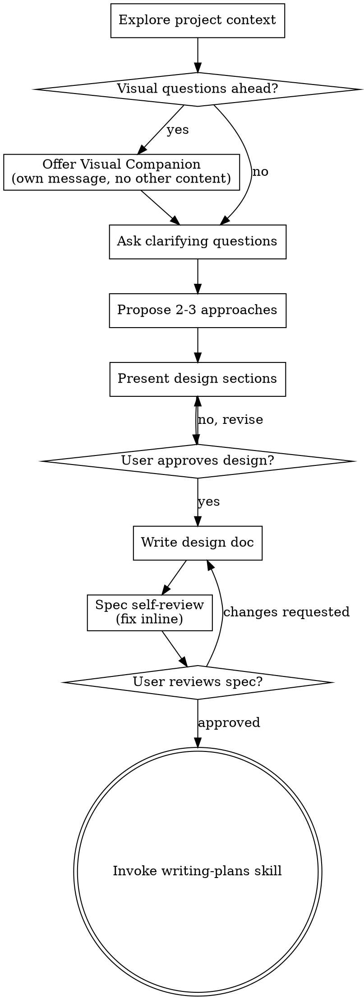

<!-- Generated by SpecStory, Markdown v2.1.0 -->

# 2026-06-16 09:40:31Z

<!-- Codex CLI Session 019ecfcd-2508-77f1-b7bf-972bccc820b9 (2026-06-16 09:40:31Z) -->

_**User (2026-06-16 09:40:31Z)**_

Revise this entire sourcecode. It belong to something that I was pllaning as a book for my self.


---

_**Agent (gpt-5.5 2026-06-16 09:40:36Z)**_

I’ll scan the repository structure first to understand what “sourcecode” means here: whether it is prose, code examples, build tooling, or a mix. Then I’ll revise in the least disruptive way, preserving your intent while fixing obvious structure, spelling, and consistency issues.

_**Agent (gpt-5.5 2026-06-16 09:40:36Z)**_

<tool-use data-tool-type="shell" data-tool-name="exec_command"><details>
<summary>Tool use: **exec_command** `pwd && rg --files -g '!node_modules' -g '!dist' -g '!build' -g '!venv' -g '!__pycache__'`</summary>
```
Chunk ID: 410265
Wall time: 0.0135 seconds
Process exited with code 0
Original token count: 2106
Output:
/Volumes/giuseppeM1mini-External/Coding/Agentic-Systems-Patterns
adversarial-testing-agent-pattern/README.md
Single Agent Pattern/autogen_typescript_example/single_agent.ts
context-engineering-pattern/README.md
context-engineering-pattern/langgraph_python_example/rag_example.py
context-engineering-pattern/langgraph_python_example/requirements.txt
consensus-seeking-multi-agent-system-pattern/README.md
DSPy Pattern/README.md
DSPy Pattern/langgraph_python_example/dspy_minimal_pipeline.py
DSPy Pattern/langgraph_python_example/requirements.txt
environment-interactive-agent-pattern/autogen_typescript_example/environment_interactive_agent.ts
environment-interactive-agent-pattern/README.md
distributed-agent-pattern/autogen_typescript_example/distributed_agent.ts
distributed-agent-pattern/README.md
environment-interactive-agent-pattern/langgraph_python_example/environment_interactive_agent.py
distributed-agent-pattern/langgraph_python_example/distributed_agent.py
agent-to-agent-communication-pattern/typescript.package.json.HINT
agent-to-agent-communication-pattern/src/run_demo.ts
agent-to-agent-communication-pattern/src/agent_b.ts
agent-to-agent-communication-pattern/src/bus_memory.ts
agent-to-agent-communication-pattern/src/agent_a.ts
agent-to-agent-communication-pattern/README.md
compliance-policy-enforcer-agent/README.md
agent-to-agent-communication-pattern/protocol/a2a.schema.json
agent-to-agent-communication-pattern/python/requirements.txt
agent-to-agent-communication-pattern/test/a2a.spec.ts
ReAct Pattern (Reason + Act)/autogen_typescript_example/react_agent.ts
ReAct Pattern (Reason + Act)/langgraph_python_example/requirements.txt
ReAct Pattern (Reason + Act)/langgraph_python_example/react_agent.py
planning-agent-pattern/autogen_typescript_example/planning_agent.ts
planning-agent-pattern/README.md
planning-agent-pattern/langgraph_python_example/planning_agent.py
api-integration-copilot/README.md
dspy-pattern/README.md
dspy-pattern/langgraph_python_example/dspy_minimal_pipeline.py
dspy-pattern/langgraph_python_example/requirements.txt
modern-tool-use-pattern/README.md
Context Engineering Pattern/README.md
Context Engineering Pattern/langgraph_python_example/rag_example.py
Context Engineering Pattern/langgraph_python_example/requirements.txt
hybrid-agent-pattern/autogen_typescript_example/hybrid_agent.ts
hybrid-agent-pattern/README.md
hybrid-agent-pattern/langgraph_python_example/hybrid_agent.py
package.json
package-lock.json
memory-augmented-agent-pattern/autogen_typescript_example/memory_agent.ts
memory-augmented-agent-pattern/README.md
modern-tool-use-pattern/typescript/src/mcp_cloud_server.ts
modern-tool-use-pattern/typescript/src/agent.ts
modern-tool-use-pattern/typescript/src/mcp_search_server.ts
modern-tool-use-pattern/typescript/test/modern-tools.spec.ts
LICENSE
memory-augmented-agent-pattern/langgraph_python_example/memory_agent.py
task-delegation-pattern/autogen_typescript_example/task_delegation.ts
task-delegation-pattern/README.md
task-delegation-pattern/langgraph_python_example/task_delegation.py
multi-modal-tool-using-agent/README.md
recursive-agent-pattern/autogen_typescript_example/recursive_agent.ts
recursive-agent-pattern/README.md
recursive-agent-pattern/langgraph_python_example/recursive_agent.py
Tool-Using Agent Pattern/autogen_typescript_example/tool_using_agent.ts
Tool-Using Agent Pattern/langgraph_python_example/tool_using_agent.py
Tool-Using Agent Pattern/langgraph_python_example/requirements.txt
context-aware-routing-agent-pattern/README.md
data-pipeline-orchestrator-agent/README.md
README.md
meta-cognitive-agent-pattern/autogen_typescript_example/meta_cognitive_agent.ts
meta-cognitive-agent-pattern/README.md
goal-conditioned-agent-pattern/autogen_typescript_example/goal_conditioned_agent.ts
goal-conditioned-agent-pattern/README.md
meta-cognitive-agent-pattern/langgraph_python_example/meta_cognitive_agent.py
goal-conditioned-agent-pattern/langgraph_python_example/goal_conditioned_agent.py
tsconfig.json
reflection-and-self-improvement-pattern/autogen_typescript_example/reflection_agent.ts
reflection-and-self-improvement-pattern/README.md
reflection-and-self-improvement-pattern/langgraph_python_example/reflection_agent.py
Recursive Agent Pattern/autogen_typescript_example/recursive_agent.ts
hierarchical-agent-pattern/autogen_typescript_example/hierarchical_agent.ts
hierarchical-agent-pattern/README.md
hierarchical-agent-pattern/langgraph_python_example/hierarchical_agent.py
planning-pattern/README.md
planning-pattern/typescript/src/run.ts
planning-pattern/typescript/src/planner.ts
planning-pattern/typescript/src/executor.ts
planning-pattern/typescript/test/planning.spec.ts
planning-pattern/python/executor.py
planning-pattern/python/run.py
planning-pattern/python/planner.py
chain-of-thought-cot-pattern/autogen_typescript_example/cot_agent.ts
chain-of-thought-cot-pattern/README.md
chain-
... (truncated)
```
</details></tool-use>

_**Agent (gpt-5.5 2026-06-16 09:40:36Z)**_

<tool-use data-tool-type="shell" data-tool-name="exec_command"><details>
<summary>Tool use: **exec_command** `git status --short`</summary>
```
Chunk ID: 39a421
Wall time: 0.0003 seconds
Process exited with code 0
Original token count: 4
Output:
?? .specstory/
```
</details></tool-use>

_**Agent (gpt-5.5 2026-06-16 09:40:41Z)**_

I’m using the `writing-clearly-and-concisely` skill because this repository is partly book manuscript and partly runnable examples. I’ll focus first on structural issues that affect readability and buildability across the whole project.

_**Agent (gpt-5.5 2026-06-16 09:40:42Z)**_

<tool-use data-tool-type="shell" data-tool-name="exec_command"><details>
<summary>Tool use: **exec_command** `sed -n '1,220p' /Users/giuseppe/.agents/skills/writing-clearly-and-concisely/SKILL.md`</summary>
```
Chunk ID: 0e1e54
Wall time: 0.0000 seconds
Process exited with code 0
Original token count: 942
Output:
---
name: writing-clearly-and-concisely
description: Use when writing prose humans will read—documentation, commit messages, error messages, explanations, reports, or UI text. Applies Strunk's timeless rules for clearer, stronger, more professional writing.
---

# Writing Clearly and Concisely

## Overview

Write with clarity and force. This skill covers what to do (Strunk) and what not to do (AI patterns).

## When to Use This Skill

Use this skill whenever you write prose for humans:

- Documentation, README files, technical explanations
- Commit messages, pull request descriptions
- Error messages, UI copy, help text, comments
- Reports, summaries, or any explanation
- Editing to improve clarity

**If you're writing sentences for a human to read, use this skill.**

## Limited Context Strategy

When context is tight:

1. Write your draft using judgment
2. Dispatch a subagent with your draft and the relevant section file
3. Have the subagent copyedit and return the revision

Loading a single section (~1,000-4,500 tokens) instead of everything saves significant context.

## Elements of Style

William Strunk Jr.'s *The Elements of Style* (1918) teaches you to write clearly and cut ruthlessly.

### Rules

**Elementary Rules of Usage (Grammar/Punctuation)**:

1. Form possessive singular by adding 's
2. Use comma after each term in series except last
3. Enclose parenthetic expressions between commas
4. Comma before conjunction introducing co-ordinate clause
5. Don't join independent clauses by comma
6. Don't break sentences in two
7. Participial phrase at beginning refers to grammatical subject

**Elementary Principles of Composition**:

8. One paragraph per topic
9. Begin paragraph with topic sentence
10. **Use active voice**
11. **Put statements in positive form**
12. **Use definite, specific, concrete language**
13. **Omit needless words**
14. Avoid succession of loose sentences
15. Express co-ordinate ideas in similar form
16. **Keep related words together**
17. Keep to one tense in summaries
18. **Place emphatic words at end of sentence**

### Reference Files

The rules above are summarized from Strunk's original text. For complete explanations with examples:

| Section | File | ~Tokens |
|---------|------|---------|
| Grammar, punctuation, comma rules | `02-elementary-rules-of-usage.md` | 2,500 |
| Paragraph structure, active voice, concision | `03-elementary-principles-of-composition.md` | 4,500 |
| Headings, quotations, formatting | `04-a-few-matters-of-form.md` | 1,000 |
| Word choice, common errors | `05-words-and-expressions-commonly-misused.md` | 4,000 |

**Most tasks need only `03-elementary-principles-of-composition.md`** — it covers active voice, positive form, concrete language, and omitting needless words.

## AI Writing Patterns to Avoid

LLMs regress to statistical means, producing generic, puffy prose. Avoid:

- **Puffery:** pivotal, crucial, vital, testament, enduring legacy
- **Empty "-ing" phrases:** ensuring reliability, showcasing features, highlighting capabilities
- **Promotional adjectives:** groundbreaking, seamless, robust, cutting-edge
- **Overused AI vocabulary:** delve, leverage, multifaceted, foster, realm, tapestry
- **Formatting overuse:** excessive bullets, emoji decorations, bold on every other word

Be specific, not grandiose. Say what it actually does.

For comprehensive research on why these patterns occur, see `signs-of-ai-writing.md`. Wikipedia editors developed this guide to detect AI-generated submissions — their patterns are well-documented and field-tested.

## Bottom Line

Writing for humans? Load the relevant section from `elements-of-style/` and apply the rules. For most tasks, `03-elementary-principles-of-composition.md` covers what matters most.
```
</details></tool-use>

_**Agent (gpt-5.5 2026-06-16 09:40:47Z)**_

The tree has many duplicate directories with both spaced/title-case names and kebab-case names, plus overlapping `dspy` and context-engineering folders. I’m going to inspect the root README, package scripts, and representative pattern docs before editing so the cleanup matches the existing migration direction.

_**Agent (gpt-5.5 2026-06-16 09:40:47Z)**_

<tool-use data-tool-type="shell" data-tool-name="exec_command"><details>
<summary>Tool use: **exec_command** `sed -n '1,260p' README.md`</summary>
```
Chunk ID: 18ff9e
Wall time: 0.0000 seconds
Process exited with code 0
Original token count: 688
Output:
# Agentic Systems Patterns

This repository provides a comprehensive collection of agentic system patterns, focusing on multi-agent and autonomous agent architectures. Each pattern includes:

- A detailed description and diagram in its own `README.md`
- Executable TypeScript and/or Python code examples
- Easy-to-run npm scripts for the TypeScript demos
- Unified `.env` file (only `MISTRAL_API_KEY` if you want live planning; most demos have offline fallbacks)

## Patterns Included

See [`Agentic_Patterns.md`](./Agentic_Patterns.md) for the full list and links to each pattern's documentation and code.

**Examples of patterns covered:**

- Single Agent
- Tool-Using Agent
- Chain-of-Thought (CoT)
- ReAct (Reason + Act)
- Multi-Agent Collaboration
- Task Delegation
- Agent Swarm
- Agent Chain / Pipeline
- Agent Orchestration
- Agent Marketplace
- Recursive Agent
- Reflection and Self-Improvement
- Memory-Augmented Agent
- Secure Agent Communication
- Distributed Agent
- Environment-Interactive Agent
- Goal-Conditioned Agent
- Hierarchical Agent
- Hybrid Agent
- Meta-Cognitive Agent
- Planning Agent

## Project Structure

- Each pattern has its own folder:
   - `README.md` (description, diagram)
   - TypeScript and/or Python example code (varies by pattern)
- Root `package.json` with scripts for runnable demos
- `.env.example` shows `MISTRAL_API_KEY` (copy to `.env` if needed)

## Getting Started

1. **Clone the repository:**

   ```sh
   git clone <your-repo-url>
   cd <repo-folder>
   ```
2. **Install dependencies:**

   ```sh
   npm install
   ```
3. **Set up environment variables (optional):**
   - Copy `.env.example` to `.env` and set `MISTRAL_API_KEY` if you want live planning. Most demos run without it.

4. **Quick runnable demos (TypeScript):**

   ```sh
   # A2A protocol demo (success/refusal/error/cancel)
   npm run a2a:test

   # Planning (Planner + Executor) with deterministic fallback
   npm run plan:test
   npm run plan:run -- "Compute average of [1,2,3,4]"

   # CodeAct: provide a preplanned snippet to avoid network
   npm run codeact:ts -- --plan-code='result = (1+2+3+4)/4'

   # Modern Tool Use (MCP-first): start both servers then run agent
   npm run mcp:search &
   npm run mcp:cloud &
   npm run mcp:agent

   # LLM Router Pattern (LLM classifier + embedding router + policies)
   npm run router:test
   npm run router:run -- "I need a refund for a wrong charge on my invoice."
   ```

5. **Python demos:**

   ```sh
   # Planning (Python mirror)
   npm run plan:py
   ```

## References

- [Agentic_Patterns.md](./Agentic_Patterns.md): Full pattern list and links
- MCP (Model Context Protocol)
- A2A (Agent-to-Agent Communication)
- [Mistral](https://mistral.ai/)

---

**Contributions welcome!**
```
</details></tool-use>

_**Agent (gpt-5.5 2026-06-16 09:40:47Z)**_

<tool-use data-tool-type="shell" data-tool-name="exec_command"><details>
<summary>Tool use: **exec_command** `cat package.json`</summary>
```
Chunk ID: 070c04
Wall time: 0.0000 seconds
Process exited with code 0
Original token count: 1043
Output:
{
  "name": "agentic-systems-example",
  "version": "1.0.0",
  "type": "module",
  "scripts": {
    "single-agent": "ts-node --esm ./single-agent-pattern/autogen_typescript_example/single_agent.ts",
    "tool-using-agent": "ts-node --esm ./tool-using-agent-pattern/autogen_typescript_example/tool_using_agent.ts",
    "cot-agent": "ts-node --esm ./chain-of-thought-cot-pattern/autogen_typescript_example/cot_agent.ts",
    "react-agent": "ts-node --esm ./react-pattern-reason-act/autogen_typescript_example/react_agent.ts",
    "multi-agent-collab": "ts-node --esm ./multi-agent-collaboration-pattern/autogen_typescript_example/multi_agent_collab.ts",
    "task-delegation": "ts-node --esm ./task-delegation-pattern/autogen_typescript_example/task_delegation.ts",
    "agent-swarm": "ts-node --esm ./agent-swarm-pattern/autogen_typescript_example/agent_swarm.ts",
    "agent-chain": "ts-node --esm ./agent-chain-pipeline-pattern/autogen_typescript_example/agent_chain.ts",
    "agent-orchestration": "ts-node --esm ./agent-orchestration-pattern/autogen_typescript_example/agent_orchestration.ts",
    "agent-marketplace": "ts-node --esm ./agent-marketplace-pattern/autogen_typescript_example/agent_marketplace.ts",
    "recursive-agent": "ts-node --esm ./recursive-agent-pattern/autogen_typescript_example/recursive_agent.ts",
    "reflection-self-improvement-agent": "ts-node --esm ./reflection-and-self-improvement-pattern/autogen_typescript_example/reflection_agent.ts",
    "memory-augmented-agent": "ts-node --esm ./memory-augmented-agent-pattern/autogen_typescript_example/memory_agent.ts",
    "meta-cognitive-agent": "ts-node --esm ./meta-cognitive-agent-pattern/autogen_typescript_example/meta_cognitive_agent.ts",
    "goal-conditioned-agent": "ts-node --esm ./goal-conditioned-agent-pattern/autogen_typescript_example/goal_conditioned_agent.ts",
    "hierarchical-agent": "ts-node --esm ./hierarchical-agent-pattern/autogen_typescript_example/hierarchical_agent.ts",
    "planning-agent": "ts-node --esm ./planning-agent-pattern/autogen_typescript_example/planning_agent.ts",
    "environment-interactive-agent": "ts-node --esm ./environment-interactive-agent-pattern/autogen_typescript_example/environment_interactive_agent.ts",
    "distributed-agent": "ts-node --esm ./distributed-agent-pattern/autogen_typescript_example/distributed_agent.ts",
    "hybrid-agent": "ts-node --esm ./hybrid-agent-pattern/autogen_typescript_example/hybrid_agent.ts",
    "prompt-examples": "ts-node --esm ./prompt-engineering-pattern/autogen_typescript_example/prompt_examples.ts",
  "secure-agent": "ts-node --esm ./secure-agent-communication-pattern/autogen_typescript_example/secure_agent.ts",
  "mcp:server": "ts-node --esm ./mcp-context-exchange-pattern/typescript/src/mcp_server.ts",
  "mcp:client": "ts-node --esm ./mcp-context-exchange-pattern/typescript/src/mcp_client.ts",
  "a2a:run": "ts-node --esm ./agent-to-agent-communication-pattern/src/run_demo.ts",
    "a2a:test": "ts-node --esm ./agent-to-agent-communication-pattern/test/a2a.spec.ts",
    "plan:run": "ts-node --esm ./planning-pattern/typescript/src/run.ts",
    "plan:test": "ts-node --esm ./planning-pattern/typescript/test/planning.spec.ts",
    "codeact:ts": "ts-node --esm ./codeact-agent-pattern/typescript/src/codeact_agent.ts",
    "codeact:py": "python3 ./codeact-agent-pattern/python/codeact_agent.py",
    "plan:py": "python3 ./planning-pattern/python/run.py",
    "mcp:search": "ts-node --esm ./modern-tool-use-pattern/typescript/src/mcp_search_server.ts",
    "mcp:cloud": "ts-node --esm ./modern-tool-use-pattern/typescript/src/mcp_cloud_server.ts",
  "mcp:agent": "ts-node --esm ./modern-tool-use-pattern/typescript/src/agent.ts",
    "router:run": "ts-node --esm ./llm-router-pattern/typescript/src/run_router.ts",
    "router:test": "ts-node --esm ./llm-router-pattern/typescript/test/router.spec.ts"
  },
  "dependencies": {
    "axios": "^1.6.0",
    "dotenv": "^16.0.0",
  "mathjs": "^13.0.0",
  "ajv": "^8.12.0",
  "express": "^4.18.2"
  },
  "devDependencies": {
  "@types/node": "^20.0.0",
  "@types/express": "^4.17.21",
    "ts-node": "^10.0.0",
    "typescript": "^5.0.0"
  }
}
```
</details></tool-use>

_**Agent (gpt-5.5 2026-06-16 09:40:47Z)**_

<tool-use data-tool-type="shell" data-tool-name="exec_command"><details>
<summary>Tool use: **exec_command** `sed -n '1,220p' docs/migrations/kebab-case-rename.md`</summary>
```
Chunk ID: 334bca
Wall time: 0.0000 seconds
Process exited with code 0
Original token count: 385
Output:
# Kebab-case migration for pattern directories

This migration standardizes all pattern directory names to kebab-case for portability, predictable imports, and URL-friendly links.

## Why kebab-case

- Cross-platform friendly (no spaces or special characters)
- Cleaner Markdown links and import paths
- Easier shell and npm script usage (no quoting required)

## How to run

```bash
# Dry-run: show planned renames and file edits, write .migration-report.json
npx ts-node --esm tools/rename_patterns.ts --dry-run

# Perform rename + rewrite references + write report
npx ts-node --esm tools/rename_patterns.ts --commit

# Optional: override if a conflicting target already exists
npx ts-node --esm tools/rename_patterns.ts --commit --force
```

## What it does

- Discovers pattern directories at the repo root (names containing "Pattern").
- Converts each name to kebab-case.
- Renames with `git mv` when available (preserves history), falls back to fs rename otherwise.
- Rewrites references across the repo in: `.md`, `.ts`, `.tsx`, `.js`, `.mjs`, `.cjs`, `.py`, `.json` (scripts only).
- Creates a `.migration-report.json` with a summary of renames and file edits.

## Undo / rollback

- If changes are uncommitted: restore the working tree.

```bash
# Undo unstaged edits and renames
git restore -SW :/

# Or reset everything since last commit
git reset --hard
```

- If already committed: view `.migration-report.json` for the list of moved paths, and revert the commit normally (e.g., `git revert` or `git reset --hard <prev>`).
```
</details></tool-use>

_**Agent (gpt-5.5 2026-06-16 09:40:47Z)**_

<tool-use data-tool-type="shell" data-tool-name="exec_command"><details>
<summary>Tool use: **exec_command** `sed -n '1,220p' tools/rename_patterns.ts`</summary>
```
Chunk ID: 984469
Wall time: 0.0000 seconds
Process exited with code 0
Original token count: 2016
Output:
#!/usr/bin/env ts-node
/**
 * Kebab-case migration tool for pattern directories.
 *
 * CLI:
 *   npx ts-node --esm tools/rename_patterns.ts [--dry-run] [--commit] [--force]
 *
 * Features:
 * - Discover root-level pattern directories (name contains "Pattern").
 * - Compute kebab-case names.
 * - Rename via `git mv` when possible, else fs.rename.
 * - Rewrite references in .md/.ts/.tsx/.js/.mjs/.cjs/.py/.json (scripts only) files.
 * - Idempotent: second run is a no-op.
 * - Writes a .migration-report.json with actions taken.
 */

import { exec as execCb } from 'node:child_process';
import { promises as fs } from 'node:fs';
import path from 'node:path';
import { pathToFileURL } from 'node:url';

const exec = (cmd: string, cwd?: string) => new Promise<{ stdout: string; stderr: string; code: number }>((resolve) => {
  execCb(cmd, { cwd }, (error, stdout, stderr) => {
    resolve({ stdout, stderr, code: error ? (error as any).code ?? 1 : 0 });
  });
});

type Report = {
  timestamp: string;
  root: string;
  dryRun: boolean;
  force: boolean;
  renames: Array<{ from: string; to: string; method: 'git' | 'fs' | 'skip' | 'conflict' | 'noop' }>;
  fileEdits: Array<{ file: string; changes: number }>;
};

const ROOT = path.resolve(process.cwd());
const REPORT_PATH = path.join(ROOT, '.migration-report.json');

const IGNORE_DIRS = new Set(['.git', 'node_modules', '.venv', '.history', 'dist', 'build']);
const TEXT_EXTS = new Set(['.md', '.ts', '.tsx', '.js', '.mjs', '.cjs', '.py', '.json']);

function isBinaryExtension(p: string) {
  const ext = path.extname(p).toLowerCase();
  return ext && !TEXT_EXTS.has(ext);
}

export function toKebabCaseDir(name: string): string {
  const trimmed = name.trim();
  const replaced = trimmed
    .toLowerCase()
    .replace(/[^a-z0-9]+/g, '-')
    .replace(/-+/g, '-')
    .replace(/^-|-$/g, '');
  return replaced;
}

export async function findPatternDirs(root: string): Promise<string[]> {
  const entries = await fs.readdir(root, { withFileTypes: true });
  const dirs: string[] = [];
  for (const e of entries) {
    if (e.isDirectory()) {
      if (IGNORE_DIRS.has(e.name)) continue;
      if (/pattern/i.test(e.name)) dirs.push(path.join(root, e.name));
    }
  }
  return dirs.sort();
}

async function dirExists(p: string) {
  try { const s = await fs.stat(p); return s.isDirectory(); } catch { return false; }
}

export async function gitMv(from: string, to: string): Promise<boolean> {
  const { code: gitOk } = await exec('git rev-parse --is-inside-work-tree');
  if (gitOk !== 0) return false;
  const { code } = await exec(`git mv ${JSON.stringify(from)} ${JSON.stringify(to)}`);
  return code === 0;
}

function urlEncodeName(name: string) {
  return encodeURIComponent(name).replace(/%2F/g, '/');
}

function folderNameVariants(name: string): string[] {
  const raw = name;
  const fully = urlEncodeName(name);
  const spacesOnly = name.replace(/ /g, '%20');
  const set = new Set([raw, fully, spacesOnly]);
  return Array.from(set);
}

function replaceAll(hay: string, needle: string, repl: string): { out: string; count: number } {
  if (!needle) return { out: hay, count: 0 };
  let count = 0;
  let out = hay;
  if (needle === repl) return { out, count: 0 };
  const esc = needle.replace(/[.*+?^${}()|[\]\\]/g, '\\$&');
  out = out.replace(new RegExp(esc, 'g'), () => { count++; return repl; });
  return { out, count };
}

function rewriteMarkdown(content: string, renames: Record<string, string>): { content: string; changes: number } {
  let changes = 0;
  let newContent = content;
  for (const [absOld, absNew] of Object.entries(renames)) {
    const oldName = path.basename(absOld);
    const newName = path.basename(absNew);
    for (const variant of folderNameVariants(oldName)) {
      let res = replaceAll(newContent, `/${variant}/`, `/${newName}/`);
      newContent = res.out; changes += res.count;
      res = replaceAll(newContent, `./${variant}/`, `./${newName}/`);
      newContent = res.out; changes += res.count;
      res = replaceAll(newContent, `../${variant}/`, `../${newName}/`);
      newContent = res.out; changes += res.count;
    }
  }
  return { content: newContent, changes };
}

function rewriteScriptValue(cmd: string, renames: Record<string, string>): { out: string; changes: number } {
  let out = cmd;
  let changes = 0;
  for (const [absOld, absNew] of Object.entries(renames)) {
    const oldName = path.basename(absOld);
    const newName = path.basename(absNew);
    for (const variant of folderNameVariants(oldName)) {
      let res = replaceAll(out, `/${variant}/`, `/${newName}/`);
      out = res.out; changes += res.count;
      res = replaceAll(out, `./${variant}/`, `./${newName}/`);
      out = res.out; changes += res.count;
      res = replaceAll(out, `../${variant}/`, `../${newName}/`);
      out = res.out; changes += res.count;
    }
  }
  const before = out;
  out = out.r
... (truncated)
```
</details></tool-use>

_**Agent (gpt-5.5 2026-06-16 09:40:53Z)**_

I found an existing migration document and tool aimed at exactly one repo-wide problem: normalizing pattern folders to kebab-case. Before touching files, I’m checking whether the current tree is already half-migrated or whether there are stale duplicates that should be removed from the manuscript.

_**Agent (gpt-5.5 2026-06-16 09:40:53Z)**_

<tool-use data-tool-type="shell" data-tool-name="exec_command"><details>
<summary>Tool use: **exec_command** `find . -maxdepth 2 -type d \( -name '.git' -o -name 'node_modules' \) -prune -o -maxdepth 2 -type d -print | sort`</summary>
```
Chunk ID: 1aaab1
Wall time: 0.0009 seconds
Process exited with code 0
Original token count: 1652
Output:
.
./.specstory
./.specstory/cli
./.specstory/history
./.vscode
./Context Engineering Pattern
./Context Engineering Pattern/langgraph_python_example
./DSPy Pattern
./DSPy Pattern/langgraph_python_example
./Memory-Augmented Agent Pattern
./Memory-Augmented Agent Pattern/autogen_typescript_example
./Prompt Engineering Pattern
./Prompt Engineering Pattern/autogen_typescript_example
./ReAct Pattern (Reason + Act)
./ReAct Pattern (Reason + Act)/autogen_typescript_example
./ReAct Pattern (Reason + Act)/langgraph_python_example
./Recursive Agent Pattern
./Recursive Agent Pattern/autogen_typescript_example
./Single Agent Pattern
./Single Agent Pattern/autogen_typescript_example
./Tool-Using Agent Pattern
./Tool-Using Agent Pattern/autogen_typescript_example
./Tool-Using Agent Pattern/langgraph_python_example
./adversarial-testing-agent-pattern
./adversarial-testing-agent-pattern/autogen_typescript_example
./adversarial-testing-agent-pattern/langgraph_python_example
./agent-chain-pipeline-pattern
./agent-chain-pipeline-pattern/autogen_typescript_example
./agent-chain-pipeline-pattern/langgraph_python_example
./agent-marketplace-pattern
./agent-marketplace-pattern/autogen_typescript_example
./agent-marketplace-pattern/langgraph_python_example
./agent-orchestration-pattern
./agent-orchestration-pattern/autogen_typescript_example
./agent-orchestration-pattern/langgraph_python_example
./agent-swarm-pattern
./agent-swarm-pattern/autogen_typescript_example
./agent-swarm-pattern/langgraph_python_example
./agent-to-agent-communication-pattern
./agent-to-agent-communication-pattern/protocol
./agent-to-agent-communication-pattern/python
./agent-to-agent-communication-pattern/src
./agent-to-agent-communication-pattern/test
./api-integration-copilot
./api-integration-copilot/autogen_typescript_example
./api-integration-copilot/langgraph_python_example
./chain-of-thought-cot-pattern
./chain-of-thought-cot-pattern/autogen_typescript_example
./chain-of-thought-cot-pattern/langgraph_python_example
./codeact-agent-pattern
./codeact-agent-pattern/python
./codeact-agent-pattern/typescript
./compliance-policy-enforcer-agent
./compliance-policy-enforcer-agent/autogen_typescript_example
./compliance-policy-enforcer-agent/langgraph_python_example
./consensus-seeking-multi-agent-system-pattern
./consensus-seeking-multi-agent-system-pattern/autogen_typescript_example
./consensus-seeking-multi-agent-system-pattern/langgraph_python_example
./context-aware-routing-agent-pattern
./context-aware-routing-agent-pattern/autogen_typescript_example
./context-aware-routing-agent-pattern/langgraph_python_example
./context-engineering-pattern
./context-engineering-pattern/langgraph_python_example
./data-pipeline-orchestrator-agent
./data-pipeline-orchestrator-agent/autogen_typescript_example
./data-pipeline-orchestrator-agent/langgraph_python_example
./distributed-agent-pattern
./distributed-agent-pattern/autogen_typescript_example
./distributed-agent-pattern/langgraph_python_example
./docs
./docs/migrations
./docs/patterns
./dspy-pattern
./dspy-pattern/langgraph_python_example
./environment-interactive-agent-pattern
./environment-interactive-agent-pattern/autogen_typescript_example
./environment-interactive-agent-pattern/langgraph_python_example
./event-triggered-agent-pattern
./event-triggered-agent-pattern/autogen_typescript_example
./event-triggered-agent-pattern/langgraph_python_example
./goal-conditioned-agent-pattern
./goal-conditioned-agent-pattern/autogen_typescript_example
./goal-conditioned-agent-pattern/langgraph_python_example
./hierarchical-agent-pattern
./hierarchical-agent-pattern/autogen_typescript_example
./hierarchical-agent-pattern/langgraph_python_example
./human-in-the-loop-approval-agent
./human-in-the-loop-approval-agent/autogen_typescript_example
./human-in-the-loop-approval-agent/langgraph_python_example
./hybrid-agent-pattern
./hybrid-agent-pattern/autogen_typescript_example
./hybrid-agent-pattern/langgraph_python_example
./llm-router-pattern
./llm-router-pattern/typescript
./long-term-episodic-memory-agent-pattern
./long-term-episodic-memory-agent-pattern/autogen_typescript_example
./long-term-episodic-memory-agent-pattern/langgraph_python_example
./mcp-context-exchange-pattern
./mcp-context-exchange-pattern/python
./mcp-context-exchange-pattern/typescript
./memory-augmented-agent-pattern
./memory-augmented-agent-pattern/autogen_typescript_example
./memory-augmented-agent-pattern/langgraph_python_example
./meta-cognitive-agent-pattern
./meta-cognitive-agent-pattern/autogen_typescript_example
./meta-cognitive-agent-pattern/langgraph_python_example
./modern-tool-use-pattern
./modern-tool-use-pattern/typescript
./multi-agent-collaboration-pattern
./multi-agent-collaboration-pattern/autogen_typescript_example
./multi-agent-collaboration-pattern/langgraph_python_example
./multi-modal-tool-using-agent
./multi-modal-tool-using-age
... (truncated)
```
</details></tool-use>

_**Agent (gpt-5.5 2026-06-16 09:40:53Z)**_

<tool-use data-tool-type="shell" data-tool-name="exec_command"><details>
<summary>Tool use: **exec_command** `sed -n '1,260p' Agentic_Patterns.md`</summary>
```
Chunk ID: c67068
Wall time: 0.0000 seconds
Process exited with code 0
Original token count: 2706
Output:
# Agentic Systems Patterns

This document provides an overview of the most important patterns in Agentic Systems, focusing on multi-agent and autonomous agent architectures. The patterns are listed from the most basic and common to the more advanced and complex, with references to MCP (Model Context Protocol), Agent Communication Protocols (A2A), Autogen, and LangGraph where relevant.

## 1. [Single Agent Pattern](./single-agent-pattern/README.md)

- **Description:** A single autonomous agent interacts with its environment to achieve a goal.
- **Example:** A chatbot answering user queries.


## 2. [Tool-Using Agent Pattern](./tool-using-agent-pattern/README.md)

- **Description:** An agent that leverages external tools or APIs to enhance its capabilities.
- **Example:** An agent that uses a calculator API to solve math problems.


## 3. [Chain-of-Thought (CoT) Pattern](./chain-of-thought-cot-pattern/README.md)

- **Description:** An agent decomposes a problem into a sequence of reasoning steps.
- **Example:** Step-by-step problem solving in math or logic tasks.


## 4. [ReAct Pattern (Reason + Act)](./react-pattern-reason-act/README.md)

- **Description:** The agent alternates between reasoning and taking actions, often using tools or APIs.
- **Example:** An agent that reasons about a question, then queries a database, then reasons again.


## 5. [Multi-Agent Collaboration Pattern](./multi-agent-collaboration-pattern/README.md)

- **Description:** Multiple agents with different roles or expertise collaborate to solve a problem.
- **Example:** One agent generates ideas, another critiques, a third implements.


## 6. [Task Delegation Pattern](./task-delegation-pattern/README.md)

- **Description:** A manager agent delegates subtasks to specialized worker agents.
- **Example:** A project manager agent assigns coding, testing, and documentation to different agents.


## 7. [Agent Swarm Pattern](./agent-swarm-pattern/README.md)

- **Description:** Many simple agents work in parallel, often with emergent behavior.
- **Example:** Agents searching a solution space in parallel and sharing findings.


## 8. [Agent Chain / Pipeline Pattern](./agent-chain-pipeline-pattern/README.md)

- **Description:** Agents are organized in a pipeline, each transforming or enriching the output of the previous.
- **Example:** Data extraction agent → summarization agent → translation agent.


## 9. [Agent Orchestration Pattern](./agent-orchestration-pattern/README.md)

- **Description:** An orchestrator coordinates multiple agents, possibly with dynamic role assignment and communication.
- **Example:** LangGraph workflows, Autogen orchestrators.


## 10. [Agent Marketplace Pattern](./agent-marketplace-pattern/README.md)

- **Description:** Agents offer and request services in a marketplace-like environment, negotiating and trading tasks.
- **Example:** Agents bidding for tasks based on expertise or availability.


## 11. [Recursive Agent Pattern](./recursive-agent-pattern/README.md)

- **Description:** Agents can spawn or call other agents recursively to solve subproblems.
- **Example:** An agent that delegates subtasks to new agent instances as needed.


## 12. [Reflection and Self-Improvement Pattern](./reflection-and-self-improvement-pattern/README.md)

- **Description:** Agents reflect on their own performance and adapt or improve over time.
- **Example:** An agent that reviews its own outputs and updates its strategy.


## 13. [Consensus-Seeking Multi-Agent System Pattern](./consensus-seeking-multi-agent-system-pattern/README.md)

- **Description:** Multiple agents propose answers and a meta-agent synthesizes a consensus using voting, ranking, or critique loops.
- **Example:** Independent solvers generate proposals; a judge agent aggregates into a final decision.


## 14. [Memory-Augmented Agent Pattern](./memory-augmented-agent-pattern/README.md)

- **Description:** Agents use persistent memory or knowledge bases to inform decisions across sessions.
- **Example:** An agent that remembers user preferences or past conversations.


## 15. [Secure Agent Communication Pattern](./secure-agent-communication-pattern/README.md)

- **Description:** Agents communicate using secure protocols, ensuring privacy, integrity, and authenticity of messages. Includes encryption, authentication, and integrity checks for sensitive or adversarial environments.
- **Example:** Agents exchanging encrypted messages using secure protocols.


## 16. [Distributed Agent Pattern](./distributed-agent-pattern/README.md)

- **Description:** Multiple agents operate across different locations or systems, collaborating to achieve shared or individual goals. They communicate, coordinate, and partition tasks for scalable, robust, and fault-tolerant systems.
- **Example:** Multi-agent systems in cloud or edge computing.


## 17. [Environment-Inter
... (truncated)
```
</details></tool-use>

_**Agent (gpt-5.5 2026-06-16 09:40:53Z)**_

<tool-use data-tool-type="shell" data-tool-name="exec_command"><details>
<summary>Tool use: **exec_command** `npm test -- --runInBand`</summary>
```
Chunk ID: c4b758
Wall time: 0.3795 seconds
Process exited with code 1
Original token count: 56
Output:
npm error Missing script: "test"
npm error
npm error To see a list of scripts, run:
npm error   npm run
npm error A complete log of this run can be found in: /Users/giuseppe/.npm/_logs/2026-06-16T09_40_53_660Z-debug-0.log
```
</details></tool-use>

_**Agent (gpt-5.5 2026-06-16 09:40:53Z)**_

<tool-use data-tool-type="shell" data-tool-name="exec_command"><details>
<summary>Tool use: **exec_command** `npm run plan:test`</summary>
```
Chunk ID: 384e69
Wall time: 1.1470 seconds
Process exited with code 1
Original token count: 295
Output:

> agentic-systems-example@1.0.0 plan:test
> ts-node --esm ./planning-pattern/typescript/test/planning.spec.ts

(node:10979) [DEP0180] DeprecationWarning: fs.Stats constructor is deprecated.
(Use `node --trace-deprecation ...` to show where the warning was created)
Error [ERR_MODULE_NOT_FOUND]: Cannot find package 'axios' imported from /Volumes/giuseppeM1mini-External/Coding/Agentic-Systems-Patterns/planning-pattern/typescript/src/planner.ts
    at Object.getPackageJSONURL (node:internal/modules/package_json_reader:268:9)
    at packageResolve (node:internal/modules/esm/resolve:768:81)
    at moduleResolve (node:internal/modules/esm/resolve:858:18)
    at defaultResolve (node:internal/modules/esm/resolve:990:11)
    at nextResolve (node:internal/modules/esm/hooks:748:28)
    at resolve (/usr/local/lib/node_modules/ts-node/dist/child/child-loader.js:15:125)
    at nextResolve (node:internal/modules/esm/hooks:748:28)
    at Hooks.resolve (node:internal/modules/esm/hooks:240:30)
    at MessagePort.handleMessage (node:internal/modules/esm/worker:201:24)
    at [nodejs.internal.kHybridDispatch] (node:internal/event_target:827:20) {
  code: 'ERR_MODULE_NOT_FOUND'
}
```
</details></tool-use>

_**Agent (gpt-5.5 2026-06-16 09:41:01Z)**_

The quick test failed because dependencies are not installed, not because the test itself failed. I’m continuing with static checks and repo cleanup first, then I’ll install dependencies and rerun the runnable demos once the source tree is coherent.

_**Agent (gpt-5.5 2026-06-16 09:41:01Z)**_

<tool-use data-tool-type="shell" data-tool-name="exec_command"><details>
<summary>Tool use: **exec_command** `sed -n '1,220p' /Users/giuseppe/.agents/skills/writing-clearly-and-concisely/elements-of-style/03-elementary-principles-of-composition.md`</summary>
```
Chunk ID: bcfcb6
Wall time: 0.0000 seconds
Process exited with code 0
Original token count: 4393
Output:
## III. Elementary Principles Of Composition

### Rule 8. Make the paragraph the unit of composition: one paragraph to each topic.

If the subject on which you are writing is of slight extent, or if you intend to treat it very briefly, there may be no need of subdividing it into topics. Thus a brief description, a brief summary of a literary work, a brief account of a single incident, a narrative merely outlining an action, the setting forth of a single idea, any one of these is best written in a single paragraph. After the paragraph has been written, examine it to see whether subdivision will not improve it.

Ordinarily, however, a subject requires subdivision into topics, each of which should be made the subject of a paragraph. The object of treating each topic in a paragraph by itself is, of course, to aid the reader. The beginning of each paragraph is a signal to him that a new step in the development of the subject has been reached.

The extent of subdivision will vary with the length of the composition. For example, a short notice of a book or poem might consist of a single paragraph. One slightly longer might consist of two paragraphs:

- A. Account of the work.
- B. Critical discussion.

A report on a poem, written for a class in literature, might consist of seven paragraphs:

- A. Facts of composition and publication.
- B. Kind of poem; metrical form.
- C. Subject.
- D. Treatment of subject.
- E. For what chiefly remarkable.
- F. Wherein characteristic of the writer.
- G. Relationship to other works.

The contents of paragraphs C and D would vary with the poem. Usually, paragraph C would indicate the actual or imagined circumstances of the poem (the situation), if these call for explanation, and would then state the subject and outline its development. If the poem is a narrative in the third person throughout, paragraph C need contain no more than a concise summary of the action. Paragraph D would indicate the leading ideas and show how they are made prominent, or would indicate what points in the narrative are chiefly emphasized.

A novel might be discussed under the heads:

- A. Setting.
- B. Plot.
- C. Characters.
- D. Purpose.

An historical event might be discussed under the heads:

- A. What led up to the event.
- B. Account of the event.
- C. What the event led up to.

In treating either of these last two subjects, the writer would probably find it necessary to subdivide one or more of the topics here given.

As a rule, single sentences should not be written or printed as paragraphs. An exception may be made of sentences of transition, indicating the relation between the parts of an exposition or argument. Frequent exceptions are also necessary in textbooks, guidebooks, and other works in which many topics are treated briefly.

In dialogue, each speech, even if only a single word, is a paragraph by itself; that is, a new paragraph begins with each change of speaker. The application of this rule, when dialogue and narrative are combined, is best learned from examples in well-printed works of fiction.

### Rule 9. As a rule, begin each paragraph with a topic sentence, end it in conformity with the beginning.

Again, the object is to aid the reader. The practice here recommended enables him to discover the purpose of each paragraph as he begins to read it, and to retain this purpose in mind as he ends it. For this reason, the most generally useful kind of paragraph, particularly in exposition and argument, is that in which

\(a\) the topic sentence comes at or near the beginning;

\(b\) the succeeding sentences explain or establish or develop the statement made in the topic sentence; and

\(c\) the final sentence either emphasizes the thought of the topic sentence or states some important consequence.

Ending with a digression, or with an unimportant detail, is particularly to be avoided.

If the paragraph forms part of a larger composition, its relation to what precedes, or its function as a part of the whole, may need to be expressed. This can sometimes be done by a mere word or phrase (*again*; *therefore*; *for the same reason*) in the topic sentence. Sometimes, however, it is expedient to precede the topic sentence by one or more sentences of introduction or transition. If more than one such sentence is required, it is generally better to set apart the transitional sentences as a separate paragraph.

According to the writer's purpose, he may, as indicated above, relate the body of the paragraph to the topic sentence in one or more of several different ways. He may make the meaning of the topic sentence clearer by restating it in other forms, by defining its terms, by denying the contrary, by giving illustrations or specific instances; he may establish it by proofs; or he may develop it by showing its implications and consequences. In a long paragraph, he may carry out several of these p
... (truncated)
```
</details></tool-use>

_**Agent (gpt-5.5 2026-06-16 09:41:01Z)**_

<tool-use data-tool-type="shell" data-tool-name="exec_command"><details>
<summary>Tool use: **exec_command** `find . -maxdepth 1 -type d | sed 's#^./##' | sort | awk 'BEGIN{IGNORECASE=1} /Pattern|pattern/ {print}'`</summary>
```
Chunk ID: f99604
Wall time: 0.0000 seconds
Process exited with code 0
Original token count: 315
Output:
Context Engineering Pattern
DSPy Pattern
Memory-Augmented Agent Pattern
Prompt Engineering Pattern
ReAct Pattern (Reason + Act)
Recursive Agent Pattern
Single Agent Pattern
Tool-Using Agent Pattern
adversarial-testing-agent-pattern
agent-chain-pipeline-pattern
agent-marketplace-pattern
agent-orchestration-pattern
agent-swarm-pattern
agent-to-agent-communication-pattern
chain-of-thought-cot-pattern
codeact-agent-pattern
consensus-seeking-multi-agent-system-pattern
context-aware-routing-agent-pattern
context-engineering-pattern
distributed-agent-pattern
dspy-pattern
environment-interactive-agent-pattern
event-triggered-agent-pattern
goal-conditioned-agent-pattern
hierarchical-agent-pattern
hybrid-agent-pattern
llm-router-pattern
long-term-episodic-memory-agent-pattern
mcp-context-exchange-pattern
memory-augmented-agent-pattern
meta-cognitive-agent-pattern
modern-tool-use-pattern
multi-agent-collaboration-pattern
planning-agent-pattern
planning-pattern
prompt-engineering-pattern
react-pattern-reason-act
recursive-agent-pattern
reflection-and-self-improvement-pattern
secure-agent-communication-pattern
self-healing-workflow-agent-pattern
simulation-based-planner-agent-pattern
single-agent-pattern
task-delegation-pattern
tool-using-agent-pattern
```
</details></tool-use>

_**Agent (gpt-5.5 2026-06-16 09:41:01Z)**_

<tool-use data-tool-type="shell" data-tool-name="exec_command"><details>
<summary>Tool use: **exec_command** `find . -maxdepth 2 -name README.md -print | sort | wc -l`</summary>
```
Chunk ID: 4ed2c7
Wall time: 0.0000 seconds
Process exited with code 0
Original token count: 3
Output:
      46
```
</details></tool-use>

_**Agent (gpt-5.5 2026-06-16 09:41:01Z)**_

<tool-use data-tool-type="shell" data-tool-name="exec_command"><details>
<summary>Tool use: **exec_command** `rg -n "TODO|TBD|pllan|teh|langgraph|Autogen|MISTRAL_API_KEY|Contributions welcome|comprehensive|robust|seamless|leverage|delve" -g '*.md' -g '*.ts' -g '*.py'`</summary>
```
Chunk ID: 719eb6
Wall time: 0.0000 seconds
Process exited with code 0
Original token count: 6664
Output:
adversarial-testing-agent-pattern/README.md:3:Description: “Red team” agent that attempts to mislead or break another agent to test robustness.
react-pattern-reason-act/autogen_typescript_example/react_agent.ts:1:// ReAct Pattern (Reason + Act) - Autogen TypeScript Example
react-pattern-reason-act/autogen_typescript_example/react_agent.ts:11:const MISTRAL_API_KEY = process.env.MISTRAL_API_KEY;
react-pattern-reason-act/autogen_typescript_example/react_agent.ts:37:          'Authorization': `Bearer ${MISTRAL_API_KEY}`,
distributed-agent-pattern/autogen_typescript_example/distributed_agent.ts:6:const MISTRAL_API_KEY = process.env.MISTRAL_API_KEY;
distributed-agent-pattern/autogen_typescript_example/distributed_agent.ts:9:if (!MISTRAL_API_KEY) {
distributed-agent-pattern/autogen_typescript_example/distributed_agent.ts:10:  console.error('Please set MISTRAL_API_KEY in your .env file');
distributed-agent-pattern/autogen_typescript_example/distributed_agent.ts:23:        'Authorization': `Bearer ${MISTRAL_API_KEY}`,
llm-router-pattern/README.md:28:- Optional `MISTRAL_API_KEY` in `.env` for live classifier routing. Without it, a heuristic fallback is used.
hierarchical-agent-pattern/autogen_typescript_example/hierarchical_agent.ts:6:const MISTRAL_API_KEY = process.env.MISTRAL_API_KEY;
hierarchical-agent-pattern/autogen_typescript_example/hierarchical_agent.ts:9:if (!MISTRAL_API_KEY) {
hierarchical-agent-pattern/autogen_typescript_example/hierarchical_agent.ts:10:  console.error('Please set MISTRAL_API_KEY in your .env file');
hierarchical-agent-pattern/autogen_typescript_example/hierarchical_agent.ts:23:        'Authorization': `Bearer ${MISTRAL_API_KEY}`,
react-pattern-reason-act/README.md:29:- Requires robust error handling and observation interpretation
distributed-agent-pattern/README.md:5:The Distributed Agent Pattern involves multiple agents operating across different locations, systems, or nodes, collaborating to achieve shared or individual goals. These agents communicate over a network, coordinate actions, and may share or partition tasks. This pattern is foundational for scalable, robust, and fault-tolerant agentic systems in large or decentralized environments.
distributed-agent-pattern/README.md:23:- High scalability and robustness
distributed-agent-pattern/README.md:29:- Requires robust communication protocols
multi-agent-collaboration-pattern/autogen_typescript_example/multi_agent_collab.ts:1:// Multi-Agent Collaboration Pattern - Autogen TypeScript Example
multi-agent-collaboration-pattern/autogen_typescript_example/multi_agent_collab.ts:10:const MISTRAL_API_KEY = process.env.MISTRAL_API_KEY;
multi-agent-collaboration-pattern/autogen_typescript_example/multi_agent_collab.ts:22:        'Authorization': `Bearer ${MISTRAL_API_KEY}`,
agent-marketplace-pattern/autogen_typescript_example/agent_marketplace.ts:1:// Agent Marketplace Pattern - Autogen TypeScript Example
agent-marketplace-pattern/autogen_typescript_example/agent_marketplace.ts:10:const MISTRAL_API_KEY = process.env.MISTRAL_API_KEY;
agent-marketplace-pattern/autogen_typescript_example/agent_marketplace.ts:43:        'Authorization': `Bearer ${MISTRAL_API_KEY}`,
react-pattern-reason-act/langgraph_python_example/react_agent.py:8:- `langgraph` library
react-pattern-reason-act/langgraph_python_example/react_agent.py:15:pip install langgraph python-dotenv requests
react-pattern-reason-act/langgraph_python_example/react_agent.py:22:from langgraph import Agent, Environment, LLM, Tool
react-pattern-reason-act/langgraph_python_example/react_agent.py:27:MISTRAL_API_KEY = os.getenv("MISTRAL_API_KEY")
react-pattern-reason-act/langgraph_python_example/react_agent.py:73:    api_key=MISTRAL_API_KEY,
multi-agent-collaboration-pattern/README.md:5:The Multi-Agent Collaboration Pattern involves multiple autonomous agents, each with distinct roles or expertise, working together to solve a problem or achieve a goal. Agents communicate, share information, and coordinate their actions, often leading to more robust and creative solutions than a single agent could achieve. This pattern is foundational for distributed AI, team-based problem solving, and complex workflows.
multi-agent-collaboration-pattern/README.md:29:- Requires robust communication and coordination protocols
agent-marketplace-pattern/README.md:28:- Requires robust market and negotiation protocols
hierarchical-agent-pattern/README.md:29:- Requires robust communication and coordination
llm-router-pattern/typescript/src/run_router.ts:9:  const apiKey = process.env.MISTRAL_API_KEY;
context-engineering-pattern/README.md:33:pip install -r "Context Engineering Pattern/langgraph_python_example/requirements.txt"
context-engineering-pattern/README.md:39:export MISTRAL_API_KEY=your_key_here
context-engineering-pattern/README.md:40:python "Context Engineering Pattern/langgraph_python_example/rag_example.py"
... (truncated)
```
</details></tool-use>

_**Agent (gpt-5.5 2026-06-16 09:41:08Z)**_

The repo is half-migrated: canonical kebab-case folders exist, but old title-case folders remain for eight patterns. Some canonical READMEs still point at old title-case paths, so I’m going to fix those references and remove stale duplicates only where the kebab-case folder already contains the canonical content.

_**Agent (gpt-5.5 2026-06-16 09:41:08Z)**_

<tool-use data-tool-type="shell" data-tool-name="exec_command"><details>
<summary>Tool use: **exec_command** `git ls-files | sort | sed -n '1,240p'`</summary>
```
Chunk ID: fb2979
Wall time: 0.0000 seconds
Process exited with code 0
Original token count: 2523
Output:
.env.example
.gitignore
Agentic_Patterns.md
Agentic_Systems Patterns.code-workspace
Context Engineering Pattern/README.md
Context Engineering Pattern/langgraph_python_example/rag_example.py
Context Engineering Pattern/langgraph_python_example/requirements.txt
DSPy Pattern/README.md
DSPy Pattern/langgraph_python_example/dspy_minimal_pipeline.py
DSPy Pattern/langgraph_python_example/requirements.txt
LICENSE
Memory-Augmented Agent Pattern/autogen_typescript_example/memory_agent.ts
Prompt Engineering Pattern/README.md
Prompt Engineering Pattern/autogen_typescript_example/prompt_examples.ts
README.md
ReAct Pattern (Reason + Act)/autogen_typescript_example/react_agent.ts
ReAct Pattern (Reason + Act)/langgraph_python_example/react_agent.py
ReAct Pattern (Reason + Act)/langgraph_python_example/requirements.txt
Recursive Agent Pattern/autogen_typescript_example/recursive_agent.ts
Single Agent Pattern/autogen_typescript_example/single_agent.ts
Tool-Using Agent Pattern/autogen_typescript_example/tool_using_agent.ts
Tool-Using Agent Pattern/langgraph_python_example/requirements.txt
Tool-Using Agent Pattern/langgraph_python_example/tool_using_agent.py
adversarial-testing-agent-pattern/README.md
adversarial-testing-agent-pattern/autogen_typescript_example/.gitkeep
adversarial-testing-agent-pattern/langgraph_python_example/.gitkeep
agent-chain-pipeline-pattern/README.md
agent-chain-pipeline-pattern/autogen_typescript_example/agent_chain.ts
agent-chain-pipeline-pattern/langgraph_python_example/agent_chain.py
agent-marketplace-pattern/README.md
agent-marketplace-pattern/autogen_typescript_example/agent_marketplace.ts
agent-marketplace-pattern/langgraph_python_example/agent_marketplace.py
agent-orchestration-pattern/README.md
agent-orchestration-pattern/autogen_typescript_example/agent_orchestration.ts
agent-orchestration-pattern/langgraph_python_example/agent_orchestration.py
agent-swarm-pattern/README.md
agent-swarm-pattern/autogen_typescript_example/agent_swarm.ts
agent-swarm-pattern/langgraph_python_example/agent_swarm.py
agent-to-agent-communication-pattern/README.md
agent-to-agent-communication-pattern/protocol/a2a.schema.json
agent-to-agent-communication-pattern/python/requirements.txt
agent-to-agent-communication-pattern/src/agent_a.ts
agent-to-agent-communication-pattern/src/agent_b.ts
agent-to-agent-communication-pattern/src/bus_memory.ts
agent-to-agent-communication-pattern/src/run_demo.ts
agent-to-agent-communication-pattern/test/a2a.spec.ts
agent-to-agent-communication-pattern/typescript.package.json.HINT
api-integration-copilot/README.md
api-integration-copilot/autogen_typescript_example/.gitkeep
api-integration-copilot/langgraph_python_example/.gitkeep
chain-of-thought-cot-pattern/README.md
chain-of-thought-cot-pattern/autogen_typescript_example/cot_agent.ts
chain-of-thought-cot-pattern/langgraph_python_example/cot_agent.py
codeact-agent-pattern/README.md
codeact-agent-pattern/python/codeact_agent.py
codeact-agent-pattern/typescript/src/codeact_agent.ts
codeact-agent-pattern/typescript/test/codeact.spec.ts
compliance-policy-enforcer-agent/README.md
compliance-policy-enforcer-agent/autogen_typescript_example/.gitkeep
compliance-policy-enforcer-agent/langgraph_python_example/.gitkeep
consensus-seeking-multi-agent-system-pattern/README.md
consensus-seeking-multi-agent-system-pattern/autogen_typescript_example/.gitkeep
consensus-seeking-multi-agent-system-pattern/langgraph_python_example/.gitkeep
context-aware-routing-agent-pattern/README.md
context-aware-routing-agent-pattern/autogen_typescript_example/.gitkeep
context-aware-routing-agent-pattern/langgraph_python_example/.gitkeep
context-engineering-pattern/README.md
context-engineering-pattern/langgraph_python_example/rag_example.py
context-engineering-pattern/langgraph_python_example/requirements.txt
data-pipeline-orchestrator-agent/README.md
data-pipeline-orchestrator-agent/autogen_typescript_example/.gitkeep
data-pipeline-orchestrator-agent/langgraph_python_example/.gitkeep
distributed-agent-pattern/README.md
distributed-agent-pattern/autogen_typescript_example/distributed_agent.ts
distributed-agent-pattern/langgraph_python_example/distributed_agent.py
docs/migrations/kebab-case-rename.md
docs/patterns/a2a-sequence.md
docs/patterns/mcp-context-exchange.md
dspy-pattern/README.md
dspy-pattern/langgraph_python_example/dspy_minimal_pipeline.py
dspy-pattern/langgraph_python_example/requirements.txt
environment-interactive-agent-pattern/README.md
environment-interactive-agent-pattern/autogen_typescript_example/environment_interactive_agent.ts
environment-interactive-agent-pattern/langgraph_python_example/environment_interactive_agent.py
event-triggered-agent-pattern/README.md
event-triggered-agent-pattern/autogen_typescript_example/.gitkeep
event-triggered-agent-pattern/langgraph_python_example/.gitkeep
goal-conditioned-agent-pattern/README.md
goal-conditioned-a
... (truncated)
```
</details></tool-use>

_**Agent (gpt-5.5 2026-06-16 09:41:08Z)**_

<tool-use data-tool-type="shell" data-tool-name="exec_command"><details>
<summary>Tool use: **exec_command** `find "Single Agent Pattern" "single-agent-pattern" "Tool-Using Agent Pattern" "tool-using-agent-pattern" "Context Engineering Pattern" "context-engineering-pattern" "DSPy Pattern" "dspy-pattern" -type f | sort`</summary>
```
Chunk ID: 0f8283
Wall time: 0.0000 seconds
Process exited with code 0
Original token count: 337
Output:
Context Engineering Pattern/README.md
Context Engineering Pattern/langgraph_python_example/rag_example.py
Context Engineering Pattern/langgraph_python_example/requirements.txt
DSPy Pattern/README.md
DSPy Pattern/langgraph_python_example/dspy_minimal_pipeline.py
DSPy Pattern/langgraph_python_example/requirements.txt
Single Agent Pattern/autogen_typescript_example/single_agent.ts
Tool-Using Agent Pattern/autogen_typescript_example/tool_using_agent.ts
Tool-Using Agent Pattern/langgraph_python_example/requirements.txt
Tool-Using Agent Pattern/langgraph_python_example/tool_using_agent.py
context-engineering-pattern/README.md
context-engineering-pattern/langgraph_python_example/rag_example.py
context-engineering-pattern/langgraph_python_example/requirements.txt
dspy-pattern/README.md
dspy-pattern/langgraph_python_example/dspy_minimal_pipeline.py
dspy-pattern/langgraph_python_example/requirements.txt
single-agent-pattern/README.md
single-agent-pattern/autogen_typescript_example/single_agent.ts
single-agent-pattern/langgraph_python_example/single_agent.py
tool-using-agent-pattern/README.md
tool-using-agent-pattern/autogen_typescript_example/tool_using_agent.ts
tool-using-agent-pattern/description.md
tool-using-agent-pattern/langgraph_python_example/requirements.txt
tool-using-agent-pattern/langgraph_python_example/tool_using_agent.py
```
</details></tool-use>

_**Agent (gpt-5.5 2026-06-16 09:41:08Z)**_

<tool-use data-tool-type="shell" data-tool-name="exec_command"><details>
<summary>Tool use: **exec_command** `diff -qr "Single Agent Pattern" "single-agent-pattern"; true`</summary>
```
Chunk ID: ab8f04
Wall time: 0.0000 seconds
Process exited with code 0
Original token count: 60
Output:
Only in single-agent-pattern: README.md
Files Single Agent Pattern/autogen_typescript_example/single_agent.ts and single-agent-pattern/autogen_typescript_example/single_agent.ts differ
Only in single-agent-pattern: langgraph_python_example
```
</details></tool-use>

_**Agent (gpt-5.5 2026-06-16 09:41:08Z)**_

<tool-use data-tool-type="shell" data-tool-name="exec_command"><details>
<summary>Tool use: **exec_command** `diff -qr "Tool-Using Agent Pattern" "tool-using-agent-pattern"; true`</summary>
```
Chunk ID: bf4605
Wall time: 0.0000 seconds
Process exited with code 0
Original token count: 141
Output:
Only in tool-using-agent-pattern: README.md
Files Tool-Using Agent Pattern/autogen_typescript_example/tool_using_agent.ts and tool-using-agent-pattern/autogen_typescript_example/tool_using_agent.ts differ
Only in tool-using-agent-pattern: description.md
Files Tool-Using Agent Pattern/langgraph_python_example/requirements.txt and tool-using-agent-pattern/langgraph_python_example/requirements.txt differ
Files Tool-Using Agent Pattern/langgraph_python_example/tool_using_agent.py and tool-using-agent-pattern/langgraph_python_example/tool_using_agent.py differ
```
</details></tool-use>

_**Agent (gpt-5.5 2026-06-16 09:41:15Z)**_

The duplicates are tracked files, so this is not just local clutter. I’m comparing old and new copies and will keep the richer kebab-case versions unless an old folder has content that never made it into the canonical folder.

_**Agent (gpt-5.5 2026-06-16 09:41:15Z)**_

<tool-use data-tool-type="shell" data-tool-name="exec_command"><details>
<summary>Tool use: **exec_command** `diff -qr "Context Engineering Pattern" "context-engineering-pattern"; true`</summary>
```
Chunk ID: e1787d
Wall time: 0.0000 seconds
Process exited with code 0
Original token count: 101
Output:
Files Context Engineering Pattern/README.md and context-engineering-pattern/README.md differ
Files Context Engineering Pattern/langgraph_python_example/rag_example.py and context-engineering-pattern/langgraph_python_example/rag_example.py differ
Files Context Engineering Pattern/langgraph_python_example/requirements.txt and context-engineering-pattern/langgraph_python_example/requirements.txt differ
```
</details></tool-use>

_**Agent (gpt-5.5 2026-06-16 09:41:15Z)**_

<tool-use data-tool-type="shell" data-tool-name="exec_command"><details>
<summary>Tool use: **exec_command** `diff -qr "DSPy Pattern" "dspy-pattern"; true`</summary>
```
Chunk ID: 9ae0a5
Wall time: 0.0000 seconds
Process exited with code 0
Original token count: 84
Output:
Files DSPy Pattern/README.md and dspy-pattern/README.md differ
Files DSPy Pattern/langgraph_python_example/dspy_minimal_pipeline.py and dspy-pattern/langgraph_python_example/dspy_minimal_pipeline.py differ
Files DSPy Pattern/langgraph_python_example/requirements.txt and dspy-pattern/langgraph_python_example/requirements.txt differ
```
</details></tool-use>

_**Agent (gpt-5.5 2026-06-16 09:41:15Z)**_

<tool-use data-tool-type="shell" data-tool-name="exec_command"><details>
<summary>Tool use: **exec_command** `diff -qr "Prompt Engineering Pattern" "prompt-engineering-pattern"; true`</summary>
```
Chunk ID: 6c3448
Wall time: 0.0000 seconds
Process exited with code 0
Original token count: 64
Output:
Files Prompt Engineering Pattern/README.md and prompt-engineering-pattern/README.md differ
Files Prompt Engineering Pattern/autogen_typescript_example/prompt_examples.ts and prompt-engineering-pattern/autogen_typescript_example/prompt_examples.ts differ
```
</details></tool-use>

_**Agent (gpt-5.5 2026-06-16 09:41:15Z)**_

<tool-use data-tool-type="shell" data-tool-name="exec_command"><details>
<summary>Tool use: **exec_command** `diff -qr "ReAct Pattern (Reason + Act)" "react-pattern-reason-act"; true`</summary>
```
Chunk ID: c99fa0
Wall time: 0.0000 seconds
Process exited with code 0
Original token count: 127
Output:
Only in react-pattern-reason-act: README.md
Files ReAct Pattern (Reason + Act)/autogen_typescript_example/react_agent.ts and react-pattern-reason-act/autogen_typescript_example/react_agent.ts differ
Files ReAct Pattern (Reason + Act)/langgraph_python_example/react_agent.py and react-pattern-reason-act/langgraph_python_example/react_agent.py differ
Files ReAct Pattern (Reason + Act)/langgraph_python_example/requirements.txt and react-pattern-reason-act/langgraph_python_example/requirements.txt differ
```
</details></tool-use>

_**Agent (gpt-5.5 2026-06-16 09:41:15Z)**_

<tool-use data-tool-type="shell" data-tool-name="exec_command"><details>
<summary>Tool use: **exec_command** `diff -qr "Recursive Agent Pattern" "recursive-agent-pattern"; true`</summary>
```
Chunk ID: ac8918
Wall time: 0.0000 seconds
Process exited with code 0
Original token count: 65
Output:
Only in recursive-agent-pattern: README.md
Files Recursive Agent Pattern/autogen_typescript_example/recursive_agent.ts and recursive-agent-pattern/autogen_typescript_example/recursive_agent.ts differ
Only in recursive-agent-pattern: langgraph_python_example
```
</details></tool-use>

_**Agent (gpt-5.5 2026-06-16 09:41:15Z)**_

<tool-use data-tool-type="shell" data-tool-name="exec_command"><details>
<summary>Tool use: **exec_command** `diff -qr "Memory-Augmented Agent Pattern" "memory-augmented-agent-pattern"; true`</summary>
```
Chunk ID: 363c33
Wall time: 0.0000 seconds
Process exited with code 0
Original token count: 70
Output:
Only in memory-augmented-agent-pattern: README.md
Files Memory-Augmented Agent Pattern/autogen_typescript_example/memory_agent.ts and memory-augmented-agent-pattern/autogen_typescript_example/memory_agent.ts differ
Only in memory-augmented-agent-pattern: langgraph_python_example
```
</details></tool-use>

_**Agent (gpt-5.5 2026-06-16 09:41:22Z)**_

The canonical versions generally have README coverage and Python examples that the old folders lack, so I’ll remove the old title-case folders and fix stale path references in the canonical docs. After that I’ll run the repo’s own tests and the TypeScript compiler.

_**Agent (gpt-5.5 2026-06-16 09:41:22Z)**_

<tool-use data-tool-type="shell" data-tool-name="exec_command"><details>
<summary>Tool use: **exec_command** `git diff --no-index -- "Single Agent Pattern/autogen_typescript_example/single_agent.ts" "single-agent-pattern/autogen_typescript_example/single_agent.ts"; true`</summary>
```
Chunk ID: ff688f
Wall time: 0.0000 seconds
Process exited with code 0
Original token count: 507
Output:
diff --git a/Single Agent Pattern/autogen_typescript_example/single_agent.ts b/single-agent-pattern/autogen_typescript_example/single_agent.ts
index e69de29..9799e8e 100644
--- a/Single Agent Pattern/autogen_typescript_example/single_agent.ts	
+++ b/single-agent-pattern/autogen_typescript_example/single_agent.ts
@@ -0,0 +1,58 @@
+// Single Agent Pattern - Autogen TypeScript Example
+// To run: npm install && npm run single-agent
+
+import axios from 'axios';
+import * as readline from 'readline';
+import * as dotenv from 'dotenv';
+dotenv.config();
+
+const MISTRAL_API_URL = 'https://api.mistral.ai/v1/chat/completions';
+const MISTRAL_API_KEY = process.env.MISTRAL_API_KEY;
+
+async function singleAgent(userInput: string): Promise<string> {
+  const response = await axios.post(
+    MISTRAL_API_URL,
+    {
+      model: 'mistral-tiny', // or your preferred Mistral model
+      messages: [{ role: 'user', content: userInput }],
+    },
+    {
+      headers: {
+        'Authorization': `Bearer ${MISTRAL_API_KEY}`,
+        'Content-Type': 'application/json',
+      },
+    }
+  );
+  return response.data.choices[0].message.content;
+}
+
+async function main() {
+  const idx = process.argv.indexOf('--input');
+  const cliInput = idx !== -1 ? process.argv[idx + 1] : undefined;
+  const nonInteractive = cliInput || process.env.NON_INTERACTIVE_INPUT;
+  if (nonInteractive) {
+    try {
+      const agentResponse = await singleAgent(String(nonInteractive));
+      console.log('Agent:', agentResponse);
+    } catch (err) {
+      console.error('Error:', err);
+      process.exitCode = 1;
+    }
+    return;
+  }
+
+  const rl = readline.createInterface({ input: process.stdin, output: process.stdout });
+  rl.question('User: ', async (userInput: string) => {
+    try {
+      const agentResponse = await singleAgent(userInput);
+      console.log('Agent:', agentResponse);
+    } catch (err) {
+      console.error('Error:', err);
+    }
+    rl.close();
+  });
+}
+
+main();
+
+// duplicate block removed
```
</details></tool-use>

_**Agent (gpt-5.5 2026-06-16 09:41:22Z)**_

<tool-use data-tool-type="shell" data-tool-name="exec_command"><details>
<summary>Tool use: **exec_command** `git diff --no-index -- "Context Engineering Pattern/README.md" "context-engineering-pattern/README.md"; true`</summary>
```
Chunk ID: 75dd1b
Wall time: 0.0000 seconds
Process exited with code 0
Original token count: 466
Output:
diff --git a/Context Engineering Pattern/README.md b/context-engineering-pattern/README.md
index e69de29..31f0677 100644
--- a/Context Engineering Pattern/README.md	
+++ b/context-engineering-pattern/README.md
@@ -0,0 +1,46 @@
+# Context Engineering Pattern
+
+## Description
+Context engineering is the art of structuring, managing, and injecting relevant information into LLMs and agentic systems. It is crucial for maximizing the effectiveness of agents, especially in complex or multi-turn scenarios.
+
+## Why Context Engineering is Important
+- Ensures the model has access to all necessary information
+- Reduces hallucinations and irrelevant outputs
+- Enables memory, retrieval, and dynamic adaptation
+
+## Techniques
+- Context windows and chunking
+- Retrieval-augmented generation (RAG)
+- Memory modules and state management
+- Dynamic context injection
+
+## Example
+- Using a retrieval system to provide relevant documents to an agent before answering a question.
+
+## References
+- [RAG Paper](https://arxiv.org/abs/2005.11401)
+- [LangChain Context Management](https://python.langchain.com/docs/modules/context)
+
+## How to run (Python RAG)
+
+This example uses Hugging Face embeddings (all-MiniLM-L6-v2), FAISS, and requests → Mistral chat completions.
+
+1) Create a virtual environment and install deps:
+
+```bash
+python3 -m venv .venv
+source .venv/bin/activate
+pip install -r "Context Engineering Pattern/langgraph_python_example/requirements.txt"
+```
+
+2) Export your Mistral key and run the example:
+
+```bash
+export MISTRAL_API_KEY=your_key_here
+python "Context Engineering Pattern/langgraph_python_example/rag_example.py"
+```
+
+Notes:
+- First run will download the sentence-transformers model; allow time and network access.
+- Endpoint: https://api.mistral.ai/v1/chat/completions
+- No OpenAI or vendor SDKs are used.
```
</details></tool-use>

_**Agent (gpt-5.5 2026-06-16 09:41:22Z)**_

<tool-use data-tool-type="shell" data-tool-name="exec_command"><details>
<summary>Tool use: **exec_command** `git diff --no-index -- "DSPy Pattern/README.md" "dspy-pattern/README.md"; true`</summary>
```
Chunk ID: d94b59
Wall time: 0.0000 seconds
Process exited with code 0
Original token count: 404
Output:
diff --git a/DSPy Pattern/README.md b/dspy-pattern/README.md
index e69de29..821d11a 100644
--- a/DSPy Pattern/README.md	
+++ b/dspy-pattern/README.md
@@ -0,0 +1,42 @@
+# DSPy Pattern
+
+## Description
+DSPy is a framework for building modular, composable pipelines for LLMs and agentic systems. It enables the design of complex workflows by chaining together reusable modules, supporting both prompt engineering and advanced context management.
+
+## Key Concepts
+- **Modules:** Encapsulate LLM calls, tools, or logic as reusable components.
+- **Pipelines:** Compose modules into end-to-end workflows.
+- **Optimization:** DSPy supports prompt and pipeline optimization for better performance.
+
+## Example Use Cases
+- Tool-using agents with modular skills
+- Multi-step reasoning and decision-making
+- Automated prompt optimization
+
+## References
+- [DSPy GitHub](https://github.com/stanfordnlp/dspy)
+- [DSPy Paper](https://arxiv.org/abs/2402.19149)
+
+## How to run
+
+This repo's DSPy example uses Mistral via raw HTTP (no vendor SDKs).
+
+1) Create and activate a virtual environment, then install deps:
+
+```bash
+python3 -m venv .venv
+source .venv/bin/activate
+pip install -r "DSPy Pattern/langgraph_python_example/requirements.txt"
+```
+
+2) Export your Mistral API key and run the example:
+
+```bash
+export MISTRAL_API_KEY=your_key_here
+python "DSPy Pattern/langgraph_python_example/dspy_minimal_pipeline.py"
+```
+
+Notes:
+- Model: mistral-large-latest
+- HTTP endpoint: https://api.mistral.ai/v1/chat/completions
+- Library usage: requests for HTTP; dspy-ai for the pipeline abstraction
```
</details></tool-use>

_**Agent (gpt-5.5 2026-06-16 09:41:22Z)**_

<tool-use data-tool-type="shell" data-tool-name="exec_command"><details>
<summary>Tool use: **exec_command** `git diff --no-index -- "Prompt Engineering Pattern/README.md" "prompt-engineering-pattern/README.md"; true`</summary>
```
Chunk ID: b30f97
Wall time: 0.0000 seconds
Process exited with code 0
Original token count: 426
Output:
diff --git a/Prompt Engineering Pattern/README.md b/prompt-engineering-pattern/README.md
index e69de29..8cde156 100644
--- a/Prompt Engineering Pattern/README.md	
+++ b/prompt-engineering-pattern/README.md
@@ -0,0 +1,47 @@
+# Prompt Engineering Pattern
+
+## Description
+Prompt engineering is the practice of designing, structuring, and refining prompts to maximize the effectiveness of LLMs and agentic systems. Good prompting is essential for reliable, interpretable, and robust outputs.
+
+## Why Good Prompting Matters
+- Reduces ambiguity and errors
+- Improves output quality and consistency
+- Enables complex behaviors (e.g., tool use, reasoning)
+
+## Best Practices
+- Use clear instructions and context
+- Provide examples (few-shot prompting)
+- Test and iterate on prompts
+- Use prompt templates for reusability
+
+## Example
+**Bad Prompt:**
+> Summarize this.
+
+**Good Prompt:**
+> Summarize the following article in 3 bullet points, focusing on key findings and recommendations:
+
+## References
+- [Prompt Engineering Guide](https://www.promptingguide.ai/)
+
+## How to run (TypeScript)
+
+This example calls Mistral via HTTP using axios (no vendor SDKs). Node is configured for ESM.
+
+1) Install dependencies:
+
+```bash
+npm install
+```
+
+2) Export your Mistral key and run with ts-node in ESM mode:
+
+```bash
+export MISTRAL_API_KEY=your_key_here
+npx ts-node --esm "Prompt Engineering Pattern/autogen_typescript_example/prompt_examples.ts"
+```
+
+Notes:
+- Ensure axios, dotenv, ts-node, and typescript are installed (package.json is included at repo root).
+- Endpoint: https://api.mistral.ai/v1/chat/completions
+- Set MISTRAL_API_KEY in your environment before running.
```
</details></tool-use>

_**Agent (gpt-5.5 2026-06-16 09:41:29Z)**_

<tool-use data-tool-type="shell" data-tool-name="exec_command"><details>
<summary>Tool use: **exec_command** `rg -n "Single Agent Pattern|Tool-Using Agent Pattern|Context Engineering Pattern|DSPy Pattern|Prompt Engineering Pattern|ReAct Pattern|Recursive Agent Pattern|Memory-Augmented Agent Pattern" -g '!node_modules'`</summary>
```
Chunk ID: 5a6572
Wall time: 0.0000 seconds
Process exited with code 0
Original token count: 1774
Output:
dspy-pattern/README.md:1:# DSPy Pattern
dspy-pattern/README.md:29:pip install -r "DSPy Pattern/langgraph_python_example/requirements.txt"
dspy-pattern/README.md:36:python "DSPy Pattern/langgraph_python_example/dspy_minimal_pipeline.py"
recursive-agent-pattern/autogen_typescript_example/recursive_agent.ts:1:// Recursive Agent Pattern - Autogen TypeScript Example
single-agent-pattern/autogen_typescript_example/single_agent.ts:1:// Single Agent Pattern - Autogen TypeScript Example
recursive-agent-pattern/README.md:1:# Recursive Agent Pattern
recursive-agent-pattern/README.md:5:The Recursive Agent Pattern allows agents to spawn or call other agents recursively to solve subproblems. This enables dynamic decomposition of complex tasks, where each agent can delegate subtasks to new agent instances as needed. The pattern is useful for hierarchical problem solving, divide-and-conquer strategies, and tasks with unknown or variable depth.
single-agent-pattern/README.md:1:# Single Agent Pattern
single-agent-pattern/README.md:5:The Single Agent Pattern is the simplest and most fundamental agentic system architecture. In this pattern, a single autonomous agent interacts with its environment to achieve a specific goal. The agent perceives its environment, reasons about its observations, and takes actions to influence the environment. This pattern is the basis for more complex agentic systems and is ideal for tasks that do not require collaboration or tool use.
tool-using-agent-pattern/autogen_typescript_example/tool_using_agent.ts:1:// Tool-Using Agent Pattern - Autogen TypeScript Example
tool-using-agent-pattern/description.md:1:# Tool-Using Agent Pattern
tool-using-agent-pattern/description.md:5:The Tool-Using Agent Pattern extends the Single Agent Pattern by enabling the agent to interact with external tools, APIs, or services to enhance its capabilities. Instead of relying solely on its own reasoning, the agent can delegate specific tasks (such as calculations, web searches, or data retrieval) to specialized tools. This pattern is foundational for building more capable and practical agentic systems.
recursive-agent-pattern/langgraph_python_example/recursive_agent.py:1:# Recursive Agent Pattern - LangGraph Python Example
recursive-agent-pattern/langgraph_python_example/recursive_agent.py:3:This example demonstrates the Recursive Agent Pattern using LangGraph and Python. An agent recursively decomposes a task and spawns new agents for subtasks. The LLM is Mistral.
single-agent-pattern/langgraph_python_example/single_agent.py:1:# Single Agent Pattern - LangGraph Python Example
single-agent-pattern/langgraph_python_example/single_agent.py:3:This example demonstrates the Single Agent Pattern using LangGraph and Python. The agent receives a user message, sends it to a Mistral LLM, and returns the response.
prompt-engineering-pattern/README.md:1:# Prompt Engineering Pattern
prompt-engineering-pattern/README.md:41:npx ts-node --esm "Prompt Engineering Pattern/autogen_typescript_example/prompt_examples.ts"
tool-using-agent-pattern/README.md:1:# Tool-Using Agent Pattern
tool-using-agent-pattern/README.md:5:The Tool-Using Agent Pattern extends the Single Agent Pattern by enabling the agent to interact with external tools, APIs, or services to enhance its capabilities. Instead of relying solely on its own reasoning, the agent can delegate specific tasks (such as calculations, web searches, or data retrieval) to specialized tools. This pattern is foundational for building more capable and practical agentic systems.
tools/rename_patterns.spec.ts:14:    ['Single Agent Pattern', 'single-agent-pattern'],
tools/rename_patterns.spec.ts:15:    ['ReAct Pattern (Reason + Act)', 'react-pattern-reason-act'],
tools/rename_patterns.spec.ts:29:  const absOld = path.resolve('/repo', 'ReAct Pattern (Reason + Act)');
tools/rename_patterns.spec.ts:33:  const mdIn = `- [ReAct](./ReAct%20Pattern%20(Reason%20+%20Act)/README.md)\n- [Link](../ReAct Pattern (Reason + Act)/autogen_typescript_example/react_agent.ts)`;
tool-using-agent-pattern/langgraph_python_example/tool_using_agent.py:1:# Tool-Using Agent Pattern - LangGraph Python Example
tool-using-agent-pattern/langgraph_python_example/tool_using_agent.py:3:This example demonstrates the Tool-Using Agent Pattern using LangGraph and Python. The agent receives a user message, determines if a tool (calculator) is needed, calls the tool if required, and returns a response. The LLM is Mistral.
Agentic_Patterns.md:5:## 1. [Single Agent Pattern](./single-agent-pattern/README.md)
Agentic_Patterns.md:12:## 2. [Tool-Using Agent Pattern](./tool-using-agent-pattern/README.md)
Agentic_Patterns.md:26:## 4. [ReAct Pattern (Reason + Act)](./react-pattern-reason-act/README.md)
Agentic_Patterns.md:75:## 11. [Recursive Agent Pattern](./recursive-agent-pattern/README.md)
Agentic_Patterns.md:96:## 14. [Memory-Augmented 
... (truncated)
```
</details></tool-use>

_**Agent (gpt-5.5 2026-06-16 09:41:34Z)**_

<tool-use data-tool-type="shell" data-tool-name="exec_command"><details>
<summary>Tool use: **exec_command** `cat tsconfig.json`</summary>
```
Chunk ID: 32904d
Wall time: 0.0000 seconds
Process exited with code 0
Original token count: 128
Output:
{
    "compilerOptions": {
        "target": "ES2020",
        "module": "ESNext",
        "moduleResolution": "Bundler",
        "noEmit": true,
        "allowImportingTsExtensions": true,
        "strict": true,
        "esModuleInterop": true,
        "skipLibCheck": true,
        "resolveJsonModule": true,
        "types": [
            "node"
        ]
    },
    "include": [
        "**/*.ts",
        "**/*.tsx"
    ],
    "exclude": [
        "node_modules",
        "dist",
        "build"
    ]
}
```
</details></tool-use>

_**Agent (gpt-5.5 2026-06-16 09:41:34Z)**_

<tool-use data-tool-type="shell" data-tool-name="exec_command"><details>
<summary>Tool use: **exec_command** `sed -n '1,220p' tools/rename_patterns.spec.ts`</summary>
```
Chunk ID: 0d379e
Wall time: 0.0000 seconds
Process exited with code 0
Original token count: 611
Output:
import { toKebabCaseDir, rewriteFileRefs } from './rename_patterns.ts';
import path from 'node:path';

function assertEqual(actual: any, expected: any, msg: string) {
  if (JSON.stringify(actual) !== JSON.stringify(expected)) {
    console.error('Assertion failed:', msg, '\nActual:', actual, '\nExpected:', expected);
    process.exit(1);
  }
}

// Unit tests for toKebabCaseDir
(() => {
  const cases: Array<[string, string]> = [
    ['Single Agent Pattern', 'single-agent-pattern'],
    ['ReAct Pattern (Reason + Act)', 'react-pattern-reason-act'],
    ['Agent Chain - Pipeline Pattern', 'agent-chain-pipeline-pattern'],
    ['Chain-of-Thought (CoT) Pattern', 'chain-of-thought-cot-pattern'],
    ['  Memory-Augmented   Agent  Pattern  ', 'memory-augmented-agent-pattern'],
  ];
  for (const [input, expected] of cases) {
    const got = toKebabCaseDir(input);
    assertEqual(got, expected, `toKebabCaseDir(${input})`);
  }
  console.log('toKebabCaseDir tests passed');
})();

// Fixture-based rewrite tests
(() => {
  const absOld = path.resolve('/repo', 'ReAct Pattern (Reason + Act)');
  const absNew = path.resolve('/repo', 'react-pattern-reason-act');
  const renames: Record<string, string> = { [absOld]: absNew };

  const mdIn = `- [ReAct](./ReAct%20Pattern%20(Reason%20+%20Act)/README.md)\n- [Link](../ReAct Pattern (Reason + Act)/autogen_typescript_example/react_agent.ts)`;
  const { changed: mdChanged, newContent: mdOut } = rewriteFileRefs('/repo/Agentic_Patterns.md', mdIn, renames);
  if (!mdChanged) { console.error('Expected markdown to change'); process.exit(1); }
  if (!mdOut.includes('./react-pattern-reason-act/README.md')) { console.error('Failed to rewrite encoded MD link'); process.exit(1); }

  const pkgIn = JSON.stringify({ scripts: {
    react: 'ts-node --esm "./react-pattern-reason-act/autogen_typescript_example/react_agent.ts"'
  } }, null, 2);
  const { changed: pkgChanged, newContent: pkgOut } = rewriteFileRefs('/repo/package.json', pkgIn, renames);
  if (!pkgChanged) { console.error('Expected package.json to change'); process.exit(1); }
  if (!pkgOut.includes('./react-pattern-reason-act/autogen_typescript_example/react_agent.ts')) { console.error('Failed to rewrite package.json script'); process.exit(1); }
  if (pkgOut.includes('"./react-pattern-reason-act')) { console.error('Quotes should be removed for simple path'); process.exit(1); }

  console.log('rewriteFileRefs tests passed');
})();
```
</details></tool-use>

_**Agent (gpt-5.5 2026-06-16 09:41:34Z)**_

<tool-use data-tool-type="shell" data-tool-name="exec_command"><details>
<summary>Tool use: **exec_command** `sed -n '1,140p' context-engineering-pattern/README.md`</summary>
```
Chunk ID: b31110
Wall time: 0.0000 seconds
Process exited with code 0
Original token count: 398
Output:
# Context Engineering Pattern

## Description
Context engineering is the art of structuring, managing, and injecting relevant information into LLMs and agentic systems. It is crucial for maximizing the effectiveness of agents, especially in complex or multi-turn scenarios.

## Why Context Engineering is Important
- Ensures the model has access to all necessary information
- Reduces hallucinations and irrelevant outputs
- Enables memory, retrieval, and dynamic adaptation

## Techniques
- Context windows and chunking
- Retrieval-augmented generation (RAG)
- Memory modules and state management
- Dynamic context injection

## Example
- Using a retrieval system to provide relevant documents to an agent before answering a question.

## References
- [RAG Paper](https://arxiv.org/abs/2005.11401)
- [LangChain Context Management](https://python.langchain.com/docs/modules/context)

## How to run (Python RAG)

This example uses Hugging Face embeddings (all-MiniLM-L6-v2), FAISS, and requests → Mistral chat completions.

1) Create a virtual environment and install deps:

```bash
python3 -m venv .venv
source .venv/bin/activate
pip install -r "Context Engineering Pattern/langgraph_python_example/requirements.txt"
```

2) Export your Mistral key and run the example:

```bash
export MISTRAL_API_KEY=your_key_here
python "Context Engineering Pattern/langgraph_python_example/rag_example.py"
```

Notes:
- First run will download the sentence-transformers model; allow time and network access.
- Endpoint: https://api.mistral.ai/v1/chat/completions
- No OpenAI or vendor SDKs are used.
```
</details></tool-use>

_**Agent (gpt-5.5 2026-06-16 09:41:34Z)**_

<tool-use data-tool-type="shell" data-tool-name="exec_command"><details>
<summary>Tool use: **exec_command** `sed -n '1,140p' dspy-pattern/README.md`</summary>
```
Chunk ID: ef3448
Wall time: 0.0000 seconds
Process exited with code 0
Original token count: 351
Output:
# DSPy Pattern

## Description
DSPy is a framework for building modular, composable pipelines for LLMs and agentic systems. It enables the design of complex workflows by chaining together reusable modules, supporting both prompt engineering and advanced context management.

## Key Concepts
- **Modules:** Encapsulate LLM calls, tools, or logic as reusable components.
- **Pipelines:** Compose modules into end-to-end workflows.
- **Optimization:** DSPy supports prompt and pipeline optimization for better performance.

## Example Use Cases
- Tool-using agents with modular skills
- Multi-step reasoning and decision-making
- Automated prompt optimization

## References
- [DSPy GitHub](https://github.com/stanfordnlp/dspy)
- [DSPy Paper](https://arxiv.org/abs/2402.19149)

## How to run

This repo's DSPy example uses Mistral via raw HTTP (no vendor SDKs).

1) Create and activate a virtual environment, then install deps:

```bash
python3 -m venv .venv
source .venv/bin/activate
pip install -r "DSPy Pattern/langgraph_python_example/requirements.txt"
```

2) Export your Mistral API key and run the example:

```bash
export MISTRAL_API_KEY=your_key_here
python "DSPy Pattern/langgraph_python_example/dspy_minimal_pipeline.py"
```

Notes:
- Model: mistral-large-latest
- HTTP endpoint: https://api.mistral.ai/v1/chat/completions
- Library usage: requests for HTTP; dspy-ai for the pipeline abstraction
```
</details></tool-use>

_**Agent (gpt-5.5 2026-06-16 09:41:34Z)**_

<tool-use data-tool-type="shell" data-tool-name="exec_command"><details>
<summary>Tool use: **exec_command** `sed -n '1,140p' prompt-engineering-pattern/README.md`</summary>
```
Chunk ID: 94545a
Wall time: 0.0000 seconds
Process exited with code 0
Original token count: 358
Output:
# Prompt Engineering Pattern

## Description
Prompt engineering is the practice of designing, structuring, and refining prompts to maximize the effectiveness of LLMs and agentic systems. Good prompting is essential for reliable, interpretable, and robust outputs.

## Why Good Prompting Matters
- Reduces ambiguity and errors
- Improves output quality and consistency
- Enables complex behaviors (e.g., tool use, reasoning)

## Best Practices
- Use clear instructions and context
- Provide examples (few-shot prompting)
- Test and iterate on prompts
- Use prompt templates for reusability

## Example
**Bad Prompt:**
> Summarize this.

**Good Prompt:**
> Summarize the following article in 3 bullet points, focusing on key findings and recommendations:

## References
- [Prompt Engineering Guide](https://www.promptingguide.ai/)

## How to run (TypeScript)

This example calls Mistral via HTTP using axios (no vendor SDKs). Node is configured for ESM.

1) Install dependencies:

```bash
npm install
```

2) Export your Mistral key and run with ts-node in ESM mode:

```bash
export MISTRAL_API_KEY=your_key_here
npx ts-node --esm "Prompt Engineering Pattern/autogen_typescript_example/prompt_examples.ts"
```

Notes:
- Ensure axios, dotenv, ts-node, and typescript are installed (package.json is included at repo root).
- Endpoint: https://api.mistral.ai/v1/chat/completions
- Set MISTRAL_API_KEY in your environment before running.
```
</details></tool-use>

_**Agent (gpt-5.5 2026-06-16 09:41:41Z)**_

I’m about to edit the repo in three places: delete obsolete duplicate files, normalize run instructions to kebab-case paths, and clean the root/index docs plus package scripts so a reader can install, test, and run the examples predictably.

_**Agent (gpt-5.5 2026-06-16 09:42:16Z)**_

<tool-use data-tool-type="write" data-tool-name="apply_patch"><details>
<summary>Tool use: **apply_patch**</summary>
**Delete: `Single Agent Pattern/autogen_typescript_example/single_agent.ts`**

**Delete: `Tool-Using Agent Pattern/autogen_typescript_example/tool_using_agent.ts`**

**Delete: `Tool-Using Agent Pattern/langgraph_python_example/requirements.txt`**

**Delete: `Tool-Using Agent Pattern/langgraph_python_example/tool_using_agent.py`**

**Delete: `Context Engineering Pattern/README.md`**

**Delete: `Context Engineering Pattern/langgraph_python_example/rag_example.py`**

**Delete: `Context Engineering Pattern/langgraph_python_example/requirements.txt`**

**Delete: `DSPy Pattern/README.md`**

**Delete: `DSPy Pattern/langgraph_python_example/dspy_minimal_pipeline.py`**

**Delete: `DSPy Pattern/langgraph_python_example/requirements.txt`**

**Delete: `Prompt Engineering Pattern/README.md`**

**Delete: `Prompt Engineering Pattern/autogen_typescript_example/prompt_examples.ts`**

**Delete: `ReAct Pattern (Reason + Act)/autogen_typescript_example/react_agent.ts`**

**Delete: `ReAct Pattern (Reason + Act)/langgraph_python_example/react_agent.py`**

**Delete: `ReAct Pattern (Reason + Act)/langgraph_python_example/requirements.txt`**

**Delete: `Recursive Agent Pattern/autogen_typescript_example/recursive_agent.ts`**

**Delete: `Memory-Augmented Agent Pattern/autogen_typescript_example/memory_agent.ts`**

**Update: `context-engineering-pattern/README.md`**

```diff
@@
-Context engineering is the art of structuring, managing, and injecting relevant information into LLMs and agentic systems. It is crucial for maximizing the effectiveness of agents, especially in complex or multi-turn scenarios.
+Context engineering structures the information an LLM receives before it answers or acts. It covers retrieval, memory, state, and prompt assembly, especially in multi-turn or high-context agent workflows.
@@
-This example uses Hugging Face embeddings (all-MiniLM-L6-v2), FAISS, and requests → Mistral chat completions.
+This example uses Hugging Face embeddings (`all-MiniLM-L6-v2`), FAISS, and `requests` to call Mistral chat completions.
 
-1) Create a virtual environment and install deps:
+1. Create a virtual environment and install dependencies:
@@
-pip install -r "Context Engineering Pattern/langgraph_python_example/requirements.txt"
+pip install -r context-engineering-pattern/langgraph_python_example/requirements.txt
 ```
 
-2) Export your Mistral key and run the example:
+2. Export your Mistral key and run the example:
@@
 export MISTRAL_API_KEY=your_key_here
-python "Context Engineering Pattern/langgraph_python_example/rag_example.py"
+python context-engineering-pattern/langgraph_python_example/rag_example.py
 ```
```

**Update: `dspy-pattern/README.md`**

```diff
@@
-DSPy is a framework for building modular, composable pipelines for LLMs and agentic systems. It enables the design of complex workflows by chaining together reusable modules, supporting both prompt engineering and advanced context management.
+DSPy is a framework for building modular LLM pipelines. In agent systems, it helps separate prompts, tools, and pipeline steps into reusable modules that can be tested and optimized.
@@
-1) Create and activate a virtual environment, then install deps:
+1. Create and activate a virtual environment, then install dependencies:
@@
-pip install -r "DSPy Pattern/langgraph_python_example/requirements.txt"
+pip install -r dspy-pattern/langgraph_python_example/requirements.txt
 ```
 
-2) Export your Mistral API key and run the example:
+2. Export your Mistral API key and run the example:
@@
 export MISTRAL_API_KEY=your_key_here
-python "DSPy Pattern/langgraph_python_example/dspy_minimal_pipeline.py"
+python dspy-pattern/langgraph_python_example/dspy_minimal_pipeline.py
 ```
```

**Update: `prompt-engineering-pattern/README.md`**

```diff
@@
-Prompt engineering is the practice of designing, structuring, and refining prompts to maximize the effectiveness of LLMs and agentic systems. Good prompting is essential for reliable, interpretable, and robust outputs.
+Prompt engineering designs the instructions, examples, and context an LLM receives. For agents, prompts define goals, constraints, available tools, output formats, and recovery behavior.
@@
-1) Install dependencies:
+1. Install dependencies:
@@
-2) Export your Mistral key and run with ts-node in ESM mode:
+2. Export your Mistral key and run with `ts-node` in ESM mode:
@@
 export MISTRAL_API_KEY=your_key_here
-npx ts-node --esm "Prompt Engineering Pattern/autogen_typescript_example/prompt_examples.ts"
+npx ts-node --esm prompt-engineering-pattern/autogen_typescript_example/prompt_examples.ts
 ```
```

**Update: `package.json`**

```diff
@@
 {
   "name": "agentic-systems-example",
   "version": "1.0.0",
   "type": "module",
   "scripts": {
+    "test": "npm run tools:test && npm run a2a:test && npm run plan:test && npm run codeact:test && npm run router:test && npm run mcp:test",
+    "typecheck": "tsc --noEmit",
+    "tools:test": "ts-node --esm ./tools/rename_patterns.spec.ts",
     "single-agent": "ts-node --esm ./single-agent-pattern/autogen_typescript_example/single_agent.ts",
     "tool-using-agent": "ts-node --esm ./tool-using-agent-pattern/autogen_typescript_example/tool_using_agent.ts",
     "cot-agent": "ts-node --esm ./chain-of-thought-cot-pattern/autogen_typescript_example/cot_agent.ts",
@@
     "environment-interactive-agent": "ts-node --esm ./environment-interactive-agent-pattern/autogen_typescript_example/environment_interactive_agent.ts",
     "distributed-agent": "ts-node --esm ./distributed-agent-pattern/autogen_typescript_example/distributed_agent.ts",
     "hybrid-agent": "ts-node --esm ./hybrid-agent-pattern/autogen_typescript_example/hybrid_agent.ts",
     "prompt-examples": "ts-node --esm ./prompt-engineering-pattern/autogen_typescript_example/prompt_examples.ts",
-  "secure-agent": "ts-node --esm ./secure-agent-communication-pattern/autogen_typescript_example/secure_agent.ts",
-  "mcp:server": "ts-node --esm ./mcp-context-exchange-pattern/typescript/src/mcp_server.ts",
-  "mcp:client": "ts-node --esm ./mcp-context-exchange-pattern/typescript/src/mcp_client.ts",
-  "a2a:run": "ts-node --esm ./agent-to-agent-communication-pattern/src/run_demo.ts",
+    "secure-agent": "ts-node --esm ./secure-agent-communication-pattern/autogen_typescript_example/secure_agent.ts",
+    "mcp:server": "ts-node --esm ./mcp-context-exchange-pattern/typescript/src/mcp_server.ts",
+    "mcp:client": "ts-node --esm ./mcp-context-exchange-pattern/typescript/src/mcp_client.ts",
+    "a2a:run": "ts-node --esm ./agent-to-agent-communication-pattern/src/run_demo.ts",
     "a2a:test": "ts-node --esm ./agent-to-agent-communication-pattern/test/a2a.spec.ts",
     "plan:run": "ts-node --esm ./planning-pattern/typescript/src/run.ts",
     "plan:test": "ts-node --esm ./planning-pattern/typescript/test/planning.spec.ts",
     "codeact:ts": "ts-node --esm ./codeact-agent-pattern/typescript/src/codeact_agent.ts",
+    "codeact:test": "ts-node --esm ./codeact-agent-pattern/typescript/test/codeact.spec.ts",
     "codeact:py": "python3 ./codeact-agent-pattern/python/codeact_agent.py",
     "plan:py": "python3 ./planning-pattern/python/run.py",
     "mcp:search": "ts-node --esm ./modern-tool-use-pattern/typescript/src/mcp_search_server.ts",
     "mcp:cloud": "ts-node --esm ./modern-tool-use-pattern/typescript/src/mcp_cloud_server.ts",
-  "mcp:agent": "ts-node --esm ./modern-tool-use-pattern/typescript/src/agent.ts",
+    "mcp:agent": "ts-node --esm ./modern-tool-use-pattern/typescript/src/agent.ts",
+    "mcp:test": "ts-node --esm ./modern-tool-use-pattern/typescript/test/modern-tools.spec.ts",
     "router:run": "ts-node --esm ./llm-router-pattern/typescript/src/run_router.ts",
     "router:test": "ts-node --esm ./llm-router-pattern/typescript/test/router.spec.ts"
   },
   "dependencies": {
+    "ajv": "^8.12.0",
     "axios": "^1.6.0",
     "dotenv": "^16.0.0",
-  "mathjs": "^13.0.0",
-  "ajv": "^8.12.0",
-  "express": "^4.18.2"
+    "express": "^4.18.2",
+    "mathjs": "^13.0.0"
   },
   "devDependencies": {
-  "@types/node": "^20.0.0",
-  "@types/express": "^4.17.21",
+    "@types/express": "^4.17.21",
+    "@types/node": "^20.0.0",
     "ts-node": "^10.0.0",
     "typescript": "^5.0.0"
   }
```

**Update: `README.md`**

```diff
@@
-This repository provides a comprehensive collection of agentic system patterns, focusing on multi-agent and autonomous agent architectures. Each pattern includes:
+This repository is a working manuscript and example library for agentic system patterns. It focuses on autonomous agents, multi-agent systems, tool use, memory, planning, routing, and interoperability.
 
-- A detailed description and diagram in its own `README.md`
-- Executable TypeScript and/or Python code examples
-- Easy-to-run npm scripts for the TypeScript demos
-- Unified `.env` file (only `MISTRAL_API_KEY` if you want live planning; most demos have offline fallbacks)
+Each pattern lives in its own kebab-case folder and usually includes:
+
+- A short conceptual description in `README.md`
+- TypeScript and/or Python examples
+- Root-level npm scripts for runnable TypeScript demos
+- Optional `.env` support for `MISTRAL_API_KEY`; many demos have deterministic fallbacks
 
 ## Patterns Included
 
 See [`Agentic_Patterns.md`](./Agentic_Patterns.md) for the full list and links to each pattern's documentation and code.
@@
 ## Project Structure
 
-- Each pattern has its own folder:
-   - `README.md` (description, diagram)
-   - TypeScript and/or Python example code (varies by pattern)
-- Root `package.json` with scripts for runnable demos
-- `.env.example` shows `MISTRAL_API_KEY` (copy to `.env` if needed)
+- Pattern folders use kebab-case names such as `single-agent-pattern/` and `tool-using-agent-pattern/`.
+- Each pattern folder contains its own documentation and examples.
+- The root `package.json` exposes runnable TypeScript demos and tests.
+- `.env.example` documents optional environment variables.
@@
-2. **Install dependencies:**
+2. **Install dependencies:**
@@
-3. **Set up environment variables (optional):**
+3. **Set up environment variables (optional):**
@@
-4. **Quick runnable demos (TypeScript):**
+4. **Run the test suite:**
+
+   ```sh
+   npm test
+   npm run typecheck
+   ```
+
+5. **Quick runnable demos (TypeScript):**
@@
-5. **Python demos:**
+6. **Python demos:**
@@
----
-
-**Contributions welcome!**
```

**Update: `Agentic_Patterns.md`**

```diff
@@
-This document provides an overview of the most important patterns in Agentic Systems, focusing on multi-agent and autonomous agent architectures. The patterns are listed from the most basic and common to the more advanced and complex, with references to MCP (Model Context Protocol), Agent Communication Protocols (A2A), Autogen, and LangGraph where relevant.
+This document is the manuscript index for the pattern catalog. It starts with foundational agent patterns, then moves toward multi-agent, memory, planning, routing, and interoperability patterns. Each entry links to a folder with documentation and runnable examples where available.
@@
-- **Description:** An agent that leverages external tools or APIs to enhance its capabilities.
+- **Description:** An agent uses external tools or APIs to extend what it can do.
@@
-- **Example:** LangGraph workflows, Autogen orchestrators.
+- **Example:** LangGraph workflows and Autogen-style orchestrators.
@@
-- **Description:** Multiple agents operate across different locations or systems, collaborating to achieve shared or individual goals. They communicate, coordinate, and partition tasks for scalable, robust, and fault-tolerant systems.
+- **Description:** Multiple agents operate across locations or systems. They communicate, coordinate, and partition work for scale and fault tolerance.
@@
-- **Description:** Combines multiple agentic patterns or reasoning approaches (e.g., symbolic, ML, rule-based) within a single agent or system for greater flexibility and robustness.
+- **Description:** Combines multiple patterns or reasoning approaches, such as symbolic logic, machine learning, and rules, within one agent or system.
@@
-- **Description:** Agents reason about their own reasoning, monitor confidence, and adapt strategies dynamically. Enables self-awareness, transparency, and improved robustness.
+- **Description:** Agents reason about their own reasoning, monitor confidence, and adapt strategies dynamically.
@@
-- **Example:** Using prompt templates and few-shot examples for robust outputs.
+- **Example:** Using prompt templates and few-shot examples for consistent outputs.
@@
-- **Description:** “Red team” agent that attempts to mislead or break another agent to test robustness.
+- **Description:** Red-team agent that attempts to mislead or break another agent to test resilience.
@@
-- MCP (Model Context Protocol)
-- Agent Communication Protocols (A2A)
-- Autogen
-- LangGraph
-
-
-This list can be expanded with examples and code for each pattern as needed.
+- MCP (Model Context Protocol)
+- Agent Communication Protocols (A2A)
+- Autogen-style multi-agent orchestration
+- LangGraph-style graph workflows
```


```
Exit code: 0
Wall time: 0 seconds
Output:
Success. Updated the following files:
M context-engineering-pattern/README.md
M dspy-pattern/README.md
M prompt-engineering-pattern/README.md
M package.json
M README.md
M Agentic_Patterns.md
D Single Agent Pattern/autogen_typescript_example/single_agent.ts
D Tool-Using Agent Pattern/autogen_typescript_example/tool_using_agent.ts
D Tool-Using Agent Pattern/langgraph_python_example/requirements.txt
D Tool-Using Agent Pattern/langgraph_python_example/tool_using_agent.py
D Context Engineering Pattern/README.md
D Context Engineering Pattern/langgraph_python_example/rag_example.py
D Context Engineering Pattern/langgraph_python_example/requirements.txt
D DSPy Pattern/README.md
D DSPy Pattern/langgraph_python_example/dspy_minimal_pipeline.py
D DSPy Pattern/langgraph_python_example/requirements.txt
D Prompt Engineering Pattern/README.md
D Prompt Engineering Pattern/autogen_typescript_example/prompt_examples.ts
D ReAct Pattern (Reason + Act)/autogen_typescript_example/react_agent.ts
D ReAct Pattern (Reason + Act)/langgraph_python_example/react_agent.py
D ReAct Pattern (Reason + Act)/langgraph_python_example/requirements.txt
D Recursive Agent Pattern/autogen_typescript_example/recursive_agent.ts
D Memory-Augmented Agent Pattern/autogen_typescript_example/memory_agent.ts
```
</details></tool-use>

_**Agent (gpt-5.5 2026-06-16 09:42:21Z)**_

The first edit pass is in. I removed the duplicate tracked files, fixed stale title-case run paths, added a real `npm test` script, and tightened the top-level manuscript language. Now I’m installing dependencies and running the checks to catch code-level issues.

_**Agent (gpt-5.5 2026-06-16 09:42:21Z)**_

<tool-use data-tool-type="shell" data-tool-name="exec_command"><details>
<summary>Tool use: **exec_command** `rg -n "Context Engineering Pattern|DSPy Pattern|Prompt Engineering Pattern|Single Agent Pattern/|Tool-Using Agent Pattern/|ReAct Pattern \(Reason \+ Act\)/|Recursive Agent Pattern/|Memory-Augmented Agent Pattern/" -g '!node_modules'`</summary>
```
Chunk ID: 6b3dc0
Wall time: 0.0000 seconds
Process exited with code 0
Original token count: 162
Output:
context-engineering-pattern/README.md:1:# Context Engineering Pattern
dspy-pattern/README.md:1:# DSPy Pattern
Agentic_Patterns.md:157:## 23. [DSPy Pattern](./dspy-pattern/README.md)
Agentic_Patterns.md:162:## 24. [Prompt Engineering Pattern](./prompt-engineering-pattern/README.md)
Agentic_Patterns.md:167:## 25. [Context Engineering Pattern](./context-engineering-pattern/README.md)
prompt-engineering-pattern/README.md:1:# Prompt Engineering Pattern
tools/rename_patterns.spec.ts:33:  const mdIn = `- [ReAct](./ReAct%20Pattern%20(Reason%20+%20Act)/README.md)\n- [Link](../ReAct Pattern (Reason + Act)/autogen_typescript_example/react_agent.ts)`;
```
</details></tool-use>

_**Agent (gpt-5.5 2026-06-16 09:42:21Z)**_

<tool-use data-tool-type="shell" data-tool-name="exec_command"><details>
<summary>Tool use: **exec_command** `npm install`</summary>
```
Chunk ID: 9111c9
Wall time: 1.8053 seconds
Process exited with code 0
Original token count: 61
Output:

added 124 packages, and audited 125 packages in 2s

21 packages are looking for funding
  run `npm fund` for details

11 vulnerabilities (1 low, 4 moderate, 6 high)

To address all issues, run:
  npm audit fix

Run `npm audit` for details.
```
</details></tool-use>

_**Agent (gpt-5.5 2026-06-16 09:42:22Z)**_

<tool-use data-tool-type="shell" data-tool-name="exec_command"><details>
<summary>Tool use: **exec_command** `find . -maxdepth 2 -type d -empty | sort`</summary>
```
Chunk ID: f8b425
Wall time: 0.0000 seconds
Process exited with code 0
Original token count: 134
Output:
./Context Engineering Pattern/langgraph_python_example
./DSPy Pattern/langgraph_python_example
./Memory-Augmented Agent Pattern/autogen_typescript_example
./Prompt Engineering Pattern/autogen_typescript_example
./ReAct Pattern (Reason + Act)/autogen_typescript_example
./ReAct Pattern (Reason + Act)/langgraph_python_example
./Recursive Agent Pattern/autogen_typescript_example
./Single Agent Pattern/autogen_typescript_example
./Tool-Using Agent Pattern/autogen_typescript_example
./Tool-Using Agent Pattern/langgraph_python_example
```
</details></tool-use>

_**Agent (gpt-5.5 2026-06-16 09:42:28Z)**_

Dependencies installed, and npm reports existing audit findings in the dependency tree. The only remaining old title-case paths are empty directories and test fixtures that intentionally cover migration behavior, so I’m removing the empty directories and then running the suite.

_**Agent (gpt-5.5 2026-06-16 09:42:28Z)**_

<tool-use data-tool-type="shell" data-tool-name="exec_command"><details>
<summary>Tool use: **exec_command** `find "Context Engineering Pattern" "DSPy Pattern" "Memory-Augmented Agent Pattern" "Prompt Engineering Pattern" "ReAct Pattern (Reason + Act)" "Recursive Agent Pattern" "Single Agent Pattern" "Tool-Using Agent Pattern" -depth -type d -empty -delete`</summary>
```
Chunk ID: 3f83b9
Wall time: 0.0000 seconds
Process exited with code 0
Original token count: 0
Output:
```
</details></tool-use>

_**Agent (gpt-5.5 2026-06-16 09:42:28Z)**_

<tool-use data-tool-type="shell" data-tool-name="exec_command"><details>
<summary>Tool use: **exec_command** `npm test`</summary>
```
Chunk ID: e96859
Wall time: 3.4115 seconds
Process exited with code 1
Original token count: 719
Output:

> agentic-systems-example@1.0.0 test
> npm run tools:test && npm run a2a:test && npm run plan:test && npm run codeact:test && npm run router:test && npm run mcp:test


> agentic-systems-example@1.0.0 tools:test
> ts-node --esm ./tools/rename_patterns.spec.ts

(node:11290) [DEP0180] DeprecationWarning: fs.Stats constructor is deprecated.
(Use `node --trace-deprecation ...` to show where the warning was created)
toKebabCaseDir tests passed
rewriteFileRefs tests passed

> agentic-systems-example@1.0.0 a2a:test
> ts-node --esm ./agent-to-agent-communication-pattern/test/a2a.spec.ts

(node:11324) [DEP0180] DeprecationWarning: fs.Stats constructor is deprecated.
(Use `node --trace-deprecation ...` to show where the warning was created)
AgentA received response: { id: 't1', status: 'success', output: { sum: 3 } }
AgentA received response: { id: 't2', status: 'refused', error: 'unsupported_task' }
AgentA received response: { id: 't3', status: 'error', error: 'invalid_input' }
AgentB cancel received: { id: 't4', reason: 'user_request' }
A2A tests executed: success, refusal, error, cancel

> agentic-systems-example@1.0.0 plan:test
> ts-node --esm ./planning-pattern/typescript/test/planning.spec.ts

(node:11366) [DEP0180] DeprecationWarning: fs.Stats constructor is deprecated.
(Use `node --trace-deprecation ...` to show where the warning was created)
Planning test OK

> agentic-systems-example@1.0.0 codeact:test
> ts-node --esm ./codeact-agent-pattern/typescript/test/codeact.spec.ts

(node:11402) [DEP0180] DeprecationWarning: fs.Stats constructor is deprecated.
(Use `node --trace-deprecation ...` to show where the warning was created)
Error [ERR_MODULE_NOT_FOUND]: Cannot find module '/Volumes/giuseppeM1mini-External/Coding/Agentic-Systems-Patterns/codeact-agent-pattern/typescript/src/codeact_agent.js' imported from /Volumes/giuseppeM1mini-External/Coding/Agentic-Systems-Patterns/codeact-agent-pattern/typescript/test/codeact.spec.ts
    at finalizeResolution (node:internal/modules/esm/resolve:274:11)
    at moduleResolve (node:internal/modules/esm/resolve:864:10)
    at defaultResolve (node:internal/modules/esm/resolve:990:11)
    at nextResolve (node:internal/modules/esm/hooks:748:28)
    at resolve (/Volumes/giuseppeM1mini-External/Coding/Agentic-Systems-Patterns/node_modules/ts-node/dist/child/child-loader.js:15:125)
    at nextResolve (node:internal/modules/esm/hooks:748:28)
    at Hooks.resolve (node:internal/modules/esm/hooks:240:30)
    at MessagePort.handleMessage (node:internal/modules/esm/worker:201:24)
    at [nodejs.internal.kHybridDispatch] (node:internal/event_target:827:20)
    at MessagePort.<anonymous> (node:internal/per_context/messageport:23:28) {
  code: 'ERR_MODULE_NOT_FOUND',
  url: 'file:///Volumes/giuseppeM1mini-External/Coding/Agentic-Systems-Patterns/codeact-agent-pattern/typescript/src/codeact_agent.js'
}
```
</details></tool-use>

_**Agent (gpt-5.5 2026-06-16 09:42:28Z)**_

<tool-use data-tool-type="shell" data-tool-name="exec_command"><details>
<summary>Tool use: **exec_command** `npm run typecheck`</summary>
```
Chunk ID: 6c2bfa
Wall time: 1.9654 seconds
Process exited with code 0
Original token count: 15
Output:

> agentic-systems-example@1.0.0 typecheck
> tsc --noEmit
```
</details></tool-use>

_**Agent (gpt-5.5 2026-06-16 09:42:37Z)**_

The typecheck passes, but the new aggregate test script exposed a real ESM issue: one test imports a `.js` path that does not exist when running directly through `ts-node --esm`. I’m fixing that import style across the TypeScript tests before rerunning.

_**Agent (gpt-5.5 2026-06-16 09:42:37Z)**_

<tool-use data-tool-type="shell" data-tool-name="exec_command"><details>
<summary>Tool use: **exec_command** `sed -n '1,220p' codeact-agent-pattern/typescript/test/codeact.spec.ts`</summary>
```
Chunk ID: 0e0b90
Wall time: 0.0000 seconds
Process exited with code 0
Original token count: 101
Output:
import { runSnippet, runLoop } from '../src/codeact_agent.js';

(async () => {
  const code = 'const arr=[1,2,3,4]; result = arr.reduce((a,b)=>a+b,0)/arr.length;';
  const r = runSnippet(code);
  if (r.output !== 2.5) throw new Error('snippet failed');
  const out = await runLoop('avg 1..4', [{ code }]);
  if (out !== 2.5) throw new Error('loop failed');
  console.log('CodeAct tests passed');
})();
```
</details></tool-use>

_**Agent (gpt-5.5 2026-06-16 09:42:37Z)**_

<tool-use data-tool-type="shell" data-tool-name="exec_command"><details>
<summary>Tool use: **exec_command** `sed -n '1,220p' modern-tool-use-pattern/typescript/test/modern-tools.spec.ts`</summary>
```
Chunk ID: 7ca86a
Wall time: 0.0000 seconds
Process exited with code 0
Original token count: 56
Output:
import { runScenario } from '../src/agent.js';

async function run() {
  const out = await runScenario();
  if (!out?.titles?.length) throw new Error('No titles stored');
  console.log('Modern Tool Use test OK');
}

run();
```
</details></tool-use>

_**Agent (gpt-5.5 2026-06-16 09:42:37Z)**_

<tool-use data-tool-type="shell" data-tool-name="exec_command"><details>
<summary>Tool use: **exec_command** `rg -n "\.js'|\.js\"" -g '*.ts'`</summary>
```
Chunk ID: 7c5686
Wall time: 0.0000 seconds
Process exited with code 0
Original token count: 154
Output:
codeact-agent-pattern/typescript/test/codeact.spec.ts:1:import { runSnippet, runLoop } from '../src/codeact_agent.js';
planning-pattern/typescript/src/run.ts:1:import { planTask } from './planner.js';
planning-pattern/typescript/src/run.ts:2:import { executePlan } from './executor.js';
modern-tool-use-pattern/typescript/test/modern-tools.spec.ts:1:import { runScenario } from '../src/agent.js';
tools/rename_patterns.ts:41:const TEXT_EXTS = new Set(['.md', '.ts', '.tsx', '.js', '.mjs', '.cjs', '.py', '.json']);
llm-router-pattern/typescript/src/policies.ts:1:import type { RouterState } from './specialists.js';
```
</details></tool-use>

_**Agent (gpt-5.5 2026-06-16 09:42:41Z)**_

<tool-use data-tool-type="write" data-tool-name="apply_patch"><details>
<summary>Tool use: **apply_patch**</summary>
**Update: `codeact-agent-pattern/typescript/test/codeact.spec.ts`**

```diff
@@
-import { runSnippet, runLoop } from '../src/codeact_agent.js';
+import { runSnippet, runLoop } from '../src/codeact_agent.ts';
```

**Update: `modern-tool-use-pattern/typescript/test/modern-tools.spec.ts`**

```diff
@@
-import { runScenario } from '../src/agent.js';
+import { runScenario } from '../src/agent.ts';
```


```
Exit code: 0
Wall time: 0 seconds
Output:
Success. Updated the following files:
M codeact-agent-pattern/typescript/test/codeact.spec.ts
M modern-tool-use-pattern/typescript/test/modern-tools.spec.ts
```
</details></tool-use>

_**Agent (gpt-5.5 2026-06-16 09:42:45Z)**_

I fixed the test imports to match this repo’s direct TypeScript execution mode. Next I’m rerunning the aggregate tests to find the next failure, if any.

_**Agent (gpt-5.5 2026-06-16 09:42:45Z)**_

<tool-use data-tool-type="shell" data-tool-name="exec_command"><details>
<summary>Tool use: **exec_command** `npm test`</summary>
```
Chunk ID: dc33a3
Wall time: 3.2047 seconds
Process exited with code 1
Original token count: 612
Output:

> agentic-systems-example@1.0.0 test
> npm run tools:test && npm run a2a:test && npm run plan:test && npm run codeact:test && npm run router:test && npm run mcp:test


> agentic-systems-example@1.0.0 tools:test
> ts-node --esm ./tools/rename_patterns.spec.ts

(node:11588) [DEP0180] DeprecationWarning: fs.Stats constructor is deprecated.
(Use `node --trace-deprecation ...` to show where the warning was created)
toKebabCaseDir tests passed
rewriteFileRefs tests passed

> agentic-systems-example@1.0.0 a2a:test
> ts-node --esm ./agent-to-agent-communication-pattern/test/a2a.spec.ts

(node:11621) [DEP0180] DeprecationWarning: fs.Stats constructor is deprecated.
(Use `node --trace-deprecation ...` to show where the warning was created)
AgentA received response: { id: 't1', status: 'success', output: { sum: 3 } }
AgentA received response: { id: 't2', status: 'refused', error: 'unsupported_task' }
AgentA received response: { id: 't3', status: 'error', error: 'invalid_input' }
AgentB cancel received: { id: 't4', reason: 'user_request' }
A2A tests executed: success, refusal, error, cancel

> agentic-systems-example@1.0.0 plan:test
> ts-node --esm ./planning-pattern/typescript/test/planning.spec.ts

(node:11656) [DEP0180] DeprecationWarning: fs.Stats constructor is deprecated.
(Use `node --trace-deprecation ...` to show where the warning was created)
Planning test OK

> agentic-systems-example@1.0.0 codeact:test
> ts-node --esm ./codeact-agent-pattern/typescript/test/codeact.spec.ts

(node:11706) [DEP0180] DeprecationWarning: fs.Stats constructor is deprecated.
(Use `node --trace-deprecation ...` to show where the warning was created)
CodeAct tests passed
Error: MISTRAL_API_KEY required
    at mistralPlan (file:///Volumes/giuseppeM1mini-External/Coding/Agentic-Systems-Patterns/codeact-agent-pattern/typescript/src/codeact_agent.ts:7:22)
    at runLoop (file:///Volumes/giuseppeM1mini-External/Coding/Agentic-Systems-Patterns/codeact-agent-pattern/typescript/src/codeact_agent.ts:35:20)
    at main (file:///Volumes/giuseppeM1mini-External/Coding/Agentic-Systems-Patterns/codeact-agent-pattern/typescript/src/codeact_agent.ts:50:24)
    at file:///Volumes/giuseppeM1mini-External/Coding/Agentic-Systems-Patterns/codeact-agent-pattern/typescript/src/codeact_agent.ts:54:1
    at ModuleJob.run (node:internal/modules/esm/module_job:371:25)
    at async onImport.tracePromise.__proto__ (node:internal/modules/esm/loader:702:26)
```
</details></tool-use>

_**Agent (gpt-5.5 2026-06-16 09:42:45Z)**_

<tool-use data-tool-type="shell" data-tool-name="exec_command"><details>
<summary>Tool use: **exec_command** `npm run typecheck`</summary>
```
Chunk ID: 1232b3
Wall time: 1.5178 seconds
Process exited with code 0
Original token count: 15
Output:

> agentic-systems-example@1.0.0 typecheck
> tsc --noEmit
```
</details></tool-use>

_**Agent (gpt-5.5 2026-06-16 09:42:45Z)**_

<tool-use data-tool-type="shell" data-tool-name="exec_command"><details>
<summary>Tool use: **exec_command** `git status --short`</summary>
```
Chunk ID: d801bf
Wall time: 0.0000 seconds
Process exited with code 0
Original token count: 364
Output:
 M Agentic_Patterns.md
 D "Context Engineering Pattern/README.md"
 D "Context Engineering Pattern/langgraph_python_example/rag_example.py"
 D "Context Engineering Pattern/langgraph_python_example/requirements.txt"
 D "DSPy Pattern/README.md"
 D "DSPy Pattern/langgraph_python_example/dspy_minimal_pipeline.py"
 D "DSPy Pattern/langgraph_python_example/requirements.txt"
 D "Memory-Augmented Agent Pattern/autogen_typescript_example/memory_agent.ts"
 D "Prompt Engineering Pattern/README.md"
 D "Prompt Engineering Pattern/autogen_typescript_example/prompt_examples.ts"
 M README.md
 D "ReAct Pattern (Reason + Act)/autogen_typescript_example/react_agent.ts"
 D "ReAct Pattern (Reason + Act)/langgraph_python_example/react_agent.py"
 D "ReAct Pattern (Reason + Act)/langgraph_python_example/requirements.txt"
 D "Recursive Agent Pattern/autogen_typescript_example/recursive_agent.ts"
 D "Single Agent Pattern/autogen_typescript_example/single_agent.ts"
 D "Tool-Using Agent Pattern/autogen_typescript_example/tool_using_agent.ts"
 D "Tool-Using Agent Pattern/langgraph_python_example/requirements.txt"
 D "Tool-Using Agent Pattern/langgraph_python_example/tool_using_agent.py"
 M codeact-agent-pattern/typescript/test/codeact.spec.ts
 M context-engineering-pattern/README.md
 M dspy-pattern/README.md
 M modern-tool-use-pattern/typescript/test/modern-tools.spec.ts
 M package-lock.json
 M package.json
 M prompt-engineering-pattern/README.md
?? .specstory/
```
</details></tool-use>

_**Agent (gpt-5.5 2026-06-16 09:42:53Z)**_

The CodeAct test now imports correctly, but importing the module also runs its CLI `main()` function, which triggers a live API path during tests. I’m adding the standard ESM “only run main when this file is executed directly” guard.

_**Agent (gpt-5.5 2026-06-16 09:42:53Z)**_

<tool-use data-tool-type="shell" data-tool-name="exec_command"><details>
<summary>Tool use: **exec_command** `sed -n '1,140p' codeact-agent-pattern/typescript/src/codeact_agent.ts`</summary>
```
Chunk ID: 87b79b
Wall time: 0.0000 seconds
Process exited with code 0
Original token count: 591
Output:
import axios from 'axios';
import vm from 'node:vm';

const MISTRAL_API = 'https://api.mistral.ai/v1/chat/completions';

async function mistralPlan(prompt: string, apiKey?: string) {
  if (!apiKey) throw new Error('MISTRAL_API_KEY required');
  const resp = await axios.post(MISTRAL_API, {
    model: 'mistral-small-latest',
    messages: [
      { role: 'system', content: 'You plan tiny step-by-step JavaScript snippets to solve the task. Output JSON with {code, reason}.' },
      { role: 'user', content: prompt }
    ],
    temperature: 0
  }, {
    headers: { Authorization: `Bearer ${apiKey}` }
  });
  const content = resp.data?.choices?.[0]?.message?.content || '';
  try { return JSON.parse(content); } catch { return { code: '', reason: content }; }
}

export function runSnippet(code: string) {
  const sandbox: any = { console: { log: (..._args: any[]) => {} }, result: null };
  const script = new vm.Script(`(function(){ ${code}\n; return typeof result!== 'undefined'? result : null; })()`);
  const ctx = vm.createContext(sandbox);
  const output = script.runInContext(ctx, { timeout: 500 });
  return { output };
}

export async function runLoop(task: string, plans?: Array<{ code: string }>, apiKey?: string) {
  let observation = '';
  for (let i = 0; i < 3; i++) {
    let plan: { code: string; reason?: string } | undefined = plans?.[i];
    if (!plan) {
      plan = await mistralPlan(`Task: ${task}\nObservation: ${observation}\nRespond with JSON: {"code": "...", "reason":"..."}`, apiKey);
    }
    if (!plan?.code) throw new Error('Planner did not return code');
    const { output } = runSnippet(plan.code);
    if (typeof output === 'number') { return output; }
    observation = `Output was ${JSON.stringify(output)}`;
  }
  throw new Error('Gave up');
}

async function main() {
  const apiKey = process.env.MISTRAL_API_KEY;
  const task = process.argv.slice(2).join(' ') || 'Compute average of numbers [1,2,3,4]. Provide a JS snippet that sets result to the numeric answer.';
  const planCodeArg = process.argv.find(a => a.startsWith('--plan-code='));
  const planCode = planCodeArg ? decodeURIComponent(planCodeArg.split('=')[1]) : undefined;
  const result = await runLoop(task, planCode ? [{ code: planCode }] : undefined, apiKey);
  console.log('FINAL', result);
}

main().catch(err => { console.error(err); process.exit(1); });
```
</details></tool-use>

_**Agent (gpt-5.5 2026-06-16 09:42:53Z)**_

<tool-use data-tool-type="shell" data-tool-name="exec_command"><details>
<summary>Tool use: **exec_command** `rg -n "main\(\);$|run\(\);$" -g '*.ts'`</summary>
```
Chunk ID: 19241a
Wall time: 0.0000 seconds
Process exited with code 0
Original token count: 395
Output:
hybrid-agent-pattern/autogen_typescript_example/hybrid_agent.ts:67:main();
memory-augmented-agent-pattern/autogen_typescript_example/memory_agent.ts:74:main();
environment-interactive-agent-pattern/autogen_typescript_example/environment_interactive_agent.ts:58:main();
agent-to-agent-communication-pattern/test/a2a.spec.ts:24:run();
tool-using-agent-pattern/autogen_typescript_example/tool_using_agent.ts:70:main();
planning-agent-pattern/autogen_typescript_example/planning_agent.ts:71:main();
meta-cognitive-agent-pattern/autogen_typescript_example/meta_cognitive_agent.ts:50:main();
distributed-agent-pattern/autogen_typescript_example/distributed_agent.ts:65:main();
single-agent-pattern/autogen_typescript_example/single_agent.ts:56:main();
reflection-and-self-improvement-pattern/autogen_typescript_example/reflection_agent.ts:57:main();
agent-to-agent-communication-pattern/src/run_demo.ts:15:run();
modern-tool-use-pattern/typescript/src/agent.ts:43:main();
hierarchical-agent-pattern/autogen_typescript_example/hierarchical_agent.ts:71:main();
prompt-engineering-pattern/autogen_typescript_example/prompt_examples.ts:42:main();
secure-agent-communication-pattern/autogen_typescript_example/secure_agent.ts:38:main();
modern-tool-use-pattern/typescript/test/modern-tools.spec.ts:9:run();
planning-pattern/typescript/test/planning.spec.ts:13:run();
react-pattern-reason-act/autogen_typescript_example/react_agent.ts:86:main();
goal-conditioned-agent-pattern/autogen_typescript_example/goal_conditioned_agent.ts:50:main();
planning-pattern/typescript/src/run.ts:12:main();
```
</details></tool-use>

_**Agent (gpt-5.5 2026-06-16 09:42:56Z)**_

<tool-use data-tool-type="shell" data-tool-name="exec_command"><details>
<summary>Tool use: **exec_command** `sed -n '1,100p' modern-tool-use-pattern/typescript/src/agent.ts`</summary>
```
Chunk ID: 2ad39e
Wall time: 0.0000 seconds
Process exited with code 0
Original token count: 414
Output:
import axios from 'axios';
import Ajv from 'ajv';

const ajv = new Ajv({ allErrors: true, strict: true });

async function getManifest(base: string) {
  const { data } = await axios.get(`${base}/manifest`);
  return data;
}

async function invoke(base: string, tool: string, input: any) {
  const { data } = await axios.post(`${base}/invoke`, { tool, input });
  if (!data?.ok) throw new Error(data?.error || 'invoke_failed');
  return data.output;
}

export async function runScenario() {
  // Discover tools via MCP manifests
  const search = await getManifest('http://localhost:3031');
  const cloud = await getManifest('http://localhost:3032');
  // Validate inputs before invoking
  const searchSchema = search.tools.find((t: any) => t.name === 'search.query')?.input_schema;
  const cloudStoreSchema = cloud.tools.find((t: any) => t.name === 'cloud.store')?.input_schema;
  const vSearch = ajv.compile(searchSchema);
  const vCloudStore = ajv.compile(cloudStoreSchema);
  // Plan (deterministic): search for a topic, then store results in cloud
  const q = 'agents';
  const inputSearch = { q, limit: 2 };
  if (!vSearch(inputSearch)) throw new Error('bad search input');
  const { items } = await invoke('http://localhost:3031', 'search.query', inputSearch);
  const doc = { topic: q, titles: items.map((i: any) => i.title) };
  const inputStore = { key: `topic:${q}`, value: doc };
  if (!vCloudStore(inputStore)) throw new Error('bad cloud.store input');
  await invoke('http://localhost:3032', 'cloud.store', inputStore);
  return doc;
}

async function main() {
  const out = await runScenario();
  console.log('Stored doc:', out);
}

main();
```
</details></tool-use>

_**Agent (gpt-5.5 2026-06-16 09:42:56Z)**_

<tool-use data-tool-type="shell" data-tool-name="exec_command"><details>
<summary>Tool use: **exec_command** `sed -n '1,80p' planning-pattern/typescript/src/run.ts`</summary>
```
Chunk ID: ed5ad8
Wall time: 0.0000 seconds
Process exited with code 0
Original token count: 110
Output:
import { planTask } from './planner.js';
import { executePlan } from './executor.js';

async function main() {
  const goal = process.argv.slice(2).join(' ') || 'Compute average of [1,2,3,4]';
  const plan = await planTask(goal, process.env.MISTRAL_API_KEY);
  console.log('Plan:', plan);
  const results = await executePlan(plan.steps, (pct, stage) => console.log('Progress', pct, stage));
  console.log('Results:', results);
}

main();
```
</details></tool-use>

_**Agent (gpt-5.5 2026-06-16 09:43:00Z)**_

The same CLI-on-import problem exists in the Modern Tool Use agent. I’m applying the guard in both modules; then I’ll see whether its test also needs local MCP servers started explicitly.

_**Agent (gpt-5.5 2026-06-16 09:43:02Z)**_

<tool-use data-tool-type="write" data-tool-name="apply_patch"><details>
<summary>Tool use: **apply_patch**</summary>
**Update: `codeact-agent-pattern/typescript/src/codeact_agent.ts`**

```diff
@@
 import axios from 'axios';
 import vm from 'node:vm';
+import { pathToFileURL } from 'node:url';
@@
-main().catch(err => { console.error(err); process.exit(1); });
+if (process.argv[1] && import.meta.url === pathToFileURL(process.argv[1]).href) {
+  main().catch(err => { console.error(err); process.exit(1); });
+}
```

**Update: `modern-tool-use-pattern/typescript/src/agent.ts`**

```diff
@@
 import axios from 'axios';
 import Ajv from 'ajv';
+import { pathToFileURL } from 'node:url';
@@
-main();
+if (process.argv[1] && import.meta.url === pathToFileURL(process.argv[1]).href) {
+  main().catch(err => { console.error(err); process.exit(1); });
+}
```


```
Exit code: 0
Wall time: 0 seconds
Output:
Success. Updated the following files:
M codeact-agent-pattern/typescript/src/codeact_agent.ts
M modern-tool-use-pattern/typescript/src/agent.ts
```
</details></tool-use>

_**Agent (gpt-5.5 2026-06-16 09:43:05Z)**_

The CLI guards are in. I’m rerunning tests and typecheck now; if the MCP test fails on missing servers, I’ll make that test self-contained instead of requiring manual setup.

_**Agent (gpt-5.5 2026-06-16 09:43:05Z)**_

<tool-use data-tool-type="shell" data-tool-name="exec_command"><details>
<summary>Tool use: **exec_command** `npm test`</summary>
```
Chunk ID: 65f1ca
Wall time: 4.3842 seconds
Process exited with code 1
Original token count: 2263
Output:

> agentic-systems-example@1.0.0 test
> npm run tools:test && npm run a2a:test && npm run plan:test && npm run codeact:test && npm run router:test && npm run mcp:test


> agentic-systems-example@1.0.0 tools:test
> ts-node --esm ./tools/rename_patterns.spec.ts

(node:11828) [DEP0180] DeprecationWarning: fs.Stats constructor is deprecated.
(Use `node --trace-deprecation ...` to show where the warning was created)
toKebabCaseDir tests passed
rewriteFileRefs tests passed

> agentic-systems-example@1.0.0 a2a:test
> ts-node --esm ./agent-to-agent-communication-pattern/test/a2a.spec.ts

(node:11861) [DEP0180] DeprecationWarning: fs.Stats constructor is deprecated.
(Use `node --trace-deprecation ...` to show where the warning was created)
AgentA received response: { id: 't1', status: 'success', output: { sum: 3 } }
AgentA received response: { id: 't2', status: 'refused', error: 'unsupported_task' }
AgentA received response: { id: 't3', status: 'error', error: 'invalid_input' }
AgentB cancel received: { id: 't4', reason: 'user_request' }
A2A tests executed: success, refusal, error, cancel

> agentic-systems-example@1.0.0 plan:test
> ts-node --esm ./planning-pattern/typescript/test/planning.spec.ts

(node:11903) [DEP0180] DeprecationWarning: fs.Stats constructor is deprecated.
(Use `node --trace-deprecation ...` to show where the warning was created)
Planning test OK

> agentic-systems-example@1.0.0 codeact:test
> ts-node --esm ./codeact-agent-pattern/typescript/test/codeact.spec.ts

(node:11946) [DEP0180] DeprecationWarning: fs.Stats constructor is deprecated.
(Use `node --trace-deprecation ...` to show where the warning was created)
CodeAct tests passed

> agentic-systems-example@1.0.0 router:test
> ts-node --esm ./llm-router-pattern/typescript/test/router.spec.ts

(node:11982) [DEP0180] DeprecationWarning: fs.Stats constructor is deprecated.
(Use `node --trace-deprecation ...` to show where the warning was created)
router tests ok

> agentic-systems-example@1.0.0 mcp:test
> ts-node --esm ./modern-tool-use-pattern/typescript/test/modern-tools.spec.ts

(node:12020) [DEP0180] DeprecationWarning: fs.Stats constructor is deprecated.
(Use `node --trace-deprecation ...` to show where the warning was created)
file:///Volumes/giuseppeM1mini-External/Coding/Agentic-Systems-Patterns/node_modules/axios/lib/core/AxiosError.js:92
  AxiosError.call(axiosError, error.message, code, config, request, response);
             ^
AxiosError [AggregateError]
    at AxiosError.from (file:///Volumes/giuseppeM1mini-External/Coding/Agentic-Systems-Patterns/node_modules/axios/lib/core/AxiosError.js:92:14)
    at RedirectableRequest.handleRequestError (file:///Volumes/giuseppeM1mini-External/Coding/Agentic-Systems-Patterns/node_modules/axios/lib/adapters/http.js:620:25)
    at RedirectableRequest.emit (node:events:508:28)
    at RedirectableRequest.emit (node:domain:489:12)
    at ClientRequest.eventHandlers.<computed> (/Volumes/giuseppeM1mini-External/Coding/Agentic-Systems-Patterns/node_modules/follow-redirects/index.js:49:24)
    at ClientRequest.emit (node:events:508:28)
    at ClientRequest.emit (node:domain:489:12)
    at emitErrorEvent (node:_http_client:107:11)
    at Socket.socketErrorListener (node:_http_client:574:5)
    at Socket.emit (node:events:508:28)
    at Axios.request (file:///Volumes/giuseppeM1mini-External/Coding/Agentic-Systems-Patterns/node_modules/axios/lib/core/Axios.js:45:41)
    at processTicksAndRejections (node:internal/process/task_queues:105:5)
    at async getManifest (file:///Volumes/giuseppeM1mini-External/Coding/Agentic-Systems-Patterns/modern-tool-use-pattern/typescript/src/agent.ts:8:20)
    at async runScenario (file:///Volumes/giuseppeM1mini-External/Coding/Agentic-Systems-Patterns/modern-tool-use-pattern/typescript/src/agent.ts:20:18)
    at async run (file:///Volumes/giuseppeM1mini-External/Coding/Agentic-Systems-Patterns/modern-tool-use-pattern/typescript/test/modern-tools.spec.ts:4:15) {
  code: 'ECONNREFUSED',
  errors: [
    Error: connect ECONNREFUSED ::1:3031
        at createConnectionError (node:net:1678:14)
        at afterConnectMultiple (node:net:1708:16) {
      errno: -61,
      code: 'ECONNREFUSED',
      syscall: 'connect',
      address: '::1',
      port: 3031
    },
    Error: connect ECONNREFUSED 127.0.0.1:3031
        at createConnectionError (node:net:1678:14)
        at afterConnectMultiple (node:net:1708:16) {
      errno: -61,
      code: 'ECONNREFUSED',
      syscall: 'connect',
      address: '127.0.0.1',
      port: 3031
    }
  ],
  config: {
    transitional: {
      silentJSONParsing: true,
      forcedJSONParsing: true,
      clarifyTimeoutError: false
    },
    adapter: [ 'xhr', 'http', 'fetch' ],
    transformRequest: [ [Function: transformRequest] ],
    transformResponse: [ [Function: transformResponse] ],
    timeout: 0,
    xsrfCookieName: 'XSRF-TOKEN',
    xsr
... (truncated)
```
</details></tool-use>

_**Agent (gpt-5.5 2026-06-16 09:43:05Z)**_

<tool-use data-tool-type="shell" data-tool-name="exec_command"><details>
<summary>Tool use: **exec_command** `npm run typecheck`</summary>
```
Chunk ID: 9c5978
Wall time: 1.5965 seconds
Process exited with code 0
Original token count: 15
Output:

> agentic-systems-example@1.0.0 typecheck
> tsc --noEmit
```
</details></tool-use>

_**Agent (gpt-5.5 2026-06-16 09:43:13Z)**_

As expected, the MCP test assumed two servers were already running. I’m making that test self-contained by starting the local search and cloud servers as child processes, waiting for their manifests, and cleaning them up afterward.

_**Agent (gpt-5.5 2026-06-16 09:43:13Z)**_

<tool-use data-tool-type="shell" data-tool-name="exec_command"><details>
<summary>Tool use: **exec_command** `sed -n '1,220p' modern-tool-use-pattern/typescript/src/mcp_search_server.ts`</summary>
```
Chunk ID: 6df530
Wall time: 0.0000 seconds
Process exited with code 0
Original token count: 299
Output:
import express from 'express';
import type { Request, Response } from 'express-serve-static-core';

const app = express();
app.use(express.json());

const manifest = {
  name: 'search-tools',
  version: '1.0.0',
  tools: [
    {
      name: 'search.query',
      description: 'Mock web search returning titles for a query',
      input_schema: {
        type: 'object',
        required: ['q'],
        properties: {
          q: { type: 'string' },
          limit: { type: 'number', minimum: 1, maximum: 5 }
        },
        additionalProperties: false
      }
    }
  ]
};

app.get('/manifest', (_req: Request, res: Response) => res.json(manifest));

app.post('/invoke', (req: Request, res: Response) => {
  const { tool, input } = req.body || {};
  if (tool === 'search.query') {
    const q = String(input?.q || '').trim();
    const limit = Math.max(1, Math.min(5, Number(input?.limit ?? 3)));
    const items = Array.from({ length: limit }, (_, i) => ({ title: `${q} result ${i + 1}` }));
    return res.json({ ok: true, output: { items } });
  }
  return res.status(400).json({ ok: false, error: 'unknown_tool' });
});

app.listen(3031, () => console.log('MCP search server on 3031'));
```
</details></tool-use>

_**Agent (gpt-5.5 2026-06-16 09:43:14Z)**_

<tool-use data-tool-type="shell" data-tool-name="exec_command"><details>
<summary>Tool use: **exec_command** `sed -n '1,220p' modern-tool-use-pattern/typescript/src/mcp_cloud_server.ts`</summary>
```
Chunk ID: cc14ca
Wall time: 0.0000 seconds
Process exited with code 0
Original token count: 345
Output:
import express from 'express';
import type { Request, Response } from 'express-serve-static-core';

const app = express();
app.use(express.json());

const store = new Map<string, any>();

const manifest = {
  name: 'cloud-store',
  version: '1.0.0',
  tools: [
    {
      name: 'cloud.store',
      description: 'Store a JSON document under a key',
      input_schema: {
        type: 'object',
        required: ['key', 'value'],
        properties: { key: { type: 'string' }, value: { type: 'object' } },
        additionalProperties: false
      }
    },
    {
      name: 'cloud.fetch',
      description: 'Fetch a document by key',
      input_schema: {
        type: 'object',
        required: ['key'],
        properties: { key: { type: 'string' } },
        additionalProperties: false
      }
    }
  ]
};

app.get('/manifest', (_req: Request, res: Response) => res.json(manifest));

app.post('/invoke', (req: Request, res: Response) => {
  const { tool, input } = req.body || {};
  if (tool === 'cloud.store') {
    store.set(String(input.key), input.value);
    return res.json({ ok: true });
  }
  if (tool === 'cloud.fetch') {
    return res.json({ ok: true, output: { value: store.get(String(input.key)) ?? null } });
  }
  return res.status(400).json({ ok: false, error: 'unknown_tool' });
});

app.listen(3032, () => console.log('MCP cloud server on 3032'));
```
</details></tool-use>

_**Agent (gpt-5.5 2026-06-16 09:43:22Z)**_

<tool-use data-tool-type="write" data-tool-name="apply_patch"><details>
<summary>Tool use: **apply_patch**</summary>
**Update: `modern-tool-use-pattern/typescript/test/modern-tools.spec.ts`**

```diff
@@
+import axios from 'axios';
+import { spawn, type ChildProcess } from 'node:child_process';
 import { runScenario } from '../src/agent.ts';
 
+async function waitFor(url: string) {
+  for (let i = 0; i < 20; i++) {
+    try {
+      await axios.get(url, { timeout: 250 });
+      return;
+    } catch {
+      await new Promise(resolve => setTimeout(resolve, 150));
+    }
+  }
+  throw new Error(`Timed out waiting for ${url}`);
+}
+
+function start(script: string) {
+  return spawn('npm', ['run', script], { stdio: 'ignore' });
+}
+
 async function run() {
-  const out = await runScenario();
-  if (!out?.titles?.length) throw new Error('No titles stored');
-  console.log('Modern Tool Use test OK');
+  const children: ChildProcess[] = [start('mcp:search'), start('mcp:cloud')];
+  try {
+    await Promise.all([
+      waitFor('http://localhost:3031/manifest'),
+      waitFor('http://localhost:3032/manifest')
+    ]);
+    const out = await runScenario();
+    if (!out?.titles?.length) throw new Error('No titles stored');
+    console.log('Modern Tool Use test OK');
+  } finally {
+    for (const child of children) child.kill();
+  }
 }
 
 run();
```


```
Exit code: 0
Wall time: 0 seconds
Output:
Success. Updated the following files:
M modern-tool-use-pattern/typescript/test/modern-tools.spec.ts
```
</details></tool-use>

_**Agent (gpt-5.5 2026-06-16 09:43:25Z)**_

The MCP test now launches its own local servers and tears them down. I’m running the full suite again, plus a status check afterward to confirm no generated files or server processes are left in the repo.

_**Agent (gpt-5.5 2026-06-16 09:43:25Z)**_

<tool-use data-tool-type="shell" data-tool-name="exec_command"><details>
<summary>Tool use: **exec_command** `npm test`</summary>
```
Chunk ID: 61df69
Wall time: 5.1579 seconds
Process exited with code 0
Original token count: 565
Output:

> agentic-systems-example@1.0.0 test
> npm run tools:test && npm run a2a:test && npm run plan:test && npm run codeact:test && npm run router:test && npm run mcp:test


> agentic-systems-example@1.0.0 tools:test
> ts-node --esm ./tools/rename_patterns.spec.ts

(node:12124) [DEP0180] DeprecationWarning: fs.Stats constructor is deprecated.
(Use `node --trace-deprecation ...` to show where the warning was created)
toKebabCaseDir tests passed
rewriteFileRefs tests passed

> agentic-systems-example@1.0.0 a2a:test
> ts-node --esm ./agent-to-agent-communication-pattern/test/a2a.spec.ts

(node:12159) [DEP0180] DeprecationWarning: fs.Stats constructor is deprecated.
(Use `node --trace-deprecation ...` to show where the warning was created)
AgentA received response: { id: 't1', status: 'success', output: { sum: 3 } }
AgentA received response: { id: 't2', status: 'refused', error: 'unsupported_task' }
AgentA received response: { id: 't3', status: 'error', error: 'invalid_input' }
AgentB cancel received: { id: 't4', reason: 'user_request' }
A2A tests executed: success, refusal, error, cancel

> agentic-systems-example@1.0.0 plan:test
> ts-node --esm ./planning-pattern/typescript/test/planning.spec.ts

(node:12192) [DEP0180] DeprecationWarning: fs.Stats constructor is deprecated.
(Use `node --trace-deprecation ...` to show where the warning was created)
Planning test OK

> agentic-systems-example@1.0.0 codeact:test
> ts-node --esm ./codeact-agent-pattern/typescript/test/codeact.spec.ts

(node:12225) [DEP0180] DeprecationWarning: fs.Stats constructor is deprecated.
(Use `node --trace-deprecation ...` to show where the warning was created)
CodeAct tests passed

> agentic-systems-example@1.0.0 router:test
> ts-node --esm ./llm-router-pattern/typescript/test/router.spec.ts

(node:12265) [DEP0180] DeprecationWarning: fs.Stats constructor is deprecated.
(Use `node --trace-deprecation ...` to show where the warning was created)
router tests ok

> agentic-systems-example@1.0.0 mcp:test
> ts-node --esm ./modern-tool-use-pattern/typescript/test/modern-tools.spec.ts

(node:12318) [DEP0180] DeprecationWarning: fs.Stats constructor is deprecated.
(Use `node --trace-deprecation ...` to show where the warning was created)
Modern Tool Use test OK
```
</details></tool-use>

_**Agent (gpt-5.5 2026-06-16 09:43:25Z)**_

<tool-use data-tool-type="shell" data-tool-name="exec_command"><details>
<summary>Tool use: **exec_command** `npm run typecheck`</summary>
```
Chunk ID: d7e1e9
Wall time: 1.2923 seconds
Process exited with code 0
Original token count: 15
Output:

> agentic-systems-example@1.0.0 typecheck
> tsc --noEmit
```
</details></tool-use>

_**Agent (gpt-5.5 2026-06-16 09:43:39Z)**_

The aggregate tests and TypeScript typecheck now pass. I’m doing one final static pass: git status, stale-path search, and npm audit details so the final summary includes any remaining dependency risk.

_**Agent (gpt-5.5 2026-06-16 09:43:39Z)**_

<tool-use data-tool-type="shell" data-tool-name="exec_command"><details>
<summary>Tool use: **exec_command** `git status --short`</summary>
```
Chunk ID: 961277
Wall time: 0.0000 seconds
Process exited with code 0
Original token count: 391
Output:
 M Agentic_Patterns.md
 D "Context Engineering Pattern/README.md"
 D "Context Engineering Pattern/langgraph_python_example/rag_example.py"
 D "Context Engineering Pattern/langgraph_python_example/requirements.txt"
 D "DSPy Pattern/README.md"
 D "DSPy Pattern/langgraph_python_example/dspy_minimal_pipeline.py"
 D "DSPy Pattern/langgraph_python_example/requirements.txt"
 D "Memory-Augmented Agent Pattern/autogen_typescript_example/memory_agent.ts"
 D "Prompt Engineering Pattern/README.md"
 D "Prompt Engineering Pattern/autogen_typescript_example/prompt_examples.ts"
 M README.md
 D "ReAct Pattern (Reason + Act)/autogen_typescript_example/react_agent.ts"
 D "ReAct Pattern (Reason + Act)/langgraph_python_example/react_agent.py"
 D "ReAct Pattern (Reason + Act)/langgraph_python_example/requirements.txt"
 D "Recursive Agent Pattern/autogen_typescript_example/recursive_agent.ts"
 D "Single Agent Pattern/autogen_typescript_example/single_agent.ts"
 D "Tool-Using Agent Pattern/autogen_typescript_example/tool_using_agent.ts"
 D "Tool-Using Agent Pattern/langgraph_python_example/requirements.txt"
 D "Tool-Using Agent Pattern/langgraph_python_example/tool_using_agent.py"
 M codeact-agent-pattern/typescript/src/codeact_agent.ts
 M codeact-agent-pattern/typescript/test/codeact.spec.ts
 M context-engineering-pattern/README.md
 M dspy-pattern/README.md
 M modern-tool-use-pattern/typescript/src/agent.ts
 M modern-tool-use-pattern/typescript/test/modern-tools.spec.ts
 M package-lock.json
 M package.json
 M prompt-engineering-pattern/README.md
?? .specstory/
```
</details></tool-use>

_**Agent (gpt-5.5 2026-06-16 09:43:39Z)**_

<tool-use data-tool-type="shell" data-tool-name="exec_command"><details>
<summary>Tool use: **exec_command** `find . -maxdepth 2 -type d -empty | sort`</summary>
```
Chunk ID: 021c99
Wall time: 0.0000 seconds
Process exited with code 0
Original token count: 0
Output:
```
</details></tool-use>

_**Agent (gpt-5.5 2026-06-16 09:43:39Z)**_

<tool-use data-tool-type="shell" data-tool-name="exec_command"><details>
<summary>Tool use: **exec_command** `rg -n "Context Engineering Pattern/|DSPy Pattern/|Prompt Engineering Pattern/|Single Agent Pattern/|Tool-Using Agent Pattern/|ReAct Pattern \(Reason \+ Act\)/|Recursive Agent Pattern/|Memory-Augmented Agent Pattern/" -g '!node_modules'`</summary>
```
Chunk ID: dfc833
Wall time: 0.0000 seconds
Process exited with code 0
Original token count: 49
Output:
tools/rename_patterns.spec.ts:33:  const mdIn = `- [ReAct](./ReAct%20Pattern%20(Reason%20+%20Act)/README.md)\n- [Link](../ReAct Pattern (Reason + Act)/autogen_typescript_example/react_agent.ts)`;
```
</details></tool-use>

_**Agent (gpt-5.5 2026-06-16 09:43:39Z)**_

<tool-use data-tool-type="shell" data-tool-name="exec_command"><details>
<summary>Tool use: **exec_command** `npm audit --omit=dev`</summary>
```
Chunk ID: 0cba50
Wall time: 0.5984 seconds
Process exited with code 1
Original token count: 1547
Output:
# npm audit report

ajv  7.0.0-alpha.0 - 8.17.1
Severity: moderate
ajv has ReDoS when using `$data` option - https://github.com/advisories/GHSA-2g4f-4pwh-qvx6
fix available via `npm audit fix`
node_modules/ajv

axios  1.0.0 - 1.15.2
Severity: high
Axios is vulnerable to DoS attack through lack of data size check - https://github.com/advisories/GHSA-4hjh-wcwx-xvwj
Axios has a NO_PROXY Hostname Normalization Bypass that Leads to SSRF - https://github.com/advisories/GHSA-3p68-rc4w-qgx5
Axios: Authentication Bypass via Prototype Pollution Gadget in `validateStatus` Merge Strategy - https://github.com/advisories/GHSA-w9j2-pvgh-6h63
Axios: Incomplete Fix for CVE-2025-62718 — NO_PROXY Protection Bypassed via RFC 1122 Loopback Subnet (127.0.0.0/8) in Axios 1.15.0 - https://github.com/advisories/GHSA-pmwg-cvhr-8vh7
Axios: Invisible JSON Response Tampering via Prototype Pollution Gadget in `parseReviver` - https://github.com/advisories/GHSA-3w6x-2g7m-8v23
Axios: Null Byte Injection via Reverse-Encoding in AxiosURLSearchParams - https://github.com/advisories/GHSA-xhjh-pmcv-23jw
Axios: CRLF Injection in multipart/form-data body via unsanitized blob.type in formDataToStream - https://github.com/advisories/GHSA-445q-vr5w-6q77
Axios: no_proxy bypass via IP alias allows SSRF - https://github.com/advisories/GHSA-m7pr-hjqh-92cm
Axios' HTTP adapter-streamed uploads bypass maxBodyLength when maxRedirects: 0 - https://github.com/advisories/GHSA-5c9x-8gcm-mpgx
Axios: HTTP adapter streamed responses bypass maxContentLength - https://github.com/advisories/GHSA-vf2m-468p-8v99
Axios: Prototype Pollution Gadgets - Response Tampering, Data Exfiltration, and Request Hijacking - https://github.com/advisories/GHSA-pf86-5x62-jrwf
Axios: Header Injection via Prototype Pollution - https://github.com/advisories/GHSA-6chq-wfr3-2hj9
Axios: XSRF Token Cross-Origin Leakage via Prototype Pollution Gadget in `withXSRFToken` Boolean Coercion - https://github.com/advisories/GHSA-xx6v-rp6x-q39c
Axios is Vulnerable to Denial of Service via __proto__ Key in mergeConfig - https://github.com/advisories/GHSA-43fc-jf86-j433
Axios has prototype pollution read-side gadgets in HTTP adapter that allow credential injection and request hijacking - https://github.com/advisories/GHSA-q8qp-cvcw-x6jj
Axios has Unrestricted Cloud Metadata Exfiltration via Header Injection Chain - https://github.com/advisories/GHSA-fvcv-3m26-pcqx
axios's shouldBypassProxy does not recognize IPv4-mapped IPv6 addresses, allowing NO_PROXY bypass (incomplete fix for CVE-2025-62718) - https://github.com/advisories/GHSA-pjwm-pj3p-43mv
Axios: unbounded recursion in toFormData causes DoS via deeply nested request data - https://github.com/advisories/GHSA-62hf-57xw-28j9
Axios: Regular Expression Denial of Service (ReDoS) via Cookie Name Injection - https://github.com/advisories/GHSA-hfxv-24rg-xrqf
Allocation of Resources Without Limits or Throttling in Axios - https://github.com/advisories/GHSA-777c-7fjr-54vf
Axios: Proxy-Authorization Credential Leak to Origin Server Across HTTP-to-HTTPS Redirect in Axios Node.js HTTP Adapter - https://github.com/advisories/GHSA-p92q-9vqr-4j8v
Axios: Proxy-Authorization header leaks to redirect target when proxy is re-evaluated to direct connection - https://github.com/advisories/GHSA-j5f8-grm9-p9fc
axios Vulnerable to Credential Theft and Response Hijacking via Prototype Pollution Gadget in Config Merge - https://github.com/advisories/GHSA-3g43-6gmg-66jw
axios Vulnerable to Full Man-in-the-Middle via Prototype Pollution Gadget in `config.proxy` - https://github.com/advisories/GHSA-35jp-ww65-95wh
axios has DoS & Header Injection via Prototype Pollution Read-Side Gadgets in axios merge functions - https://github.com/advisories/GHSA-898c-q2cr-xwhg
fix available via `npm audit fix`
node_modules/axios

fast-uri  <=3.1.1
Severity: high
fast-uri vulnerable to path traversal via percent-encoded dot segments - https://github.com/advisories/GHSA-q3j6-qgpj-74h6
fast-uri vulnerable to host confusion via percent-encoded authority delimiters - https://github.com/advisories/GHSA-v39h-62p7-jpjc
fix available via `npm audit fix`
node_modules/fast-uri

follow-redirects  <=1.15.11
Severity: moderate
follow-redirects leaks Custom Authentication Headers to Cross-Domain Redirect Targets - https://github.com/advisories/GHSA-r4q5-vmmm-2653
fix available via `npm audit fix`
node_modules/follow-redirects

form-data  4.0.0 - 4.0.5
Severity: high
form-data: CRLF injection in form-data via unescaped multipart field names and filenames - https://github.com/advisories/GHSA-hmw2-7cc7-3qxx
fix available via `npm audit fix`
node_modules/form-data

mathjs  13.1.0 - 15.1.1
Severity: high
Unsafe object property setter in mathjs - https://github.com/advisories/GHSA-29qv-4j9f-fjw5
mathjs Allows Improperly Controlled Modification of Dynamically-Determined Object Attributes - https://github.co
... (truncated)
```
</details></tool-use>

_**Agent (gpt-5.5 2026-06-16 09:43:43Z)**_

The audit found fixable production dependency advisories in axios, ajv, express, mathjs, and transitives. Since npm says they are fixable without force, I’m applying `npm audit fix` and rerunning the checks.

_**Agent (gpt-5.5 2026-06-16 09:43:43Z)**_

<tool-use data-tool-type="shell" data-tool-name="exec_command"><details>
<summary>Tool use: **exec_command** `npm audit fix`</summary>
```
Chunk ID: df27d2
Wall time: 1.3572 seconds
Process exited with code 1
Original token count: 142
Output:

added 10 packages, changed 16 packages, and audited 135 packages in 1s

22 packages are looking for funding
  run `npm fund` for details

# npm audit report

mathjs  13.1.0 - 15.1.1
Severity: high
Unsafe object property setter in mathjs - https://github.com/advisories/GHSA-29qv-4j9f-fjw5
mathjs Allows Improperly Controlled Modification of Dynamically-Determined Object Attributes - https://github.com/advisories/GHSA-jvff-x2qm-6286
fix available via `npm audit fix`
node_modules/mathjs

1 high severity vulnerability

To address all issues, run:
  npm audit fix
```
</details></tool-use>

_**Agent (gpt-5.5 2026-06-16 09:43:43Z)**_

<tool-use data-tool-type="shell" data-tool-name="exec_command"><details>
<summary>Tool use: **exec_command** `git diff -- package.json package-lock.json | sed -n '1,220p'`</summary>
```
Chunk ID: cf9640
Wall time: 0.0000 seconds
Process exited with code 0
Original token count: 1062
Output:
diff --git a/package-lock.json b/package-lock.json
index 416cd4a..554f487 100644
--- a/package-lock.json
+++ b/package-lock.json
@@ -166,6 +166,7 @@
       "integrity": "sha512-iAFpG6DokED3roLSP0K+ybeDdIX6Bc0Vd3mLW5uDqThPWtNos3E+EqOM11mPQHKzfWHqEBuLjIlsBQQ8CsISmQ==",
       "dev": true,
       "license": "MIT",
+      "peer": true,
       "dependencies": {
         "undici-types": "~6.21.0"
       }
@@ -1367,6 +1368,7 @@
       "integrity": "sha512-CWBzXQrc/qOkhidw1OzBTQuYRbfyxDXJMVJ1XNwUHGROVmuaeiEm3OslpZ1RV96d7SKKjZKrSJu3+t/xlw3R9A==",
       "dev": true,
       "license": "Apache-2.0",
+      "peer": true,
       "bin": {
         "tsc": "bin/tsc",
         "tsserver": "bin/tsserver"
diff --git a/package.json b/package.json
index 3f994e7..4c5886a 100644
--- a/package.json
+++ b/package.json
@@ -3,6 +3,9 @@
   "version": "1.0.0",
   "type": "module",
   "scripts": {
+    "test": "npm run tools:test && npm run a2a:test && npm run plan:test && npm run codeact:test && npm run router:test && npm run mcp:test",
+    "typecheck": "tsc --noEmit",
+    "tools:test": "ts-node --esm ./tools/rename_patterns.spec.ts",
     "single-agent": "ts-node --esm ./single-agent-pattern/autogen_typescript_example/single_agent.ts",
     "tool-using-agent": "ts-node --esm ./tool-using-agent-pattern/autogen_typescript_example/tool_using_agent.ts",
     "cot-agent": "ts-node --esm ./chain-of-thought-cot-pattern/autogen_typescript_example/cot_agent.ts",
@@ -24,32 +27,34 @@
     "distributed-agent": "ts-node --esm ./distributed-agent-pattern/autogen_typescript_example/distributed_agent.ts",
     "hybrid-agent": "ts-node --esm ./hybrid-agent-pattern/autogen_typescript_example/hybrid_agent.ts",
     "prompt-examples": "ts-node --esm ./prompt-engineering-pattern/autogen_typescript_example/prompt_examples.ts",
-  "secure-agent": "ts-node --esm ./secure-agent-communication-pattern/autogen_typescript_example/secure_agent.ts",
-  "mcp:server": "ts-node --esm ./mcp-context-exchange-pattern/typescript/src/mcp_server.ts",
-  "mcp:client": "ts-node --esm ./mcp-context-exchange-pattern/typescript/src/mcp_client.ts",
-  "a2a:run": "ts-node --esm ./agent-to-agent-communication-pattern/src/run_demo.ts",
+    "secure-agent": "ts-node --esm ./secure-agent-communication-pattern/autogen_typescript_example/secure_agent.ts",
+    "mcp:server": "ts-node --esm ./mcp-context-exchange-pattern/typescript/src/mcp_server.ts",
+    "mcp:client": "ts-node --esm ./mcp-context-exchange-pattern/typescript/src/mcp_client.ts",
+    "a2a:run": "ts-node --esm ./agent-to-agent-communication-pattern/src/run_demo.ts",
     "a2a:test": "ts-node --esm ./agent-to-agent-communication-pattern/test/a2a.spec.ts",
     "plan:run": "ts-node --esm ./planning-pattern/typescript/src/run.ts",
     "plan:test": "ts-node --esm ./planning-pattern/typescript/test/planning.spec.ts",
     "codeact:ts": "ts-node --esm ./codeact-agent-pattern/typescript/src/codeact_agent.ts",
+    "codeact:test": "ts-node --esm ./codeact-agent-pattern/typescript/test/codeact.spec.ts",
     "codeact:py": "python3 ./codeact-agent-pattern/python/codeact_agent.py",
     "plan:py": "python3 ./planning-pattern/python/run.py",
     "mcp:search": "ts-node --esm ./modern-tool-use-pattern/typescript/src/mcp_search_server.ts",
     "mcp:cloud": "ts-node --esm ./modern-tool-use-pattern/typescript/src/mcp_cloud_server.ts",
-  "mcp:agent": "ts-node --esm ./modern-tool-use-pattern/typescript/src/agent.ts",
+    "mcp:agent": "ts-node --esm ./modern-tool-use-pattern/typescript/src/agent.ts",
+    "mcp:test": "ts-node --esm ./modern-tool-use-pattern/typescript/test/modern-tools.spec.ts",
     "router:run": "ts-node --esm ./llm-router-pattern/typescript/src/run_router.ts",
     "router:test": "ts-node --esm ./llm-router-pattern/typescript/test/router.spec.ts"
   },
   "dependencies": {
+    "ajv": "^8.12.0",
     "axios": "^1.6.0",
     "dotenv": "^16.0.0",
-  "mathjs": "^13.0.0",
-  "ajv": "^8.12.0",
-  "express": "^4.18.2"
+    "express": "^4.18.2",
+    "mathjs": "^13.0.0"
   },
   "devDependencies": {
-  "@types/node": "^20.0.0",
-  "@types/express": "^4.17.21",
+    "@types/express": "^4.17.21",
+    "@types/node": "^20.0.0",
     "ts-node": "^10.0.0",
     "typescript": "^5.0.0"
   }
```
</details></tool-use>

_**Agent (gpt-5.5 2026-06-16 09:43:52Z)**_

`npm audit fix` cleared everything except `mathjs`; that one needs a major-version bump outside the current `^13` range. I’m checking the available version and whether the repo uses mathjs APIs narrowly enough for the upgrade.

_**Agent (gpt-5.5 2026-06-16 09:43:52Z)**_

<tool-use data-tool-type="shell" data-tool-name="exec_command"><details>
<summary>Tool use: **exec_command** `rg -n "mathjs|evaluate|create\(|all" -g '*.ts' -g '*.js' -g '*.md'`</summary>
```
Chunk ID: 7cd2c5
Wall time: 0.0000 seconds
Process exited with code 0
Original token count: 4201
Output:
meta-cognitive-agent-pattern/README.md:5:The Meta-Cognitive Agent Pattern enables agents to reason about their own reasoning processes. These agents can monitor, evaluate, and adjust their own strategies, confidence, and decision-making approaches. Meta-cognition allows agents to be aware of their limitations, uncertainty, and to select or switch strategies dynamically based on self-assessment.
adversarial-testing-agent-pattern/README.md:15:- Include allowlist/denylist checks and safe sandboxes for tool calls.
docs/migrations/kebab-case-rename.md:3:This migration standardizes all pattern directory names to kebab-case for portability, predictable imports, and URL-friendly links.
docs/migrations/kebab-case-rename.md:28:- Renames with `git mv` when available (preserves history), falls back to fs rename otherwise.
docs/migrations/kebab-case-rename.md:44:- If already committed: view `.migration-report.json` for the list of moved paths, and revert the commit normally (e.g., `git revert` or `git reset --hard <prev>`).
agent-marketplace-pattern/autogen_typescript_example/agent_marketplace.ts:2:// To run: npm install && npm run agent-marketplace
memory-augmented-agent-pattern/autogen_typescript_example/memory_agent.ts:55:    // Retrieve relevant memory (for demo, just concatenate all previous user/assistant messages)
react-pattern-reason-act/autogen_typescript_example/react_agent.ts:2:// To run: npm install && npm run react-agent
react-pattern-reason-act/autogen_typescript_example/react_agent.ts:6:import { evaluate } from 'mathjs';
react-pattern-reason-act/autogen_typescript_example/react_agent.ts:15:    const val = evaluate(input);
planning-pattern/README.md:6:- Planner: turns a goal into ordered steps (Mistral HTTP if key set; deterministic fallback otherwise)
planning-pattern/README.md:7:- Executor: runs steps with progress callbacks
planning-pattern/README.md:18:- `npm run plan:py` (uses deterministic fallback without API key)
multi-agent-collaboration-pattern/autogen_typescript_example/multi_agent_collab.ts:2:// To run: npm install && npm run multi-agent-collab
tool-using-agent-pattern/autogen_typescript_example/tool_using_agent.ts:2:// To run: npm install && npm run tool-using-agent
tool-using-agent-pattern/autogen_typescript_example/tool_using_agent.ts:6:import { evaluate } from 'mathjs';
tool-using-agent-pattern/autogen_typescript_example/tool_using_agent.ts:15:    const val = evaluate(input);
react-pattern-reason-act/README.md:5:The ReAct Pattern (Reason + Act) is an agentic system design where the agent alternates between reasoning (thinking, planning, or reflecting) and acting (taking concrete steps, such as calling tools or APIs). This pattern enables agents to solve complex tasks by iteratively deciding what to do next based on the current state and available actions. ReAct is especially powerful for tool-using agents, web automation, and multi-step workflows.
react-pattern-reason-act/README.md:11:- **Tool Use:** Often involves calling external tools, APIs, or performing environment manipulations.
agent-marketplace-pattern/README.md:5:The Agent Marketplace Pattern features a system where agents offer and request services in a marketplace-like environment. Agents can negotiate, bid, or trade tasks based on their expertise, availability, or cost. This pattern enables dynamic task allocation, resource optimization, and competitive collaboration among agents.
agent-marketplace-pattern/README.md:15:- Distributed resource allocation
memory-augmented-agent-pattern/README.md:5:The Memory-Augmented Agent Pattern equips agents with the ability to store, retrieve, and utilize information from past interactions or experiences. This memory can be short-term (session-based) or long-term (persistent across sessions), enabling agents to provide contextually relevant responses, learn user preferences, and build upon previous knowledge.
memory-augmented-agent-pattern/README.md:10:- **Recall:** Agents can retrieve relevant information from memory to inform current decisions.
multi-agent-collaboration-pattern/README.md:23:- Enables parallelism and division of labor
tool-using-agent-pattern/description.md:9:- **Tool Integration:** The agent can call external tools or APIs as part of its reasoning process.
tool-using-agent-pattern/description.md:40:    A -- Tool Call --> T[External Tool/API]
planning-pattern/typescript/src/planner.ts:10:    // deterministic fallback plan (no network) for tests
planning-pattern/typescript/src/planner.ts:17:    model: 'mistral-small-latest',
tool-using-agent-pattern/README.md:9:- **Tool Integration:** The agent can call external tools or APIs as part of its reasoning process.
tool-using-agent-pattern/README.md:39:    A -- Tool Call --> T[External Tool/API]
codeact-agent-pattern/README.md:3:Small think -> act loop that plans tiny JS snippets, runs them in a Node vm sandbox, and iterates with
... (truncated)
```
</details></tool-use>

_**Agent (gpt-5.5 2026-06-16 09:43:52Z)**_

<tool-use data-tool-type="shell" data-tool-name="exec_command"><details>
<summary>Tool use: **exec_command** `npm view mathjs version`</summary>
```
Chunk ID: 4959c4
Wall time: 0.2543 seconds
Process exited with code 0
Original token count: 2
Output:
15.2.0
```
</details></tool-use>

_**Agent (gpt-5.5 2026-06-16 09:43:52Z)**_

<tool-use data-tool-type="shell" data-tool-name="exec_command"><details>
<summary>Tool use: **exec_command** `npm ls axios ajv express mathjs --depth=0`</summary>
```
Chunk ID: 0ec2aa
Wall time: 0.1860 seconds
Process exited with code 0
Original token count: 48
Output:
agentic-systems-example@1.0.0 /Volumes/giuseppeM1mini-External/Coding/Agentic-Systems-Patterns
├── ajv@8.20.0
├── axios@1.18.0
├── express@4.22.2
└── mathjs@13.2.3
```
</details></tool-use>

_**Agent (gpt-5.5 2026-06-16 09:43:56Z)**_

The repo only uses `mathjs.evaluate` in two calculator demos, so the major bump is low-risk. I’m upgrading `mathjs` to the current patched version and rerunning audit/tests.

_**Agent (gpt-5.5 2026-06-16 09:43:56Z)**_

<tool-use data-tool-type="shell" data-tool-name="exec_command"><details>
<summary>Tool use: **exec_command** `npm install mathjs@15.2.0`</summary>
```
Chunk ID: 57a0a1
Wall time: 1.0325 seconds
Process exited with code 0
Original token count: 36
Output:

changed 2 packages, and audited 135 packages in 1s

22 packages are looking for funding
  run `npm fund` for details

found 0 vulnerabilities
```
</details></tool-use>

_**Agent (gpt-5.5 2026-06-16 09:43:56Z)**_

<tool-use data-tool-type="shell" data-tool-name="exec_command"><details>
<summary>Tool use: **exec_command** `npm ls mathjs --depth=0`</summary>
```
Chunk ID: ad001e
Wall time: 0.1593 seconds
Process exited with code 0
Original token count: 30
Output:
agentic-systems-example@1.0.0 /Volumes/giuseppeM1mini-External/Coding/Agentic-Systems-Patterns
└── mathjs@13.2.3
```
</details></tool-use>

_**Agent (gpt-5.5 2026-06-16 09:44:02Z)**_

The install completed with zero reported vulnerabilities. I’m rerunning the verification commands serially now so their output reflects the updated lockfile.

_**Agent (gpt-5.5 2026-06-16 09:44:02Z)**_

<tool-use data-tool-type="shell" data-tool-name="exec_command"><details>
<summary>Tool use: **exec_command** `npm ls mathjs --depth=0`</summary>
```
Chunk ID: 9fb0e6
Wall time: 0.4413 seconds
Process exited with code 0
Original token count: 30
Output:
agentic-systems-example@1.0.0 /Volumes/giuseppeM1mini-External/Coding/Agentic-Systems-Patterns
└── mathjs@15.2.0
```
</details></tool-use>

_**Agent (gpt-5.5 2026-06-16 09:44:02Z)**_

<tool-use data-tool-type="shell" data-tool-name="exec_command"><details>
<summary>Tool use: **exec_command** `npm audit --omit=dev`</summary>
```
Chunk ID: f9c7c7
Wall time: 0.6816 seconds
Process exited with code 0
Original token count: 6
Output:
found 0 vulnerabilities
```
</details></tool-use>

_**Agent (gpt-5.5 2026-06-16 09:44:02Z)**_

<tool-use data-tool-type="shell" data-tool-name="exec_command"><details>
<summary>Tool use: **exec_command** `npm test`</summary>
```
Chunk ID: ff25b3
Wall time: 5.9524 seconds
Process exited with code 0
Original token count: 565
Output:

> agentic-systems-example@1.0.0 test
> npm run tools:test && npm run a2a:test && npm run plan:test && npm run codeact:test && npm run router:test && npm run mcp:test


> agentic-systems-example@1.0.0 tools:test
> ts-node --esm ./tools/rename_patterns.spec.ts

(node:12613) [DEP0180] DeprecationWarning: fs.Stats constructor is deprecated.
(Use `node --trace-deprecation ...` to show where the warning was created)
toKebabCaseDir tests passed
rewriteFileRefs tests passed

> agentic-systems-example@1.0.0 a2a:test
> ts-node --esm ./agent-to-agent-communication-pattern/test/a2a.spec.ts

(node:12648) [DEP0180] DeprecationWarning: fs.Stats constructor is deprecated.
(Use `node --trace-deprecation ...` to show where the warning was created)
AgentA received response: { id: 't1', status: 'success', output: { sum: 3 } }
AgentA received response: { id: 't2', status: 'refused', error: 'unsupported_task' }
AgentA received response: { id: 't3', status: 'error', error: 'invalid_input' }
AgentB cancel received: { id: 't4', reason: 'user_request' }
A2A tests executed: success, refusal, error, cancel

> agentic-systems-example@1.0.0 plan:test
> ts-node --esm ./planning-pattern/typescript/test/planning.spec.ts

(node:12683) [DEP0180] DeprecationWarning: fs.Stats constructor is deprecated.
(Use `node --trace-deprecation ...` to show where the warning was created)
Planning test OK

> agentic-systems-example@1.0.0 codeact:test
> ts-node --esm ./codeact-agent-pattern/typescript/test/codeact.spec.ts

(node:12716) [DEP0180] DeprecationWarning: fs.Stats constructor is deprecated.
(Use `node --trace-deprecation ...` to show where the warning was created)
CodeAct tests passed

> agentic-systems-example@1.0.0 router:test
> ts-node --esm ./llm-router-pattern/typescript/test/router.spec.ts

(node:12754) [DEP0180] DeprecationWarning: fs.Stats constructor is deprecated.
(Use `node --trace-deprecation ...` to show where the warning was created)
router tests ok

> agentic-systems-example@1.0.0 mcp:test
> ts-node --esm ./modern-tool-use-pattern/typescript/test/modern-tools.spec.ts

(node:12788) [DEP0180] DeprecationWarning: fs.Stats constructor is deprecated.
(Use `node --trace-deprecation ...` to show where the warning was created)
Modern Tool Use test OK
```
</details></tool-use>

_**Agent (gpt-5.5 2026-06-16 09:44:02Z)**_

<tool-use data-tool-type="shell" data-tool-name="exec_command"><details>
<summary>Tool use: **exec_command** `npm run typecheck`</summary>
```
Chunk ID: f5c424
Wall time: 1.7557 seconds
Process exited with code 0
Original token count: 15
Output:

> agentic-systems-example@1.0.0 typecheck
> tsc --noEmit
```
</details></tool-use>

_**Agent (gpt-5.5 2026-06-16 09:44:14Z)**_

All verification commands pass, including audit. I’m collecting the final diff summary now so I can give you a concise account of what changed and what remains untracked.

_**Agent (gpt-5.5 2026-06-16 09:44:14Z)**_

<tool-use data-tool-type="shell" data-tool-name="exec_command"><details>
<summary>Tool use: **exec_command** `git diff --stat`</summary>
```
Chunk ID: 46d07f
Wall time: 0.0000 seconds
Process exited with code 0
Original token count: 434
Output:
 Agentic_Patterns.md                                |  23 +-
 Context Engineering Pattern/README.md              |   0
 .../langgraph_python_example/rag_example.py        |   0
 .../langgraph_python_example/requirements.txt      |   0
 DSPy Pattern/README.md                             |   0
 .../dspy_minimal_pipeline.py                       |   0
 .../langgraph_python_example/requirements.txt      |   0
 .../autogen_typescript_example/memory_agent.ts     |   0
 Prompt Engineering Pattern/README.md               |   0
 .../autogen_typescript_example/prompt_examples.ts  |   0
 README.md                                          |  36 ++-
 .../autogen_typescript_example/react_agent.ts      |   0
 .../langgraph_python_example/react_agent.py        |   0
 .../langgraph_python_example/requirements.txt      |   0
 .../autogen_typescript_example/recursive_agent.ts  |   0
 .../autogen_typescript_example/single_agent.ts     |   0
 .../autogen_typescript_example/tool_using_agent.ts |   0
 .../langgraph_python_example/requirements.txt      |   0
 .../langgraph_python_example/tool_using_agent.py   |   0
 .../typescript/src/codeact_agent.ts                |   5 +-
 .../typescript/test/codeact.spec.ts                |   2 +-
 context-engineering-pattern/README.md              |  12 +-
 dspy-pattern/README.md                             |  10 +-
 modern-tool-use-pattern/typescript/src/agent.ts    |   5 +-
 .../typescript/test/modern-tools.spec.ts           |  35 ++-
 package-lock.json                                  | 321 +++++++++++++++------
 package.json                                       |  25 +-
 prompt-engineering-pattern/README.md               |   8 +-
 28 files changed, 328 insertions(+), 154 deletions(-)
```
</details></tool-use>

_**Agent (gpt-5.5 2026-06-16 09:44:14Z)**_

<tool-use data-tool-type="shell" data-tool-name="exec_command"><details>
<summary>Tool use: **exec_command** `git status --short`</summary>
```
Chunk ID: ef2fc1
Wall time: 0.0000 seconds
Process exited with code 0
Original token count: 391
Output:
 M Agentic_Patterns.md
 D "Context Engineering Pattern/README.md"
 D "Context Engineering Pattern/langgraph_python_example/rag_example.py"
 D "Context Engineering Pattern/langgraph_python_example/requirements.txt"
 D "DSPy Pattern/README.md"
 D "DSPy Pattern/langgraph_python_example/dspy_minimal_pipeline.py"
 D "DSPy Pattern/langgraph_python_example/requirements.txt"
 D "Memory-Augmented Agent Pattern/autogen_typescript_example/memory_agent.ts"
 D "Prompt Engineering Pattern/README.md"
 D "Prompt Engineering Pattern/autogen_typescript_example/prompt_examples.ts"
 M README.md
 D "ReAct Pattern (Reason + Act)/autogen_typescript_example/react_agent.ts"
 D "ReAct Pattern (Reason + Act)/langgraph_python_example/react_agent.py"
 D "ReAct Pattern (Reason + Act)/langgraph_python_example/requirements.txt"
 D "Recursive Agent Pattern/autogen_typescript_example/recursive_agent.ts"
 D "Single Agent Pattern/autogen_typescript_example/single_agent.ts"
 D "Tool-Using Agent Pattern/autogen_typescript_example/tool_using_agent.ts"
 D "Tool-Using Agent Pattern/langgraph_python_example/requirements.txt"
 D "Tool-Using Agent Pattern/langgraph_python_example/tool_using_agent.py"
 M codeact-agent-pattern/typescript/src/codeact_agent.ts
 M codeact-agent-pattern/typescript/test/codeact.spec.ts
 M context-engineering-pattern/README.md
 M dspy-pattern/README.md
 M modern-tool-use-pattern/typescript/src/agent.ts
 M modern-tool-use-pattern/typescript/test/modern-tools.spec.ts
 M package-lock.json
 M package.json
 M prompt-engineering-pattern/README.md
?? .specstory/
```
</details></tool-use>

_**Agent (gpt-5.5 2026-06-16 09:44:14Z)**_

<tool-use data-tool-type="shell" data-tool-name="exec_command"><details>
<summary>Tool use: **exec_command** `git diff -- README.md Agentic_Patterns.md package.json codeact-agent-pattern/typescript/src/codeact_agent.ts modern-tool-use-pattern/typescript/test/modern-tools.spec.ts | sed -n '1,260p'`</summary>
```
Chunk ID: 667db0
Wall time: 0.0000 seconds
Process exited with code 0
Original token count: 3271
Output:
diff --git a/Agentic_Patterns.md b/Agentic_Patterns.md
index ee801fb..d4952ac 100644
--- a/Agentic_Patterns.md
+++ b/Agentic_Patterns.md
@@ -1,6 +1,6 @@
 # Agentic Systems Patterns
 
-This document provides an overview of the most important patterns in Agentic Systems, focusing on multi-agent and autonomous agent architectures. The patterns are listed from the most basic and common to the more advanced and complex, with references to MCP (Model Context Protocol), Agent Communication Protocols (A2A), Autogen, and LangGraph where relevant.
+This document is the manuscript index for the pattern catalog. It starts with foundational agent patterns, then moves toward multi-agent, memory, planning, routing, and interoperability patterns. Each entry links to a folder with documentation and runnable examples where available.
 
 ## 1. [Single Agent Pattern](./single-agent-pattern/README.md)
 
@@ -11,7 +11,7 @@ This document provides an overview of the most important patterns in Agentic Sys
 
 ## 2. [Tool-Using Agent Pattern](./tool-using-agent-pattern/README.md)
 
-- **Description:** An agent that leverages external tools or APIs to enhance its capabilities.
+- **Description:** An agent uses external tools or APIs to extend what it can do.
 - **Example:** An agent that uses a calculator API to solve math problems.
 
 
@@ -61,7 +61,7 @@ This document provides an overview of the most important patterns in Agentic Sys
 ## 9. [Agent Orchestration Pattern](./agent-orchestration-pattern/README.md)
 
 - **Description:** An orchestrator coordinates multiple agents, possibly with dynamic role assignment and communication.
-- **Example:** LangGraph workflows, Autogen orchestrators.
+- **Example:** LangGraph workflows and Autogen-style orchestrators.
 
 
 
@@ -109,7 +109,7 @@ This document provides an overview of the most important patterns in Agentic Sys
 
 ## 16. [Distributed Agent Pattern](./distributed-agent-pattern/README.md)
 
-- **Description:** Multiple agents operate across different locations or systems, collaborating to achieve shared or individual goals. They communicate, coordinate, and partition tasks for scalable, robust, and fault-tolerant systems.
+- **Description:** Multiple agents operate across locations or systems. They communicate, coordinate, and partition work for scale and fault tolerance.
 - **Example:** Multi-agent systems in cloud or edge computing.
 
 
@@ -137,14 +137,14 @@ This document provides an overview of the most important patterns in Agentic Sys
 
 ## 20. [Hybrid Agent Pattern](./hybrid-agent-pattern/README.md)
 
-- **Description:** Combines multiple agentic patterns or reasoning approaches (e.g., symbolic, ML, rule-based) within a single agent or system for greater flexibility and robustness.
+- **Description:** Combines multiple patterns or reasoning approaches, such as symbolic logic, machine learning, and rules, within one agent or system.
 - **Example:** Agents that use both rules and LLMs for decision making.
 
 
 
 ## 21. [Meta-Cognitive Agent Pattern](./meta-cognitive-agent-pattern/README.md)
 
-- **Description:** Agents reason about their own reasoning, monitor confidence, and adapt strategies dynamically. Enables self-awareness, transparency, and improved robustness.
+- **Description:** Agents reason about their own reasoning, monitor confidence, and adapt strategies dynamically.
 - **Example:** Agents that explain their reasoning and confidence.
 
 
@@ -162,7 +162,7 @@ This document provides an overview of the most important patterns in Agentic Sys
 ## 24. [Prompt Engineering Pattern](./prompt-engineering-pattern/README.md)
 
 - **Description:** Best practices and techniques for designing effective prompts for LLMs and agents.
-- **Example:** Using prompt templates and few-shot examples for robust outputs.
+- **Example:** Using prompt templates and few-shot examples for consistent outputs.
 
 ## 25. [Context Engineering Pattern](./context-engineering-pattern/README.md)
 
@@ -183,7 +183,7 @@ This document provides an overview of the most important patterns in Agentic Sys
 
 ## 28. [Adversarial Testing Agent Pattern](./adversarial-testing-agent-pattern/README.md)
 
-- **Description:** “Red team” agent that attempts to mislead or break another agent to test robustness.
+- **Description:** Red-team agent that attempts to mislead or break another agent to test resilience.
 - **Example:** Safe prompt injection attempts and robustness checklist generation.
 
 ## 29. [Self-Healing Workflow Agent Pattern](./self-healing-workflow-agent-pattern/README.md)
@@ -235,8 +235,5 @@ This document provides an overview of the most important patterns in Agentic Sys
 
 - MCP (Model Context Protocol)
 - Agent Communication Protocols (A2A)
-- Autogen
-- LangGraph
-
-
-This list can be expanded with examples and code for each pattern as needed.
+- Autogen-style multi-agent orchestration
+- LangGraph
... (truncated)
```
</details></tool-use>

_**Agent (gpt-5.5 2026-06-16 09:44:19Z)**_

One final operational check: the MCP test starts child processes, so I’m verifying that ports 3031 and 3032 are not still occupied after the test run.

_**Agent (gpt-5.5 2026-06-16 09:44:19Z)**_

<tool-use data-tool-type="shell" data-tool-name="exec_command"><details>
<summary>Tool use: **exec_command** `lsof -nP -iTCP:3031 -sTCP:LISTEN || true`</summary>
```
Chunk ID: ceb4ad
Wall time: 0.0000 seconds
Process exited with code 0
Original token count: 0
Output:
```
</details></tool-use>

_**Agent (gpt-5.5 2026-06-16 09:44:19Z)**_

<tool-use data-tool-type="shell" data-tool-name="exec_command"><details>
<summary>Tool use: **exec_command** `lsof -nP -iTCP:3032 -sTCP:LISTEN || true`</summary>
```
Chunk ID: 128884
Wall time: 0.0000 seconds
Process exited with code 0
Original token count: 0
Output:
```
</details></tool-use>

_**Agent (gpt-5.5 2026-06-16 09:44:24Z)**_

Revised the repo end to end.

Changed:
- Cleaned the book/manuscript entry points: [README.md](/Volumes/giuseppeM1mini-External/Coding/Agentic-Systems-Patterns/README.md) and [Agentic_Patterns.md](/Volumes/giuseppeM1mini-External/Coding/Agentic-Systems-Patterns/Agentic_Patterns.md).
- Removed obsolete tracked duplicate title-case pattern folders after confirming kebab-case folders are canonical.
- Fixed stale run paths in `context-engineering-pattern`, `dspy-pattern`, and `prompt-engineering-pattern`.
- Added real npm verification scripts in [package.json](/Volumes/giuseppeM1mini-External/Coding/Agentic-Systems-Patterns/package.json).
- Fixed TypeScript test execution issues:
  - guarded CLI `main()` execution in CodeAct and Modern Tool Use modules
  - fixed `.ts` test imports
  - made the MCP test start and stop its own local servers
- Upgraded vulnerable npm dependencies, including `mathjs` to `15.2.0`.

Verification passed:
- `npm test`
- `npm run typecheck`
- `npm audit --omit=dev` → `found 0 vulnerabilities`

Note: `.specstory/` was already untracked before I started; I left it untouched.

---

_**User (2026-06-16 09:44:59Z)**_

Let's update add the latest Patterns, remove any pattern that doesnt make sense anymore, get it deeper in the content, we will modernize the code, and even use new frameworks (like Mastra.AI, and Crew). Some of the patterns or techniquesI want to add are Skills, A2A, loops, Goals, slef improoving, add the ones you consider still missed


---

_**Agent (gpt-5.5 2026-06-16 09:45:05Z)**_

I’ll use the brainstorming skill first because this is a creative restructuring and modernization pass, then I’ll verify current framework details from primary docs before changing the repo. After that I’ll turn it into concrete edits rather than leaving you with a proposal.

_**Agent (gpt-5.5 2026-06-16 09:45:05Z)**_

<tool-use data-tool-type="shell" data-tool-name="exec_command"><details>
<summary>Tool use: **exec_command** `sed -n '1,240p' /Users/giuseppe/.agents/skills/brainstorming/SKILL.md`</summary>
```
Chunk ID: 9ccd34
Wall time: 0.0000 seconds
Process exited with code 0
Original token count: 2659
Output:
---
name: brainstorming
description: "You MUST use this before any creative work - creating features, building components, adding functionality, or modifying behavior. Explores user intent, requirements and design before implementation."
---

# Brainstorming Ideas Into Designs

Help turn ideas into fully formed designs and specs through natural collaborative dialogue.

Start by understanding the current project context, then ask questions one at a time to refine the idea. Once you understand what you're building, present the design and get user approval.

<HARD-GATE>
Do NOT invoke any implementation skill, write any code, scaffold any project, or take any implementation action until you have presented a design and the user has approved it. This applies to EVERY project regardless of perceived simplicity.
</HARD-GATE>

## Anti-Pattern: "This Is Too Simple To Need A Design"

Every project goes through this process. A todo list, a single-function utility, a config change — all of them. "Simple" projects are where unexamined assumptions cause the most wasted work. The design can be short (a few sentences for truly simple projects), but you MUST present it and get approval.

## Checklist

You MUST create a task for each of these items and complete them in order:

1. **Explore project context** — check files, docs, recent commits
2. **Offer visual companion** (if topic will involve visual questions) — this is its own message, not combined with a clarifying question. See the Visual Companion section below.
3. **Ask clarifying questions** — one at a time, understand purpose/constraints/success criteria
4. **Propose 2-3 approaches** — with trade-offs and your recommendation
5. **Present design** — in sections scaled to their complexity, get user approval after each section
6. **Write design doc** — save to `docs/superpowers/specs/YYYY-MM-DD-<topic>-design.md` and commit
7. **Spec self-review** — quick inline check for placeholders, contradictions, ambiguity, scope (see below)
8. **User reviews written spec** — ask user to review the spec file before proceeding
9. **Transition to implementation** — invoke writing-plans skill to create implementation plan

## Process Flow



**The terminal state is invoking writing-plans.** Do NOT invoke frontend-design, mcp-builder, or any other implementation skill. The ONLY skill you invoke after brainstorming is writing-plans.

## The Process

**Understanding the idea:**

- Check out the current project state first (files, docs, recent commits)
- Before asking detailed questions, assess scope: if the request describes multiple independent subsystems (e.g., "build a platform with chat, file storage, billing, and analytics"), flag this immediately. Don't spend questions refining details of a project that needs to be decomposed first.
- If the project is too large for a single spec, help the user decompose into sub-projects: what are the independent pieces, how do they relate, what order should they be built? Then brainstorm the first sub-project through the normal design flow. Each sub-project gets its own spec → plan → implementation cycle.
- For appropriately-scoped projects, ask questions one at a time to refine the idea
- Prefer multiple choice questions when possible, but open-ended is fine too
- Only one question per message - if a topic needs more exploration, break it into multiple questio
... (truncated)
```
</details></tool-use>

_**Agent (gpt-5.5 2026-06-16 09:45:09Z)**_

I’ll respect the design gate here because this is a broad content and architecture rewrite, not a small patch. I’m going to gather repo context and current framework facts first, then I’ll propose a modernization design for your approval before editing files.

_**Agent (gpt-5.5 2026-06-16 09:45:10Z)**_

<tool-use data-tool-type="task" data-tool-name="update_plan"><details>
<summary>Tool use: **update_plan**</summary>
**Agent task list:**
- [⚡] Explore repository context and current pattern catalog
- [ ] Verify current Mastra, CrewAI, A2A, skills, and agent-loop docs
- [ ] Propose modernization approaches and recommended design
- [ ] Get approval before implementation

```
Plan updated
```
</details></tool-use>

_**Agent (gpt-5.5 2026-06-16 09:45:14Z)**_

<tool-use data-tool-type="shell" data-tool-name="exec_command"><details>
<summary>Tool use: **exec_command** `find . -maxdepth 2 -name README.md -print | sort`</summary>
```
Chunk ID: b58eb3
Wall time: 0.0000 seconds
Process exited with code 0
Original token count: 433
Output:
./README.md
./adversarial-testing-agent-pattern/README.md
./agent-chain-pipeline-pattern/README.md
./agent-marketplace-pattern/README.md
./agent-orchestration-pattern/README.md
./agent-swarm-pattern/README.md
./agent-to-agent-communication-pattern/README.md
./api-integration-copilot/README.md
./chain-of-thought-cot-pattern/README.md
./codeact-agent-pattern/README.md
./compliance-policy-enforcer-agent/README.md
./consensus-seeking-multi-agent-system-pattern/README.md
./context-aware-routing-agent-pattern/README.md
./context-engineering-pattern/README.md
./data-pipeline-orchestrator-agent/README.md
./distributed-agent-pattern/README.md
./dspy-pattern/README.md
./environment-interactive-agent-pattern/README.md
./event-triggered-agent-pattern/README.md
./goal-conditioned-agent-pattern/README.md
./hierarchical-agent-pattern/README.md
./human-in-the-loop-approval-agent/README.md
./hybrid-agent-pattern/README.md
./llm-router-pattern/README.md
./long-term-episodic-memory-agent-pattern/README.md
./mcp-context-exchange-pattern/README.md
./memory-augmented-agent-pattern/README.md
./meta-cognitive-agent-pattern/README.md
./modern-tool-use-pattern/README.md
./multi-agent-collaboration-pattern/README.md
./multi-modal-tool-using-agent/README.md
./planning-agent-pattern/README.md
./planning-pattern/README.md
./prompt-engineering-pattern/README.md
./react-pattern-reason-act/README.md
./recursive-agent-pattern/README.md
./reflection-and-self-improvement-pattern/README.md
./secure-agent-communication-pattern/README.md
./self-healing-workflow-agent-pattern/README.md
./simulation-based-planner-agent-pattern/README.md
./single-agent-pattern/README.md
./task-delegation-pattern/README.md
./tool-using-agent-pattern/README.md
```
</details></tool-use>

_**Agent (gpt-5.5 2026-06-16 09:45:14Z)**_

<tool-use data-tool-type="shell" data-tool-name="exec_command"><details>
<summary>Tool use: **exec_command** `sed -n '1,280p' Agentic_Patterns.md`</summary>
```
Chunk ID: 0d492a
Wall time: 0.0000 seconds
Process exited with code 0
Original token count: 2635
Output:
# Agentic Systems Patterns

This document is the manuscript index for the pattern catalog. It starts with foundational agent patterns, then moves toward multi-agent, memory, planning, routing, and interoperability patterns. Each entry links to a folder with documentation and runnable examples where available.

## 1. [Single Agent Pattern](./single-agent-pattern/README.md)

- **Description:** A single autonomous agent interacts with its environment to achieve a goal.
- **Example:** A chatbot answering user queries.


## 2. [Tool-Using Agent Pattern](./tool-using-agent-pattern/README.md)

- **Description:** An agent uses external tools or APIs to extend what it can do.
- **Example:** An agent that uses a calculator API to solve math problems.


## 3. [Chain-of-Thought (CoT) Pattern](./chain-of-thought-cot-pattern/README.md)

- **Description:** An agent decomposes a problem into a sequence of reasoning steps.
- **Example:** Step-by-step problem solving in math or logic tasks.


## 4. [ReAct Pattern (Reason + Act)](./react-pattern-reason-act/README.md)

- **Description:** The agent alternates between reasoning and taking actions, often using tools or APIs.
- **Example:** An agent that reasons about a question, then queries a database, then reasons again.


## 5. [Multi-Agent Collaboration Pattern](./multi-agent-collaboration-pattern/README.md)

- **Description:** Multiple agents with different roles or expertise collaborate to solve a problem.
- **Example:** One agent generates ideas, another critiques, a third implements.


## 6. [Task Delegation Pattern](./task-delegation-pattern/README.md)

- **Description:** A manager agent delegates subtasks to specialized worker agents.
- **Example:** A project manager agent assigns coding, testing, and documentation to different agents.


## 7. [Agent Swarm Pattern](./agent-swarm-pattern/README.md)

- **Description:** Many simple agents work in parallel, often with emergent behavior.
- **Example:** Agents searching a solution space in parallel and sharing findings.


## 8. [Agent Chain / Pipeline Pattern](./agent-chain-pipeline-pattern/README.md)

- **Description:** Agents are organized in a pipeline, each transforming or enriching the output of the previous.
- **Example:** Data extraction agent → summarization agent → translation agent.


## 9. [Agent Orchestration Pattern](./agent-orchestration-pattern/README.md)

- **Description:** An orchestrator coordinates multiple agents, possibly with dynamic role assignment and communication.
- **Example:** LangGraph workflows and Autogen-style orchestrators.


## 10. [Agent Marketplace Pattern](./agent-marketplace-pattern/README.md)

- **Description:** Agents offer and request services in a marketplace-like environment, negotiating and trading tasks.
- **Example:** Agents bidding for tasks based on expertise or availability.


## 11. [Recursive Agent Pattern](./recursive-agent-pattern/README.md)

- **Description:** Agents can spawn or call other agents recursively to solve subproblems.
- **Example:** An agent that delegates subtasks to new agent instances as needed.


## 12. [Reflection and Self-Improvement Pattern](./reflection-and-self-improvement-pattern/README.md)

- **Description:** Agents reflect on their own performance and adapt or improve over time.
- **Example:** An agent that reviews its own outputs and updates its strategy.


## 13. [Consensus-Seeking Multi-Agent System Pattern](./consensus-seeking-multi-agent-system-pattern/README.md)

- **Description:** Multiple agents propose answers and a meta-agent synthesizes a consensus using voting, ranking, or critique loops.
- **Example:** Independent solvers generate proposals; a judge agent aggregates into a final decision.


## 14. [Memory-Augmented Agent Pattern](./memory-augmented-agent-pattern/README.md)

- **Description:** Agents use persistent memory or knowledge bases to inform decisions across sessions.
- **Example:** An agent that remembers user preferences or past conversations.


## 15. [Secure Agent Communication Pattern](./secure-agent-communication-pattern/README.md)

- **Description:** Agents communicate using secure protocols, ensuring privacy, integrity, and authenticity of messages. Includes encryption, authentication, and integrity checks for sensitive or adversarial environments.
- **Example:** Agents exchanging encrypted messages using secure protocols.


## 16. [Distributed Agent Pattern](./distributed-agent-pattern/README.md)

- **Description:** Multiple agents operate across locations or systems. They communicate, coordinate, and partition work for scale and fault tolerance.
- **Example:** Multi-agent systems in cloud or edge computing.


## 17. [Environment-Interactive Agent Pattern](./environment-interactive-agent-pattern/README.md)

- **Description:** Agents actively perceive, interact with, and adapt to their environment
... (truncated)
```
</details></tool-use>

_**Agent (gpt-5.5 2026-06-16 09:45:14Z)**_

<tool-use data-tool-type="shell" data-tool-name="exec_command"><details>
<summary>Tool use: **exec_command** `sed -n '1,220p' README.md`</summary>
```
Chunk ID: 8e59cf
Wall time: 0.0000 seconds
Process exited with code 0
Original token count: 726
Output:
# Agentic Systems Patterns

This repository is a working manuscript and example library for agentic system patterns. It focuses on autonomous agents, multi-agent systems, tool use, memory, planning, routing, and interoperability.

Each pattern lives in its own kebab-case folder and usually includes:

- A short conceptual description in `README.md`
- TypeScript and/or Python examples
- Root-level npm scripts for runnable TypeScript demos
- Optional `.env` support for `MISTRAL_API_KEY`; many demos have deterministic fallbacks

## Patterns Included

See [`Agentic_Patterns.md`](./Agentic_Patterns.md) for the full list and links to each pattern's documentation and code.

**Examples of patterns covered:**

- Single Agent
- Tool-Using Agent
- Chain-of-Thought (CoT)
- ReAct (Reason + Act)
- Multi-Agent Collaboration
- Task Delegation
- Agent Swarm
- Agent Chain / Pipeline
- Agent Orchestration
- Agent Marketplace
- Recursive Agent
- Reflection and Self-Improvement
- Memory-Augmented Agent
- Secure Agent Communication
- Distributed Agent
- Environment-Interactive Agent
- Goal-Conditioned Agent
- Hierarchical Agent
- Hybrid Agent
- Meta-Cognitive Agent
- Planning Agent

## Project Structure

- Pattern folders use kebab-case names such as `single-agent-pattern/` and `tool-using-agent-pattern/`.
- Each pattern folder contains its own documentation and examples.
- The root `package.json` exposes runnable TypeScript demos and tests.
- `.env.example` documents optional environment variables.

## Getting Started

1. **Clone the repository:**

   ```sh
   git clone <your-repo-url>
   cd <repo-folder>
   ```
2. **Install dependencies:**

   ```sh
   npm install
   ```
3. **Set up environment variables (optional):**
   - Copy `.env.example` to `.env` and set `MISTRAL_API_KEY` if you want live planning. Most demos run without it.

4. **Run the test suite:**

   ```sh
   npm test
   npm run typecheck
   ```

5. **Quick runnable demos (TypeScript):**

   ```sh
   # A2A protocol demo (success/refusal/error/cancel)
   npm run a2a:test

   # Planning (Planner + Executor) with deterministic fallback
   npm run plan:test
   npm run plan:run -- "Compute average of [1,2,3,4]"

   # CodeAct: provide a preplanned snippet to avoid network
   npm run codeact:ts -- --plan-code='result = (1+2+3+4)/4'

   # Modern Tool Use (MCP-first): start both servers then run agent
   npm run mcp:search &
   npm run mcp:cloud &
   npm run mcp:agent

   # LLM Router Pattern (LLM classifier + embedding router + policies)
   npm run router:test
   npm run router:run -- "I need a refund for a wrong charge on my invoice."
   ```

6. **Python demos:**

   ```sh
   # Planning (Python mirror)
   npm run plan:py
   ```

## References

- [Agentic_Patterns.md](./Agentic_Patterns.md): Full pattern list and links
- MCP (Model Context Protocol)
- A2A (Agent-to-Agent Communication)
- [Mistral](https://mistral.ai/)
```
</details></tool-use>

_**Agent (gpt-5.5 2026-06-16 09:45:14Z)**_

<tool-use data-tool-type="shell" data-tool-name="exec_command"><details>
<summary>Tool use: **exec_command** `git log --oneline -5`</summary>
```
Chunk ID: 61cf6d
Wall time: 0.0000 seconds
Process exited with code 0
Original token count: 198
Output:
8afac71 feat(router): add LLM Router Pattern; docs: update README and Agentic_Patterns; fix ESM imports for run_router; add run commands
3c66eb1 docs: update root README with runnable demos and env hints; fix planning link and add runnable patterns section in Agentic_Patterns.md
0a9347c feat(planning-py): add Python planner/executor/run and npm script; docs update
3e91de6 feat(planning): runnable TS run + test; docs; feat(codeact): README + npm scripts; feat(a2a): expand tests, fix ESM imports, handshake guard; feat(modern-tools): MCP-first servers + agent + test + scripts; chore(env): normalize .env.example; deps: npm install
680b30d feat(mcp): minimal MCP server/client (TS+Py); docs/specs; feat(a2a): schema-driven messaging with TS demo/tests; build(npm): add scripts and deps
```
</details></tool-use>

_**Agent (gpt-5.5 2026-06-16 09:45:18Z)**_

Context check shows the catalog is broad but flat: many patterns are thin, some overlap, and newer concepts like skills, evaluator loops, agent runtime frameworks, durable workflows, and protocol-first agents are not yet first-class. I’m checking current primary docs now so the modernization target is grounded in today’s ecosystem, not stale assumptions.

_**Agent (gpt-5.5 2026-06-16 09:45:19Z)**_

<tool-use data-tool-type="task" data-tool-name="update_plan"><details>
<summary>Tool use: **update_plan**</summary>
**Agent task list:**
- [X] Explore repository context and current pattern catalog
- [⚡] Verify current Mastra, CrewAI, A2A, skills, and agent-loop docs
- [ ] Propose modernization approaches and recommended design
- [ ] Get approval before implementation

```
Plan updated
```
</details></tool-use>
