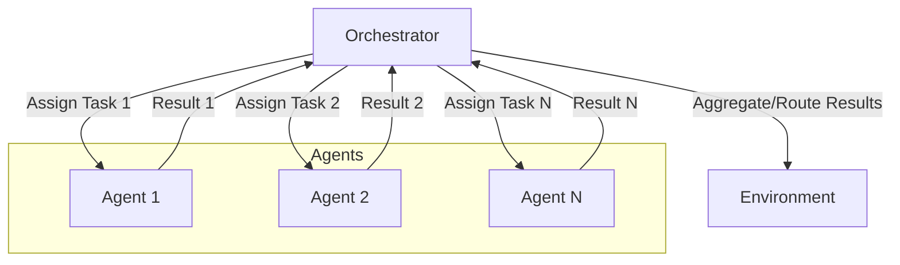

# Agent Orchestration Pattern

## Description

The Agent Orchestration Pattern features an orchestrator that coordinates multiple agents, possibly with dynamic role assignment, communication, and task routing. The orchestrator can manage agent lifecycles, assign tasks based on agent capabilities, and aggregate or route results. This pattern is common in complex workflows, dynamic multi-agent systems, and environments where agent roles or numbers may change at runtime.

### Key Characteristics

- **Central Orchestrator:** A dedicated component manages agent interactions and task flow.
- **Dynamic Coordination:** Agents can be assigned roles or tasks on the fly.
- **Scalability:** Supports adding/removing agents as needed.

### Use Cases

- Complex workflow automation
- Dynamic multi-agent systems (e.g., LangGraph workflows, Autogen orchestrators)
- Adaptive team formation and management

### Advantages

- Highly flexible and scalable
- Enables dynamic, context-aware task assignment
- Centralized control for monitoring and optimization

### Limitations

- Orchestrator can become a bottleneck or single point of failure
- More complex system design and state management
- Requires robust communication protocols

---

## Mermaid Diagram

