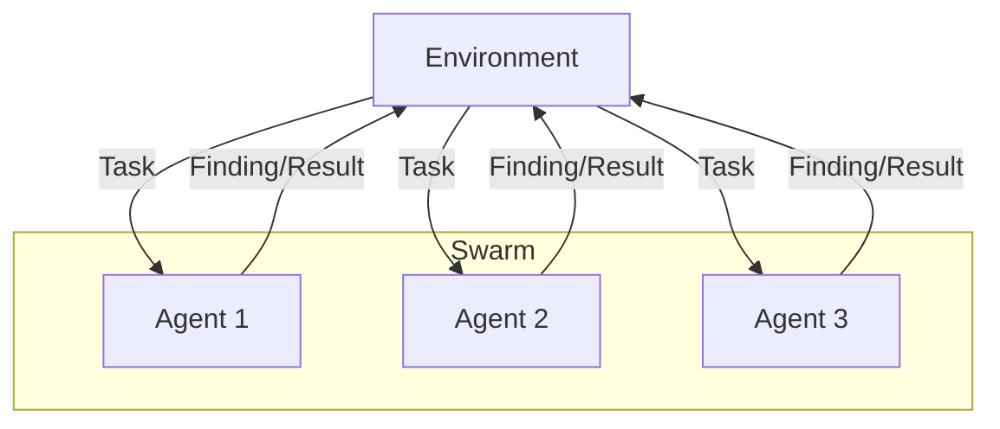

# Agent Swarm Pattern

## Description

The Agent Swarm Pattern involves many simple agents working in parallel, often with minimal coordination, to explore a solution space or solve a problem. The agents may share findings or results, and their collective behavior can lead to emergent solutions. This pattern is inspired by swarm intelligence in nature (e.g., ants, bees) and is useful for search, optimization, and distributed problem solving.

### Key Characteristics

- **Parallelism:** Many agents operate simultaneously, often independently.
- **Emergent Behavior:** Collective intelligence arises from simple agent rules and interactions.
- **Exploration:** Agents may search, sample, or optimize in parallel.

### Use Cases

- Search and optimization (e.g., genetic algorithms, ant colony optimization)
- Distributed data collection or analysis
- Large-scale simulation or exploration

### Advantages

- Scalable and robust to individual agent failure
- Can efficiently explore large or complex spaces
- Simple agent design, powerful collective results

### Limitations

- May require aggregation or consensus mechanisms
- Harder to control or predict individual agent behavior
- Communication overhead if agents share too much data

---

## Mermaid Diagram

