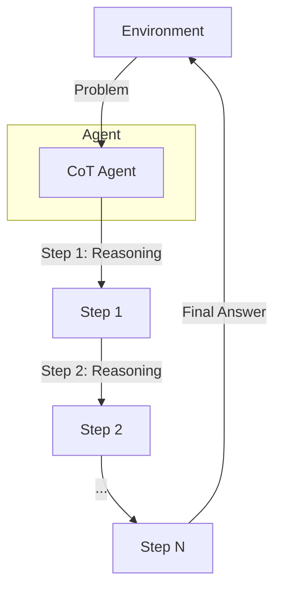

# Chain-of-Thought (CoT) Pattern

## Description

The Chain-of-Thought (CoT) Pattern is a reasoning strategy where an agent decomposes a complex problem into a sequence of intermediate reasoning steps. Instead of producing an answer directly, the agent generates a step-by-step explanation or thought process, which leads to more accurate and interpretable results. This pattern is especially useful for tasks that require logical reasoning, multi-step calculations, or justification of answers.

### Key Characteristics

- **Stepwise Reasoning:** The agent breaks down the problem into smaller, manageable steps.
- **Transparency:** Each step in the reasoning process is visible and can be inspected.
- **Improved Accuracy:** Decomposing complex tasks often leads to better results.

### Use Cases

- Math word problems
- Logical puzzles
- Multi-step decision making
- Explanatory question answering

### Advantages

- Increased interpretability and trust
- Better handling of complex, multi-step tasks
- Easier debugging and error analysis

### Limitations

- May be slower than direct answer generation
- Requires careful prompt or agent design
- Not always necessary for simple tasks

---

## Mermaid Diagram

