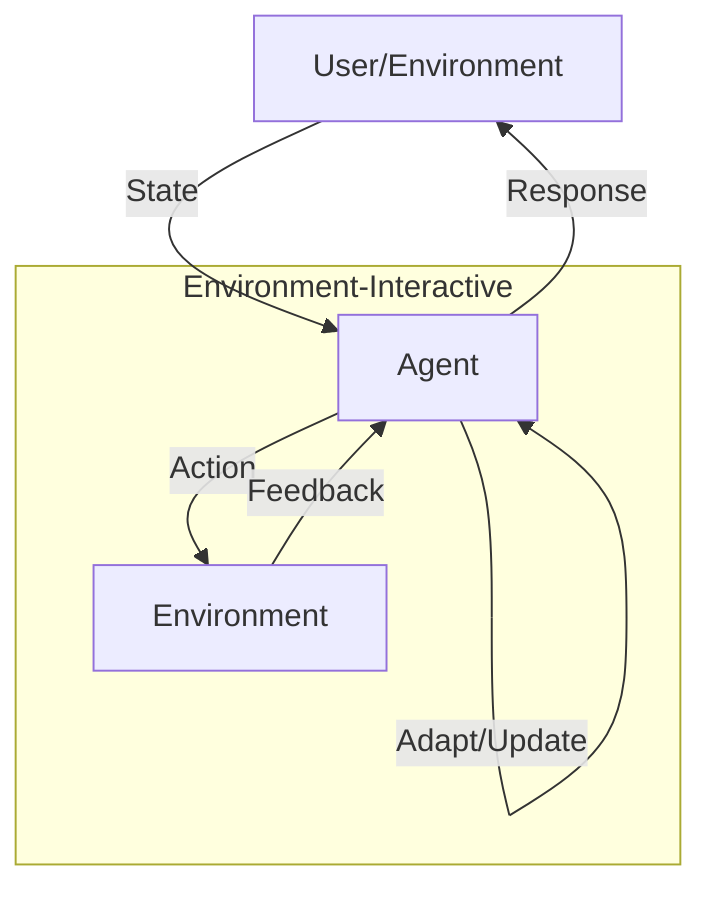

# Environment-Interactive Agent Pattern

## Description

The Environment-Interactive Agent Pattern focuses on agents that actively perceive, interact with, and adapt to their environment. These agents can sense changes, take actions that alter the environment, and learn from the outcomes of their actions. This pattern is foundational for agents operating in dynamic, real-world, or simulated environments where feedback and adaptation are crucial.

### Key Characteristics

- **Perception:** Agents sense or observe the environment.
- **Action:** Agents take actions that affect the environment.
- **Feedback Loop:** Agents receive feedback and adapt their behavior accordingly.
- **Learning:** Agents improve performance based on environmental outcomes.

### Use Cases

- Robotics and autonomous systems
- Game-playing agents
- Agents in simulation environments
- Adaptive user interfaces

### Advantages

- Enables real-time adaptation and learning
- Suitable for dynamic and unpredictable settings
- Can optimize behavior through trial and error

### Limitations

- Requires robust sensing and action mechanisms
- May need complex feedback and learning logic
- Risk of negative or unsafe actions in real-world settings

---

## Mermaid Diagram

