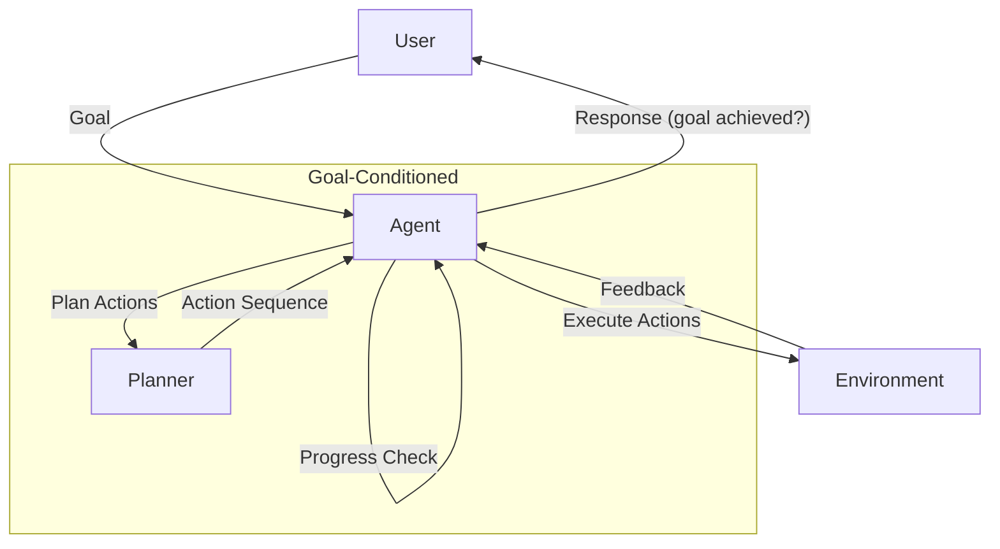

# Goal-Conditioned Agent Pattern

## Description

The Goal-Conditioned Agent Pattern structures agents to operate with explicit goals or objectives that guide their behavior. These agents receive a goal as input and plan or act to achieve it, often adapting their actions based on progress or feedback. This pattern is foundational for agents that need to solve tasks, pursue objectives, or adapt to changing requirements.

### Key Characteristics

- **Explicit Goal Input:** Agents are provided with a clear goal or objective.
- **Goal-Driven Planning:** Actions and decisions are conditioned on the current goal.
- **Progress Monitoring:** Agents track their progress toward the goal and adapt as needed.
- **Dynamic Replanning:** If obstacles arise, agents can adjust their strategy to stay aligned with the goal.

### Use Cases

- Task completion agents (e.g., "Book a flight to Paris")
- Multi-step problem solvers
- Agents that adapt to changing user goals
- Automated assistants with dynamic objectives

### Advantages

- Flexible and adaptive behavior
- Can handle a wide range of tasks
- Enables dynamic and user-driven interactions

### Limitations

- Requires robust goal representation and tracking
- May need complex planning or reasoning logic
- Risk of goal misinterpretation or drift

---

## Mermaid Diagram

