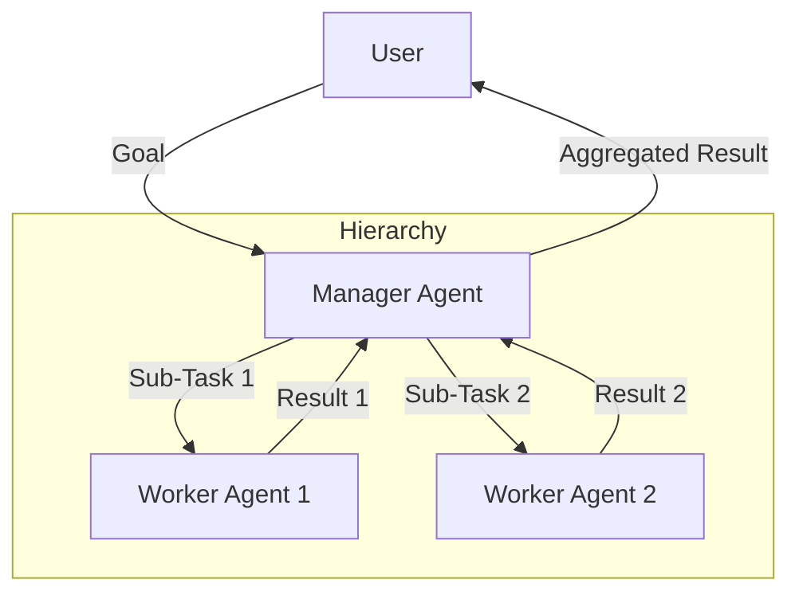

# Hierarchical Agent Pattern

## Description

The Hierarchical Agent Pattern organizes agents in a multi-level structure, where higher-level agents delegate tasks or goals to lower-level sub-agents. Each agent operates at a different level of abstraction, allowing for decomposition of complex problems into manageable sub-tasks. This pattern is useful for large, complex, or multi-step tasks that benefit from structured delegation and coordination.

### Key Characteristics

- **Multi-Level Structure:** Agents are organized in a hierarchy (e.g., manager, worker).
- **Task Decomposition:** High-level agents break down goals into sub-tasks for sub-agents.
- **Delegation:** Sub-agents execute specific tasks and report results upward.
- **Coordination:** Results are aggregated and integrated at higher levels.

### Use Cases

- Project management agents (manager/subordinate roles)
- Multi-step workflow automation
- Complex planning and execution systems
- Agents that coordinate teams of specialized sub-agents

### Advantages

- Scalable and modular problem solving
- Clear separation of concerns
- Enables specialization among sub-agents

### Limitations

- Requires robust communication and coordination
- Risk of bottlenecks or miscommunication
- More complex agent design and management

---

## Mermaid Diagram

