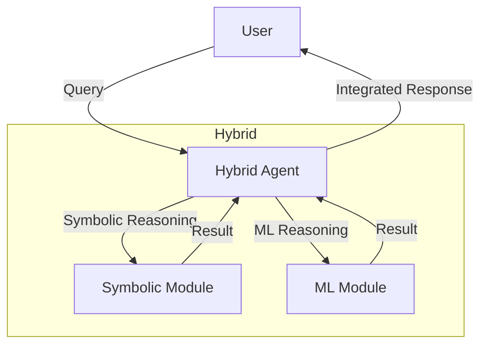

# Hybrid Agent Pattern

## Description

The Hybrid Agent Pattern combines multiple agentic patterns or reasoning approaches within a single agent or system. Hybrid agents may integrate symbolic reasoning, machine learning, rule-based logic, or other paradigms to leverage the strengths of each. This pattern is useful for complex tasks that benefit from both structured logic and adaptive learning.

### Key Characteristics

- **Integration:** Combines two or more agentic patterns or reasoning methods.
- **Flexibility:** Can switch or blend strategies based on context or task.
- **Complementarity:** Leverages strengths of different approaches (e.g., rules for precision, ML for adaptation).
- **Coordination:** Manages interactions between different reasoning modules.

### Use Cases

- Agents that use both rules and LLMs for decision making
- Systems that combine planning with reactive behaviors
- Multi-modal agents (text, vision, etc.)
- Adaptive assistants for complex environments

### Advantages

- Greater flexibility and robustness
- Can handle a wider range of tasks and scenarios
- Enables best-of-both-worlds solutions

### Limitations

- Increased system complexity
- Requires careful integration and coordination
- Potential for conflicting strategies or outputs

---

## Mermaid Diagram

