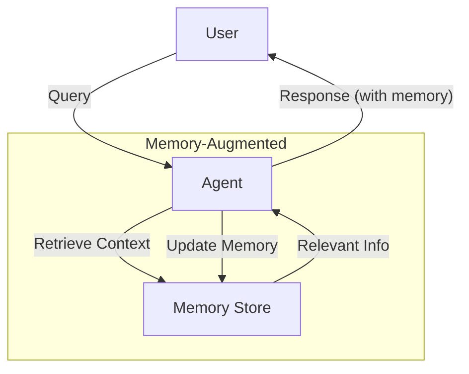

# Memory-Augmented Agent Pattern

## Description

The Memory-Augmented Agent Pattern equips agents with the ability to store, retrieve, and utilize information from past interactions or experiences. This memory can be short-term (session-based) or long-term (persistent across sessions), enabling agents to provide contextually relevant responses, learn user preferences, and build upon previous knowledge.

### Key Characteristics

- **Memory Storage:** Agents maintain a memory store (in-memory, database, or file-based).
- **Recall:** Agents can retrieve relevant information from memory to inform current decisions.
- **Contextual Awareness:** Responses are improved by leveraging past interactions.
- **Learning:** Agents can update memory with new facts, corrections, or user preferences.

### Use Cases

- Conversational agents that remember user details
- Task assistants that track progress over time
- Agents that learn and adapt to user feedback
- Knowledge base augmentation

### Advantages

- More personalized and coherent interactions
- Ability to learn and adapt over time
- Reduces repeated questions or mistakes

### Limitations

- Requires memory management and retrieval strategies
- Risk of outdated or incorrect memory
- Privacy and data retention concerns

---

## Mermaid Diagram

