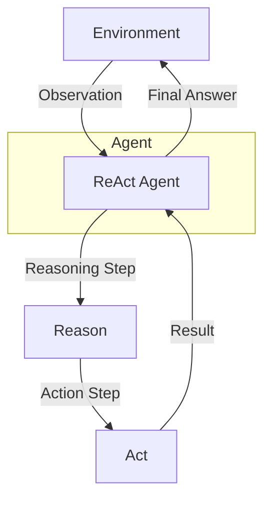

# ReAct Pattern (Reason + Act)

## Description

The ReAct Pattern (Reason + Act) is an agentic system design where the agent alternates between reasoning (thinking, planning, or reflecting) and acting (taking concrete steps, such as calling tools or APIs). This pattern enables agents to solve complex tasks by iteratively deciding what to do next based on the current state and available actions. ReAct is especially powerful for tool-using agents, web automation, and multi-step workflows.

### Key Characteristics

- **Alternating Reasoning and Action:** The agent reasons about the problem, takes an action, observes the result, and repeats as needed.
- **Dynamic Planning:** The agent can change its plan based on new information or results from actions.
- **Tool Use:** Often involves calling external tools, APIs, or performing environment manipulations.

### Use Cases

- Web automation and scraping
- Multi-step data processing
- Interactive assistants that use tools
- Agents that need to adapt to changing environments

### Advantages

- Flexible and adaptive problem solving
- Supports complex, multi-step tasks
- Enables integration with external systems and APIs

### Limitations

- More complex agent design and state management
- Requires robust error handling and observation interpretation
- May be slower due to iterative process

---

## Mermaid Diagram

