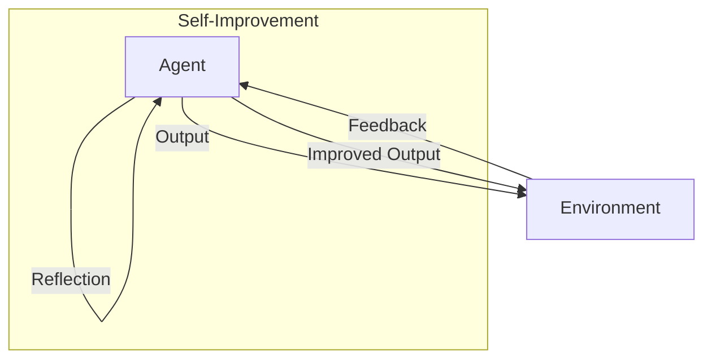

# Reflection and Self-Improvement Pattern

## Description

The Reflection and Self-Improvement Pattern enables agents to review their own outputs, reflect on their performance, and adapt or improve their strategies over time. This can involve self-critique, learning from mistakes, or updating internal models. The pattern is foundational for building agents that can learn, adapt, and optimize themselves autonomously.

### Key Characteristics

- **Self-Reflection:** Agents analyze their own outputs or decisions.
- **Adaptation:** Agents update their strategies, prompts, or models based on feedback.
- **Continuous Improvement:** Performance can improve over time with experience.

### Use Cases

- Agents that critique and revise their own answers
- Automated code or content review
- Adaptive tutoring or recommendation systems
- Agents that learn from user feedback

### Advantages

- Enables learning and optimization
- Reduces repeated mistakes
- Increases agent robustness and reliability

### Limitations

- Requires mechanisms for feedback and learning
- Risk of overfitting or negative adaptation
- More complex agent design and state management

---

## Mermaid Diagram

