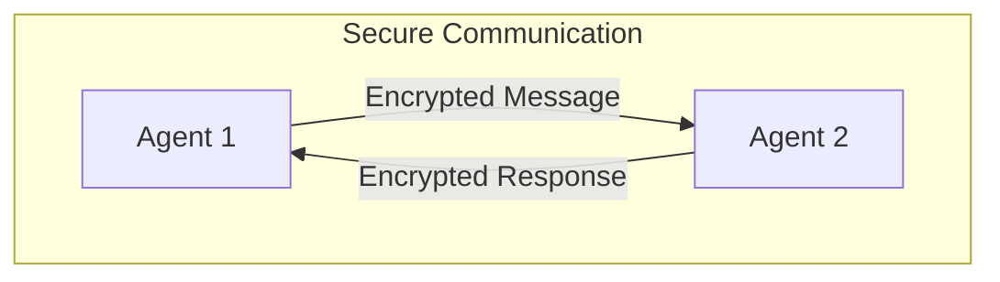

# Secure Agent Communication Pattern

## Description

The Secure Agent Communication Pattern ensures that agents communicate using secure protocols, protecting the privacy, integrity, and authenticity of their messages. This pattern is essential for applications where sensitive data is exchanged or where agents operate in untrusted or adversarial environments.

### Key Characteristics

- **Encryption:** Messages between agents are encrypted to prevent eavesdropping.
- **Authentication:** Agents verify the identity of communication partners.
- **Integrity:** Mechanisms are in place to detect tampering or message alteration.
- **Confidentiality:** Sensitive information is protected during transmission.

### Use Cases

- Agents exchanging confidential or sensitive data
- Multi-agent systems in finance, healthcare, or defense
- Distributed agents operating over public networks
- Privacy-preserving collaborative agents

### Advantages

- Protects against data breaches and unauthorized access
- Ensures trust and reliability in agent interactions
- Enables compliance with privacy and security regulations

### Limitations

- Adds computational and communication overhead
- Requires key management and secure protocol implementation
- Potential for denial-of-service or authentication attacks

---

## Mermaid Diagram

