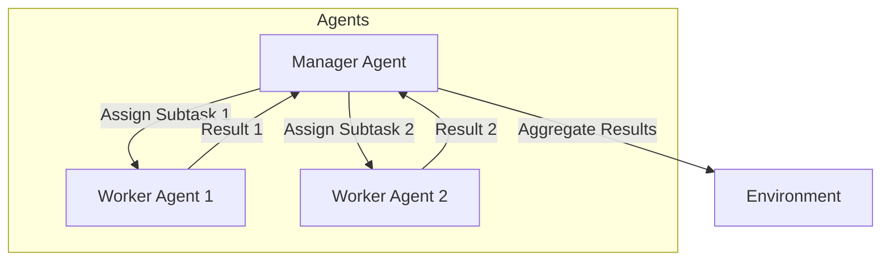

# Task Delegation Pattern

## Description

The Task Delegation Pattern features a manager (or orchestrator) agent that breaks down a complex task into subtasks and delegates them to specialized worker agents. Each worker agent is responsible for a specific subtask, and the manager coordinates their execution and aggregates the results. This pattern is common in project management, workflow automation, and systems requiring division of labor.

### Key Characteristics

- **Manager/Worker Structure:** A central agent delegates work to multiple specialized agents.
- **Specialization:** Worker agents are optimized for specific subtasks.
- **Coordination:** The manager handles task assignment, progress tracking, and result aggregation.

### Use Cases

- Project management bots
- Automated workflow orchestration
- Multi-step data processing pipelines
- Systems requiring division of labor

### Advantages

- Efficient handling of complex, multi-step tasks
- Enables parallelism and specialization
- Scalable and modular system design

### Limitations

- Requires robust coordination and error handling
- Potential bottleneck at the manager agent
- More complex communication and state management

---

## Mermaid Diagram

