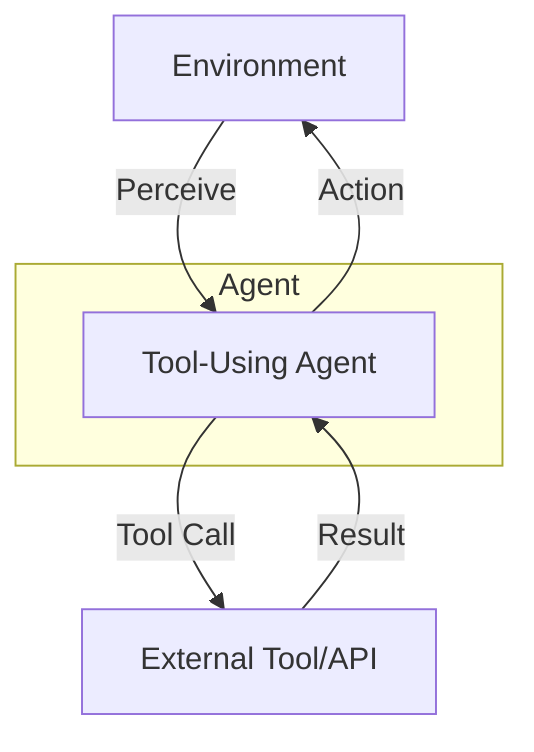

# Tool-Using Agent Pattern

## Description

The Tool-Using Agent Pattern extends the Single Agent Pattern by enabling the agent to interact with external tools, APIs, or services to enhance its capabilities. Instead of relying solely on its own reasoning, the agent can delegate specific tasks (such as calculations, web searches, or data retrieval) to specialized tools. This pattern is foundational for building more capable and practical agentic systems.

### Key Characteristics

- **Tool Integration:** The agent can call external tools or APIs as part of its reasoning process.
- **Decision Making:** The agent decides when and how to use tools based on the task or user input.
- **Enhanced Capabilities:** The agent can solve a broader range of problems by leveraging external resources.

### Use Cases

- Agents that use calculators, search engines, or databases
- Virtual assistants that book appointments or fetch weather data
- Data analysis bots that use external libraries or APIs

### Advantages

- Greatly expands the agent's abilities
- Enables real-world applications (e.g., automation, information retrieval)
- Modular and extensible: new tools can be added as needed

### Limitations

- Increased complexity in agent design
- Requires robust error handling for tool failures
- Security and privacy considerations when using external services

---

## Mermaid Diagram

