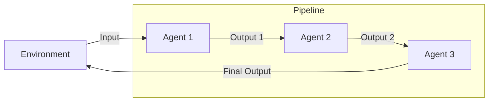

# Agent Chain / Pipeline Pattern

## Description

The Agent Chain (Pipeline) Pattern organizes agents in a sequential pipeline, where each agent processes the output of the previous one. This enables modular, stepwise transformation or enrichment of data, and is ideal for workflows that require multiple stages of processing, validation, or augmentation. Each agent in the chain can be specialized for a particular function.

### Key Characteristics

- **Sequential Processing:** Agents are arranged in a fixed order, each handling a specific stage.
- **Modularity:** Each agent can be developed and tested independently.
- **Composability:** Pipelines can be extended or modified by adding/removing agents.

### Use Cases

- Data extraction → summarization → translation
- Multi-stage document processing
- Chained reasoning or validation steps
- Automated content moderation pipelines

### Advantages

- Clear, maintainable workflow structure
- Easy to debug and extend
- Supports specialization and division of labor

### Limitations

- Fixed order may not suit all tasks
- Bottlenecks if one stage is slow or fails
- Less flexible than dynamic orchestration

---

## Mermaid Diagram

