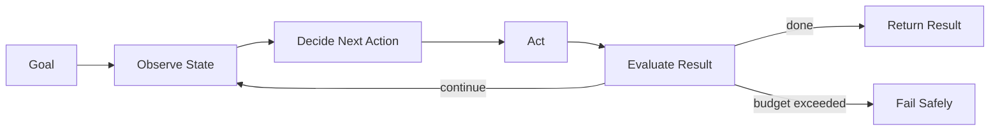

# Agent Loop Pattern

## Intent

The Agent Loop Pattern defines the runtime cycle that turns a model call into an agent: observe state, decide the next action, act through tools or messages, evaluate the result, and stop when the goal is complete or a limit is reached.

## Use When

- The next step is not fully known before execution starts.
- The agent may need multiple tool calls or revisions.
- You need explicit stop conditions, budgets, and recoverable state.

## Avoid When

- The task is a fixed workflow with known steps.
- A single prompt or deterministic function is sufficient.
- You cannot safely bound tool use, cost, or runtime.

## Architecture

## Implementation Notes

- Persist the loop state: goal, messages, observations, tool calls, outputs, errors, and budget counters.
- Make stop conditions explicit: success predicate, max iterations, max cost, max wall-clock time, and user cancellation.
- Treat model output as a proposal. Validate tool names, tool inputs, structured outputs, and permissions before acting.
- Emit trace events for each loop iteration so failures can be debugged after the run.

## Failure Modes

- Infinite loops caused by vague goals or missing stop conditions.
- Repeated tool calls with no new information.
- Hidden state drift when observations are summarized too aggressively.
- Premature success when the evaluator only checks whether an answer exists.

## Related Patterns

- [Goals and State](../goals-and-state-pattern/README.md)
- [Tool-Using Agent](../tool-using-agent-pattern/README.md)
- [Evaluator-Optimizer](../evaluator-optimizer-pattern/README.md)
