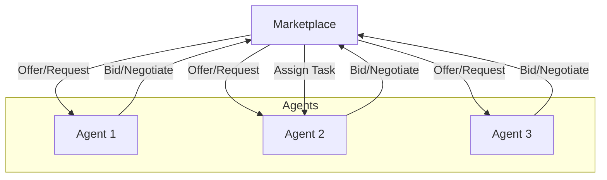

# Agent Marketplace Pattern

## Description

The Agent Marketplace Pattern features a system where agents offer and request services in a marketplace-like environment. Agents can negotiate, bid, or trade tasks based on their expertise, availability, or cost. This pattern enables dynamic task allocation, resource optimization, and competitive collaboration among agents.

### Key Characteristics

- **Service Offering:** Agents advertise their capabilities or services.
- **Task Bidding/Negotiation:** Agents compete or negotiate for tasks.
- **Dynamic Allocation:** Tasks are assigned based on bids, negotiation, or market rules.

### Use Cases

- Distributed resource allocation
- Task outsourcing and brokering
- Multi-agent negotiation and trading
- Dynamic team formation

### Advantages

- Efficient resource utilization
- Supports competition and specialization
- Flexible and adaptive to changing needs

### Limitations

- Requires robust market and negotiation protocols
- Potential for conflicts or suboptimal outcomes
- More complex agent and system design

---

## Mermaid Diagram

