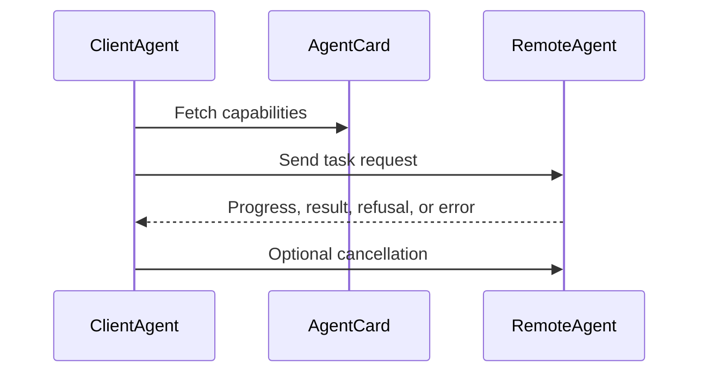

# Agent-to-Agent Communication Protocol (A2A)

A2A makes agents discoverable and callable across process, team, and vendor boundaries. Instead of hard-coding one agent into another, each agent exposes capabilities and exchanges typed task messages.

## Intent

Use this pattern when one agent needs to call another agent as a remote collaborator. The protocol boundary should make capability discovery, task submission, progress, refusal, cancellation, and results explicit.

## Use When

- Agents are owned by different services, teams, runtimes, or vendors.
- A caller must discover what a remote agent can do before sending work.
- Task state must survive asynchronous progress, refusal, error, or cancellation.

## Avoid When

- Both agents are simple functions inside one process.
- The interaction is only a local tool call with a typed input and output.
- You cannot authenticate callers or validate messages.

## What A2A Adds

The important design artifact is the agent card: it tells other agents what this agent can do, where to call it, and what interaction modes it supports. The message protocol then gives both sides a common contract for task lifecycle events.

## Core Flow

## Protocol Types

See `./protocol/a2a.schema.json` for JSON Schemas of:

- Handshake
- TaskRequest
- TaskResponse
- Progress
- Cancel

## How to run (TS)

- Demo: `ts-node --esm ./agent-to-agent-communication-pattern/src/run_demo.ts`
- Test: `ts-node --esm ./agent-to-agent-communication-pattern/test/a2a.spec.ts`

## Implementation Notes

- Messages validated against schemas before delivery.
- Bus is in-memory; swap to a real transport without changing messages.
- Treat refusals as valid protocol outcomes, not exceptions.
- Include idempotency keys or task IDs so retries do not duplicate work.
- Add authentication and authorization before crossing a trust boundary.

## Failure Modes

- Treating a remote agent like a local tool and ignoring latency, refusal, or cancellation.
- Sending unvalidated natural language blobs instead of typed task messages.
- Missing capability discovery, causing callers to rely on stale assumptions.
- No correlation ID across progress, result, and error messages.
