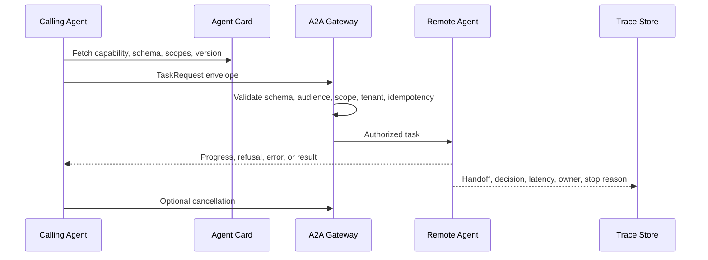

# Agent-to-Agent Communication Protocol (A2A)

## Intent

A2A makes agents discoverable and callable across process, team, runtime, and vendor boundaries. Use it when one agent needs to call another agent as a remote collaborator through an explicit protocol contract.

This is the agent version of service-to-service communication. The point is not to let agents chat freely. The point is to let one bounded agent request work from another bounded agent with identity, schema validation, authorization, idempotency, progress, refusal, cancellation, traceability, and versioning.

Microservice communication patterns still apply. REST, gRPC, MCP, and A2A are different protocol shapes, but the engineering concerns are familiar: contracts, identity, authorization, retries, timeouts, idempotency, observability, ownership, and backward compatibility.

## Use When

- Agents are owned by different services, teams, runtimes, or vendors.
- A caller must discover what a remote agent can do before sending work.
- Task state must survive asynchronous progress, refusal, error, timeout, retry, or cancellation.
- The caller and callee need a shared contract for ownership, task lifecycle, and result shape.
- Cross-agent communication needs TLS, OAuth or OIDC scopes, trace IDs, and audit records.

## Avoid When

- Both agents are simple functions inside one process.
- The interaction is only a local tool call with a typed input and output.
- You cannot authenticate callers, validate messages, or trace handoffs.
- The remote agent has no stable owner, capability contract, or versioning policy.
- A deterministic workflow would be clearer than adding another autonomous collaborator.

## What A2A Adds

The important design artifact is the agent card: it tells other agents what this agent can do, where to call it, what schemas it accepts, what scopes it requires, which task lifecycle states it emits, and what interaction modes it supports.

The message protocol then gives both sides a common contract for task lifecycle events:

- capability discovery;
- task submission;
- progress;
- refusal;
- cancellation;
- timeout;
- error;
- result;
- audit and trace correlation.

The remote agent should be treated as a service with a contract, not as a model hidden behind a friendly name.

## Architecture



## System Shape

- **Capability boundary:** callers discover capabilities from an agent card instead of relying on stale assumptions.
- **Message boundary:** every task request has a schema, trace ID, message ID, idempotency key, source agent, target agent, tenant, audience, scopes, and timeout.
- **Identity boundary:** callers are authenticated through service identity and delegated credentials.
- **Authorization boundary:** scopes, tenant, audience, capability, policy, and risk are checked before the remote agent starts work.
- **Ownership boundary:** every task has a current owner, status, stop reason, and cancellation path.
- **Observability boundary:** handoffs, retries, refusals, timeouts, approvals, and results are trace events, not hidden chat messages.

## Core Protocol

1. Fetch the remote agent card: capability, schema, version, scopes, owner, timeout, and lifecycle states.
2. Build a task request envelope from current goal, state, tenant, trace ID, idempotency key, and allowed delegation budget.
3. Validate the message schema before transport.
4. Authenticate caller and verify audience, scopes, tenant, capability, and policy.
5. Deliver the request to the remote agent only after authorization succeeds.
6. Emit progress, refusal, error, timeout, cancellation, or result events with the same trace ID.
7. Validate the response schema and ownership state before the caller consumes the result.
8. Record the handoff, decision, latency, cost, status, owner, and stop reason.
9. Convert repeated failures, unsafe delegation, or protocol mismatches into eval cases.

## Protocol Types

See `./protocol/a2a.schema.json` for JSON Schemas of:

- Handshake
- TaskRequest
- TaskResponse
- Progress
- Cancel

## Implementation Notes

- Messages should be validated against schemas before delivery.
- A2A messages should carry correlation fields, not rely on logs to reconstruct a handoff later.
- Use TLS for remote transport and mTLS where service identity matters.
- Use OAuth or OIDC scopes for delegated authority.
- Treat refusals, timeouts, and cancellation as normal protocol outcomes, not exceptions.
- Include idempotency keys or task IDs so retries do not duplicate work.
- Add authorization before crossing a trust boundary.
- Keep agent card versions and message schema versions backward compatible.
- Avoid delegation loops by tracking owner, parent task, delegation depth, and stop reason.

### Message Envelope

```ts
type AgentMessageEnvelope = {
  traceId: string;
  messageId: string;
  idempotencyKey: string;
  fromAgent: string;
  toAgent: string;
  tenantId: string;
  capability: string;
  auth: {
    audience: string;
    scopes: string[];
  };
  timeoutMs: number;
  payload: Record<string, unknown>;
};
```

### Authorization Check

```ts
function validateA2AEnvelope(input: {
  envelope: AgentMessageEnvelope;
  requiredAudience: string;
  requiredScope: string;
  targetAgent: string;
  seenIdempotencyKeys: Set<string>;
}) {
  const { envelope, requiredAudience, requiredScope, targetAgent, seenIdempotencyKeys } = input;

  if (!envelope.traceId || !envelope.messageId || !envelope.idempotencyKey) {
    return { decision: 'deny', reason: 'missing_correlation_fields' };
  }

  if (envelope.toAgent !== targetAgent || envelope.auth.audience !== targetAgent) {
    return { decision: 'deny', reason: 'wrong_audience' };
  }

  if (envelope.auth.audience !== requiredAudience) {
    return { decision: 'deny', reason: 'wrong_required_audience' };
  }

  if (!envelope.auth.scopes.includes(requiredScope)) {
    return { decision: 'deny', reason: 'missing_scope' };
  }

  if (seenIdempotencyKeys.has(envelope.idempotencyKey)) {
    return { decision: 'deny', reason: 'duplicate_message' };
  }

  return { decision: 'allow', reason: 'accepted' };
}
```

The exact envelope can change by protocol, but the boundary should remain: identify the caller, identify the target, validate authority, preserve correlation, and stop duplicate work.

## Observability

Trace every cross-agent handoff. At minimum record:

- caller agent;
- target agent;
- capability requested;
- trace ID, message ID, task ID, and idempotency key;
- schema version and agent card version;
- authorization decision and reason;
- current task owner;
- progress events;
- refusal, timeout, cancellation, retry, approval wait, or final result;
- latency and cost by agent;
- stop reason.

If a multi-agent run fails, the operator should be able to reconstruct which agent owned the task at each point and why ownership changed.

## Failure Modes

- Treating a remote agent like a local function and ignoring latency, refusal, timeout, or cancellation.
- Sending unvalidated natural language blobs instead of typed task messages.
- Missing capability discovery, causing callers to rely on stale assumptions.
- No trace ID across progress, result, and error messages.
- No idempotency key, so retries duplicate work.
- Wrong audience or missing scope is accepted because the remote agent trusts the caller by name.
- Agents delegate the same task back and forth with no owner or delegation budget.
- The remote agent changes its schema without versioning.
- A fallback path bypasses authorization or observability.

## Evaluation Strategy

Test the protocol, not only the happy-path collaboration.

- Test valid calls with correct audience, scope, tenant, schema, trace ID, and idempotency key.
- Test wrong audience, missing scope, schema mismatch, missing trace ID, and duplicate message.
- Test refusal as a valid result.
- Test timeout and cancellation behavior.
- Test delegation loop detection.
- Test unsafe capability requests.
- Test backward-compatible schema evolution.
- Test that every handoff emits trace and ownership events.

Measure schema-validity rate, authorization false allows, refusal handling, timeout recovery, duplicate-message detection, delegation-loop rate, trace completeness, and owner-at-failure coverage.

## Production Checklist

- Publish an agent card with capabilities, schemas, scopes, owner, version, and lifecycle states.
- Validate every request and response against versioned schemas.
- Require TLS for remote transport and mTLS for service identity where appropriate.
- Validate OAuth or OIDC audience, scopes, subject, tenant, and expiry before execution.
- Require trace ID, message ID, task ID, idempotency key, source agent, and target agent.
- Treat refusal, cancellation, timeout, and approval wait as first-class outcomes.
- Track current owner and delegation depth to prevent task bouncing.
- Add timeouts, retries, and cancellation semantics before production.
- Record handoffs, authorization decisions, progress, results, and stop reasons in traces.
- Convert protocol failures and unsafe delegation into eval fixtures.

## How to run (TS)

- Demo: `ts-node --esm ./agent-to-agent-communication-pattern/src/run_demo.ts`
- Test: `ts-node --esm ./agent-to-agent-communication-pattern/test/a2a.spec.ts`

## Related Patterns

- [Agents As Services](/systems-architecture/agents-as-services)
- [Choosing Multi-Agent Topology](/multi-agent-systems/choosing-multi-agent-topology)
- [Supervisor / Worker](/multi-agent-systems/supervisor-worker)
- [Secure Agent Communication](/tools-skills-protocols/secure-agent-communication)
- [Policy Enforcement](/production-runtime/policy-enforcement)
- [Observability and Evals](/production-runtime/observability-and-evals)
- [MCP-first Tool Use](/tools-skills-protocols/mcp-first-tool-use)
