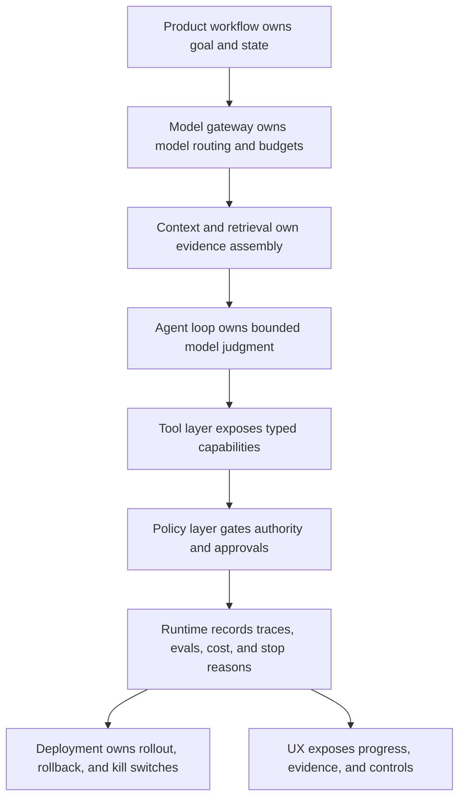

# Agent Engineer Toolkit

Un agent engineer elige models, tools, memory, orchestration, evals e infraestructura de deployment como un solo sistema. El toolkit debe apoyar la arquitectura, no definirla.

Usa este capítulo para decidir qué construir directamente y qué tomar de un framework.

Piensa en el toolkit como un mapa de capabilities. Algunas capabilities pueden venir de un framework, otras de servicios de plataforma existentes, y otras deben permanecer bajo control del producto porque definen autoridad, policy y confianza.

## Toolkit Layers

| Layer | Responsabilidad | Ejemplos de Decisiones |
| --- | --- | --- |
| Model layer | Razonamiento, generación, llamadas a tools, structured output. | Calidad del model, latencia, costo, context window, modo de deployment. |
| Model gateway | Routing, fallback, límites de tasa, abstracción de proveedores. | Qué models están permitidos, cuándo ocurre fallback, cómo se fijan versiones. |
| Context layer | Ensambla el conjunto de trabajo del model. | Forma del context packet, etiquetas de fuente, exclusiones, presupuesto de tokens. |
| Orchestration layer | Workflow, routing, loops, state, reintentos. | Workflow en código, grafo estilo LangGraph, crew estilo CrewAI, runtime estilo Mastra. |
| Tool layer | Acciones externas y acceso a datos. | Servidores MCP, APIs internas, browser tools, ejecución de código, funciones de base de datos. |
| Policy layer | Decisiones de allow, deny, aprobación, escalamiento y auditoría en runtime. | Autoridad de tool, acceso a datos, escrituras en memory, umbrales de aprobación. |
| Memory layer | Working, episodic, semantic y user memory. | Índice vectorial, almacén relacional, filesystem state, memory write policy. |
| Retrieval layer | Búsqueda de fuentes, filtrado, reranking, citación. | Tipo de índice, registro de fuentes, reglas de frescura, filtros de tenant. |
| Evaluation layer | Chequeos de calidad y regresión. | Golden datasets, judges, etiquetas humanas, production traces. |
| Observability layer | Depuración y operaciones. | Traces, métricas, costos, logs, run replay. |
| Deployment layer | Hosting en runtime, escalado, configuración, rollback. | Feature flags, canaries, kill switches, environment policy. |
| Security layer | Permisos y contención. | Sandboxes, secrets, policy gates, auditoría, controles de egreso. |
| UX layer | Interacción humana y confianza. | Streaming, aprobaciones, explicaciones, handoffs, recuperación. |
| Governance layer | Cómo cambia el sistema. | ADRs, revisiones, release gates, incident-to-eval loop. |

Las layers pueden venir de un solo framework, varias librerías o código directo. Lo importante es que cada layer tenga un responsable.

Usa el mapa como verificación de ownership. Si un toolkit oculta uno de estos límites, el equipo aún es responsable de la decisión faltante; solo se ha movido fuera de la vista.

## Build, Buy, Or Compose

No preguntes primero "¿qué framework deberíamos usar?". Pregunta qué capabilities del toolkit deben ser propiedad del producto.

| Capability | Frecuentemente provisto por framework | Debe permanecer bajo control del producto |
| --- | --- | --- |
| Model adapters | Clientes de proveedor, streaming, ayudantes de structured output. | Models permitidos, fallback policy, presupuestos de costo. |
| Orchestration | Ejecución de grafos, pasos de workflow, reintentos. | State schema, razones de detención, esperas de aprobación, rollback. |
| Tooling | Registro de tools, ayudantes de invocación, clientes MCP. | Autoridad de tool, efectos secundarios, alcances, credenciales, aprobaciones. |
| Memory | Almacenes, embeddings, ayudantes de retrieval. | Write policy, consentimiento, retención, eliminación, corrección. |
| Retrieval | Índices, rerankers, conectores. | Registro de fuentes, filtros de acceso, frescura, reglas de citación. |
| Evals | Runners, judges, reportes. | Casos bloqueantes, fixtures de incidentes, release gates. |
| Observability | Spans, logs, dashboards. | Trace schema, redacción, requisitos de auditoría, replay policy. |
| Deployment | Hosting, configuraciones, escalado. | Plan de rollout, kill switches, ownership de incidentes. |

Los frameworks son buenos para la mecánica. Los equipos de producto aún deben ser dueños de la autoridad.

## Minimum Toolkit By Risk

El toolkit debe escalar según el riesgo. Un demo y un agent de producción con efectos secundarios no necesitan la misma maquinaria.

| Nivel de riesgo | Toolkit mínimo |
| --- | --- |
| Demo | Llamada al model, prompt, entradas de ejemplo, simple run log. |
| Asistente interno solo lectura | Context builder, filtros de fuente, evals básicos, trace IDs, feedback path. |
| Agent de producción solo lectura | State model, retrieval policy, eval gates, observabilidad, presupuestos de costo, controles de rollout. |
| Agent de producción con efectos secundarios | Tools tipados, policy engine, approval gates, idempotencia, rollback, incident replay. |
| Agent regulado o de alto riesgo | Revisión de seguridad, audit logs, redacción, aislamiento de tenant, escalamiento humano, ADRs, release gates formales. |

Agregar layers al toolkit no es ceremonia cuando el agent puede afectar usuarios, dinero, acceso, datos o sistemas de producción.

## Build vs Framework

Usa un framework cuando elimina complejidad operativa real:

- Ejecución de grafos;
- State durable;
- Tracing;
- Registro de tools;
- Integración de eval;
- Flujos de aprobación humana;
- Gestión de deployment;
- Orquestación multi-agent.

Construye directamente cuando:

- El workflow es pequeño;
- El equipo necesita control total sobre state y policy;
- Las abstracciones del framework ocultan fallas importantes;
- El sistema debe integrarse con infraestructura existente;
- El agent es parte de un workflow de producto mayor.

Los frameworks deben hacer los límites más claros. Si un framework dificulta ver el state, llamadas a tools, permisos o modos de falla, usa una abstracción más pequeña.

## Product-Owned Interfaces

Mantén estas interfaces explícitas incluso cuando un framework las ejecute:

- Contratos de request y response;
- Schemas de state y eventos;
- Tool manifests;
- Forma del context packet;
- Policy decision schema;
- Memory record schema;
- Approval request y decision schema;
- Formato de eval fixture;
- Trace schema;
- Controles de deployment y rollback.

Estas son las piezas que permiten a un equipo migrar frameworks, depurar incidentes y mantener la autoridad fuera de los prompts.

## Framework Evaluation Checklist

Antes de adoptar un framework, pruébalo contra los requisitos de producción del agent.

- ¿Puede persistir y reanudar el state?
- ¿Puede representar approval gates?
- ¿Puede restringir tools por rol o ruta?
- ¿Puede trazar llamadas a models, tools y handoffs?
- ¿Puede ejecutar evals con fixtures realistas?
- ¿Puede soportar fallback y routing de models?
- ¿Puede exponer costo y latencia por paso?
- ¿Puede ejecutarse en el entorno de deployment del equipo?
- ¿Pueden los ingenieros depurar fallas sin leer el código interno del framework?
- ¿Puede ser removido después si el producto lo supera?

Haz un vertical slice delgado antes de comprometer toda la arquitectura.

## Model Selection

Elige models por carga de trabajo, no solo por ranking de benchmarks.

Evalúa:

- Fiabilidad de structured output;
- Fiabilidad en el uso de tools;
- Seguimiento de instrucciones;
- Latencia;
- Costo por task completado;
- Comportamiento del context window;
- Comportamiento de rechazo y seguridad;
- Necesidades multimodales;
- Soporte para restricciones de deployment;
- Estabilidad del proveedor y versionado.

Usa múltiples models cuando reduzca costo o mejore calidad. Un model pequeño puede hacer routing, clasificar o extraer. Un model más fuerte puede planear, sintetizar o resolver edge cases.

## Tooling Decisions

Los tools requieren disciplina de ingeniería.

Al seleccionar el toolkit, busca las superficies mínimas que hagan los tools gobernables: nombres, descripciones, entradas y salidas tipadas, scopes de permisos, timeouts, idempotencia, etiquetas de efectos secundarios y test fixtures. La checklist de diseño completa está en [Tool Capability Design](../tools-skills-protocols/tool-capability-design); este capítulo solo pregunta si tu toolkit puede soportarlo.

Los tools deficientes exponen superficies amplias como shell sin restricciones, browser control genérico o "database query" sin policy checks. Los tools amplios pueden ser útiles para coding agents confiables, pero necesitan sandboxing y auditoría.

La tool layer debe ser aburrida a propósito. Los tools deben parecerse a capabilities de producto, no a infraestructura cruda. Prefiere `create_refund_draft` sobre `run_sql`, `send_approved_message` sobre `post_http` y `lookup_order_summary` sobre acceso amplio a bases de datos.

## Memory Decisions

Memory no es una sola función. Son varios almacenes con reglas diferentes.

- Working memory guarda el state actual del task.
- Episodic memory almacena ejecuciones previas e interacciones de usuario.
- Semantic memory almacena hechos y documentos.
- Procedural memory almacena habilidades, playbooks y preferencias.

Decide quién puede escribir en memory, cómo se validan las escrituras, cómo expira la memory antigua y cómo se cita la retrieval.

## Decisiones de Evaluación y Observabilidad

Evals y traces son capas del toolkit, no detalles finales.

Como mínimo, el toolkit debe soportar:

- evals offline con tools simulados;
- trajectory evals que inspeccionan llamadas a tools y decisiones de policy;
- regression evals a partir de incidentes;
- seguimiento de versiones de model, prompt, tool, policy y memory;
- traces a través de llamadas a model, llamadas a tool, retrieval, aprobaciones y escrituras en memory;
- reglas de redacción para logs y fixtures de eval;
- replay sin repetir efectos secundarios inseguros.

Si el toolkit no puede probar lo que sucedió, el equipo depurará la respuesta final en vez del sistema.

## Lista de Verificación para el Ensamblaje del Toolkit

Antes de elegir librerías o frameworks, completa esto:

| Pregunta | Respuesta Necesaria |
| --- | --- |
| ¿Quién posee el goal activo y el state? | workflow, runtime, app service o framework. |
| ¿Quién posee la autoridad de tool? | tool registry, policy engine, access-control service. |
| ¿Quién posee las escrituras en memory? | memory service, policy gate, revisión humana. |
| ¿Quién posee el ensamblaje de context? | context builder con paquetes trazables. |
| ¿Quién posee los eval gates? | CI, proceso de release, eval service. |
| ¿Quién posee la observabilidad? | tracing platform, app logs, audit store. |
| ¿Quién posee el rollback? | deployment system, feature flags, tool disablement. |
| ¿Quién posee los controles de usuario? | product UI, approval service, support workflow. |

Las capas sin dueño se convierten en incidentes en producción.

## Anti-Patrones del Toolkit

- Elegir un framework antes de elegir un pattern.
- Darle a cada agent todas las tools.
- Tratar la búsqueda vectorial como memory sin policy de escritura.
- Registrar solo respuestas finales y no decisiones de tools.
- Usar model routing sin evals para la calidad de las rutas.
- Lanzar un demo framework path sin state, policy y observability de producción.
- Tratar la memory proporcionada por el framework como segura por defecto.
- Dejar que la policy viva solo en el texto del prompt.
- Agregar observability después del primer incidente en producción.
- Construir una capa de tool sin manifest, dueño o ruta de desactivación.
- Elegir un model gateway sin version pinning ni reglas de fallback.

## Capítulos Relacionados

- [Framework Selection](./framework-selection)
- [Agent Harnesses](./agent-harnesses)
- [Agent Development Lifecycle](./agent-development-lifecycle)
- [Choosing the Right Pattern](../pattern-selection/choosing-the-right-pattern)
- [Tool Capability Design](../tools-skills-protocols/tool-capability-design)
- [Context Engineering](../foundations/context-engineering)
- [Policy Enforcement](../production-runtime/policy-enforcement)
- [Observability and Evals](../production-runtime/observability-and-evals)
- [Architecture Decision Records for Agents](../systems-architecture/architecture-decision-records)
- [MCP-first Tool Use](../tools-skills-protocols/mcp-first-tool-use)
- [Working Memory](../memory-knowledge/working-memory)
- [Mastra Runtime](../production-runtime/mastra-runtime)
- [CrewAI Flows and Crews](../multi-agent-systems/crewai-flows-and-crews)
- [Agentic System Architecture](../systems-architecture/agentic-system-architecture)
