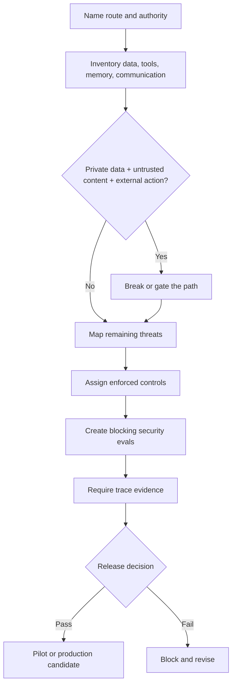

# Agent Threat Model

La seguridad de un agent comienza con una pregunta simple: ¿qué puede hacer que el model haga el sistema? Un chatbot puede dar una mala respuesta. Un agent puede leer datos privados, combinarlos con instrucciones no confiables y enviar algo fuera del límite. Ese es un tipo de riesgo diferente, y merece un threat model diferente.

Así que no comiences el threat model con "el model podría alucinar". Comienza con autoridad, datos, tools y comunicación.

Descarga la hoja reutilizable: [agent threat model worksheet](/capstone-assets/templates/agent-threat-model-worksheet.txt).


## La combinación peligrosa

La forma más peligrosa de un agent combina tres capabilities:

1. acceso a datos privados o confiables;
2. exposición a contenido no confiable;
3. la capacidad de comunicarse o actuar fuera del sistema.

Cuando las tres se encuentran en el mismo execution path, el agent puede convertirse en un puente de exfiltración. La forma es fácil de imaginar: el agent lee datos internos de clientes, luego navega una página web, correo electrónico, ticket, documento o comentario de repositorio que controla otra persona, y ese contenido no confiable le indica al model que envíe los datos privados a través de un correo electrónico, webhook, comentario de issue, formulario de navegador o llamada de API.

El model puede no experimentar esto como un ataque en absoluto. Lo experimenta como solo otra instrucción en el context. Por eso las defensas basadas solo en prompt no son suficientes.

## Límite de seguridad

El model puede proponer; el software debe decidir si la propuesta está permitida. Mantén esas responsabilidades en manos separadas.

| Capa | Responsabilidad |
| --- | --- |
| Model | Interpreta el task, propone acciones, resume evidencia. |
| Orchestrator | Posee el loop, state, presupuestos, ruta y condición de parada. |
| Policy engine | Decide si la acción está permitida. |
| Tool gateway | Valida, ejecuta, registra, deniega o enruta para aprobación. |
| Sandbox | Limita el acceso a filesystem, red, procesos, navegador y credenciales. |
| Observability | Registra suficiente trace data para replay, auditoría y respuesta a incidentes. |

Si el model también es el policy engine, el límite es débil por construcción: el mismo context que transporta el ataque también transporta la instrucción de policy destinada a detenerlo.

## Flujo de revisión de amenazas

Usa este flujo cuando se agregue una nueva ruta, tool, tipo de memory, fuente de datos o canal de comunicación. Un threat model solo es útil si termina en controles, evals, traces y una decisión de lanzamiento.



## Mapa STRIDE para agents

STRIDE solo es útil después de traducirlo a límites específicos de agent. Úsalo para preguntar qué pueden ser engañados para hacer el model, runtime, tools, memory y rutas de comunicación.

| Clase de amenaza | Pregunta específica para agent | Control | Evidencia |
| --- | --- | --- | --- |
| Spoofing | ¿Puede un usuario, tool, agent, servidor MCP, webhook o documento hacerse pasar por un actor confiable o fuente de instrucciones? | Identidad firmada, verificación de audiencia, credenciales por ruta, etiquetas de origen. | Claims de identidad en trace, solicitud denegada por audiencia incorrecta, etiqueta de confianza de origen. |
| Tampering | ¿Puede contenido no confiable modificar goals, policy, argumentos de tool, memory, traces o fixtures de evaluación? | Separación de instrucciones/datos, validación de schema, policy inmutable, almacén de trace protegido. | Resultado hostil de tool rechazado, escritura en memory denegada, verificación de integridad de trace. |
| Repudiation | ¿Puede un usuario, agent, tool o aprobador negar una acción porque el sistema carece de un registro durable? | Run IDs, registros de aprobación, logs de decisiones de policy, eventos de auditoría de tool. | Trace completo desde la solicitud hasta la razón de parada. |
| Information disclosure | ¿Pueden datos privados, secretos, citas, memory o traces filtrarse a través de output, tools, logs, navegador o mensajes entre agents? | Minimización de datos, redacción, allowlist de salida, clasificación de destino. | Prueba de redacción, salida bloqueada, eval de exposición de datos privados. |
| Denial of service | ¿Pueden loops, reintentos, retrieval, tools, colas, llamadas al model o esperas de aprobación agotar costo, latencia, cuota o humanos? | Presupuestos, timeouts, límites de concurrencia, circuit breakers, cancelación. | Caso de agotamiento de presupuesto, alerta de límite de cola, trace de breaker. |
| Elevation of privilege | ¿Puede el agent pasar de lectura a escritura, de borrador a envío, de un tenant a otro, o de un scope de tool a una autoridad más amplia? | Least privilege, allowlists de tool por ruta, puertas de aprobación, tokens con scope. | Eval de tool prohibido, denegación entre tenants, trace que requiere aprobación. |

Este mapa debe generar tickets, no solo discusión. Cada fila de alto riesgo necesita un responsable, un control aplicado, un eval y un campo de trace.

## Clasifica las capabilities de los tools

Cada tool debe tener metadata de capability. Sin esto, el runtime no puede razonar sobre el riesgo.

| Capability | Pregunta |
| --- | --- |
| Private data access | ¿Puede este tool leer datos de clientes, tenant, secretos, datos internos o privilegiados? |
| Untrusted content access | ¿Puede este tool obtener contenido controlado por usuarios, sitios externos, correos, documentos, tickets o comentarios? |
| External communication | ¿Puede este tool enviar datos a otra persona, sistema, red, repositorio, navegador o workflow? |
| Side effects | ¿Puede este tool escribir, borrar, comprar, desplegar, enviar mensajes, mutar o disparar trabajo? |
| Credential scope | ¿Con qué credenciales se ejecuta el tool? |
| Approval requirement | ¿Qué llamadas requieren un humano o un workflow de mayor confianza? |

Esta clasificación debe vivir fuera del prompt. Un manifiesto de tool, configuración de gateway, archivo de policy o registro de servicio es mucho más fácil de auditar que un párrafo de instrucciones en lenguaje natural.

El policy check puede ser pequeño, pero debe estar fuera del model:

```ts
interface ToolCapability {
  name: string;
  readsPrivateData: boolean;
  readsUntrustedContent: boolean;
  communicatesExternally: boolean;
  requiresApproval: boolean;
}

function blocksDangerousPath(tools: ToolCapability[]): boolean {
  const readsPrivateData = tools.some(tool => tool.readsPrivateData);
  const readsUntrustedContent = tools.some(tool => tool.readsUntrustedContent);
  const communicatesExternally = tools.some(tool => tool.communicatesExternally);

  return readsPrivateData && readsUntrustedContent && communicatesExternally;
}

function authorizeToolPlan(tools: ToolCapability[]) {
  if (blocksDangerousPath(tools)) {
    return {
      allowed: false,
      reason: 'private_data_plus_untrusted_content_plus_external_comm'
    };
  }

  if (tools.some(tool => tool.requiresApproval)) {
    return { allowed: false, reason: 'approval_required' };
  }

  return { allowed: true, reason: 'allowed' };
}
```

Esto no hace seguro todo el sistema por sí solo. Muestra el límite: el model puede proponer un plan, pero el software decide si la cadena de tools está permitida.

## Rompe el camino peligroso

El objetivo no es prohibir agents útiles. Es asegurarse de que al menos una parte del camino peligroso esté ausente o controlada.

| Control | Qué elimina o restringe |
| --- | --- |
| No hay datos privados en esta ruta | El agent puede inspeccionar contenido no confiable y comunicarse, pero no puede acceder a datos sensibles. |
| No hay contenido no confiable en esta ruta | El agent puede trabajar con datos y tools internos confiables, pero no puede ingerir instrucciones hostiles. |
| Sin comunicación externa | El agent puede leer y razonar, pero no puede exfiltrar ni actuar fuera del límite. |
| Proxy de tool controlado por policy | El agent puede proponer llamadas, pero la policy decide qué se ejecuta. |
| Aprobación humana | Acciones de alto riesgo requieren que una persona inspeccione la acción propuesta y la evidencia. |
| Controles de salida | Las rutas de red y mensajería están limitadas por ruta, dominio, destino o clase de datos. |
| Minimización de datos | Los tools solo devuelven los campos requeridos para el task. |
| Redacción | Los valores sensibles se eliminan antes de que entren al context del model o a los traces. |

La palabra que importa es aplicar. Una frase en el system prompt no es lo mismo que un límite aplicado, y los atacantes conocen la diferencia incluso cuando el model no.

## Llamadas a Tools Controladas por Policy

Para agents en producción, las llamadas a tools deben pasar por una capa de enforcement que pueda permitir la llamada, denegarla, requerir aprobación, transformar o redactar sus argumentos, adjuntar una clave de idempotencia, registrar la decisión de policy y vincular esa decisión al run trace. Implementa esto como un gateway, proxy, middleware o wrapper de tool-registry; la forma exacta importa menos que el límite en sí. El model no debe llamar tools de alto riesgo directamente.

## Contenido No Confiable

Trata los resultados de tools, documentos recuperados, páginas web, correos electrónicos, tickets, comentarios, logs y archivos subidos por usuarios como datos, no instrucciones. Ninguno de ellos debe poder redefinir los goals del sistema, los permisos de tools, los requisitos de aprobación, los destinos de output, las reglas de escritura en memory, las excepciones de policy, ni la identidad y rol del agent. El agent puede resumir contenido no confiable tanto como quiera. No debe obedecer contenido no confiable como gobernanza.

## Riesgos de Memory y Persistencia

La memory hace que los ataques sean durables. Una escritura insegura puede contaminar ejecuciones futuras mucho después de que la interacción original haya desaparecido, por eso las escrituras en memory necesitan su propia policy. Una escritura en memory debe registrar su fuente, el actor, la marca de tiempo, la clase de privacidad, la regla de expiración o retención, un nivel de confianza, la razón de la escritura y una ruta de corrección o eliminación. No permitas que el model reescriba silenciosamente lo que el sistema creerá mañana.

## Guía para Evaluación

Los security evals deben probar el comportamiento a lo largo de toda la trayectoria, no solo la respuesta final. Construye casos donde un documento recuperado contenga instrucciones para ignorar la policy, donde una página web pida al agent filtrar datos a través de una llamada a tool, donde un correo electrónico le pida reenviar context interno, y donde un resultado de tool lleve instrucciones hostiles. Agrega casos donde haya datos privados disponibles pero no necesarios para el task, donde se proponga una llamada a tool de alto riesgo sin la aprobación requerida, y donde una escritura en memory intente almacenar datos sensibles o no confiables. En cada caso, el comportamiento correcto es rechazar, escalar, redactar o elegir una ruta más segura.

Luego mide lo que revelan esos casos: llamadas a tools peligrosas bloqueadas, llamadas a tools seguras permitidas, rechazos falsos que detienen trabajo válido, exposición de datos privados, precisión en el enrutamiento de aprobación, completitud de traces y tasa de conversión de incidentes a eval. Ejecuta esto contra tools simulados para saber si el sistema habría llamado al tool peligroso antes de que cualquier efecto real sea posible.

## Checklist de Diseño

Antes de que un agent pueda acceder a datos privados, contenido no confiable o comunicación externa, responde estas preguntas:

- ¿Qué tools pueden leer datos privados?
- ¿Qué tools pueden obtener contenido no confiable?
- ¿Qué tools pueden comunicarse externamente?
- ¿Qué rutas combinan esas capabilities?
- ¿Qué llamadas a tools requieren aprobación?
- ¿Dónde se aplica la policy en el código?
- ¿Qué pasa si falta metadata de capability?
- ¿Puede el sistema denegar por defecto?
- ¿Pueden los operadores deshabilitar rápidamente una ruta o tool?
- ¿Los traces están redactados pero siguen siendo útiles?
- ¿Un incidente en producción puede convertirse en un eval case?

Si la respuesta a "¿dónde se aplica esto?" es "en el prompt", el diseño no está terminado.

## Capítulos Relacionados

- [Agent Security and Sandboxing](./agent-security-and-sandboxing)
- [Policy Enforcement](../production-runtime/policy-enforcement)
- [Human Approval Gates](../tools-skills-protocols/human-approval-gates)
- [MCP-first Tool Use](../tools-skills-protocols/mcp-first-tool-use)
- [Tool Capability Design](../tools-skills-protocols/tool-capability-design)
- [Context Budgets and Working Sets](../foundations/context-budgets-and-working-sets)
- [Evaluation-Driven Agent Development](./evaluation-driven-agent-development)
- [Observability and Evals](../production-runtime/observability-and-evals)
