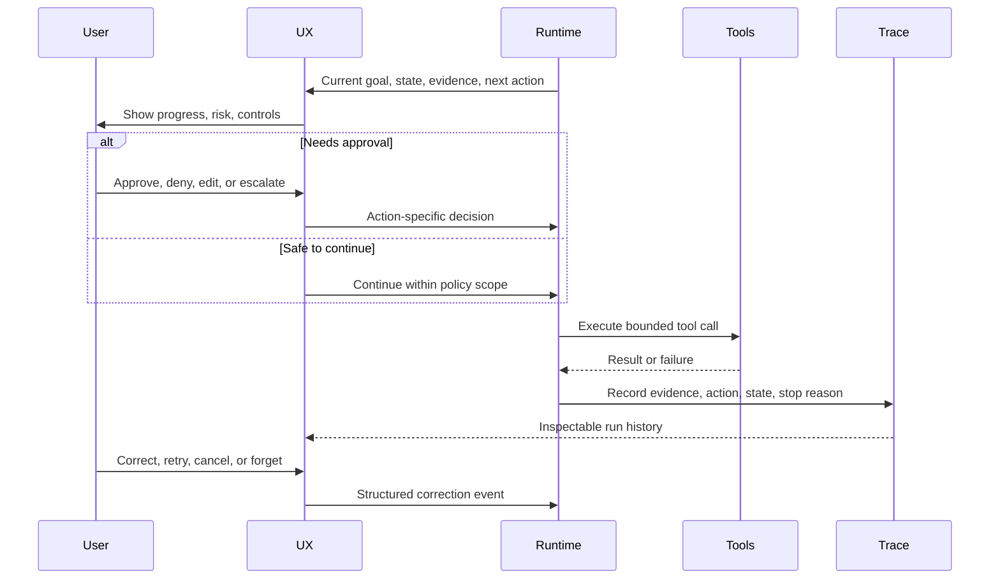
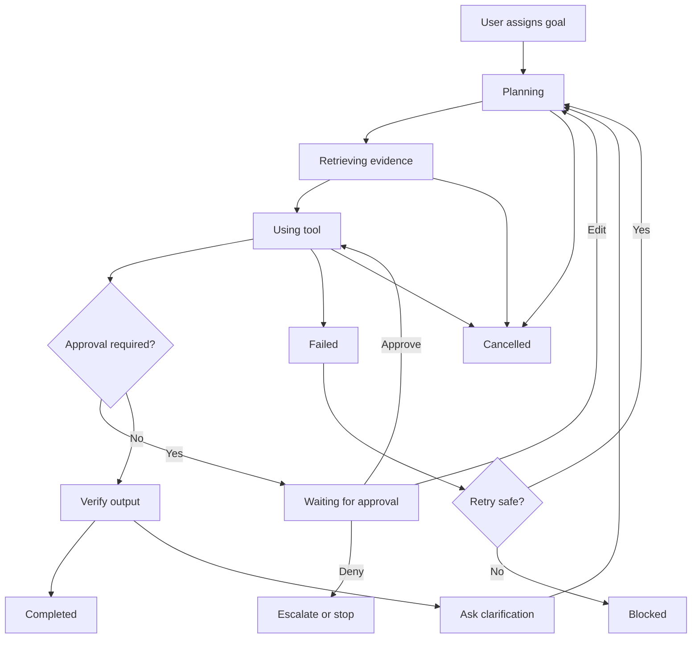
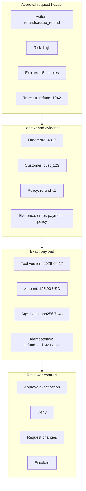

# Agent UX y confianza humana

Agent UX es la interfaz entre el juicio humano y la autonomía de la máquina. Una buena interfaz de agent muestra el progreso, pide ayuda en el momento adecuado y hace que sus acciones sean inspeccionables.

Usa este capítulo cuando los humanos asignan goals, revisan outputs, aprueban acciones o recuperan ejecuciones fallidas.

El contrato central es simple: el usuario debe entender qué intenta hacer el agent, qué ha visto, qué ha cambiado, qué está a punto de hacer y cómo interrumpirlo o corregirlo. La confianza no es una sensación que la UI genera con mensajes amigables. La confianza es el resultado de autonomía limitada, state visible y control usable.

Descarga la hoja de trabajo reutilizable: [agent UX review worksheet](/capstone-assets/templates/agent-ux-review-worksheet.txt).

## UX Goals

La experiencia de agent debe ayudar a los usuarios a responder:

- ¿Qué intenta hacer el agent?
- ¿Qué ha hecho ya?
- ¿Qué evidencia está usando?
- ¿Qué hará después?
- ¿Qué necesita mi aprobación?
- ¿Qué falló?
- ¿Cómo lo corrijo?
- ¿Cómo lo detengo?

La confianza proviene del control y la visibilidad, no del lenguaje seguro.

## Trust Contract

Una interfaz de agent debe hacer visibles cinco cosas según el riesgo del task:

| Pregunta | Obligación de UX |
| --- | --- |
| ¿Cuál es el goal? | Mostrar el goal activo, criterios de éxito y propietario. |
| ¿Qué sabe? | Mostrar evidencia, memory usada, resultados de tools y vacíos conocidos. |
| ¿Qué puede hacer? | Mostrar autoridad disponible, efectos secundarios pendientes y requisitos de aprobación. |
| ¿Qué está pasando ahora? | Mostrar el state actual, paso, motivo de espera y progreso. |
| ¿Cómo intervengo? | Proveer opciones de cancelar, pausar, aprobar, denegar, editar, reintentar, escalar y rutas de corrección. |

Esto no significa exponer cada detalle interno. Significa exponer los hechos operativos que un usuario razonable necesita para supervisar el agent.



Usa este loop como prueba de UX. Si la interfaz no puede mostrar el state, exponer la decisión, vincular la aprobación a una acción y registrar la corrección, el usuario está supervisando una caja negra.

## Supervision State Model

La interfaz debe exponer el mismo modelo de state que usa el runtime. Las palabras pueden cambiar según el producto, pero las transiciones de state no deben ocultarse detrás de un solo spinner.



Usa el modelo como checklist de UI. Cada state necesita evidencia visible, controles disponibles, reglas de detención y eventos de trace. Un state que no puede mostrarse no puede ser supervisado.

## Interaction Modes

| Modo | Usar cuando | Requisito de UX |
| --- | --- | --- |
| Interactivo | El usuario está presente y puede aclarar o aprobar. | Progreso en streaming, preguntas, cancelar, UI de aprobación. |
| En segundo plano | El trabajo toma minutos u horas. | Página de estado, notificaciones, reanudar, historial de auditoría. |
| Revisión humana | El agent prepara trabajo para aprobación. | Diff, evidencia, justificación, aceptar/editar/rechazar. |
| Autónomo | El agent opera dentro de autoridad limitada. | Alcance de policy, trazabilidad, alertas, rollback. |
| Multi-agent | Varios agents colaboran. | Visibilidad de roles, estado de handoff, propietario final. |

La UX debe coincidir con el riesgo. Un agent de investigación solo lectura puede ser ligero. Un agent de codificación que despliega a producción necesita revisión y rollback más estrictos.

## UX States

Trata los states del agent como states de producto, no como texto de spinner.

| State | Lo que el usuario debe ver |
| --- | --- |
| Planning | Goal, ruta, supuestos y siguiente paso. |
| Retrieving | Fuentes que se buscan, filtros y cantidad de evidencia. |
| Using tool | Nombre del tool, sistema objetivo, propósito y clase de efecto secundario. |
| Waiting for approval | Acción propuesta, riesgo, evidencia, aprobador y vencimiento. |
| Asking clarification | El input faltante y por qué bloquea el progreso. |
| Blocked | Motivo de bloqueo, trabajo completado y opciones de recuperación. |
| Escalating | Quién recibe el handoff y qué context se incluye. |
| Completed | Resultado, evidencia, sistemas cambiados y trace ID. |
| Failed | Clase de fallo, cambios externos, opciones de reintento y trace ID. |
| Cancelled | Qué se detuvo, qué se revirtió y qué queda pendiente. |

Estos states deben mapearse al state del runtime. Si la UI dice "trabajando" mientras el runtime espera aprobación, el sistema está ocultando el hecho más importante.

## Progress Design

Muestra el progreso en límites significativos:

- entender el goal;
- seleccionar una ruta;
- recuperar evidencia;
- invocar tools;
- esperar sistemas externos;
- evaluar output;
- solicitar aprobación;
- completar o detener.

No transmitas razonamientos ocultos como señal principal de progreso. Muestra acciones, evidencia y transiciones de state.

Un evento de progreso útil es pequeño y concreto:

```ts
type AgentUxEvent = {
  runId: string;
  state:
    | "planning"
    | "retrieving"
    | "using_tool"
    | "waiting_for_approval"
    | "asking_clarification"
    | "blocked"
    | "escalating"
    | "completed"
    | "failed"
    | "cancelled";
  title: string;
  detail?: string;
  evidenceRefs: string[];
  toolCallId?: string;
  approvalId?: string;
  traceId: string;
  userActions: Array<"cancel" | "pause" | "approve" | "deny" | "edit" | "retry" | "escalate" | "inspect">;
};
```

La UI no necesita mostrar el evento en bruto. Pero el producto debe construirse a partir de eventos como este, para que el progreso, la trazabilidad y la recuperación se mantengan alineados.

## User Controls

Los controles deben coincidir con la autoridad del agent:

- **Cancel:** detener la ejecución y prevenir efectos secundarios futuros.
- **Pause:** detener después del límite seguro actual.
- **Approve:** permitir una acción exacta, no autonomía futura amplia.
- **Deny:** detener o redirigir a una alternativa más segura.
- **Edit:** cambiar un borrador, campo extraído, paso del plan o acción propuesta.
- **Retry:** repetir un paso seguro con la misma evidencia o una ruta revisada.
- **Inspect:** abrir evidencia, resultados de tools, memory, decisión de policy o trace.
- **Forget:** eliminar o rechazar una escritura de memory.
- **Escalate:** transferir a un humano o a un workflow de mayor confianza.

Los controles son parte de la arquitectura. Un botón de cancelar que no puede detener una llamada de tool en cola no es un botón de cancelar real.

## Explainability

Los usuarios necesitan explicaciones accionables.

Buenas explicaciones incluyen:

- evidencia fuente;
- resultados de tools;
- verificaciones de policy;
- incertidumbre;
- caminos alternativos considerados cuando sea relevante;
- motivo de escalamiento o rechazo.

Evita explicaciones que expongan prompts privados, cadenas internas irrelevantes de pensamiento o afirmaciones vagas como "the model decided".

## Visibility Rules

Muestra al usuario el nivel de detalle adecuado para el riesgo del task.

| Superficie | Task de bajo riesgo | Task de alto riesgo |
| --- | --- | --- |
| Goal | resumen corto. | goal, restricciones, propietario, criterios de éxito. |
| Evidence | enlaces de cita. | enlaces de cita, antigüedad de fuente, conflictos, evidencia faltante. |
| Tools | ocultos o resumidos. | nombre del tool, sistema objetivo, efecto secundario, resultado. |
| Memory | preferencia relevante si se usa. | fuente de memory, antigüedad, alcance, opción de corrección u olvido. |
| Policy | usualmente oculto. | motivo de policy, requisito de aprobación, motivo de denegación. |
| State | progreso ligero. | paso, motivo de detención, state de reintento, state de aprobación. |

Alto riesgo no siempre significa dramático. Enviar un correo, cambiar accesos, emitir un reembolso, escribir memory, borrar un archivo o tocar producción merecen más visibilidad que responder una pregunta de documentación.

## Correcciones

Diseña rutas de corrección antes de que los usuarios las necesiten.

Tipos de corrección:

- editar la respuesta final;
- corregir campos extraídos;
- cambiar la ruta;
- agregar contexto faltante;
- rechazar escritura en memory;
- reintentar con un tool diferente;
- escalar a un humano;
- cancelar y hacer rollback.

Las correcciones deben actualizar los evals y, cuando corresponda, la memory. No deben desaparecer en el historial del chat.

Una corrección es un dato. Registra qué se corrigió, quién lo corrigió, a qué run afectó, si la memory cambió y si la suite de eval necesita un nuevo caso.

## Multi-Agent UX

Los sistemas multi-agent necesitan claridad de roles.

Muestra:

- qué agent es dueño del task;
- qué agents contribuyeron;
- qué produjo cada rol;
- dónde ocurrieron los handoffs;
- qué agent o workflow tomó la decisión final;
- dónde un humano entró al loop.

Si los usuarios no pueden saber quién es responsable, el sistema parecerá poco confiable incluso cuando el resultado sea correcto.

## Approval UX

Las solicitudes de aprobación deben ser específicas.

Una aprobación debe mostrar:

- acción propuesta;
- sistema objetivo;
- datos o usuario afectados;
- evidencia;
- nivel de riesgo;
- resultado de policy;
- si es reversible o irreversible;
- resultado esperado;
- opciones para aprobar o rechazar.

Nunca pidas una aprobación amplia como "continuar con todas las acciones" cuando el agent puede realizar efectos secundarios de alto riesgo.

Las aprobaciones deben estar ligadas a acciones exactas. Si cambia el destinatario propuesto, monto, archivo, comando, permiso, memory o payload, la aprobación ya no aplica.

Para el contrato de aprobación subyacente, consulta [Human Approval Gates](../tools-skills-protocols/human-approval-gates). Este capítulo se enfoca en lo que el usuario debe poder ver y decidir.

### Mock de Panel de Aprobación

Usa este modelo de panel al revisar acciones de alto riesgo. El diseño puede variar, pero la evidencia, acción, riesgo y controles de decisión no deben desaparecer.



Un panel de aprobación debe hacer que la acción riesgosa sea explícita y clara. El revisor debe ver el mismo action ID, arguments hash, policy version, resource IDs y trace ID que el runtime validará antes de reanudar.

| Área del Panel | Campos Requeridos |
| --- | --- |
| Encabezado | approval ID, trace ID, requester, risk class, expiry. |
| Acción | tool name, tool version, side-effect class, exact resource. |
| Evidencia | source IDs, policy references, diff o payload, missing evidence. |
| Runtime Safety | idempotency key, rollback note, si la acción es reversible. |
| Decisión | aprobar acción exacta, denegar, solicitar cambios, escalar, cancelar. |

## Failure UX

Un run fallido debe ser útil.

Devuelve:

- qué se completó;
- qué falló;
- por qué se detuvo;
- si algo cambió externamente;
- qué puede hacer el usuario después;
- enlace o ID para revisar el trace.

La Failure UX es parte de la confiabilidad. Un sistema que falla de forma clara aún puede ser confiable.

## Trust Calibration

La UI no debe hacer que el agent parezca más seguro o más autónomo de lo que realmente es.

Usa lenguaje confiado solo cuando el sistema tiene evidencia sólida y la acción es de bajo riesgo. Usa incertidumbre cuando la evidencia es parcial, obsoleta, conflictiva o está fuera de la autoridad del agent. Haz que las negativas y escalaciones sean resultados normales, no fracasos vergonzosos.

Una mala calibración de confianza se ve así:

- "Listo" cuando el agent solo redactó algo;
- "Verificado" cuando no se revisaron las citas;
- "Encontré la respuesta" cuando las fuentes están en conflicto;
- "Ejecutando de forma segura" cuando el tool tiene acceso amplio de escritura;
- "Recordado" cuando el usuario nunca aprobó una escritura en memory.

## Failure Modes

- El agent parece ocupado pero no muestra en qué state está.
- El uso de tools se oculta hasta después de que ocurren efectos secundarios.
- La memory se usa de forma invisible y el usuario no puede corregirla ni olvidarla.
- Las solicitudes de aprobación ocultan la acción real o el recurso afectado.
- El usuario no puede cancelar un run que aún puede ejecutar efectos secundarios.
- Los errores se resumen como mensajes genéricos de falla sin ruta de recuperación.
- Los handoffs multi-agent ocultan quién toma la decisión final.
- Los mensajes de progreso implican certeza cuando la evidencia es débil.
- La UI muestra una respuesta final pero no el trace, citas o sistemas cambiados.
- Las correcciones desaparecen en el chat y nunca mejoran los evals o la memory.

## Evaluation Guidance

El Agent UX también necesita evals. No solo preguntes si la respuesta es correcta. Pregunta si el usuario pudo supervisar al agent.

- Prueba si los usuarios pueden identificar el goal activo y el state actual.
- Prueba si las solicitudes de aprobación exponen la acción exacta y los efectos secundarios.
- Prueba si la cancelación detiene futuros efectos secundarios.
- Prueba si las correcciones actualizan el artifact correcto: respuesta, state, memory o eval.
- Prueba si los usuarios pueden inspeccionar la evidencia y los resultados de tools.
- Prueba si el uso de memory es visible y corregible.
- Prueba si los mensajes de falla explican qué cambió externamente.
- Prueba si el lenguaje de confianza coincide con la solidez de la evidencia.
- Prueba si los handoffs multi-agent muestran la propiedad.
- Prueba si un usuario puede recuperarse de runs bloqueados, fallidos o escalados.

Mide el éxito de tasks, éxito de correcciones, claridad de aprobaciones, éxito de cancelaciones, tasa de inspección de evidencia, tasa de override de usuario, tasa de corrección de memory, tasa de recuperación ante fallas y calibración de confianza.

## Production Checklist

- Mapea los states del runtime a states explícitos en la UI.
- Muestra goal, paso actual, evidencia, llamadas a tools, aprobaciones y motivo de detención.
- Proporciona controles para cancelar, pausar, aprobar, denegar, editar, reintentar, inspeccionar, olvidar y escalar donde sea relevante.
- Ata las aprobaciones a acciones exactas.
- Haz visible y corregible el uso de memory.
- Muestra los sistemas externos cambiados después de efectos secundarios.
- Trata la negativa, cancelación, espera de aprobación y escalamiento como states normales.
- Registra las correcciones como eventos estructurados.
- Alimenta las correcciones, overrides y fallas de usuario en los evals.
- Mantén los trace IDs accesibles para soporte y revisión de incidentes.

## Capítulos Relacionados

- [Human Approval Gates](../tools-skills-protocols/human-approval-gates)
- [Goals and State](../foundations/goals-and-state)
- [Tool Capability Design](../tools-skills-protocols/tool-capability-design)
- [Memory-Augmented Agent](../memory-knowledge/memory-augmented-agent)
- [Routing and Handoffs](../pattern-selection/routing-and-handoffs)
- [Observability and Evals](../production-runtime/observability-and-evals)
- [Agent Development Lifecycle](./agent-development-lifecycle)
