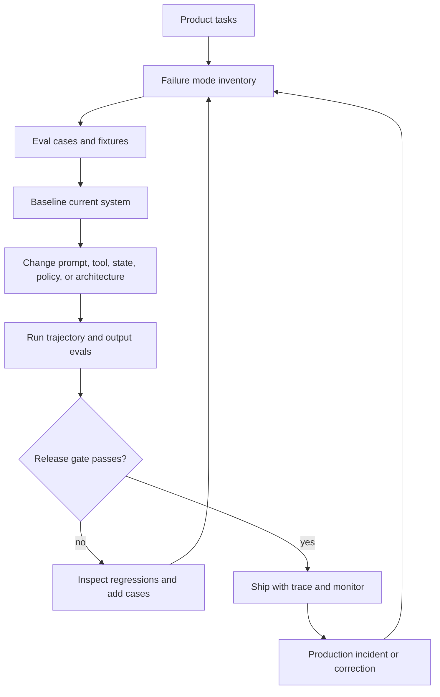

# Evaluation-Driven Agent Development

La evaluación convierte el desarrollo de agents de suposiciones basadas en demos a ingeniería real.

Sin evals, el equipo discute a partir de demos, anécdotas y percepciones. Con evals, el equipo puede decir qué falló, por qué importa, si el siguiente cambio ayudó y qué rompió.

Usa este capítulo cuando un agent pasa de prototipo a producción, o cuando un prototipo ya parece impresionante pero nadie puede probar que es confiable.

## Intent

Construye agents a partir de modos de falla y métricas de éxito, no de demos. Una demo muestra que el agent puede funcionar una vez. Un eval suite muestra si sigue funcionando en los casos que importan.

El eval loop es:

1. listar las tasks que el agent debe manejar;
2. listar las formas en que esas tasks pueden fallar;
3. definir métricas de negocio y calidad;
4. crear fixtures y datasets;
5. ejecutar el agent contra esos datasets;
6. inspeccionar fallas;
7. mejorar prompts, tools, state, policy o arquitectura;
8. repetir en cada cambio significativo.

La palabra clave es arquitectura. Si un eval falla porque al agent le falta state, editar el prompt es la solución incorrecta. Si falla porque el tool no es seguro, una mejor instrucción no es suficiente. Los evals deben poder cambiar el diseño.



Usa el loop como función de control. Cada cambio significativo debe nombrar la falla que ataca, el eval que prueba la mejora y el release gate que no debe romper.

## Qué Evaluar

Evalúa toda la trayectoria, no solo la respuesta final.

| Capa | Qué Revisar |
| --- | --- |
| Routing | Ruta correcta, confianza, comportamiento de fallback. |
| Planning | Pasos válidos, orden de dependencias, restricciones faltantes. |
| Retrieval | Relevancia de fuentes, frescura, cobertura, citas. |
| Tool use | Tool correcto, input válido, efectos secundarios seguros, manejo de errores. |
| Memory | Recall correcto, escritura segura, sin filtraciones obsoletas o privadas. |
| Policy | Permisos, requisitos de aprobación, rechazos. |
| Final output | Corrección, completitud, tono, formato, evidencia. |
| Operations | Latencia, costo, reintentos, eventos de breaker, escalamiento. |

Si solo se evalúa la respuesta final, el equipo perderá la falla que la causó. La respuesta puede parecer correcta aunque el agent haya usado evidencia obsoleta, omitido aprobación, reintentado un tool seis veces o escrito bad memory para la siguiente ejecución.

## Lentes de Evaluación por Responsabilidad

Diferentes patterns requieren diferentes evidencias. No uses un solo puntaje genérico de "calidad de respuesta" para cada agentic system.

| Responsabilidad del Pattern | Pregunta Principal | Prueba Mínima |
| --- | --- | --- |
| Loop control | ¿La ejecución se detuvo por la razón correcta? | Casos de presupuesto de pasos, presupuesto de tools, timeout, retry y stop-reason. |
| Context assembly | ¿El model vio la evidencia y exclusiones correctas? | Aserciones de context packet para fuentes incluidas, omitidas, frescura y presupuesto. |
| Tool use | ¿El sistema usó la autoridad mínima segura? | Tools simulados, casos de tools prohibidos, revisiones de schema, revisiones de aprobación y rutas de error. |
| Memory | ¿El sistema recordó solo lo que policy permite? | Escritura permitida, escritura denegada, corrección, eliminación, recall obsoleto y casos de aislamiento de tenant. |
| Retrieval | ¿El sistema encontró y citó la evidencia correcta? | Relevancia, cobertura, cita, casos de evidencia faltante y fuentes en conflicto. |
| Multi-agent coordination | ¿La delegación mejoró el resultado sin ocultar la responsabilidad? | Línea base de single-agent, falla de worker, desacuerdo, fusión y casos de owner final. |
| Human approval | ¿La acción correcta se pausó con suficiente información? | Casos de aprobación requerida, aprobación denegada, timeout, reanudación y registro de auditoría. |
| Runtime operation | ¿El equipo puede explicar y recuperarse de una falla? | Integridad de trace, replay, rollback, breaker, fixture de incidente y casos de release-gate. |

Esta tabla es una herramienta de diseño. Si el pattern seleccionado introduce un riesgo, el eval debe atacar ese riesgo directamente.

## Contrato de Caso Eval Mínimo

Un caso de eval debe ser lo suficientemente pequeño para revisar y lo suficientemente específico para fallar por la razón correcta.

```ts
type AgentEvalCase = {
  caseId: string;
  goal: string;
  input: string;
  mockedTools?: Record<string, unknown[]>;
  expected: {
    finalStatus?: "succeeded" | "needs_human" | "refused" | "failed";
    stopReason?: string;
    toolsCalled?: string[];
    toolsNotCalled?: string[];
    requiredTraceEvents?: string[];
    requiredCitations?: string[];
    memoryWrites?: "none" | "allowed" | "denied" | "review_required";
  };
};
```

El schema es intencionalmente simple. Permite al equipo probar final output, trayectoria, policy, memory y observability sin convertir el eval suite en otro proyecto de agent.

## Inventario de Modos de Falla

Comienza cada proyecto de agent con un inventario de modos de falla. Este es el artifact temprano más útil porque convierte el miedo en casos comprobables.

Ejemplos:

- selecciona la ruta incorrecta;
- pide información que ya tiene;
- omite una aprobación requerida;
- llama un write tool cuando un análisis de solo lectura es suficiente;
- recupera evidencia irrelevante;
- confía en memory obsoleta;
- entra en loop sin avanzar;
- da una respuesta confiada con evidencia débil;
- expone datos sensibles;
- excede el presupuesto de costo o latencia;
- no puede reanudar después de una interrupción.

Cada modo de falla debe mapearse al menos a una prueba, consulta de trace o alerta en producción. Si una falla es importante pero invisible, el sistema no está listo.

Un buen inventario es específico al producto. "Hallucination" es demasiado amplio. "Responde preguntas sobre refund-policy sin citar el documento de policy actual" es comprobable. "Tool misuse" es demasiado amplio. "Llama `issue_refund` antes de que exista un registro de aprobación de manager" es comprobable.

## Métricas

Usa un conjunto pequeño de métricas que coincidan con el producto. Más métricas no crean más verdad. Usualmente crean más formas de ignorar la falla real.

Métricas comunes:

- tasa de completion de tasks;
- corrección;
- cobertura de evidencia;
- precisión en llamadas a tools;
- precisión de rutas;
- precisión y recall de aprobaciones;
- tasa de hallucination;
- tasa de corrección por usuario;
- tasa de escalamiento humano;
- costo por task completada;
- latencia por paso;
- tasa de incidentes.

No optimices una métrica en aislamiento. Una tasa de escalamiento más baja es mala si el agent está tomando decisiones inseguras en su lugar. Menor latencia es mala si el agent omite retrieval. Mayor completion de tasks es mala si completa la task incorrecta.

Las mejores métricas forman un conjunto de restricciones: la calidad no puede mejorar violando requisitos de seguridad, costo, latencia, evidencia o aprobación.

## Tipos de Eval Dataset

| Dataset | Fuente | Uso |
| --- | --- | --- |
| Golden tasks | Ejemplos escritos a mano | Cobertura básica de regresión. |
| Adversarial tasks | Casos límite diseñados | Seguridad, routing, policy, prompt injection. |
| Production traces | Ejecuciones reales con redacción | Comportamiento realista y fallas de baja frecuencia. |
| Human-labeled data | Expertos en la materia | Ground truth para tasks de alto juicio. |
| Synthetic variants | Generados de casos conocidos | Expansión de cobertura tras revisión humana. |
| Incident fixtures | Fallas pasadas | Prevenir regresiones. |

Los production traces son valiosos, pero requieren controles de privacidad y etiquetado cuidadoso. No viertas conversaciones de usuarios sin procesar en un pipeline de eval sin redacción, reglas de retención y controles de acceso.

Los synthetic data son útiles para expandir cobertura, pero no deben convertirse en el ground truth por sí solos. Los casos generados suelen omitir las partes complicadas del uso real: context faltante, instrucciones contradictorias de usuario, frases extrañas, registros obsoletos y caídas parciales de tools.

## Judges

Los model judges pueden ayudar, pero necesitan restricciones. Son revisores, no ley.

Usa model judges para:

- calidad subjetiva;
- revisión basada en rúbricas;
- comparar dos outputs;
- verificar si una afirmación está respaldada por evidencia.

Usa revisiones deterministas para:

- validez de schema;
- campos requeridos;
- tools prohibidos;
- límites de presupuesto;
- presencia de citas;
- etiquetas de ruta;
- puertas de permisos.

Combina ambos. Un model judge no debe ser el único control antes de una acción de alto riesgo.

También evalúa al judge. Dale ejemplos buenos y malos conocidos. Rastrea falsos positivos y falsos negativos. Si el judge premia prosa pulida sobre evidencia, hará que el agent se vea mejor mientras el sistema empeora.

## Evaluation-Driven Development Loop

Para cada cambio significativo en el agent:

1. Agrega o actualiza casos de eval antes de cambiar prompts o tools.
2. Ejecuta el sistema actual para establecer una línea base.
3. Realiza el cambio más pequeño que apunte a la falla.
4. Ejecuta nuevamente la suite de eval.
5. Inspecciona regresiones, no solo el puntaje promedio.
6. Promueve el cambio solo si mejora el comportamiento objetivo sin afectar casos críticos.

Este loop funciona para prompts, tools, policies, memory, routing, models y orquestación.

Los puntajes promedio son peligrosos. Un cambio que mejora casos fáciles y rompe casos de policy no es una mejora. Mantén un conjunto pequeño de evals bloqueantes que deben pasar siempre: validez de schema, llamadas prohibidas a tools, comportamiento de aprobación, límites de privacidad y incident fixtures conocidos.

## Production Monitoring

El monitoreo en runtime debe alimentar la suite de eval. El sistema en producción es la mejor fuente de casos que el equipo no imaginó, así que captura las señales que los exponen: ejecuciones fallidas, overrides humanos, correcciones de usuario, rutas de baja confianza, eventos de breaker, fallas de tools, ejecuciones costosas o lentas, denegaciones de policy y escrituras inusuales en memory. Cada incidente serio debe convertirse en al menos un caso de eval. El objetivo no es culpar. El objetivo es hacer que la falla sea difícil de repetir.

El monitoreo también debe mostrar cuando la suite de eval está desactualizada. Si los traces de producción contienen tipos de task, rutas de tool o decisiones de policy que nunca aparecen en las pruebas, la suite de eval ya no representa el sistema.

Para el operating loop de producción, consulta [Production Evaluation Feedback Loops](../production-runtime/production-evaluation-feedback-loops).

## Release Gates

Antes de lanzar un cambio significativo en el agent, define qué debe pasar.

Release gates mínimos:

- sin fallas de schema en golden tasks;
- sin llamadas prohibidas a tools;
- sin IDs de trace faltantes;
- sin saltos de aprobación;
- sin regresión en incident fixtures;
- sin afirmaciones no soportadas en respuestas con evidencia;
- sin fallas de alto riesgo sin resolver en la review queue.

Estos gates deben ser aburridos. Ese es el punto. Evitan que el equipo lance un demo emocionante que reabra fallas antiguas.

## Related Chapters

- [Observability and Evals](../production-runtime/observability-and-evals)
- [Production Evaluation Feedback Loops](../production-runtime/production-evaluation-feedback-loops)
- [Circuit Breakers, Fallbacks, and Replay](../pattern-selection/circuit-breakers-fallbacks-replay)
- [Policy Enforcement](../production-runtime/policy-enforcement)
- [Evaluator-Optimizer](../control-loops/evaluator-optimizer)
- [Agent Development Lifecycle](./agent-development-lifecycle)
