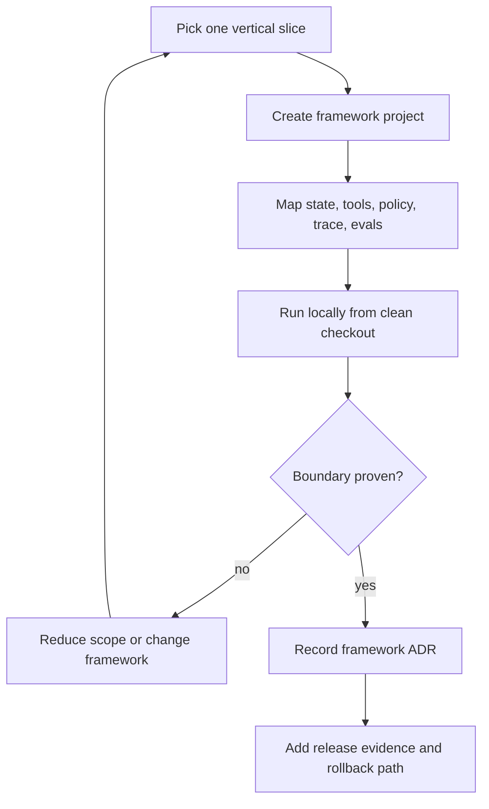

# Notas sobre la configuración de frameworks reales

Los laboratorios enseñan arquitectura a través de pequeñas implementaciones locales. Este capítulo muestra cómo traducir esos patterns a proyectos reales con frameworks, sin hacer que el libro dependa de un solo lenguaje o proveedor.

Usa estas notas después de los laboratorios neutrales al framework. Mantén los mismos contratos arquitectónicos: state schema, tool manifest, policy gate, trace schema, eval fixtures y rollback plan. El framework debe alojar esos contratos, no reemplazarlos.

## Cómo usar este capítulo

Comienza con una vertical slice:

1. una solicitud de usuario;
2. un objeto de state;
3. una tool de solo lectura;
4. una tool de efectos secundarios detrás de policy o aprobación;
5. un trace;
6. un caso de eval;
7. un comando local de ejecución;
8. una ruta de rollback o deshabilitación.

No comiences portando todos los laboratorios. Porta el comportamiento más pequeño que demuestre que el framework puede asumir la responsabilidad que necesitas que asuma.



Usa este flujo antes de expandir el port. Un framework es candidato solo después de que demuestre el boundary que más importa: state, approval, tool authority, transcript ownership, workflow packaging o eval integration.

## Reglas compartidas de configuración

Cada variante de framework debe definir estos archivos antes del primer demo:

| Artifact | Propósito |
| --- | --- |
| `.env.example` | Nombra las keys requeridas sin almacenar secretos. |
| `state.schema.*` | Define state reanudable y campos de migración. |
| `tools.*` | Declara tool names, inputs, outputs, side effects y permisos. |
| `policy.*` | Hace cumplir reglas de acción antes de retrieval, memory writes, tool calls o respuestas finales. |
| `trace.*` | Emite eventos de run, model, tool, policy, approval y evaluator. |
| `evals/*` | Almacena happy path, negative path y trajectory checks. |
| `README.md` | Muestra comandos de install, local run, test, eval y cleanup. |

Mantén los secretos fuera de los ejemplos. Usa `.env.example` para nombres y variables de entorno locales para valores.

## Playbook de fallas de configuración

Los ports de frameworks fallan de maneras repetibles. Trata las fallas de configuración como evidencia de diseño, no como una molestia local. Un framework no está listo para el camino de producción del libro hasta que un nuevo ingeniero pueda reproducir install, run, test, eval y cleanup desde un checkout limpio.

| Failure | Señal común | Qué capturar | Solución o decisión |
| --- | --- | --- | --- |
| Wrong runtime version | Python, Node.js o el package manager rechaza la instalación. | Runtime version, lockfile version, comando de instalación, paquete fallido. | Fija el runtime en docs y CI, o elige un slice de framework con versiones soportadas. |
| Hidden provider dependency | El demo importa un paquete de provider que no fue instalado. | Módulo faltante, nombre del paquete provider, model route, campo `.env.example`. | Haz explícitos los paquetes provider y mantén pruebas determinísticas de fallback. |
| Secret required for local test | La prueba base falla antes de que se pueda inspeccionar la arquitectura. | Comando, variable de entorno faltante, si existe fallback determinístico. | Separa pruebas unit/eval de pruebas smoke con provider en vivo. |
| Generated scaffold hides policy | Las reglas de tool, approval o memory viven solo dentro del prompt de ejemplo. | Ruta del archivo, regla oculta, módulo de policy faltante, prueba de boundary fallida. | Mueve policy al código y agrega un trajectory eval. |
| State cannot resume | Interrupción, retry o reinicio del servidor local pierde el run state. | Thread ID, checkpoint store, comando de resume, diferencia de state esperada. | Agrega checkpointer persistente o rechaza el framework para durable workflows. |
| Trace is final-answer only | Los logs muestran output pero no route, tool, policy, approval o stop reason. | Trace fields presentes y faltantes, sample run ID, requisito de eval. | Agrega instrumentación antes de expandir el port. |
| Upgrade breaks behavior | La actualización de un paquete cambia routing, tool calls, memory o termination. | Versiones vieja/nueva, trace cambiado, fixture fallido, comando de rollback. | Requiere evals de regresión antes de actualizar el framework. |

Captura la falla en el framework ADR. La pregunta útil no es "¿Podemos instalarlo?" La pregunta útil es "¿Qué boundary de producción demostró o no demostró la configuración?"

Usa este registro de evidencia de configuración para cada framework slice:

| Field | Valor de ejemplo |
| --- | --- |
| Framework slice | `native-framework-examples/langgraph-refund/` |
| Runtime versions | `python --version`, `node --version` o versión del package manager. |
| Install command | Comando exacto desde un checkout limpio. |
| Baseline run command | El comando más pequeño que demuestre el boundary principal. |
| Eval command | Comando acotado que demuestre el comportamiento de falla. |
| Required secrets | Solo nombres; sin valores. |
| Deterministic fallback | Sí/no y comando. |
| Known setup failure | Una falla capturada y su solución. |
| Rollback o ruta de deshabilitación | Comando, feature flag o eliminación de ruta. |

## Variante LangGraph

Usa LangGraph cuando el principal riesgo es el control de flujo con estado: branching, checkpoints, interrupts, replay o esperas de aprobación humana.

Ejemplos nativos del repositorio:

- `native-framework-examples/langgraph-refund/` para approval, interrupt y comportamiento de resume.
- `native-framework-examples/langgraph-research-rag/` para source filtering, citation faithfulness y comportamiento de escalation.

Referencias oficiales de configuración:

- [LangGraph install](https://docs.langchain.com/oss/python/langgraph/install)
- [LangGraph graph API](https://docs.langchain.com/oss/python/langgraph/graph-api)
- [LangGraph local server](https://docs.langchain.com/oss/python/langgraph/local-server)
- [LangGraph persistence](https://docs.langchain.com/oss/python/langgraph/persistence)
- [LangGraph interrupts](https://docs.langchain.com/oss/python/langgraph/interrupts)

Configuración local típica:

```sh
python3 -m venv .venv
source .venv/bin/activate
pip install -U langgraph
```

Para un servidor local de LangGraph, la documentación oficial usa el LangGraph CLI:

```sh
pip install -U "langgraph-cli[inmem]"
langgraph dev
```

Usa el servidor in-memory solo para desarrollo local. Producción necesita almacenamiento persistente para checkpoints y cualquier almacén de largo plazo.

Ruta de port desde los laboratorios:

| Lab Asset | LangGraph Mapping |
| --- | --- |
| state object | state schema `StateGraph` |
| loop step | node function |
| route decision | conditional edge |
| approval wait | interrupt más checkpoint |
| trace event | spans de node, model, tool, policy e interrupt |
| eval case | graph input, expected state diff, expected route, expected stop reason |

Preguntas de producción:

- ¿Qué checkpointer almacena el graph state con alcance de thread?
- ¿Cómo se asignan los thread IDs y se protegen contra acceso cruzado entre tenants?
- ¿Qué nodes pueden causar side effects?
- ¿Los nodes de side-effect son idempotentes bajo retry o resume?
- ¿Qué campos de state necesitan migraciones?
- ¿Qué interrupts requieren registros de aprobación humana?

Criterio de aceptación de ejemplo nativo: el ejemplo debe demostrar el boundary de mayor riesgo. Para workflows de reembolso, debe pausar en un approval interrupt, reanudar por thread ID, preservar el state previo y pasar evals sin emitir dinero. Para Research RAG, debe omitir fuentes obsoletas y prohibidas antes de la síntesis de la respuesta, citar solo evidencia actual aprobada y escalar cuando falte evidencia aprobada.

## Variante AutoGen

Usa AutoGen cuando el principal riesgo es el comportamiento colaborativo: contratos de roles, historial de mensajes, terminación del equipo y revisión de transcripciones.

Ejemplo nativo del repositorio: `native-framework-examples/autogen-delivery/`.

Referencias oficiales de configuración:

- [AutoGen documentation](https://microsoft.github.io/autogen/stable//index.html)
- [AgentChat user guide](https://microsoft.github.io/autogen/stable//user-guide/agentchat-user-guide/index.html)
- [AgentChat installation](https://microsoft.github.io/autogen/stable//user-guide/agentchat-user-guide/installation.html)
- [AgentChat agents](https://microsoft.github.io/autogen/stable//user-guide/agentchat-user-guide/tutorial/agents.html)
- [AgentChat teams](https://microsoft.github.io/autogen/stable//user-guide/agentchat-user-guide/tutorial/teams.html)
- [AgentChat termination](https://microsoft.github.io/autogen/stable//user-guide/agentchat-user-guide/tutorial/termination.html)
- [AutoGen to Microsoft Agent Framework migration guide](https://learn.microsoft.com/en-us/agent-framework/migration-guide/from-autogen/)

Configuración local típica:

```sh
python3 -m venv .venv
source .venv/bin/activate
pip install -U "autogen-agentchat" "autogen-ext[openai]"
```

AutoGen AgentChat actualmente requiere Python 3.10 o posterior. AutoGen es mantenido por la comunidad, así que los nuevos proyectos de larga duración en el stack de Microsoft también deberían evaluar Microsoft Agent Framework antes de estandarizar con AutoGen. Mantén los paquetes de proveedores explícitos para que las dependencias de model no queden ocultas dentro del framework.

Ruta de portabilidad desde los laboratorios:

| Activo del laboratorio | Mapeo en AutoGen |
| --- | --- |
| supervisor | team manager o coordinator |
| worker contract | agent role, tools y expected output |
| transcript | durable message record |
| termination rule | team stop condition |
| tool policy | execution wrapper fuera del texto del mensaje |
| eval case | transcript replay con aserciones de role, tool y termination |

Preguntas para producción:

- ¿Quién es dueño del transcript como durable state?
- ¿Qué mensajes se persisten, redactan y pueden reproducirse?
- ¿Qué detiene al equipo?
- ¿Qué agent puede llamar a qué tool?
- ¿Un retry puede duplicar un side effect de tool?
- ¿Qué fallas de transcript se convierten en fixtures de eval?

Criterio de aceptación del ejemplo nativo: el ejemplo debe definir AgentChat agents específicos por rol, una regla de terminación del equipo, una exportación normalizada de transcript y evals que fallen si faltan roles, el orden de turnos es inválido o falta el owner final.

## Variante Mastra

Usa Mastra cuando el principal riesgo es empaquetar un product runtime en TypeScript alrededor de agents, workflows, tools, memory, observability y evals.

Ejemplo nativo del repositorio: `native-framework-examples/mastra-refund/`.

Referencias oficiales de configuración:

- [Mastra docs](https://mastra.ai/docs)
- [Mastra quickstart](https://mastra.ai/guides/getting-started/quickstart)
- [Mastra manual install](https://mastra.ai/docs/getting-started/manual-install)
- [Mastra agents](https://mastra.ai/docs/agents/overview)
- [Mastra tools](https://mastra.ai/docs/agents/using-tools)
- [Mastra workflows](https://mastra.ai/docs/workflows/overview)
- [Mastra evals](https://mastra.ai/docs/evals/overview)

La configuración local típica inicia desde el CLI del framework:

```sh
npm create mastra@latest
```

Usa el scaffold para inspeccionar la estructura del proyecto y luego mapea los contratos del libro en módulos administrados por el framework. No dejes la policy del producto solo dentro del código de ejemplo generado.

Ruta de portabilidad desde los laboratorios:

| Activo del laboratorio | Mapeo en Mastra |
| --- | --- |
| agent decision | Mastra agent |
| deterministic control flow | workflow |
| tool registry | typed tool declarations |
| memory contract | framework memory más retention policy |
| trace schema | runtime observability export |
| eval case | framework eval más repository fixture |

Preguntas para producción:

- ¿Qué partes son propiedad de Mastra y cuáles siguen siendo propiedad de la aplicación?
- ¿Dónde declaran los tools sus side effects y permisos?
- ¿Cómo se despliegan, reintentan y hacen rollback los workflows?
- ¿Cómo se exportan los traces y resultados de eval al sistema operativo del equipo?
- ¿Qué actualizaciones del framework requieren regression evals?

Criterio de aceptación del ejemplo nativo: el ejemplo debe definir un agent de borrador de reembolso, tools tipados de policy y borrador, un workflow que haga cumplir el orden policy-before-draft y un eval que falle en movimientos de dinero o mensajes al cliente.

## Variante CrewAI

Usa CrewAI cuando el principal riesgo es la automatización de workflows en Python con state administrado por el flujo y crews de especialistas acotados.

Ejemplo nativo del repositorio: `native-framework-examples/crewai-delivery/`.

Referencias oficiales de configuración:

- [CrewAI docs](https://docs.crewai.com/)
- [CrewAI installation](https://docs.crewai.com/en/installation)
- [CrewAI quickstart](https://docs.crewai.com/en/quickstart)
- [CrewAI introduction](https://docs.crewai.com/en/introduction)

La documentación actual de CrewAI enfatiza Python 3.10 a 3.13, instalación basada en `uv` y un quickstart que crea un Flow más un agent crew. Mantén el flow generado lo suficientemente pequeño para que las transiciones de state sigan siendo visibles.

Ruta de portabilidad desde los laboratorios:

| Activo del laboratorio | Mapeo en CrewAI |
| --- | --- |
| flow state | CrewAI Flow state |
| task delegation | crew tasks |
| worker contract | agent role, goal, tools y output shape |
| merge policy | flow acceptance step |
| trace event | flow, task y crew output records |
| eval case | flow output más aserciones de role-output |

Preguntas para producción:

- ¿Qué posee el Flow que el Crew no debe mutar implícitamente?
- ¿Qué aporta cada rol que una función determinista no podría?
- ¿Cómo se validan los outputs del crew antes de que el flow los acepte?
- ¿Qué sucede cuando un rol falla o no está de acuerdo?
- ¿Qué checkpoints de flow se necesitan antes de efectos secundarios externos?

Criterio de aceptación del ejemplo nativo: el ejemplo debe mantener separados los outputs de planner, reviewer y tester, y luego dejar que el Flow decida la aceptación final.

## Variante Mini-Runtime

Usa el mini-runtime personalizado cuando el principal riesgo es comprender y poseer la arquitectura. No es un reemplazo de framework para todas las necesidades de producción. Es una herramienta de enseñanza y diseño.

Mapea los mismos contratos directamente:

| Contrato | Ubicación en Mini-Runtime |
| --- | --- |
| state | objeto o tabla de aplicación explícita |
| tools | registro con schemas y etiquetas de side-effect |
| policy | función llamada antes de la autoridad |
| memory | context packet más almacenamiento gobernado |
| trace | lista de eventos append-only |
| evals | pruebas deterministas sobre state, trace y output |

El mini-runtime es valioso porque hace visibles las responsabilidades ocultas del framework. Después de construirlo, los lectores pueden juzgar si LangGraph, AutoGen, Mastra o CrewAI agregan suficiente valor operativo para justificar la abstracción.

## Lista de verificación de aceptación agnóstica al framework

Antes de considerar completo un port a framework, verifica:

- el comando de instalación está documentado y es reproducible;
- el comando de ejecución local funciona desde un checkout limpio;
- los secretos viven en variables de entorno, no en el código fuente;
- el owner del state está nombrado;
- los side effects de tools están declarados;
- la policy se ejecuta antes de la autoridad;
- los traces incluyen eventos de model, tool, policy y evaluator;
- los evals cubren happy path, negative path y trayectoria;
- rollback o kill switch está documentado;
- el código específico del framework no oculta los contratos del producto.

Si el port solo pasa el happy path, sigue siendo una demo.
