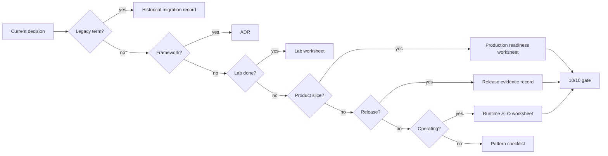
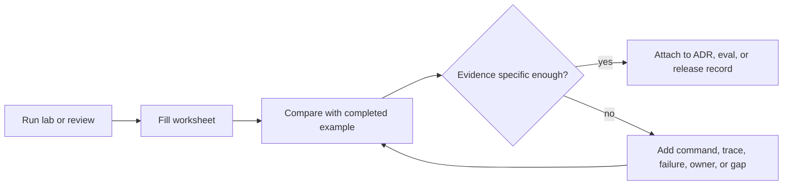

# Plantillas y Hojas de Trabajo

Estas plantillas convierten las recomendaciones del libro en artifacts de ingeniería revisables. Úsalas cuando un laboratorio se convierte en un slice de producto, cuando un equipo elige un framework o cuando un agent obtiene más autoridad.

Copia solo las secciones que importan. Un registro de decisión corto y completo es mejor que una plantilla larga con respuestas vacías.

Para ejemplos llenados, compara estas plantillas con los [Proyectos Capstone](../capstone-projects/).

## Elige el Artifact Correcto

Comienza con el artifact que corresponda a la decisión que tienes enfrente. No llenes todas las plantillas por defecto.

| Situación | Usa este Artifact | Listo Cuando |
| --- | --- | --- |
| Elegir LangGraph, AutoGen, Mastra, CrewAI o un runtime personalizado | [Framework selection ADR template](/capstone-assets/templates/framework-selection-adr-template.txt) | El equipo puede nombrar qué controla el framework y qué sigue controlando la aplicación. |
| Estudiar ADRs de agent completados | [Completed agent ADR examples](/capstone-assets/templates/completed-agent-adr-examples.txt) | El equipo puede comparar su registro de decisión con ejemplos realistas de authority, RAG y multi-agent. |
| Estudiar evidencia de laboratorio completada | [Completed lab evidence examples](/capstone-assets/templates/completed-lab-evidence-examples.txt) | El equipo puede comparar su hoja de trabajo con comandos concretos, traces, rutas de falla, brechas de producción y decisiones de lanzamiento. |
| Estudiar evidencia de preparación para producción | [Completed production readiness examples](/capstone-assets/templates/completed-production-readiness-examples.txt) | El equipo puede comparar su hoja de producción con responsables concretos, gates, bloqueadores, calificaciones de readiness y siguientes acciones. |
| Revisar una respuesta Agentic RAG | [Agentic RAG query trace worksheet](/capstone-assets/templates/agentic-rag-query-trace-worksheet.txt) | El equipo puede reconstruir la selección de fuentes, evidencia omitida, verificación de citas y la decisión final de respuesta o rechazo. |
| Revisar un workflow de debate o consenso | [Debate and consensus review checklist](/capstone-assets/templates/debate-consensus-review-checklist.txt) | Independencia, merge policy, manejo de disenso, presupuesto, comparación base y errores del juez son revisados. |
| Modelar amenazas en una ruta de agent | [Agent threat model worksheet](/capstone-assets/templates/agent-threat-model-worksheet.txt) | Datos privados, contenido no confiable, autoridad de tool, riesgos STRIDE, evals y evidencia de trace se revisan en conjunto. |
| Revisar UX y confianza de agent | [Agent UX review worksheet](/capstone-assets/templates/agent-ux-review-worksheet.txt) | States en runtime, evidencia visible, controles de usuario, UX de aprobación, rutas de corrección y UX evals son explícitos. |
| Terminar un laboratorio | [Lab completion worksheet](/capstone-assets/templates/lab-completion-worksheet.txt) | Se registran el comando de ejecución, comando de prueba, boundary del pattern y la lección. |
| Completar Lab 02 Agent Loop y Planeación | [Lab 02 planning loop guided exercise worksheet](/capstone-assets/templates/lab-02-planning-loop-guided-exercise.txt) | Se capturan el trace del plan base, input cambiado, paso no soportado, input faltante y contrato de condición de parada. |
| Completar Lab 03 Agentic RAG | [Lab 03 Agentic RAG guided exercise worksheet](/capstone-assets/templates/lab-03-agentic-rag-guided-exercise.txt) | Se capturan retrieval base, cambio de grounding, comportamiento ante evidencia faltante, contrato de fuente, comparación con grafo nativo y fixture de eval. |
| Completar Lab 06 Observability y Evals | [Lab 06 observability and evals guided exercise worksheet](/capstone-assets/templates/lab-06-observability-evals-guided-exercise.txt) | Se capturan contrato de trace, falla por missing-policy, caso negativo, CI gate y nota de incidente a eval. |
| Completar Lab 07 Runtime Packaging | [Lab 07 runtime packaging guided exercise worksheet](/capstone-assets/templates/lab-07-runtime-packaging-guided-exercise.txt) | Se capturan límites de runtime, orden de tools, efectos secundarios prohibidos, rollback y comparación con Mastra nativo. |
| Completar Lab 12 State Graphs | [Lab 12 state graph guided exercise worksheet](/capstone-assets/templates/lab-12-state-graph-guided-exercise.txt) | Se capturan interrupción, checkpoint, reanudación, seguridad de replay, comparación con LangGraph nativo y seguimiento de producción. |
| Convertir un laboratorio en un slice de producto | [Lab production readiness worksheet](/capstone-assets/templates/lab-production-readiness-worksheet.txt) | State faltante, policy, eval, trace, rollback y controles de ownership son explícitos. |
| Revisar un candidato a producción | [Production readiness worksheet](/capstone-assets/templates/production-readiness-worksheet.txt) | Cada ruta de alta authority tiene evidencia o está fuera del alcance del release. |
| Operar una ruta en producción | [Runtime SLO and incident review worksheet](/capstone-assets/templates/runtime-slo-and-incident-review-worksheet.txt) | SLOs, paneles de dashboard, triaje de incidentes, revisión de traces, conversión de eval y acciones de rollback son explícitas. |
| Preparar un release | [Release evidence record](/capstone-assets/templates/release-evidence-record.txt) | El release tiene output de eval, riesgo conocido, aprobador, responsable de rollback y comando de rollback. |
| Revisar la composición de un agentic system | [Agentic system architecture review checklist](/capstone-assets/templates/agentic-system-architecture-review-checklist.txt) | Experiencia, control, ejecución, conocimiento, seguridad, observability, evaluación, contratos y límites de authority son explícitos. |
| Revisar la arquitectura completa de un sistema | [Reference architecture review checklist](/capstone-assets/templates/reference-architecture-review-checklist.txt) | Entrada, ruteo, state, conocimiento, tools, memory, aprobación, evals, observability y ownership del release se revisan en conjunto. |
| Revisar trabajo desatendido disparado por eventos | [Event-triggered agent review checklist](/capstone-assets/templates/event-triggered-agent-review-checklist.txt) | Contrato de evento, admisión, dedupe, orden, reintentos, dead letters, tormentas, traces y evals son explícitos. |
| Revisar un workflow auto-recuperable | [Self-healing workflow review checklist](/capstone-assets/templates/self-healing-workflow-review-checklist.txt) | Clases de falla, recovery policy, idempotencia, compensación, breakers, paquetes de replay y regression evals son explícitos. |
| Revisar una arquitectura de agent personal | [Personal agent architecture review checklist](/capstone-assets/templates/personal-agent-architecture-review-checklist.txt) | Consentimiento, división local/nube, credenciales, memory, controles de usuario, conectores y evidencia de auditoría son explícitos. |
| Revisar el bar final | [10/10 production gate scorecard](/capstone-assets/templates/ten-out-of-ten-production-gate-scorecard.txt) | El sistema es revisable, testeable, observable, reversible y tiene ownership. |
| Comparar un capstone con tu propio sistema | [Capstone review scorecard](/capstone-assets/templates/capstone-review-scorecard.txt) | Tienes un plan concreto de adaptación y una lista de brechas bloqueadoras. |
| Calificar un pattern antes de adoptarlo | [Pattern evaluation scorecard](/capstone-assets/templates/pattern-evaluation-scorecard.txt) | El pattern tiene evidencia de goal, boundary, autonomía, tools, state, context, seguridad, evals, observability y operaciones. |
| Traducir terminología antigua de agent | [Historical pattern migration record](/capstone-assets/templates/historical-pattern-migration-record.txt) | Una etiqueta heredada vaga se mapea a una decisión de arquitectura actual con evidencia. |
| Revisar un paquete de skill reutilizable | [Skill review checklist](/capstone-assets/templates/skill-review-checklist.txt) | Activación, formato de instrucciones, assets, seguridad, versionado, pruebas, observability y decisión final son explícitos. |
| Revisar un pattern | La checklist de revisión de pattern correspondiente abajo | Casos de uso, casos a evitar, modos de falla, evals y controles de producción tienen evidencia. |



Usa el artifact más pequeño que pruebe la decisión. Agrega el production gate solo cuando el sistema esté lo suficientemente cerca del release como para que la evidencia faltante deba bloquear el progreso.

## Ejemplos Completados

Las plantillas en blanco solo ayudan después de que el lector entiende el estándar de evidencia. Usa ejemplos completados para comparar la densidad y especificidad de tu propio artifact.



Usa [Completed agent ADR examples](/capstone-assets/templates/completed-agent-adr-examples.txt) para decisiones de arquitectura. Usa [Completed lab evidence examples](/capstone-assets/templates/completed-lab-evidence-examples.txt) para paquetes de evidencia de laboratorio y revisiones de eval. Usa [Completed production readiness examples](/capstone-assets/templates/completed-production-readiness-examples.txt) cuando un equipo necesita calibrar evidencia de owner, gate, blocker, rollback y decisiones de release.

Versiones descargables:

- [A2A agent interoperability review checklist](/capstone-assets/templates/a2a-agent-interoperability-review-checklist.txt)
- [Agentic RAG query trace worksheet](/capstone-assets/templates/agentic-rag-query-trace-worksheet.txt)
- [Agentic system architecture review checklist](/capstone-assets/templates/agentic-system-architecture-review-checklist.txt)
- [Agent threat model worksheet](/capstone-assets/templates/agent-threat-model-worksheet.txt)
- [Agent UX review worksheet](/capstone-assets/templates/agent-ux-review-worksheet.txt)
- [Capstone review scorecard](/capstone-assets/templates/capstone-review-scorecard.txt)
- [Completed agent ADR examples](/capstone-assets/templates/completed-agent-adr-examples.txt)
- [Completed lab evidence examples](/capstone-assets/templates/completed-lab-evidence-examples.txt)
- [Completed production readiness examples](/capstone-assets/templates/completed-production-readiness-examples.txt)
- [Computer-use agent review checklist](/capstone-assets/templates/computer-use-agent-review-checklist.txt)
- [CrewAI flows and crews review checklist](/capstone-assets/templates/crewai-flows-and-crews-review-checklist.txt)
- [Debate and consensus review checklist](/capstone-assets/templates/debate-consensus-review-checklist.txt)
- [Cost controls and runtime budgets review checklist](/capstone-assets/templates/cost-controls-runtime-budgets-review-checklist.txt)
- [Deployment walkthrough review checklist](/capstone-assets/templates/deployment-walkthrough-review-checklist.txt)
- [Domain agent architecture review checklist](/capstone-assets/templates/domain-agent-architecture-review-checklist.txt)
- [Durable workflows review checklist](/capstone-assets/templates/durable-workflows-review-checklist.txt)
- [Evaluator-optimizer review checklist](/capstone-assets/templates/evaluator-optimizer-review-checklist.txt)
- [Event-triggered agent review checklist](/capstone-assets/templates/event-triggered-agent-review-checklist.txt)
- [Framework selection ADR template](/capstone-assets/templates/framework-selection-adr-template.txt)
- [Historical pattern migration record](/capstone-assets/templates/historical-pattern-migration-record.txt)
- [Lab 02 planning loop guided exercise worksheet](/capstone-assets/templates/lab-02-planning-loop-guided-exercise.txt)
- [Lab 03 Agentic RAG guided exercise worksheet](/capstone-assets/templates/lab-03-agentic-rag-guided-exercise.txt)
- [Lab 06 observability and evals guided exercise worksheet](/capstone-assets/templates/lab-06-observability-evals-guided-exercise.txt)
- [Lab 07 runtime packaging guided exercise worksheet](/capstone-assets/templates/lab-07-runtime-packaging-guided-exercise.txt)
- [Lab 12 state graph guided exercise worksheet](/capstone-assets/templates/lab-12-state-graph-guided-exercise.txt)
- [Lab completion worksheet](/capstone-assets/templates/lab-completion-worksheet.txt)
- [Lab production readiness worksheet](/capstone-assets/templates/lab-production-readiness-worksheet.txt)
- [Knowledge-bound agents review checklist](/capstone-assets/templates/knowledge-bound-agents-review-checklist.txt)
- [Long-term episodic memory review checklist](/capstone-assets/templates/long-term-episodic-memory-review-checklist.txt)
- [Mastra runtime review checklist](/capstone-assets/templates/mastra-runtime-review-checklist.txt)
- [Memory-augmented agent review checklist](/capstone-assets/templates/memory-augmented-agent-review-checklist.txt)
- [MCP-first tool use review checklist](/capstone-assets/templates/mcp-first-tool-use-review-checklist.txt)
- [Observability and evals review checklist](/capstone-assets/templates/observability-and-evals-review-checklist.txt)
- [Personal agent architecture review checklist](/capstone-assets/templates/personal-agent-architecture-review-checklist.txt)
- [Parallel agents review checklist](/capstone-assets/templates/parallel-agents-review-checklist.txt)
- [Pattern evaluation scorecard](/capstone-assets/templates/pattern-evaluation-scorecard.txt)
- [Planning and execution review checklist](/capstone-assets/templates/planning-and-execution-review-checklist.txt)
- [Policy enforcement review checklist](/capstone-assets/templates/policy-enforcement-review-checklist.txt)
- [Production evaluation feedback loop review checklist](/capstone-assets/templates/production-evaluation-feedback-loops-review-checklist.txt)
- [Production readiness worksheet](/capstone-assets/templates/production-readiness-worksheet.txt)
- [Release evidence record](/capstone-assets/templates/release-evidence-record.txt)
- [Reference architecture review checklist](/capstone-assets/templates/reference-architecture-review-checklist.txt)
- [Reflection pattern review checklist](/capstone-assets/templates/reflection-pattern-review-checklist.txt)
- [ReAct review checklist](/capstone-assets/templates/react-review-checklist.txt)
- [Runtime SLO and incident review worksheet](/capstone-assets/templates/runtime-slo-and-incident-review-worksheet.txt)
- [Self-improvement review checklist](/capstone-assets/templates/self-improvement-review-checklist.txt)
- [Self-healing workflow review checklist](/capstone-assets/templates/self-healing-workflow-review-checklist.txt)
- [Secure agent communication review checklist](/capstone-assets/templates/secure-agent-communication-review-checklist.txt)
- [Semantic recall and RAG review checklist](/capstone-assets/templates/semantic-recall-rag-review-checklist.txt)
- [Skill review checklist](/capstone-assets/templates/skill-review-checklist.txt)
- [Task delegation review checklist](/capstone-assets/templates/task-delegation-review-checklist.txt)
- [Tool capability design review checklist](/capstone-assets/templates/tool-capability-design-review-checklist.txt)
- [Working memory review checklist](/capstone-assets/templates/working-memory-review-checklist.txt)
- [10/10 production gate scorecard](/capstone-assets/templates/ten-out-of-ten-production-gate-scorecard.txt)

## Framework Selection ADR

Usa este ADR al adoptar LangGraph, AutoGen, Mastra, CrewAI, un mini-runtime u otro framework.

```md
# ADR-000: Choose [Framework] for [Agent or Workflow]

## Status

Proposed | Accepted | Superseded

## Context

¿Qué problema de producto estamos resolviendo?
¿Qué workflow visible para el usuario alojará este framework?
¿Qué restricciones importan: lenguaje, despliegue, cumplimiento, habilidades del equipo, latencia, costo o infraestructura existente?

## Decision

Usaremos [framework] para [scope].
El framework será responsable de [state/control flow/tools/memory/evals/observability/deployment].
La aplicación seguirá siendo responsable de [policy/domain data/security/approval/rollback].

## Alternatives Considered

| Option | Why It Fit | Why We Did Not Choose It |
| --- | --- | --- |
| Direct code / mini-runtime | | |
| LangGraph | | |
| AutoGen | | |
| Mastra | | |
| CrewAI | | |

## Responsibility Boundary

| Responsibility | Owner | Evidence |
| --- | --- | --- |
| State | framework/application/platform | schema, checkpoint, migration plan |
| Control flow | framework/application/platform | graph, workflow, team, flow, loop |
| Tools | framework/application/platform | manifest, schema, permission model |
| Policy | framework/application/platform | enforcement point before authority |
| Memory | framework/application/platform | retention, deletion, correction rules |
| Observability | framework/application/platform | trace schema and dashboard |
| Evals | framework/application/platform | fixtures, thresholds, CI gate |
| Deployment | framework/application/platform | runbook, rollback, kill switch |

## Vertical Slice Proof

- user request:
- state object:
- read tool:
- side-effect tool:
- policy decision:
- trace:
- eval:
- rollback:

## Acceptance Criteria

- los comandos de instalación y ejecución local están documentados;
- el state puede ser inspeccionado y reproducido;
- la policy se ejecuta antes de los efectos secundarios;
- los evals fallan la build ante regresiones críticas;
- los traces explican una ejecución fallida;
- el rollback puede deshabilitar la capability riesgosa;
- el código específico del framework no oculta la policy del producto.

## Consecuencias

¿Qué se vuelve más fácil?
¿Qué se vuelve más difícil?
¿Qué riesgos de lock-in o migración permanecen?
¿Qué incidente en producción nos haría reconsiderar esta decisión?

## Disparador de Revisión

Revisa este ADR después de una actualización de model, actualización de framework, incorporación de una nueva tool con capacidad de escritura, nuevo tipo de memory, incidente en producción o repetidas intervenciones humanas.
```

## Production Readiness Worksheet

Use this worksheet before exposing the system to real users, real data, or real side effects.

| Gate | Answer | Evidence |
| --- | --- | --- |
| Owner | Who owns the runtime and incidents? | team, on-call, runbook |
| Scope | Which users, tenants, tools, data, and workflows are in scope? | ADR, service config |
| State | What state exists and where is it persisted? | schema, checkpoint store |
| Idempotency | Which actions can be retried safely? | idempotency keys, side-effect records |
| Tools | Which tools can be called and with what authority? | tool manifest, permission map |
| Policy | Where does policy run before authority? | enforcement code, tests |
| Approval | Which actions require approval? | approval schema, UI/API, expiry |
| Memory | What can be read or written? | retention, deletion, correction rules |
| Observability | Can one failed run be reconstructed? | trace dashboard, redaction proof |
| Evals | What blocks release? | eval fixtures, thresholds, CI output |
| Security | How are secrets, egress, and sandboxing handled? | secret manager, network policy |
| Rollback | How do we disable model, prompt, tool, workflow, or agent? | runbook, feature flag |
| Incident Loop | How do incidents become evals? | post-incident process |

Readiness rating:

```text
green: cada ruta de alta autoridad tiene evidencia
yellow: solo para lanzamiento interno limitado o de solo lectura
red: solo demo; sin usuarios reales, datos ni efectos secundarios
```

## Lab-To-Production Checklist

Use this checklist after completing any hands-on lab.

```text
lab:
target product slice:
framework/language:
owner:

Arquitectura
[ ] Pattern seleccionado y enlazado
[ ] Decisión de framework registrada
[ ] State owner nombrado
[ ] Límite de tool definido
[ ] Límite de policy definido
[ ] Límite de aprobación humana definido cuando sea necesario

Implementación
[ ] Comando de instalación documentado
[ ] Comando de ejecución local documentado
[ ] Comando de prueba documentado
[ ] Comando de eval documentado
[ ] .env.example comprometido
[ ] Secrets excluidos del código fuente
[ ] Tool schemas validados
[ ] Side effects usan claves de idempotencia
[ ] Los errores tienen resultados tipados

Producción
[ ] Checkpoint o decisión explícita de stateless registrada
[ ] Trace schema implementado
[ ] Redacción de trace implementada
[ ] Umbral de eval definido
[ ] CI gate configurado
[ ] Ruta de rollback documentada
[ ] Kill switch probado
[ ] Runbook creado

Evidencia
[ ] Salida de prueba adjunta
[ ] Salida de eval adjunta
[ ] Ejemplo de trace adjunto
[ ] ADR enlazado
[ ] Owner aceptó el riesgo residual
```

If a checked item has no evidence, leave it unchecked.

## Release Gate Checklist

Use this gate for each production release.

Download the [release evidence record](/capstone-assets/templates/release-evidence-record.txt) when preparing a public book release, GitHub Pages deployment, or release PR.

| Check | Required Before Release |
| --- | --- |
| Prompt/model changed | run task, refusal, policy, tool, and cost evals |
| Tool changed | run authorization, schema, idempotency, and error evals |
| Policy changed | run false-allow, false-deny, approval, and escalation evals |
| Memory changed | run read-scope, write-policy, deletion, and correction evals |
| Retrieval changed | run access, freshness, citation, and missing-evidence evals |
| Runtime changed | run retry, cancellation, checkpoint, and trace completeness evals |

Release decision:

```text
release version:
change type:
eval dataset version:
passing threshold:
actual result:
known failures:
approved by:
rollback owner:
rollback command:
```

## Incident-To-Eval Worksheet

Use this after production incidents, near misses, or serious human overrides.

```text
incident ID:
date:
service:
trace ID:
owner:

¿Qué sucedió?

¿Qué límite falló?
[ ] state
[ ] tool
[ ] policy
[ ] approval
[ ] memory
[ ] retrieval
[ ] model/prompt
[ ] workflow
[ ] observability
[ ] eval gate

¿Qué debió haber pasado?

Nuevo caso de eval:
input:
expected trajectory:
expected tool behavior:
expected policy behavior:
expected output:
blocking threshold:

Regla de lanzamiento:
[ ] bloquea futuros lanzamientos
[ ] solo advertencia
[ ] solo monitoreo

Seguimiento:
cambio de código:
cambio de policy:
cambio de runbook:
actualización de ADR:
owner:
fecha límite:
```

Un incidente que no produce un eval, un cambio de policy o una actualización de runbook probablemente se repetirá.

## Capítulos Relacionados

- [Framework Selection](./framework-selection)
- [Real Framework Setup Notes](./real-framework-setup-notes)
- [Cross-Framework Decision Matrix](./cross-framework-decision-matrix)
- [Architecture Decision Records for Agents](../systems-architecture/architecture-decision-records)
- [Deployment Walkthrough](../production-runtime/deployment-walkthrough)
- [Lab Production Readiness Checklist](../hands-on-labs/production-readiness-checklist)
