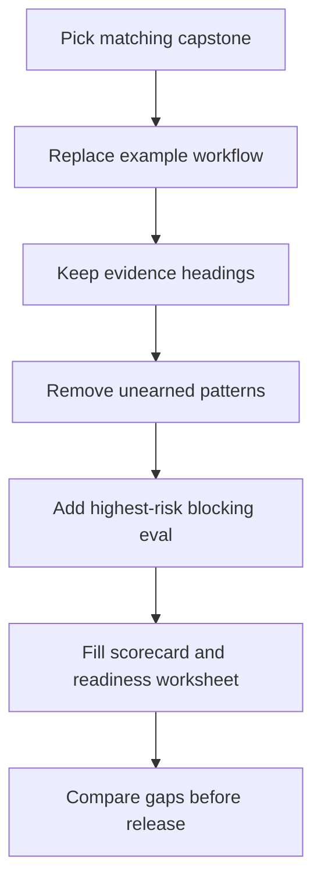

# Capstone Projects

Los capstones muestran cómo los patterns se combinan en sistemas con forma de producto. Cada capstone parte de un workflow concreto, elige los límites agentic correctos, mapea el diseño entre frameworks y define la evidencia de producción requerida antes del lanzamiento.

Usa estos capítulos después de los labs. Los labs aíslan un pattern a la vez. Los capstones combinan patterns en sistemas con state, tools, policy, memory, observability, evals, deployment, rollback, ownership y slices nativos de framework seleccionados.

No leas los capstones como tutoriales extensos. Léelos como paquetes de revisión de diseño. Cada uno muestra qué evidencia debe reunir un equipo antes de convertir un agent pattern en comportamiento de producto.

## Capstone Set

| Capstone | Primary Goal | Main Patterns | Framework Lens |
| --- | --- | --- | --- |
| [Support Refund Agent](./support-refund-agent) | Redactar recomendaciones de reembolso seguras según policy. | Tool use, policy enforcement, approval gates, observability, evals. | Mastra runtime, LangGraph workflow, mini-runtime, slices nativos de Mastra y LangGraph. |
| [Research RAG Agent](./research-rag-agent) | Responder usando fuentes aprobadas con citas y reglas de memory. | Context engineering, semantic recall, knowledge-bound agents, memory, evals. | LangGraph graph, Python/TypeScript directo, Mastra runtime, slice nativo de LangGraph. |
| [Multi-Agent Delivery Workflow](./multi-agent-delivery-workflow) | Coordinar agents especialistas preservando un único owner responsable. | Supervisor/worker, CrewAI flows, AutoGen transcripts, durable workflows. | CrewAI, AutoGen, LangGraph, Mastra, slices nativos de CrewAI y AutoGen. |

## Choose A Capstone

Usa el capstone que coincida con tu límite de mayor riesgo.

| Si tu sistema necesita... | Comienza con | Riesgo principal a inspeccionar |
| --- | --- | --- |
| Un model que redacte una acción que involucre dinero, policy o datos de clientes. | [Support Refund Agent](./support-refund-agent) | El model nunca debe tener autoridad final sobre el side effect. |
| Respuestas fundamentadas en fuentes privadas o aprobadas. | [Research RAG Agent](./research-rag-agent) | El sistema debe rechazar o escalar cuando falte evidencia, esté desactualizada o no autorizada. |
| Varios agents especialistas o roles contribuyendo a un solo entregable. | [Multi-Agent Delivery Workflow](./multi-agent-delivery-workflow) | La coordinación no debe borrar bloqueos, preocupaciones minoritarias, tasks fallidas ni ownership final. |

Si aplica más de una, lee los capstones en este orden: autoridad sobre side effects, evidencia fundamentada, luego coordinación multi-agent. Los side effects y datos privados suelen requerir revisión antes que las decisiones de topología.

## How To Reuse A Capstone

Convierte un capstone en tu propia revisión de diseño en cinco pasos:

1. Reemplaza el workflow de ejemplo por tu workflow real.
2. Mantén los mismos encabezados de evidencia: state, tools, policy, memory, trace, eval, ADR, runbook, rollback.
3. Elimina cualquier pattern que no justifique su lugar en tu workflow.
4. Agrega un eval bloqueante para la falla de mayor riesgo.
5. Registra los gaps en el [capstone review scorecard](/capstone-assets/templates/capstone-review-scorecard.txt) y el [production readiness worksheet](/capstone-assets/templates/production-readiness-worksheet.txt).

El valor reutilizable es la forma de la revisión, no el dominio. Un sistema de reembolsos, un asistente de investigación y un delivery workflow necesitan la misma prueba: autoridad acotada, state reproducible, decisiones trazables, eval gates y rollback.



Usa este flujo como el contrato de reutilización de capstones. El resultado no es una implementación copiada; es un paquete de sistema revisado con gaps, evidencia y bloqueos de lanzamiento explícitos.

## Run The Capstones

Los capstones incluyen assets deterministas en TypeScript para que los lectores puedan inspeccionar state, traces, evals y comportamiento de rollback sin claves de proveedor de model.

```sh
npm run capstones:demo
npm run capstones:test
```

Salida esperada del demo:

```text
support-refund-agent: pass
  stop: draft_ready
  trace events: 7
research-rag-agent: pass
  stop: answered_with_citation
  trace events: 6
multi-agent-delivery-workflow: pass
  stop: accepted_after_review
  trace events: 4
```

Fuente:

- `capstone-projects-runtime/typescript/src/capstones.ts`
- `capstone-projects-runtime/typescript/test/capstones.spec.ts`

Después de ejecutar los comandos, compara la salida con las secciones de trace y eval de cada capstone. El objetivo es conectar el comportamiento en runtime con la evidencia escrita de diseño.

## Runtime Evidence Map

Usa este mapa para inspeccionar el path de código antes de leer los capítulos detallados de cada capstone.

| Capstone | Safe Stop | Release Evals | Rollback Path |
| --- | --- | --- | --- |
| Support Refund Agent | `draft_ready` | `draft_contains_policy_citation`, `no_money_movement`, `safe_stop_reason` | Desactiva `refunds.create_draft`; redirige el ticket a una cola de soporte humano. |
| Research RAG Agent | `answered_with_citation` | `current_source_used`, `stale_source_rejected`, `forbidden_source_omitted`, `citation_faithfulness` | Desactiva la síntesis de respuestas; devuelve solo la lista de fuentes rankeadas. |
| Multi-Agent Delivery Workflow | `accepted_after_review` | `planner_present`, `risk_review_present`, `test_plan_present`, `turns_sequential`, `final_owner_accepts_last` | Desactiva la delegación; redirige la solicitud a una checklist de entrega de un solo owner. |

Estas no son simples aserciones. Cada eval protege un límite de producción:

- El capstone de reembolso prueba que el agent puede redactar una recomendación mientras la policy bloquea el movimiento de dinero.
- El capstone de RAG prueba que el context packet usa la fuente aprobada actual y omite fuentes desactualizadas o prohibidas.
- El capstone de delivery prueba que los agents especialistas pueden contribuir sin eliminar el ownership final del workflow.

## What Each Capstone Proves

Cada capstone incluye:

- problema y non-goals;
- composición de patterns;
- arquitectura del sistema;
- modelo de datos y state;
- límites de tool, policy, memory y approval;
- mapeo nativo de framework;
- path de ejemplo nativo de framework donde exista;
- ejemplo de trace;
- ejemplo de reporte de eval;
- ejemplo de ADR;
- ejemplo de runbook;
- checklist de release y rollback.

La estructura repetida importa. Da a los lectores una forma reutilizable de revisión de diseño: si un proyecto futuro no puede llenar estas secciones, no está listo para producción.

## Capstone Completion Standard

Un capstone solo está completo cuando puede responder estas preguntas:

Descarga el artefacto reutilizable de revisión: [capstone review scorecard](/capstone-assets/templates/capstone-review-scorecard.txt).

Descarga la hoja de seguimiento de producción: [production readiness worksheet](/capstone-assets/templates/production-readiness-worksheet.txt).

| Pregunta | Evidencia requerida |
| --- | --- |
| ¿Quién es owner del state? | State schema, plan de checkpoint, nota de migración. |
| ¿Quién es owner de la autoridad? | Tool manifest, decisión de policy, regla de approval. |
| ¿Qué prueba la calidad? | Eval cases, thresholds, ejemplos de falla. |
| ¿Qué prueba la observabilidad? | Secuencia de eventos de trace y campos requeridos. |
| ¿Qué prueba la preparación para producción? | Notas de deployment, runbook, path de rollback. |
| ¿Qué prueba la portabilidad? | Mapeo de framework y assets fuera de código exclusivo del framework. |

No trates un capstone como un lab más grande. Trátalo como una pequeña revisión de diseño para producción.

## Capstone Review Gate

Usa este gate antes de tratar cualquier capstone como material A++:

| Check | Evidencia |
| --- | --- |
| El workflow es concreto | Un workflow visible para el usuario u operador inicia el sistema. |
| El límite de autoridad es explícito | Tools, datos, memory, approvals y side effects tienen owners nombrados. |
| El path inseguro está bloqueado | Al menos un eval bloqueante detecta la falla de mayor riesgo. |
| La ejecución es reproducible | State, trace, versiones y resultado de eval pueden reconstruir éxito y falla. |
| El lector puede reutilizar la forma | Se proveen artefactos de ADR, runbook, trace, eval, checklist o rollback. |

Registra el score, gaps bloqueantes y el siguiente artefacto de producción en el capstone review scorecard.

## Rúbrica A++ para Capstone

Califica cada área del 0 al 2.

| Área | Evidencia A++ |
| --- | --- |
| Problema y alcance | Workflow concreto, non-goals explícitos, nivel de autoridad claro. |
| Composición de patterns | Cada loop, tool, memory, agent y límite de aprobación tiene una razón de existir. |
| Límite de arquitectura | El juicio del model está separado del control determinista, policy, state, tools y aprobación. |
| Control de tool y policy | Contratos de tool, permisos, timeouts, campos de auditoría y rutas de negación o aprobación de alto riesgo están documentados. |
| State, memory y context | El state de ejecución, reglas de memory, fuentes de context, confianza, frescura y presupuesto son inspeccionables. |
| Evidencia de evaluación | Happy paths, edge cases, rutas inseguras y regresiones tienen umbrales que pueden bloquear el release. |
| Observabilidad y trazabilidad | Una ejecución exitosa y una fallida pueden reconstruirse a partir de los campos de trace. |
| Operación en producción | Runbook, disparadores de incidentes, rollback, kill switch y responsables están nombrados. |
| Portabilidad de framework | Las responsabilidades del framework y de la aplicación están claras. |
| Reutilización para el lector | El capítulo deja al lector con formas reutilizables de ADR, trace, eval, runbook o checklist. |

Interpreta la puntuación de esta manera:

- 0-9: ejemplo esquemático
- 10-14: nota de diseño útil
- 15-17: capstone sólido
- 18-20: ejemplo didáctico de nivel producción

Un capstone no puede obtener A++ si un tool de alto riesgo puede ejecutarse sin policy o aprobación, si no existe un trace reproducible, si no existe un eval bloqueante para comportamientos inseguros, si la propiedad de state o memory no es clara, o si el rollback no está documentado.

## Orden de Lectura Recomendado

1. [Support Refund Agent](./support-refund-agent)
2. [Research RAG Agent](./research-rag-agent)
3. [Multi-Agent Delivery Workflow](./multi-agent-delivery-workflow)
4. [Deployment Walkthrough](../production-runtime/deployment-walkthrough)
5. [Templates and Worksheets](../agent-engineering-practice/templates-and-worksheets)

El primer capstone es intensivo en tool y policy. El segundo es intensivo en evidencia y memory. El tercero es intensivo en coordinación.
