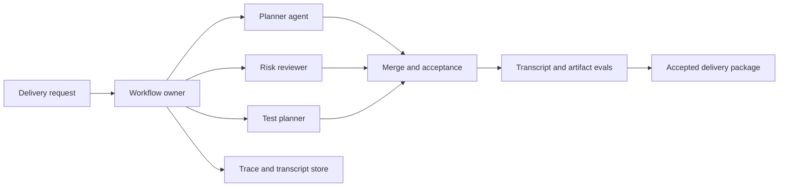

# Capstone - Multi-Agent Delivery Workflow

Construye un workflow que coordina agents especialistas para planear, revisar y empaquetar un delivery artifact, mientras mantiene un único responsable para la aceptación final.

Este capstone requiere mucha coordinación. La lección es que múltiples agents no eliminan la necesidad de ownership en el workflow. De hecho, la incrementan.

## Problema

Un equipo quiere un agentic workflow que convierta una solicitud de producto en un delivery package revisado: resumen de requerimientos, plan de implementación, revisión de riesgos, plan de pruebas y nota de lanzamiento final. Los agents especialistas pueden ayudar, pero el workflow debe evitar trabajo duplicado, salidas en conflicto, autoridad poco clara y transcripciones imposibles de revisar.

## No Objetivos

- No permitas que los agents fusionen sus propios outputs sin un owner final.
- No trates los nombres de roles como especialización.
- No uses el historial de chat como único state store.
- No permitas tools sin permisos específicos por rol.

## Composición del Pattern

| Preocupación | Pattern |
| --- | --- |
| decomposition | [Task Delegation](../multi-agent-systems/task-delegation) |
| coordination | [Supervisor / Worker](../multi-agent-systems/supervisor-worker) |
| role workflow | [CrewAI Flows and Crews](../multi-agent-systems/crewai-flows-and-crews) |
| transcript review | [Observability and Evals](../production-runtime/observability-and-evals) |
| durable state | [Durable Workflows](../production-runtime/durable-workflows) |
| production runtime | [Deployment Walkthrough](../production-runtime/deployment-walkthrough) |

## Arquitectura

Lee este diagrama como un límite de accountability. Los agents especialistas contribuyen trabajo, pero el workflow owner mantiene el state, fusiona outputs, ejecuta evals y acepta el paquete final.




## Activos Ejecutables

Ejecuta la implementación determinista del capstone:

```sh
npm run capstones:demo
npm run capstones:test
```

Inspecciona:

- `capstone-projects-runtime/typescript/src/capstones.ts`
- `capstone-projects-runtime/typescript/test/capstones.spec.ts`

Evidencia descargable:

- [Sample trace JSON](/capstone-assets/traces/multi-agent-delivery-workflow.trace.json)
- [Sample eval report](/capstone-assets/eval-reports/multi-agent-delivery-workflow-eval-report.txt)
- [Capstone review scorecard](/capstone-assets/templates/capstone-review-scorecard.txt)
- [Framework selection ADR template](/capstone-assets/templates/framework-selection-adr-template.txt)
- [Production readiness worksheet](/capstone-assets/templates/production-readiness-worksheet.txt)

Señal esperada del runtime:

```text
multi-agent-delivery-workflow: pass
  stop: accepted_after_review
  trace events: 4
```

El test suite trata estos como evidencia de release:

| Evidencia | Verificación en Runtime |
| --- | --- |
| Planner output existe | `planner_present` |
| Risk review existe | `risk_review_present` |
| Test plan existe | `test_plan_present` |
| Turns están ordenados | `turns_sequential` |
| Workflow owner acepta al final | `final_owner_accepts_last` |
| Release gate emite una sola decisión final | `delivery_workflow_release_gate` |

## Contratos de Rol

| Rol | Input | Output | No Puede Hacer |
| --- | --- | --- | --- |
| Planner | request, constraints | scoped implementation plan | aprobar el release final |
| Risk reviewer | request, plan | risks, mitigations, blockers | reescribir el plan en silencio |
| Test planner | request, plan | test matrix and gates | bajar el umbral de release |
| Workflow owner | todos los outputs | final accepted package | ignorar evals fallidos |

Cada rol necesita una razón para existir. Si un rol no cambia el output o el perfil de riesgo, elimínalo.

## Capstone Review Gate

Antes de tratar este capstone como nivel producción, verifica el límite de accountability:

| Verificación | Evidencia |
| --- | --- |
| Un owner acepta el output final | Workflow owner, no un worker agent, establece la aceptación final. |
| Los roles son distintos | Planner, reviewer y tester tienen diferentes inputs, outputs y límites. |
| Transcript está normalizado | Los mensajes incluyen rol, turno, tipo, task, stop reason y eval result. |
| Falta de revisión bloquea el release | Risk review y test plan son requeridos antes de la aceptación. |
| Delegación puede deshabilitarse | Rollback redirige el trabajo a un workflow de checklist con único owner. |

Registra el resultado en el capstone review scorecard y en el production readiness worksheet.

## Production Bridge

Usa esta tabla al convertir el capstone en un servicio:

| Capstone Artifact | Versión en Producción |
| --- | --- |
| Role contracts | Schemas de roles versionados con permisos, alcances de tools, timeouts y outputs esperados. |
| Workflow owner | Paso de aceptación durable con owner final, stop reason y control de rollback. |
| Transcript example | Almacén de transcripciones redactadas con replay, retención y enlaces a incidentes. |
| Transcript evals | Gates bloqueantes para cobertura de roles, orden de turnos, owner final y blockers ignorados. |
| Runbook | Kill switch para delegación más ruta de checklist de fallback. |

El primer hito de producción es un delivery workflow que pueda rechazar colaboración incompleta y probar quién aceptó el paquete final.

## Native Framework Mapping

Comienza con el capstone determinista en TypeScript, luego compara los slices nativos:

- `native-framework-examples/crewai-delivery/` prueba la separación de roles y aceptación controlada por el flow antes de agregar herramientas reales de gestión de proyectos o repositorios.
- `native-framework-examples/autogen-delivery/` prueba roles de equipo AgentChat, terminación, exportación de transcript normalizada y transcript evals.

| Framework | Mejor Mapeo |
| --- | --- |
| CrewAI | Flow mantiene el state y la aceptación final. Crew agents producen outputs de planner, reviewer y tester. |
| AutoGen | AgentChat team registra turnos de roles y terminación. Transcript evals verifican orden de roles y stop reason. |
| LangGraph | Nodos o subgrafos representan roles. Graph state almacena cada output y la aceptación final. |
| Mastra | Workflow coordina agents, tools, evals y exportación de trace dentro de un paquete TypeScript runtime. |
| Mini-runtime | Supervisor distribuye tasks, valida outputs de workers, fusiona resultados y emite trace events. |

## Ejemplo de Trace y Transcript

```json
{
  "trace_id": "tr_delivery_331",
  "workflow_state": "accepted",
  "messages": [
    { "turn": 1, "from": "workflow", "to": "planner", "type": "assignment" },
    { "turn": 2, "from": "planner", "to": "workflow", "type": "plan" },
    { "turn": 3, "from": "workflow", "to": "risk_reviewer", "type": "review_request" },
    { "turn": 4, "from": "risk_reviewer", "to": "workflow", "type": "risk_review" },
    { "turn": 5, "from": "workflow", "to": "test_planner", "type": "test_request" },
    { "turn": 6, "from": "test_planner", "to": "workflow", "type": "test_plan" },
    { "turn": 7, "from": "workflow", "to": "team", "type": "accepted_package" }
  ],
  "evals": [
    { "case_id": "planner_present", "status": "pass" },
    { "case_id": "risk_review_present", "status": "pass" },
    { "case_id": "test_plan_present", "status": "pass" },
    { "case_id": "turns_sequential", "status": "pass" },
    { "case_id": "final_owner_accepts_last", "status": "pass" }
  ]
}
```

## Ejemplo de Eval Report

| Caso | Esperado | Resultado |
| --- | --- | --- |
| `planner_present` | Planner regresa un implementation plan. | pass |
| `risk_review_present` | Risk reviewer regresa output de revisión antes de la aceptación. | pass |
| `test_plan_present` | Test planner regresa test gates antes de la aceptación. | pass |
| `turns_sequential` | Los turns del transcript son del 1 al 7 sin huecos. | pass |
| `final_owner_accepts_last` | El workflow owner envía `accepted_package` al final. | pass |
| reviewer encuentra blocker | Workflow se detiene o escala. | blocking |
| tester falta | La aceptación final está bloqueada. | blocking |

Umbral de bloqueo:

```text
required role coverage: 100%
final owner present: 100%
critical blocker ignored: 0
missing test gate accepted: 0
```

## Ejemplo de ADR

```md
# ADR-023: Delivery workflow uses specialist agents with workflow-owned acceptance

## Status

Accepted

## Decision

The delivery workflow may delegate planning, risk review, and test planning to specialist agents. A workflow-owned acceptance step decides the final package. Worker agents cannot approve release, lower gates, or mutate final state directly.

## Rollback

Disable multi-agent delegation and route requests to a single deterministic checklist workflow until transcript evals and role boundaries pass.
```

## Ejemplo de Runbook

```text
service: multi-agent-delivery-workflow
owner: platform-engineering
kill switch: disable delegation
fallback: single-owner delivery checklist
trace dashboard: platform/delivery-workflow/traces
eval suite: evals/delivery-workflow
incident trigger: final package accepted without risk review, test plan, or owner
post-incident action: add transcript regression fixture and update role contract
```

## Lista de verificación para lanzamiento

- El state del workflow está separado del chat de roles.
- Cada rol tiene un input tipado y un output esperado.
- Los permisos de tool son específicos por rol.
- Merge y aceptación son pasos explícitos del workflow.
- Los transcript evals verifican el orden, la cobertura de roles y la razón de detención.
- El rollback puede deshabilitar la delegación sin deshabilitar todo el delivery workflow.

## Labs relacionados

- [Lab 05 - Multi-Agent Supervisor](../hands-on-labs/lab-05-multi-agent-supervisor)
- [Lab 08 - CrewAI Flows and Crews](../hands-on-labs/lab-08-crewai-flows-and-crews)
- [Lab 12 - LangGraph State Graph](../hands-on-labs/lab-12-langgraph-state-graph)
- [Lab 13 - AutoGen Transcript Evals](../hands-on-labs/lab-13-autogen-transcript-evals)

Ejemplos nativos:

- `native-framework-examples/crewai-delivery/` ([descargar](/downloads/native-crewai-delivery.zip))
- `native-framework-examples/autogen-delivery/` ([descargar](/downloads/native-autogen-delivery.zip))
