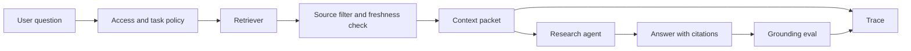

# Capstone - Research RAG Agent

Construye un research agent que responda usando fuentes aprobadas, cite evidencia, rechace afirmaciones no respaldadas y registre suficiente trace data para depurar fallas de retrieval.

Este capstone depende fuertemente de la evidencia. El principal riesgo no es que el model no pueda escribir una respuesta. El principal riesgo es que la respuesta parezca convincente pero use evidencia obsoleta, prohibida o inexistente.

## Problema

Los equipos de producto, soporte e ingeniería a menudo necesitan respuestas de documentos internos. Un research agent puede reducir el tiempo de búsqueda, pero debe respetar el acceso a fuentes, vigencia, citaciones y reglas de memory.

## No Objetivos

- No responder usando fuentes no aprobadas.
- No tratar el texto recuperado como instrucciones confiables.
- No almacenar hechos privados en memory sin reglas de retención y corrección.
- No citar documentos que el agent realmente no usó.

## Composición de Patterns

| Preocupación | Pattern |
| --- | --- |
| context packet | [Context Engineering](../foundations/context-engineering) |
| retrieval | [Semantic Recall and RAG](../memory-knowledge/semantic-recall-rag) |
| evidence boundary | [Knowledge-Bound Agents](../memory-knowledge/knowledge-bound-agents) |
| memory | [Memory-Augmented Agent](../memory-knowledge/memory-augmented-agent) |
| policy | [Policy Enforcement](../production-runtime/policy-enforcement) |
| quality | [Observability and Evals](../production-runtime/observability-and-evals) |

## Arquitectura

Lee este diagrama como un evidence boundary. Retrieval puede encontrar candidatos, pero solo el filtrado de fuentes, el ensamblado de context y los grounding evals deciden qué puede citar la respuesta.




## Recursos Ejecutables

Ejecuta la implementación determinista del capstone:

```sh
npm run capstones:demo
npm run capstones:test
```

Inspecciona:

- `capstone-projects-runtime/typescript/src/capstones.ts`
- `capstone-projects-runtime/typescript/test/capstones.spec.ts`

Evidencia descargable:

- [Sample trace JSON](/capstone-assets/traces/research-rag-agent.trace.json)
- [Sample eval report](/capstone-assets/eval-reports/research-rag-agent-eval-report.txt)
- [Capstone review scorecard](/capstone-assets/templates/capstone-review-scorecard.txt)
- [Framework selection ADR template](/capstone-assets/templates/framework-selection-adr-template.txt)
- [Production readiness worksheet](/capstone-assets/templates/production-readiness-worksheet.txt)

Señal esperada en runtime:

```text
research-rag-agent: pass
  stop: answered_with_citation
  trace events: 6
```

La suite de pruebas trata estos como evidencia de release:

| Evidencia | Verificación en Runtime |
| --- | --- |
| El context packet incluye la fuente aprobada actual | `current_source_used` |
| El context packet excluye la fuente obsoleta | `stale_source_rejected` |
| El context packet excluye la fuente prohibida | `forbidden_source_omitted` |
| La respuesta cita la fuente que usó | `citation_faithfulness` |

Ejemplo nativo:

- `native-framework-examples/langgraph-research-rag/` ([descargar](/downloads/native-langgraph-research-rag.zip))

## Context Packet

| Campo | Regla Requerida |
| --- | --- |
| `question` | Almacena la pregunta normalizada y el texto original del usuario por separado. |
| `actor` | Incluye tenant, rol y alcance de acceso a fuentes. |
| `sources` | Incluye ID de fuente, título, vigencia, resultado de ACL y etiqueta de citación. |
| `evidence` | Incluye solo los pasajes aprobados necesarios para la respuesta. |
| `memory` | Incluye memory de usuario o proyecto solo cuando la policy lo permite. |
| `instructions` | Separa instrucciones del sistema del contenido recuperado. |
| `omissions` | Registra fuentes omitidas por acceso, vigencia o relevancia. |

## Capstone Review Gate

Antes de tratar este capstone como apto para producción, verifica el evidence boundary:

| Verificación | Evidencia |
| --- | --- |
| El acceso a fuentes ocurre antes del ensamblado de context | Las fuentes prohibidas se omiten antes de la síntesis de la respuesta. |
| Se aplica vigencia | Las fuentes obsoletas no pueden reemplazar fuentes aprobadas actuales. |
| Las citaciones son fieles | Cada afirmación citada corresponde a evidencia en el context packet. |
| La falta de evidencia falla cerrado | El agent rechaza o escala en vez de adivinar. |
| Los registros en memory están gobernados | La memory durable requiere IDs de fuente, confianza, retención y ruta de corrección. |

Registra el resultado en el capstone review scorecard y el production readiness worksheet.

## Production Bridge

Usa esta tabla al convertir el capstone en un servicio:

| Capstone Artifact | Versión de Producción |
| --- | --- |
| Context packet | Contrato de evidencia versionado con ACLs, vigencia, notas de fuentes omitidas y presupuesto de tokens. |
| Source filter | Servicio de control de acceso con registro de auditoría y versión de policy. |
| Citation eval | Release gate bloqueante para evidencia no soportada, obsoleta, prohibida o ausente. |
| Memory rule | Ruta de escritura gobernada con retención, eliminación, corrección, consentimiento y alcance de tenant. |
| Runbook | Fallback que desactiva la síntesis y solo retorna listas de fuentes aprobadas. |

El primer hito de producción es una ruta de respuesta que pueda explicar qué citó, qué omitió y por qué.

## Native Framework Mapping

| Framework | Mejor Mapeo |
| --- | --- |
| LangGraph | Nodos de grafo para clasificar pregunta, recuperar, filtrar, responder, citar, evaluar y escalar. Los stores manejan memory de largo plazo. |
| Mastra | El agent maneja la síntesis de respuestas; el workflow controla retrieval, filtrado de fuentes, evals, policy de memory y exportación de traces. |
| AutoGen | Los agents de researcher y reviewer pueden colaborar, pero el acceso a fuentes y las verificaciones de citación permanecen en software. |
| CrewAI | El flow controla el evidence packet y la aceptación; la crew puede dividir tareas de research y revisión. |
| Mini-runtime | Constructor de context directo más cliente de retrieval, función de policy de fuentes, validador de respuestas y eventos de trace. |

## Trace Example

```json
{
  "trace_id": "tr_research_2077",
  "question": "Can the support refund agent issue money?",
  "events": [
    { "span": "policy", "decision": "allow", "scope": "support_docs" },
    { "span": "retrieval", "query": "support refund agent issue money", "top_k": 5 },
    { "span": "source_filter", "allowed": 1, "stale": 1, "forbidden": 1 },
    { "span": "context_packet", "evidence_refs": ["refund-policy-v4"] },
    { "span": "model", "prompt": "research-answer-v1", "status": "succeeded" },
    { "span": "eval", "case_id": "research_rag_release_gate", "status": "pass" }
  ]
}
```

## Eval Report Example

| Eval | Qué Verifica | Regla de Bloqueo |
| --- | --- | --- |
| `current_source_used` | `refund-policy-v4` llega al context packet | no hay respuesta sin evidencia aprobada actual |
| `stale_source_rejected` | `refund-policy-v2` queda fuera del context packet | no hay respuesta de policy obsoleta |
| `forbidden_source_omitted` | `finance-private-notes` queda fuera del context packet | no hay fuente prohibida en context |
| `citation_faithfulness` | las fuentes citadas respaldan la respuesta | no hay citación no soportada |
| rechazo por falta de evidencia | el agent rechaza cuando falta evidencia aprobada | no hay respuesta inventada |
| memory write | los registros en memory siguen reglas de retención | no hay registro sensible en memory |

Fixture de ejemplo:

```json
{
  "case_id": "stale_refund_policy_rejected",
  "question": "Can the agent issue refunds directly?",
  "retrieved_sources": ["refund-policy-v2", "refund-policy-v4"],
  "expected": {
    "must_cite": ["refund-policy-v4"],
    "must_not_cite": ["refund-policy-v2"],
    "answer_contains": "may draft but not issue refunds"
  }
}
```

## ADR Example

```md
# ADR-022: Research agent answers only from approved current sources

## Status

Accepted

## Decision

The research agent may answer only from sources that pass access control, freshness, and citation checks. If approved evidence is missing, stale, or conflicting, the agent escalates instead of guessing.

## Rollback

Disable answer synthesis and keep retrieval-only search results available while the source filter or citation evaluator is repaired.
```

## Runbook Example

```text
service: research-rag-agent
owner: knowledge-platform
kill switch: disable answer synthesis
fallback: return ranked source list only
trace dashboard: knowledge/research-agent/traces
eval suite: evals/research-rag
incident trigger: unsupported answer, forbidden source exposure, stale source citation
post-incident action: add retrieval fixture and citation eval before re-enable
```

## Lista de verificación para lanzamiento

- Los ACLs de origen se ejecutan antes del ensamblaje de context.
- El contenido recuperado se separa de las instrucciones.
- Las respuestas citan solo evidencia en el context packet.
- La ausencia de evidencia produce rechazo o escalamiento.
- Las escrituras en memory tienen reglas de retención, eliminación y corrección.
- Los evals cubren fuentes obsoletas, prohibidas, ausentes y en conflicto.

## Estándar de finalización de Native Slice

El native slice de LangGraph está completo cuando demuestra estos resultados:

| Requisito | Evidencia |
| --- | --- |
| el acceso a la fuente se ejecuta antes de que la salida de retrieval entre al context | nodo `check_access` y policy trace |
| las fuentes obsoletas y prohibidas quedan fuera del evidence packet | nodo `filter_sources` y lista de fuentes omitidas |
| la respuesta cita solo evidencia actual aprobada | salida `answer_with_citations` y eval de citación |
| la ausencia de evidencia aprobada escala | edge condicional a `escalate` |
| el release gate bloquea grounding incorrecto | fallos `evaluate_answer` por citaciones obsoletas o prohibidas |

El slice debe permanecer pequeño. Su función es demostrar policy de fuente, ensamblaje de context, fidelidad de citación y escalamiento antes de agregar vector stores reales o llamadas a model.

## Labs relacionados

- [Lab 03 - Agentic RAG](../hands-on-labs/lab-03-agentic-rag)
- [Lab 06 - Observability and Evals](../hands-on-labs/lab-06-observability-and-evals)
- [Lab 11 - Context, Memory, Trace, and Evals](../hands-on-labs/lab-11-context-memory-trace-evals)
- [Lab 12 - LangGraph State Graph](../hands-on-labs/lab-12-langgraph-state-graph)
