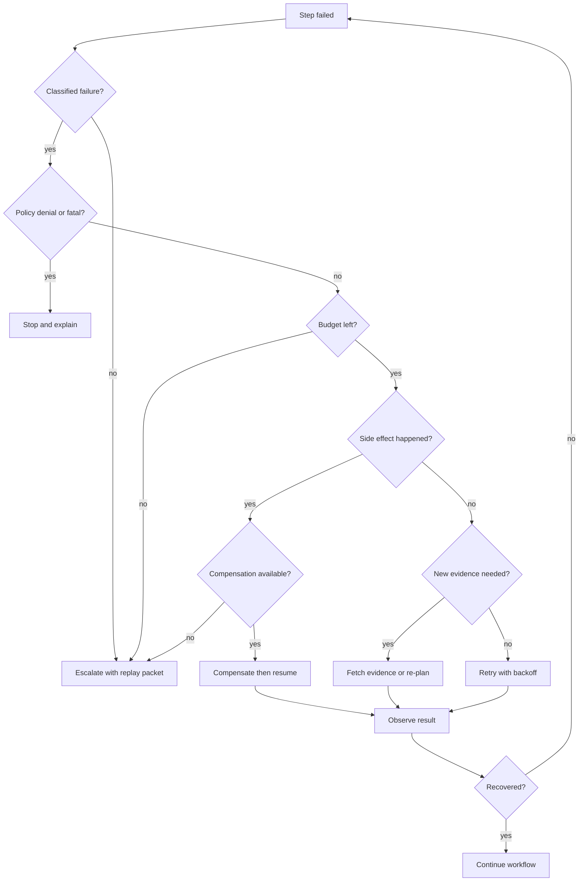

# Self-Healing Workflows

Los self-healing workflows detectan pasos fallidos y se recuperan mediante retry, fallback, re-planning o escalamiento.

> Fuente y descargas
>
> - [Repository source](https://github.com/GTuritto/Agentic-Systems-Patterns/tree/main/self-healing-workflow-agent-pattern)
> - [Download code bundle](/downloads/self-healing-workflows.zip)

## Intent

Usa este pattern para mantener un agentic workflow de larga duración íntegro cuando un paso falla. Un self-healing workflow no reintenta a ciegas. Registra la falla, la clasifica, elige una acción de recuperación, actualiza el state y se detiene cuando la recuperación sería insegura o ineficiente.

El objetivo no es un uptime perfecto. El objetivo es una recuperación controlada con evidencia.

## Scenario

Un account-support agent recopila el context del cliente, revisa la policy, redacta una resolución y actualiza un CRM. La escritura en el CRM falla después de crear el draft. Un workflow débil volvería a ejecutar toda la task y arriesgaría mensajes o registros duplicados. Un self-healing workflow clasifica la falla como un side effect parcial, conserva el draft exitoso, reintenta solo la escritura en el CRM con una idempotency key y escala si el retry vuelve a fallar.

La decisión de diseño importante es el alcance de la recuperación. Recupera el paso fallido, no todo el workflow, a menos que el state demuestre que el plan está obsoleto.

## Use When

- Se esperan fallas y pueden clasificarse antes de iniciar la recuperación.
- Los pasos tienen inputs, outputs, side effects y razones de detención observables.
- Los retries son idempotentes, o existe compensación para side effects parciales.
- Los fallbacks reducen autoridad, costo o riesgo en vez de ocultar la falla.
- El re-planning usa nueva evidencia, state cambiado o un plan confirmado como obsoleto.
- El escalamiento humano tiene un owner, mensaje y handoff packet.

## Avoid When

- El workflow no puede distinguir entre fallas transitorias, fatales, de policy y side effects parciales.
- Reintentar un paso puede repetir una acción externa irreversible.
- El sistema llamaría al model de nuevo sin nueva evidencia.
- La acción de recuperación es más peligrosa que la falla original.
- El usuario u operador no puede inspeccionar por qué el workflow se recuperó o se detuvo.

## Architecture

Usa este diagrama para leer Self-Healing Workflows como un límite de sistema, no solo como una forma de código. La pregunta clave de ownership es: el loop controller es dueño del progreso, presupuestos, condiciones de detención y recovery state.


Léelo como una máquina de estados de recuperación: cada retry, fallback, re-plan, compensación, escalamiento y razón de detención debe ser explícita y trazable.

## Decision Rules

Clasifica antes de recuperar. El controller debe elegir de un vocabulario pequeño de recuperación y rechazar recuperaciones ambiguas.

| Failure Class | Examples | Recovery Action | Stop Condition |
| --- | --- | --- | --- |
| Transient tool failure | timeout, temporary 5xx, connection reset | retry same step with backoff and idempotency key | retry budget exhausted |
| Rate limit or quota | 429, token quota, per-account throttle | wait, use lower-cost fallback, or reschedule | deadline or budget exhausted |
| Missing evidence | source unavailable, weak retrieval, incomplete tool output | fetch more evidence or ask for clarification | no new source can change the decision |
| Stale plan | dependency changed, previous step invalidated | re-plan from current durable state | repeated stale-plan loop |
| Policy denial | unsafe tool request, forbidden data movement | block, explain, and escalate if needed | always stop autonomous recovery |
| Partial side effect | draft created but CRM write failed | compensate, resume failed step, or escalate | compensation unavailable |
| Fatal domain error | account closed, item unavailable, invalid recipient | stop and return a clear failure | always stop retry loop |



Este gráfico es el contrato de producción: cada borde necesita un trace event, verificación de presupuesto y razón de detención.

## System Shape

| Component | Owns | Must Emit |
| --- | --- | --- |
| Workflow controller | current step, progress, budgets, stop conditions | selected step, attempt number, remaining budget |
| Failure classifier | failure class, severity, retryability | class, evidence, confidence, ambiguity |
| Recovery policy | retry, fallback, re-plan, compensate, escalate, stop | decision, reason, allowed authority |
| Idempotency layer | duplicate suppression for side effects | key, target, previous result |
| Compensation handler | undo or repair of partial external actions | compensation action, result, residual risk |
| Replay builder | incident packet for debugging and evals | inputs, state, tool outputs, policy version |
| Escalation channel | human owner and user-facing status | owner, summary, next action, deadline |

El controller es dueño del loop. Los tools no deciden reintentar por sí mismos, y las llamadas al model no hacen re-planning silencioso tras una falla. La recuperación es una decisión de policy sobre durable state.

## Contract

El contrato útil más pequeño separa el resultado del paso, failure class, decisión de recuperación y trace evidence.

```ts
type FailureClass =
  | "transient"
  | "rate_limit"
  | "missing_evidence"
  | "stale_plan"
  | "policy_denied"
  | "partial_side_effect"
  | "fatal";

type RecoveryAction =
  | "retry"
  | "fallback"
  | "replan"
  | "compensate"
  | "escalate"
  | "stop";

type RecoveryDecision = {
  action: RecoveryAction;
  reason: string;
  retryAfterMs?: number;
  requiresNewEvidence: boolean;
  idempotencyKey?: string;
};

type RecoveryTraceEvent = {
  workflowId: string;
  stepId: string;
  attempt: number;
  failureClass: FailureClass;
  decision: RecoveryDecision;
  budgetRemaining: number;
  stopReason?: string;
};
```

Este contrato previene un bug común en producción: tratar cada falla como una excepción retryable.

## Core Protocol

1. Persiste el workflow state antes de cada paso que pueda crear un side effect externo.
2. Ejecuta el paso a través de un tool, worker o ruta de model acotada.
3. Si el paso tiene éxito, almacena la evidencia y continúa.
4. Si el paso falla, clasifica la falla con evidencia concreta.
5. Verifica la policy, retry budget, time budget, cost budget y no-progress breaker.
6. Elige una acción de recuperación: retry, fallback, re-plan, compensate, escalate o stop.
7. Emite un trace event antes de ejecutar la acción de recuperación.
8. Reanuda desde el durable state, no desde un plan optimista en memoria.
9. Convierte incidentes no resueltos en regression evals.

## Workflow Transition Map

| From | Event | To | Required Evidence |
| --- | --- | --- | --- |
| running | step succeeded | running or complete | output, validation result, updated state |
| running | transient failure | retry_wait | failure class, attempt count, backoff |
| retry_wait | timer elapsed | running | same idempotency key and unchanged target |
| running | fallback selected | running | fallback reason and reduced authority |
| running | stale plan detected | replanning | changed state or new evidence |
| replanning | valid plan produced | running | plan diff and validation result |
| running | partial side effect detected | compensating | side-effect ID and compensation rule |
| compensating | compensation succeeded | running or escalated | compensation result and residual risk |
| running | policy denial or fatal error | stopped | policy rule or fatal domain evidence |
| any active state | budget exhausted | escalated | budget values and replay packet |

## Implementation Notes

- Mantén la retry policy por paso. Una llamada de lectura barata y una actualización de pago no deben compartir una regla de retry.
- Usa idempotency keys para cada llamada con side effect, incluyendo correos, escrituras en CRM, actualizaciones de tickets, ediciones de calendario y mutaciones de archivos.
- Usa backoff y jitter para fallas transitorias de infraestructura, no para fallas de policy.
- Haz re-planning solo cuando el state cambió o llegó nueva evidencia. Re-planning con los mismos hechos usualmente quema tokens.
- Prefiere fallbacks de menor autoridad: draft en vez de enviar, fuente de solo lectura en vez de escritura, resumen en caché en vez de mutación en vivo.
- Construye replay packets automáticamente. Un operador no debería reconstruir el state desde logs dispersos.
- Trata la compensación como un paso de primera clase con su propio éxito, falla y ruta de escalamiento.

## Failure Modes

- El loop reintenta un policy denial hasta que se agota el budget.
- Un side effect parcial se repite porque el retry no tiene una idempotency key.
- El re-planning oculta la falla original en lugar de preservar el trace.
- Un fallback devuelve datos de menor calidad sin marcar la respuesta como degradada.
- El controller escala sin suficiente state para que un humano continúe.
- Los loops sin progreso consumen budget porque cada iteración parece ligeramente diferente.
- La compensación falla y el sistema sigue actuando como si el rollback hubiera tenido éxito.
- La recovery policy vive solo en el prompt y no puede ser auditada.

## Review Checklist

Usa la [self-healing workflow review checklist](/capstone-assets/templates/self-healing-workflow-review-checklist.txt) antes de avanzar un recovery loop más allá de la etapa de prototipo.

- Cada failure class tiene un owner y una acción de recuperación.
- Cada side effect reintentable tiene una idempotency key.
- Cada ruta de compensación tiene un mensaje de residual-risk.
- Cada condición de parada produce una explicación para el usuario u operador.
- Cada incidente en producción puede convertirse en un regression eval reproducible.

## Evaluation Strategy

Prueba la recuperación como comportamiento, no como manejo de excepciones.

| Eval Case | Expected Result |
| --- | --- |
| transient read timeout | reintenta con backoff, mismos inputs, trace event registrado |
| repeated timeout | se detiene o escala cuando se agota el retry budget |
| policy-denied write | no reintenta, registra la policy rule, retorna estado bloqueado |
| partial CRM write | compensa o reanuda desde un state idempotente sin escritura duplicada |
| stale plan | re-planifica solo después de que cambian las evidencias |
| degraded fallback | marca el output como derivado de fallback y de menor confianza |
| bad classifier | falla el eval porque la acción de recuperación no coincide con la failure class |
| no-progress loop | el breaker detiene tras el umbral y emite replay packet |

Mide la tasa de finalización, tasa de ejecuciones recuperadas, tasa de retries inseguros, tasa de side-effects duplicados, latencia media de recuperación, consumo de budget, calidad de escalamiento y tasa de éxito de replay.

## Production Checklist

- Define failure classes en código, no solo en instrucciones de prompt.
- Establece budgets de retry, costo, tiempo y no-progreso por workflow y por paso.
- Persiste el state antes de side effects visibles externamente.
- Almacena idempotency keys junto con action targets y resultados.
- Requiere policy denial para detener la recuperación autónoma.
- Emite eventos de trace estructurados para failure class, decisión de recuperación, budget y motivo de parada.
- Genera replay packets para escalaciones y recuperaciones fallidas.
- Agrega dashboards para tasa de retry, tasa de fallback, tasa de compensación, tasa de escalamiento y hits de prevención de duplicados.
- Convierte incidentes resueltos en regression evals antes de ampliar la automatización.

## Code Walkthrough

Lee el extracto como la expresión ejecutable más pequeña del pattern. El capítulo explica las restricciones de diseño; el código muestra dónde esas restricciones se convierten en interfaces concretas, state, validación o control flow.

## Source Code

Estos extractos muestran la forma de la implementación. El código completo está disponible en el bundle de descarga y en el repositorio fuente.

### `self-healing-workflow-agent-pattern/autogen_typescript_example/self_healing_workflow.ts`

[Open full source](https://github.com/GTuritto/Agentic-Systems-Patterns/blob/main/self-healing-workflow-agent-pattern/autogen_typescript_example/self_healing_workflow.ts)

```ts
type FailureClass =
  | "transient"
  | "rate_limit"
  | "missing_evidence"
  | "stale_plan"
  | "policy_denied"
  | "partial_side_effect"
  | "fatal";

type RecoveryAction = "retry" | "fallback" | "replan" | "compensate" | "escalate" | "stop";

type StepFailure = {
  class: FailureClass;
  message: string;
  sideEffectId?: string;
};

type StepResult =
  | { ok: true; value: string }
  | { ok: false; failure: StepFailure };

function isStepFailure(result: StepResult): result is { ok: false; failure: StepFailure } {
  return result.ok === false;
}

type WorkflowState = {
  workflowId: string;
  stepId: string;
  attempt: number;
  maxAttempts: number;
  budgetRemaining: number;
  idempotencyKey: string;
  trace: string[];
};

type RecoveryDecision = {
  action: RecoveryAction;
  reason: string;
  retryAfterMs?: number;
};

function decideRecovery(state: WorkflowState, failure: StepFailure): RecoveryDecision {
  if (failure.class === "policy_denied") {
    return { action: "stop", reason: "Policy denials are never retried." };
  }

  if (failure.class === "fatal") {
    return { action: "stop", reason: "Fatal domain failure cannot be healed." };
  }

  if (failure.class === "partial_side_effect") {
    return failure.sideEffectId
      ? { action: "compensate", reason: `Compensate partial side effect ${failure.sideEffectId}.` }
      : { action: "escalate", reason: "Partial side effect has no compensation handle." };
  }

  if (state.attempt >= state.maxAttempts || state.budgetRemaining <= 0) {
    return { action: "escalate", reason: "Recovery budget exhausted." };
  }

  if (failure.class === "stale_plan" || failure.class === "missing_evidence") {
    return { action: "replan", reason: "Recovery needs changed state or new evidence." };
  }

  if (failure.class === "rate_limit") {
    return { action: "fallback", reason: "Use lower-cost fallback after quota failure." };
  }

  return {
    action: "retry",
    reason: "Transient failure can retry with same idempotency key.",
    retryAfterMs: Math.min(30_000, 2 ** state.attempt * 250)
  };
}

async function runSelfHealingStep(
  state: WorkflowState,
  step: (idempotencyKey: string) => Promise<StepResult>
): Promise<StepResult> {
  while (state.budgetRemaining > 0) {
    const result = await step(state.idempotencyKey);
    if (result.ok) return result;
    if (!isStepFailure(result)) return result;

    const decision = decideRecovery(state, result.failure);
    state.trace.push(`${state.stepId} attempt ${state.attempt}: ${decision.action} - ${decision.reason}`);

    if (decision.action === "retry") {
      state.attempt += 1;
      state.budgetRemaining -= 1;
```

_Extracto truncado por legibilidad. Descarga el bundle o abre el archivo fuente para la implementación completa._

### `self-healing-workflow-agent-pattern/langgraph_python_example/self_healing_workflow.py`

[Abrir fuente completa](https://github.com/GTuritto/Agentic-Systems-Patterns/blob/main/self-healing-workflow-agent-pattern/langgraph_python_example/self_healing_workflow.py)

```py
from dataclasses import dataclass, field
from typing import Callable, Literal, Optional, Union

FailureClass = Literal[
    "transient",
    "rate_limit",
    "missing_evidence",
    "stale_plan",
    "policy_denied",
    "partial_side_effect",
    "fatal",
]
RecoveryAction = Literal["retry", "fallback", "replan", "compensate", "escalate", "stop"]

@dataclass
class StepFailure:
    failure_class: FailureClass
    message: str
    side_effect_id: Optional[str] = None

@dataclass
class StepSuccess:
    value: str

StepResult = Union[StepSuccess, StepFailure]

@dataclass
class WorkflowState:
    workflow_id: str
    step_id: str
    attempt: int
    max_attempts: int
    budget_remaining: int
    idempotency_key: str
    trace: list[str] = field(default_factory=list)

@dataclass
class RecoveryDecision:
    action: RecoveryAction
    reason: str
    retry_after_ms: Optional[int] = None

def decide_recovery(state: WorkflowState, failure: StepFailure) -> RecoveryDecision:
    if failure.failure_class == "policy_denied":
        return RecoveryDecision("stop", "Policy denials are never retried.")

    if failure.failure_class == "fatal":
        return RecoveryDecision("stop", "Fatal domain failure cannot be healed.")

    if failure.failure_class == "partial_side_effect":
        if failure.side_effect_id:
            return RecoveryDecision("compensate", f"Compensate partial side effect {failure.side_effect_id}.")
        return RecoveryDecision("escalate", "Partial side effect has no compensation handle.")

    if state.attempt >= state.max_attempts or state.budget_remaining <= 0:
        return RecoveryDecision("escalate", "Recovery budget exhausted.")

    if failure.failure_class in {"stale_plan", "missing_evidence"}:
        return RecoveryDecision("replan", "Recovery needs changed state or new evidence.")

    if failure.failure_class == "rate_limit":
        return RecoveryDecision("fallback", "Use lower-cost fallback after quota failure.")

    return RecoveryDecision(
        "retry",
        "Transient failure can retry with the same idempotency key.",
        retry_after_ms=min(30_000, 2**state.attempt * 250),
    )

def run_self_healing_step(
    state: WorkflowState,
    step: Callable[[str], StepResult],
) -> StepResult:
    while state.budget_remaining > 0:
        result = step(state.idempotency_key)
        if isinstance(result, StepSuccess):
            return result

        decision = decide_recovery(state, result)
        state.trace.append(f"{state.step_id} attempt {state.attempt}: {decision.action} - {decision.reason}")

        if decision.action == "retry":
            state.attempt += 1
```

_Fragmento truncado para facilitar la lectura. Descarga el bundle o abre el archivo fuente para ver la implementación completa._

## Descarga

- [Descargar bundle de fuentes](/downloads/self-healing-workflows.zip)
- [Abrir carpeta de fuentes](https://github.com/GTuritto/Agentic-Systems-Patterns/tree/main/self-healing-workflow-agent-pattern)

El bundle de descarga contiene la carpeta `self-healing-workflow-agent-pattern/` actual de este repositorio.

## Patrones relacionados

- [Planning and Execution](/control-loops/planning-and-execution)
- [ReAct](/control-loops/react)
- [Reflection](/control-loops/reflection)
- [Durable Workflows](/production-runtime/durable-workflows)
- [Circuit Breakers, Fallbacks, and Replay](/pattern-selection/circuit-breakers-fallbacks-replay)
