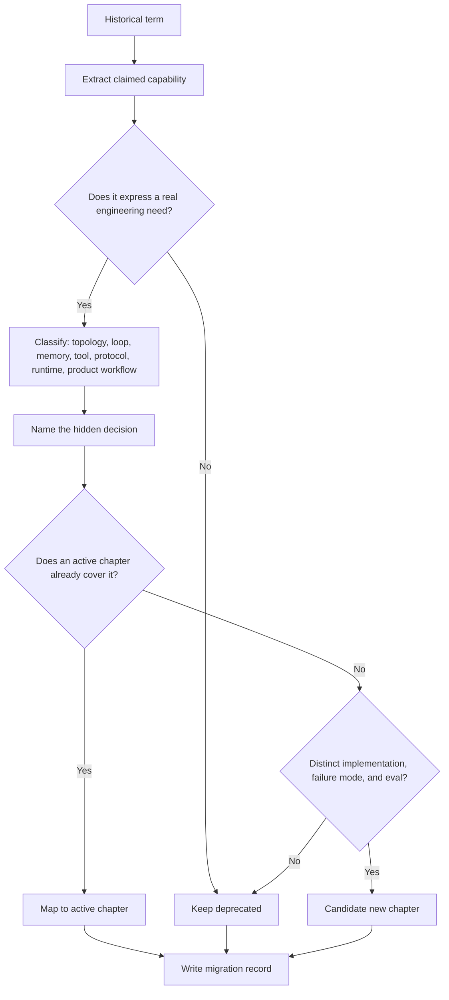

# Patrones Obsoletos / Históricos

Los patrones obsoletos se conservan en el repositorio pero se eliminan del camino de aprendizaje activo.

Son especulativos, demasiado amplios, duplicados por capítulos más sólidos, o actualmente demasiado superficiales para sostenerse como patrones activos.

Usa esta página como guía de traducción. Los términos antiguos de agent todavía aparecen en publicaciones, presentaciones de proveedores y prototipos tempranos. El libro activo conserva las ideas útiles pero las mueve a capítulos con límites más claros, código y verificaciones de producción.

Descarga la hoja de trabajo reutilizable: [historical pattern migration record](/capstone-assets/templates/historical-pattern-migration-record.txt).

## Por Qué Existe Esta Sección

Los términos históricos no son inútiles. A menudo señalan necesidades reales: coordinación, memory, acceso a tools, delegación o adaptación. El problema es que muchas etiquetas antiguas nombran una aspiración en lugar de un diseño.

Un libro en línea debe ayudar a los lectores a traducir esa aspiración en algo comprobable. Trata esta sección como un glosario con criterio:

- conserva la idea útil;
- rechaza la etiqueta vaga;
- mapea la idea al capítulo actual que da límites, código, evals y verificaciones de producción.

No cites un término histórico como arquitectura por sí solo. Úsalo solo como pista de que detrás hay una decisión de diseño más precisa.

## Flujo de Decisión de Migración

Usa este flujo cuando un término antiguo aparezca en un roadmap, revisión de diseño o comparación de proveedores. El objetivo no es preservar la etiqueta; el objetivo es recuperar la decisión de ingeniería detrás de ella.



## Mapa de Migración

| Término Histórico | Por Qué Se Obsoletó | Leer En Su Lugar |
| --- | --- | --- |
| Agent Marketplace | Demasiado especulativo sin protocolo, confianza, precios, permisos y controles de calidad. | [A2A Agent Interoperability](../tools-skills-protocols/a2a-agent-interoperability), [MCP-first Tool Use](../tools-skills-protocols/mcp-first-tool-use), [Choosing Multi-Agent Topology](../multi-agent-systems/choosing-multi-agent-topology) |
| Agent Swarm | El término oculta la topología real y suele implicar coordinación incontrolada. | [Parallel Agents](../multi-agent-systems/parallel-agents), [Choosing Multi-Agent Topology](../multi-agent-systems/choosing-multi-agent-topology), [Resource-Aware Agent Design](../pattern-selection/resource-aware-agent-design) |
| Hybrid Agent | Demasiado amplio; casi todo sistema útil combina llamadas a model, tools, retrieval y software. | [Agentic System Architecture](../systems-architecture/agentic-system-architecture), [Reference Architecture](../systems-architecture/reference-architecture) |
| Meta-Cognitive Agent | Las ideas útiles pertenecen a ciclos concretos de reflexión, evaluación y mejora. | [Reflection](../control-loops/reflection), [Evaluator-Optimizer](../control-loops/evaluator-optimizer), [Self-Improvement](../control-loops/self-improvement) |
| Recursive Agent | La recursión es una técnica de implementación, no un patrón de producción por sí mismo. | [Planning and Execution](../control-loops/planning-and-execution), [Goals and State](../foundations/goals-and-state), [Task Delegation](../multi-agent-systems/task-delegation) |
| Distributed Agent | Demasiado vago comparado con protocolos explícitos, workflows y límites de propiedad. | [A2A Agent Interoperability](../tools-skills-protocols/a2a-agent-interoperability), [Durable Workflows](../production-runtime/durable-workflows), [Reference Architecture](../systems-architecture/reference-architecture) |
| API Integration Copilot | Mejor tratado como ejemplo aplicado de uso de tools y workflow. | [Tool Capability Design](../tools-skills-protocols/tool-capability-design), [MCP-first Tool Use](../tools-skills-protocols/mcp-first-tool-use), [Human Approval Gates](../tools-skills-protocols/human-approval-gates) |
| Data Pipeline Orchestrator Agent | Mejor enseñado mediante durable workflows, state, reintentos y observability. | [Durable Workflows](../production-runtime/durable-workflows), [Observability and Evals](../production-runtime/observability-and-evals), [Deployment Walkthrough](../production-runtime/deployment-walkthrough) |
| Multi-Modal Tool-Using Agent | Archivado hasta que el repositorio tenga una implementación multimodal desarrollada y un eval suite. | [Tool Capability Design](../tools-skills-protocols/tool-capability-design), [Production Evaluation Feedback Loops](../production-runtime/production-evaluation-feedback-loops) |

## Traducciones Trabajadas

Usa estos ejemplos cuando una revisión de diseño comience con un término antiguo.

| Afirmación | Mejor Traducción | Pregunta de Diseño | Evidencia Actual Necesaria |
| --- | --- | --- | --- |
| "Necesitamos un agent swarm para investigación." | Ejecuta agents especialistas en paralelo solo si el trabajo independiente puede fusionarse de forma segura. | ¿Qué puede ejecutarse de forma independiente, quién fusiona los resultados y cómo se resuelven los conflictos? | Parallel trace, merge rubric, cost budget y disagreement eval. |
| "Necesitamos un recursive agent para planificación." | Usa planificación acotada con profundidad explícita, razones de detención y validación del plan. | ¿Cuál es la profundidad máxima de planificación y qué rechaza un mal plan? | Plan schema, stop condition, invalid-plan tests y replay trace. |
| "Necesitamos una arquitectura de distributed agent." | Separa servicios, colas, workflow state, gateways de tools y mensajes agent-to-agent. | ¿Qué componente posee state, policy, retry y aceptación final? | Service diagram, durable workflow record, A2A envelope y runbook. |
| "Necesitamos un meta-cognitive agent." | Agrega un evaluator o paso de reflexión solo donde mejore resultados medibles. | ¿Qué revisa el revisor que la primera pasada no puede revisar? | Rubric, before/after eval, stop rule y regression case. |
| "Necesitamos un API copilot." | Construye un workflow enfocado en uso de tools con llamadas a API con permisos y aprobación humana para acciones riesgosas. | ¿Qué acción de API puede ejecutarse sin un humano y cuál debe ser aprobada? | Tool manifest, approval record, auth test y audit log. |

La traducción debe hacer que el sistema sea menos místico y más fácil de revisar. Si la versión más clara suena ordinaria, normalmente es buena señal.

## Categorías de Reemplazo

La mayoría de los términos obsoletos se asignan a una de cinco categorías de diseño actuales.

| El Lenguaje Antiguo Usualmente Significa | Categoría Actual | Comienza Aquí |
| --- | --- | --- |
| "Swarm", "society", "collective", "crew" | Multi-agent topology | [Choosing Multi-Agent Topology](../multi-agent-systems/choosing-multi-agent-topology) |
| "Recursive", "self-planning", "autonomous loop" | Control loop | [Planning and Execution](../control-loops/planning-and-execution) |
| "Meta-cognitive", "self-critiquing", "self-improving" | Evaluation loop | [Reflection](../control-loops/reflection), [Evaluator-Optimizer](../control-loops/evaluator-optimizer) |
| "Distributed", "marketplace", "agent network" | Protocol and service boundary | [A2A Agent Interoperability](../tools-skills-protocols/a2a-agent-interoperability), [Agents As Services](../systems-architecture/agents-as-services) |
| "Copilot", "orchestrator", "assistant for X" | Product workflow with tool permissions | [Tool Capability Design](../tools-skills-protocols/tool-capability-design), [Human Approval Gates](../tools-skills-protocols/human-approval-gates) |

Si un término no encaja en una categoría, divídelo hasta que lo haga. Un término que mezcle topology, memory, tools, policy y UX debe convertirse en varias decisiones de diseño, no en un solo pattern.

## Tarjeta de Puntuación para Triage de Términos Legados

Usa esta tarjeta antes de agregar un término antiguo a un roadmap, slide o documento de arquitectura. Una puntuación baja significa que el término debe seguir deprecado. Una puntuación media indica que la idea debe mapearse a un capítulo existente. Una puntuación alta significa que el término podría merecer trabajo de pattern nuevo.

| Criterio | 0 Puntos | 1 Punto | 2 Puntos |
| --- | --- | --- | --- |
| Intent | aspiración vaga | necesidad clara de usuario o sistema | necesidad distinta no cubierta en otro lugar |
| Boundary | sin owner ni state boundary | owner o boundary parcial | owner explícito, state, tools, policy y aceptación |
| Implementation | solo demo o solo descripción | una implementación plausible | implementación ejecutable con contratos |
| Failure modes | no nombrados | riesgos genéricos | fallas específicas y casos a evitar |
| Evaluation | sin eval | ejemplos informales | evals repetibles y casos negativos |
| Operations | sin historia de producción | logging parcial o runbook | observability, rollback, presupuesto y ruta de incidentes |

Interpreta la puntuación:

- 0-4: mantener deprecado.
- 5-8: mapear a capítulos existentes.
- 9-12: candidato a nuevo capítulo, pero solo después de que existan código y evals.

Esta tarjeta protege el libro de la inflación de vocabulario. Un término se gana su lugar en el camino activo al hacer más claras las decisiones de ingeniería.

## Cómo Leer Literatura Antigua de Agent

Cuando un artículo antiguo usa uno de estos términos, tradúcelo en preguntas de producción:

1. ¿Qué topología quiere decir realmente el autor?
2. ¿Quién es owner de state, tools, policy, memory y aceptación final?
3. ¿Qué paso es software determinista y cuál es juicio del model?
4. ¿Qué evidencia, trace o eval probaría que el pattern funciona?
5. ¿Qué capítulo actual enseña la misma idea con un boundary más claro?

Esto mantiene útil el lenguaje antiguo sin dejar que etiquetas vagas dirijan la arquitectura.

## Workflow de Revisión de Migración

Usa este workflow cuando un equipo trae un nombre de pattern antiguo a una revisión de arquitectura, roadmap o documento de diseño.

1. Clasifica el claim: topología, control loop, tool boundary, memory, knowledge, runtime, operations, product workflow o domain packaging.
2. Nombra la decisión oculta por la etiqueta: ownership, state, policy, evidencia, eval, observability, costo, latencia o aprobación humana.
3. Mapea el claim al capítulo actual más sólido.
4. Decide si el capítulo actual es suficiente.
5. Promueve un pattern nuevo solo si el término antiguo expone un intent, failure mode, forma de implementación y método de evaluación distintos.

La mayoría de los términos históricos fallan en el paso 2. Suenan arquitectónicos, pero no le dicen al lector qué construir, probar, observar o rechazar.

## No Promuevas Un Término Solo Porque

| Señal Débil | Por Qué No Es Suficiente |
| --- | --- |
| Aparece en presentaciones de vendors. | El lenguaje de marketing suele comprimir varias decisiones de ingeniería en una sola etiqueta vaga. |
| Tiene muchos resultados de búsqueda. | El vocabulario popular aún puede ser demasiado amplio para un capítulo del libro. |
| Existe un demo. | Un demo prueba posibilidad, no repetibilidad, boundaries ni aptitud para producción. |
| Mapea a varios capítulos. | Si mapea a todos lados, probablemente es un término de packaging y no un pattern. |
| Suena más avanzado que el capítulo de reemplazo. | Los mejores capítulos hacen la decisión más clara, no más ruidosa. |

## Registro de Migración

Usa este registro corto al traducir un término deprecado al libro activo.

```text
legacy_term:
source:
claimed_capability:
actual_decision_needed:
current_chapter:
ownership_boundary:
required_evidence:
promotion_decision: keep_deprecated | map_to_existing | candidate_new_chapter
reason:
```

El registro debe hacer la decisión auditable. Un lector debe poder ver por qué el término siguió deprecado, a dónde se movió la idea útil y qué evidencia cambiaría la decisión.

Descarga la versión completa: [historical pattern migration record](/capstone-assets/templates/historical-pattern-migration-record.txt).

### Ejemplo Completado

```text
legacy_term: Agent Swarm
source: internal roadmap proposal, Q3 platform planning
claimed_capability: many agents collaborate to research incidents faster than one analyst
actual_decision_needed: whether independent investigation branches can run in parallel and be merged safely
current_chapter: Multi-Agent Systems / Parallel Agents
ownership_boundary: orchestrator owns fan-out, analysts own scoped findings, aggregator owns merge, human incident lead owns final acceptance
required_evidence: parallel trace, merge rubric, cost budget, conflict-handling eval, escalation rule
promotion_decision: map_to_existing
reason: the useful idea is bounded parallel investigation; the swarm label hides merge policy, budget, and final ownership
```

Este es el estándar: el registro de migración debe reemplazar la etiqueta antigua con una decisión que otro ingeniero pueda revisar.

## Criterios de Promoción

Un pattern deprecado solo puede regresar al camino de aprendizaje activo cuando tiene:

- un intent claro que difiere de los capítulos existentes;
- una implementación de referencia ejecutable;
- un walkthrough concreto de código;
- casos de eval que prueben cuándo usarlo y cuándo evitarlo;
- guía de producción para state, policy, tools, observability y manejo de fallas;
- enlaces a plantillas o checklists que los lectores puedan reutilizar.

Sin esos artefactos, el término permanece aquí como vocabulario histórico.

## Valor Para El Lector

Este capítulo existe para reducir la confusión. Los lectores deben salir sabiendo qué capítulo moderno reemplaza cada término antiguo y por qué el libro evita nombres de patterns vagos.

Archivo fuente: [`deprecated`](https://github.com/GTuritto/Agentic-Systems-Patterns/tree/main/deprecated)
