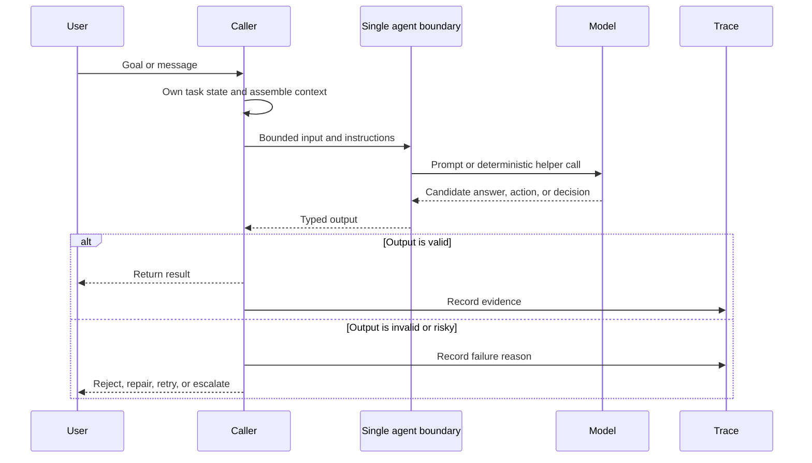

# Single Agent

Un single agent recibe un goal o mensaje, consulta su context y produce una respuesta o acción. Esta es la unidad útil más pequeña en el catálogo.

> Fuente y descargas
>
> - [Repository source](https://github.com/GTuritto/Agentic-Systems-Patterns/tree/main/single-agent-pattern)
> - [Download code bundle](/downloads/single-agent.zip)

## Propósito

Un single agent recibe un goal o mensaje, consulta su context y produce una respuesta o acción. Esta es la unidad útil más pequeña en el catálogo.

## Escenario

Un equipo de soporte quiere un pequeño asistente que reescriba notas internas en bruto en una respuesta orientada al cliente. La entrada contiene el resumen del ticket, un extracto de la policy y el tono deseado. La salida es un borrador de respuesta sin llamadas a tools, sin escrituras en memory y sin autoridad de pago.

Este es un buen baseline de single-agent porque la task tiene un solo worker, un paquete de context acotado y una salida tipada. El solicitante sigue siendo dueño del state del ticket, la versión de la policy, la escalación y el envío final. El agent solo es dueño del borrador.

```text
input:
  ticket_id: T-918
  customer_issue: "Package arrived two days late."
  policy_excerpt: "Late delivery may receive shipping-fee credit, not full refund."
  requested_output: "draft customer reply"

single_agent_allowed:
  - summarize issue
  - draft reply
  - explain policy-backed next step

single_agent_forbidden:
  - issue refund
  - update ticket status
  - send message to customer
  - remember customer preference
```

Si el equipo después necesita consulta de órdenes en vivo, recuperación de policy, aprobación o envío de mensajes, este pattern ha llegado a su límite. Mantén el single agent como el worker de redacción y coloca tools, state, aprobación y entrega en el workflow que lo rodea.

## Usar cuando

- Un solo worker respaldado por un model puede completar la task sin delegar.
- La interacción tiene un objetivo estrecho y una condición de éxito clara.
- Quieres el baseline más simple y útil antes de agregar tools, memory u orquestación.

## Evitar cuando

- La task necesita reintentos con state, aprobaciones externas, múltiples especialistas o evaluación independiente.
- El agent debe recuperarse de fallas prolongadas o reanudar después de una interrupción.

## Arquitectura



Usa esto como la arquitectura baseline. Si el sistema necesita reintentos durables, evaluación independiente, orquestación de tools o handoffs de especialistas, ya superó el patrón de single-agent.

## Forma del sistema

- **Límite del pattern:** una función, clase o servicio de agent con límite estrecho acepta input más context y retorna una respuesta, acción o decisión tipada.
- **Dueño del state:** el solicitante o un pequeño servicio de aplicación es dueño del task state hasta que se introduce un runtime pattern.
- **Artifact principal:** `single-agent-pattern/` contiene la implementación de referencia ejecutable y ejemplos.
- **Promesa operacional:** Un single agent recibe un goal o mensaje, consulta su context y produce una respuesta o acción. Esta es la unidad útil más pequeña en el catálogo.
- **Ruta ejecutable:** comienza con `npm run single-agent` antes de adaptar el pattern a un sistema mayor.

## Protocolo central

1. Acepta un input, goal o solicitud de task acotada.
2. Ensambla las instrucciones mínimas útiles, context, state y descripciones de tools.
3. Ejecuta el model o helper determinista detrás de un límite tipado.
4. Valida el resultado antes de devolverlo a usuarios, tools o state durable.
5. Registra suficiente evidencia para explicar la salida después.

## Notas de implementación

- Mantén explícito el límite del pattern: inputs, state, efectos secundarios y outputs deben ser visibles.
- Valida las decisiones producidas por el model antes de que afecten tools, usuarios o state durable.
- Emite suficiente trace data para depurar fallas después de la ejecución.

## Modos de falla

- El pattern se aplica donde un workflow determinista más simple sería mejor.
- State, llamadas a tools o decisiones del model no son lo suficientemente observables para depurar.
- El sistema carece de comportamiento claro de detención, reintento o escalación.

## Estrategia de evaluación

- Usa golden tasks que cubran solicitudes normales, solicitudes ambiguas, context faltante y input inválido.
- Verifica que los outputs coincidan con la forma esperada y que solicitudes inseguras o no soportadas sean rechazadas.
- Rastrea precisión, validez de schema, latencia, uso de tokens y calidad de rechazos.
- Incluye casos que prueben que cada condición de "Usar cuando" es verdadera para este pattern.
- Incluye casos negativos de "Evitar cuando" para que el sistema elija un pattern más simple o seguro cuando corresponda.

## Lista de verificación para producción

- Define el input, context, output y contrato de errores.
- Mantén prompts, schemas y descripciones de tools versionados.
- Agrega pruebas deterministas para el comportamiento útil más pequeño.
- Registra decisiones del model sin filtrar secretos ni datos privados de usuarios.
- Define escalación humana para trabajo ambiguo, de alto riesgo o bloqueado por policy.
- Mantén el source bundle, capítulo generado, pruebas y artifact de despliegue en la misma release.

## Ejecuta el ejemplo

```sh
npm run single-agent
```

## Recorrido del código

Lee el extracto como la expresión ejecutable más pequeña del pattern. El capítulo explica las restricciones de diseño; el código muestra dónde esas restricciones se convierten en interfaces concretas, state, validación o control de flujo.

## Código fuente

Estos extractos muestran la forma de la implementación. El código completo está disponible en el bundle de descarga y en el repository source.

### `single-agent-pattern/autogen_typescript_example/single_agent.ts`

[Open full source](https://github.com/GTuritto/Agentic-Systems-Patterns/blob/main/single-agent-pattern/autogen_typescript_example/single_agent.ts)

```ts
// Single Agent Pattern - Autogen TypeScript Example
// To run: npm install && npm run single-agent

import axios from 'axios';
import * as readline from 'readline';
import * as dotenv from 'dotenv';
dotenv.config();

const MISTRAL_API_URL = 'https://api.mistral.ai/v1/chat/completions';
const MISTRAL_API_KEY = process.env.MISTRAL_API_KEY;

async function singleAgent(userInput: string): Promise<string> {
  const response = await axios.post(
    MISTRAL_API_URL,
    {
      model: 'mistral-tiny', // or your preferred Mistral model
      messages: [{ role: 'user', content: userInput }],
    },
    {
      headers: {
        'Authorization': `Bearer ${MISTRAL_API_KEY}`,
        'Content-Type': 'application/json',
      },
    }
  );
  return response.data.choices[0].message.content;
}

async function main() {
  const idx = process.argv.indexOf('--input');
  const cliInput = idx !== -1 ? process.argv[idx + 1] : undefined;
  const nonInteractive = cliInput || process.env.NON_INTERACTIVE_INPUT;
  if (nonInteractive) {
    try {
      const agentResponse = await singleAgent(String(nonInteractive));
      console.log('Agent:', agentResponse);
    } catch (err) {
      console.error('Error:', err);
      process.exitCode = 1;
    }
    return;
  }

  const rl = readline.createInterface({ input: process.stdin, output: process.stdout });
  rl.question('User: ', async (userInput: string) => {
    try {
      const agentResponse = await singleAgent(userInput);
      console.log('Agent:', agentResponse);
    } catch (err) {
      console.error('Error:', err);
    }
    rl.close();
  });
}

main();

// duplicate block removed
```

### `single-agent-pattern/langgraph_python_example/single_agent.py`

[Open full source](https://github.com/GTuritto/Agentic-Systems-Patterns/blob/main/single-agent-pattern/langgraph_python_example/single_agent.py)

```py
# Single Agent Pattern - LangGraph Python Example

Este ejemplo demuestra el Single Agent Pattern usando LangGraph y Python. El agent recibe un mensaje de usuario, lo envía a un Mistral LLM y retorna la respuesta.

## Requisitos

- Python 3.8+
- Biblioteca `langgraph`
- `python-dotenv` (para soporte de .env)
- Acceso a la API de Mistral LLM

## Instalar dependencias

``​`bash
pip install langgraph python-dotenv requests
``​`

## Código de ejemplo

``​`python
import os
from langgraph import Agent, Environment, LLM
from dotenv import load_dotenv

load_dotenv()

MISTRAL_API_KEY = os.getenv("MISTRAL_API_KEY")
MISTRAL_API_URL = "https://api.mistral.ai/v1/chat/completions"

class SimpleEnvironment(Environment):
    def get_observation(self):
        return input("User: ")
    def send_action(self, action):
        print(f"Agent: {action}")

class SingleAgent(Agent):
    def __init__(self, llm):
        self.llm = llm
    def act(self, observation):
        return self.llm.complete(observation)

llm = LLM(
    provider="mistral",
    api_key=MISTRAL_API_KEY,
    api_url=MISTRAL_API_URL,
)

env = SimpleEnvironment()
agent = SingleAgent(llm)

observation = env.get_observation()
action = agent.act(observation)
env.send_action(action)
``​`

---

- Asegúrate de que tu archivo `.env` contenga tu clave de API de Mistral como `MISTRAL_API_KEY`.
- Este es un ejemplo funcional y mínimo.
```

## Descarga

- [Descargar paquete fuente](/downloads/single-agent.zip)
- [Abrir carpeta fuente](https://github.com/GTuritto/Agentic-Systems-Patterns/tree/main/single-agent-pattern)

El paquete de descarga contiene la carpeta `single-agent-pattern/` actual de este repositorio.

## Patrones relacionados

- [Agent Loop](/foundations/agent-loop)
- [Goals and State](/foundations/goals-and-state)
- [Tool Use](/foundations/tool-use)
- [Choosing the Right Pattern](/pattern-selection/choosing-the-right-pattern)
- [Resource-Aware Agent Design](/pattern-selection/resource-aware-agent-design)
