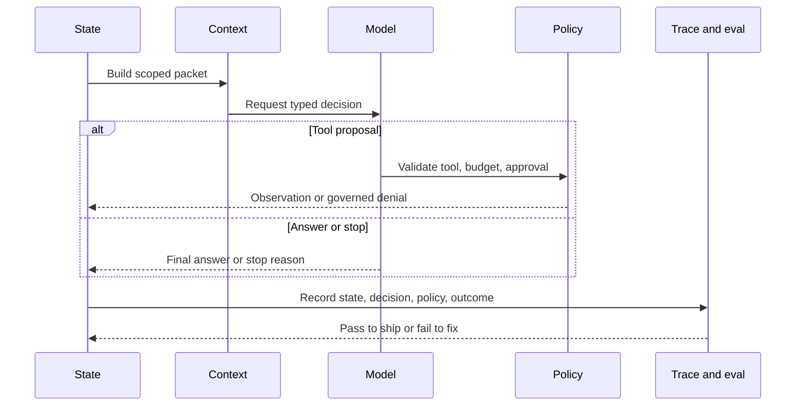

# From-Scratch Mini-Framework Track

Esta ruta construye un agent runtime educativo y pequeño desde los primeros principios. No es un reemplazo para LangGraph, Mastra AI, sistemas tipo AutoGen, CrewAI ni motores de workflow para producción. Es una forma de entender los primitivos que esos sistemas empaquetan.

Descarga la [hoja de trabajo de finalización del laboratorio](/capstone-assets/templates/lab-completion-worksheet.txt) y la [hoja de trabajo de preparación para producción](/capstone-assets/templates/lab-production-readiness-worksheet.txt) antes de comenzar la ruta.

Comienza con [Building a Minimal Agent Runtime](../agent-engineering-practice/building-a-minimal-agent-runtime) para la teoría. Luego usa estos laboratorios si quieres implementar los primitivos por tu cuenta.

La implementación mantenida en TypeScript está en `minimal-agent-runtime/typescript`. Úsala como solución de referencia mientras implementas tu propia versión pequeña en TypeScript o Python.

```sh
npm run mini-runtime
npm run mini-runtime:test
```

## Qué construyes

| Lab | Componente | Lección principal |
| --- | --- | --- |
| [Lab 09 - Minimal Agent Loop](./lab-09-minimal-agent-loop.md) | State, decisiones, loop, razones de detención | Un agent es un loop controlado, no un prompt. |
| [Lab 10 - Tool Registry and Policy Gate](./lab-10-tool-registry-and-policy-gate.md) | Tools, policy, resultados que requieren aprobación | La ejecución de tools es un límite de software. |
| [Lab 11 - Context, Memory, Trace, and Evals](./lab-11-context-memory-trace-evals.md) | Context packets, memory con alcance, trace events, trajectory evals | El comportamiento del runtime debe ser inspeccionable y testeable. |

## Contrato de aprendizaje

Al finalizar la ruta, deberías poder explicar:

- qué posee el loop;
- qué pertenece al state;
- por qué las decisiones del model son propuestas;
- cómo los tools se convierten en capabilities específicas;
- por qué el policy es independiente de los prompts;
- cómo se ensamblan los context packets;
- qué debe registrar un trace;
- por qué los trajectory evals detectan fallas que los final-answer evals no ven.

## Elección de implementación

Los laboratorios están escritos para que puedas implementar el runtime en TypeScript o Python. Usa TypeScript si quieres discriminated unions fuertes y un camino directo a los ejemplos existentes del repositorio. Usa Python si prefieres una implementación compacta para enseñanza antes de mapear las ideas a LangGraph o CrewAI.

Mantén la implementación pequeña. El objetivo no es un framework de propósito general. El objetivo es un runtime que puedas entender en una sola sesión.

La referencia en TypeScript es intencionalmente libre de dependencias. La versión en Python debe preservar los mismos contratos: las decisiones son propuestas tipadas, el policy corre antes de la ejecución, los traces registran el camino y los evals inspeccionan la trayectoria.

Usa este modelo para conectar los tres laboratorios. El mini-runtime es valioso porque cada paso tiene un responsable: el state mantiene la ejecución, el context delimita lo que ve el model, el policy controla la acción, el trace registra el comportamiento y los evals juzgan la trayectoria.



## Track Review Gate

Antes de considerar la ruta como completa, verifica los primitivos del runtime:

| Check | Evidencia |
| --- | --- |
| Existe control del loop | El runtime tiene state, decisiones, observaciones, presupuestos y razones de detención. |
| Los tools están gobernados | Se prueban búsquedas de tools, decisiones de policy, resultados que requieren aprobación y rechazos por tools desconocidos. |
| El context es explícito | Los context packets y lecturas de memory tienen alcance definido en vez de estar ocultos en el texto del prompt. |
| El trace es revisable | Las ejecuciones emiten eventos que explican decisiones, llamadas a tools, resultados de policy y estado final. |
| Los evals inspeccionan la trayectoria | Las pruebas pueden fallar caminos inseguros incluso si el texto final parece plausible. |

Registra los comandos, salidas, caminos de falla probados y brechas de producción en la hoja de trabajo de finalización del laboratorio.

## Puente a producción

Usa esta tabla al comparar tu mini-runtime con un framework real:

| Mini-Runtime Primitive | Pregunta para runtime de producción |
| --- | --- |
| Loop state | ¿Dónde se persiste, migra, reanuda y elimina el state? |
| Tool registry | ¿Cómo se versionan, autorizan, deshabilitan y auditan los tools? |
| Policy gate | ¿Puede el policy detener retrieval, escrituras en memory, tools y respuestas finales antes de la ejecución? |
| Trace events | ¿Pueden los operadores reconstruir una ejecución fallida sin secretos sin procesar? |
| Trajectory evals | ¿Qué evals bloquean cambios en prompt, model, tool, policy, memory y workflow? |

La ruta tiene éxito cuando mejora el juicio sobre frameworks. Falla si tienta al equipo a lanzar un framework sin operación.

## Advertencia de producción

No lances este mini-runtime como plataforma de producción sin agregar ejecución durable, persistencia, autenticación, autorización, concurrencia, despliegue, integraciones de observability, control de reintentos y respuesta a incidentes.

La pregunta correcta para producción no es "¿podemos construir nuestro propio framework?" sino "ahora que entendemos los primitivos, ¿qué framework o runtime nos da los controles que necesitamos?"

## Comparación con frameworks

Después de los laboratorios, compara cada primitivo con frameworks maduros:

- LangGraph: graph state, nodos, edges, checkpoints e interrupts.
- Mastra AI: agents, tools, workflows, memory, evals y runtime packaging.
- Sistemas tipo AutoGen: roles de manager/worker, mensajes y ejecución de funciones.
- CrewAI: flows, crews, tasks, roles y asignación de tools.
- MCP y A2A: límites de protocolo para tools y llamadas agent-to-agent.

## Capítulos relacionados

- [Building a Minimal Agent Runtime](../agent-engineering-practice/building-a-minimal-agent-runtime)
- [Agent Harnesses](../agent-engineering-practice/agent-harnesses)
- [Tool Capability Design](../tools-skills-protocols/tool-capability-design)
- [Observability and Evals](../production-runtime/observability-and-evals)
