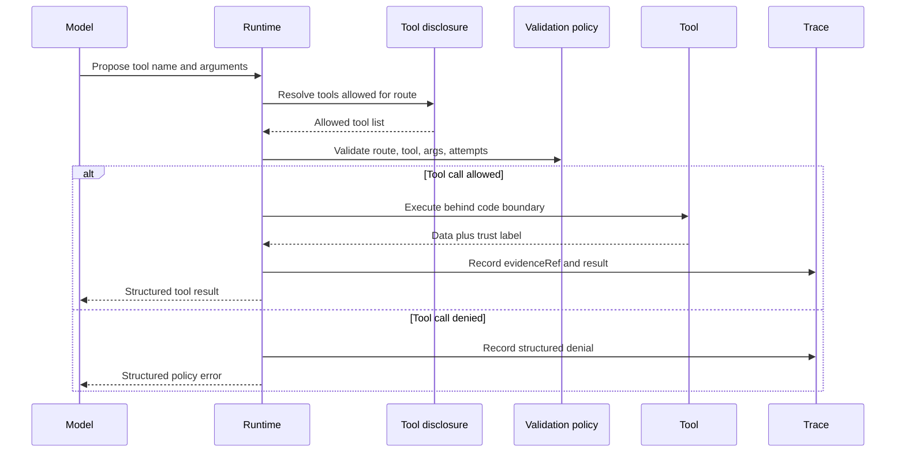

# Lab 01 - Construye un Agent que Usa Tools

Descarga la [hoja de trabajo de finalización del laboratorio](/capstone-assets/templates/lab-completion-worksheet.txt) y la [hoja de trabajo de preparación para producción](/capstone-assets/templates/lab-production-readiness-worksheet.txt) antes de comenzar.

## Objetivo

Construye el límite de tool más pequeño y útil: un runtime recibe una propuesta de uso de tool, valida la ruta y los argumentos, ejecuta el tool detrás del código, marca outputs confiables y no confiables, y retorna un resultado estructurado.

## Qué Vas a Usar

- Lenguaje: TypeScript
- Framework/runtime: runtime personalizado mínimo con un ejemplo de ruta estilo AutoGen
- Lección agnóstica de framework: el model puede proponer el uso de tools, pero el software es responsable de la validación, ejecución y manejo de errores.
- Capítulo de pattern: [Tool Use](/foundations/tool-use)
- Carpeta fuente: [`tool-using-agent-pattern/`](https://github.com/GTuritto/Agentic-Systems-Patterns/tree/main/tool-using-agent-pattern)
- Descarga: [tool-use.zip](/downloads/tool-use.zip)
- Archivo principal: `tool-using-agent-pattern/typescript/src/tool_runtime.ts`
- Archivo demo: `tool-using-agent-pattern/typescript/src/run_demo.ts`

## Presupuesto de Tiempo del Ejercicio

Estas estimaciones asumen que las dependencias ya están instaladas.

| Ejercicio | Tiempo | Output |
| --- | ---: | --- |
| Configuración y ejecución base | 5 min | Output del comando tool-runtime exitoso. |
| Inspecciona el límite del tool | 8 min | Notas sobre validación de rutas, datos confiables y texto de policy no confiable. |
| Cambia una ruta o caso de tool | 8-10 min | Un éxito visible, denegación o error controlado. |
| Revisa la brecha de producción | 5-7 min | Un control faltante para llevar a la hoja de preparación. |

## Configuración

Desde la raíz del repositorio:

```sh
npm install
```

Este laboratorio se ejecuta sin una key de model. Ejercita el tool runtime directamente para que puedas inspeccionar el límite de software antes de agregar propuestas del model.

## Ejecútalo

```sh
npm run tool-using-agent
```

Output esperado:

```json
{
  "order": {
    "status": "ok",
    "tool": "read_order",
    "trust": "trusted_system"
  },
  "policy": {
    "status": "ok",
    "tool": "search_refund_policy",
    "trust": "untrusted_content"
  }
}
```

El output real también incluye datos del tool y valores de `evidenceRef`. Registra esos campos en la hoja de finalización del laboratorio.

## Inspecciona el Código

Abre `tool-using-agent-pattern/typescript/src/tool_runtime.ts` y encuentra:

- `ToolName`: los nombres de tools expuestos.
- `ToolContext`: el context de runtime para ruta, aprobaciones, timeouts e intentos.
- `disclosedTools(route)`: el límite de disclosure de tools basado en rutas.
- `validateProposal(proposal, context)`: el límite de validación.
- `execute(proposal, context)`: el límite de ejecución.

Luego abre `tool-using-agent-pattern/typescript/src/run_demo.ts` y encuentra las dos propuestas demo: `read_order` y `search_refund_policy`.

El punto de diseño importante es que un model puede proponer una llamada a un tool, pero el código es responsable de disclosure, validación, ejecución, marcado de confianza y referencias de evidencia.

## Cambia Una Cosa

Cambia la ruta en `run_demo.ts` de:

```ts
route: "refund_investigation",
```

a:

```ts
route: "order_status",
```

Ejecuta el laboratorio de nuevo.

## Resultado Esperado

La llamada `read_order` aún debe tener éxito porque `order_status` puede usar ese tool. La llamada `search_refund_policy` debe ser denegada porque esa ruta solo expone `read_order`.

Registra la denegación como el camino de falla intencional. Esto prueba que la disponibilidad de tools depende de la ruta, no de lo que el model solicita.

Usa este flujo como el modelo de aceptación para el laboratorio. El model propone una llamada, pero el runtime es responsable de disclosure, validación, ejecución, marcado de confianza y evidencia de trace.



## Puerta de Revisión del Lab

Antes de continuar, verifica el límite en vez de solo revisar el camino feliz:

| Revisión | Evidencia |
| --- | --- |
| El disclosure de tools es limitado | `order_status` expone `read_order`; `refund_investigation` expone tools de refund-investigation. |
| La ejecución de tools es propiedad del código | `ToolRuntime` ejecuta `read_order` y `search_refund_policy`; el texto del model no. |
| El uso inválido de ruta/tool está controlado | Un tool oculto o no permitido retorna una denegación estructurada. |
| La confianza es explícita | Los datos de order son `trusted_system`; el texto de policy es `untrusted_content`. |
| La evidencia es rastreable | Los resultados exitosos de tools incluyen `evidenceRef`. |
| La brecha de producción es visible | El laboratorio nombra la integración de autorización faltante, exportación de traces, dashboards, despliegue y manejo de incidentes. |

Registra el comando, output y comportamiento de falla en la hoja de finalización del laboratorio.

## Extensión a Producción

Reemplaza el enrutamiento por prefijo con una solicitud de tool tipada:

- nombre del tool
- JSON schema para argumentos
- verificación de autorización
- timeout
- resultado estructurado de éxito o error
- trace ID para la ejecución

No le des al model acceso amplio a funciones arbitrarias. Expón tools limitados con permisos explícitos.

## Puente a Producción

Usa esta tabla al adaptar el laboratorio a un tool real de producto:

| Concepto del Lab | Versión de Producción |
| --- | --- |
| Unión `ToolName` | Manifest de tools versionado con owner, permiso, timeout y clase de side-effect. |
| `disclosedTools(route)` | Disclosure de tools basado en ruta, actor, tenant y riesgo. |
| `validateProposal(...)` | Validación de schema, policy, aprobación, presupuesto y state. |
| Campo `trust` | Clasificación de datos que separa datos confiables del sistema de contenido no confiable. |
| `evidenceRef` | Referencia de evidencia ligada a trace para auditoría, replay y evals. |
| Output de consola demo | Respuesta estructurada más evento de trace, registro de eval y señal de dashboard. |

El primer hito de producción no es agregar más tools. Es probar que un tool puede ser llamado, denegado, rastreado y probado de forma segura.

## Mapeo Entre Frameworks

- En LangGraph, este límite usualmente aparece como un nodo de tool o callable ligado al state del graph.
- En Mastra AI, se mapea a un tool tipado expuesto a través de un agent o workflow.
- En sistemas estilo AutoGen, se mapea a una llamada de función/tool propuesta por un assistant y ejecutada por el runtime.
- En CrewAI, se mapea a tools asignados a un rol de agent, con el flujo o configuración de crew limitando el acceso.

## Capítulos Relacionados

- [MCP-first Tool Use](/tools-skills-protocols/mcp-first-tool-use)
- [Human Approval Gates](/tools-skills-protocols/human-approval-gates)
- [Policy Enforcement](/production-runtime/policy-enforcement)
