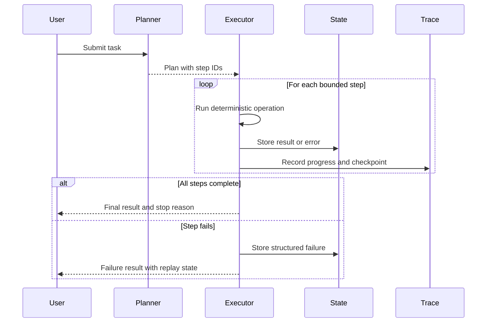
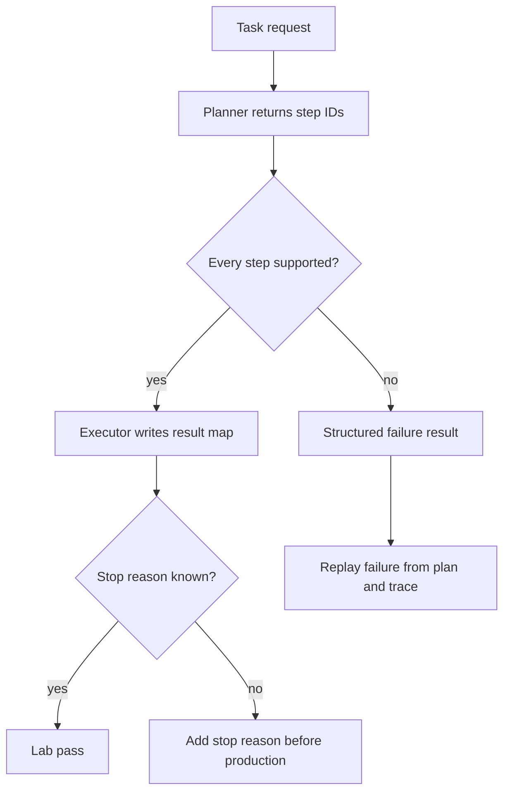

# Lab 02 - Construye un Agent Loop con Planning

Descarga la [hoja de ejercicios guiados del planning loop de Lab 02](/capstone-assets/templates/lab-02-planning-loop-guided-exercise.txt), la [hoja de finalización del laboratorio](/capstone-assets/templates/lab-completion-worksheet.txt) y la [hoja de preparación para producción del laboratorio](/capstone-assets/templates/lab-production-readiness-worksheet.txt) antes de comenzar.

## Objetivo

Separa el planning de la ejecución. El planner decide los pasos; el executor ejecuta operaciones acotadas y registra los resultados. Esto te da la estructura de control detrás de muchos agent loops sin hacer que cada paso sea autónomo.

## Qué Vas a Usar

- Lenguaje: TypeScript, con un espejo en Python
- Framework/runtime: planner y executor neutrales al framework
- Lección agnóstica al framework: el planning y la ejecución son responsabilidades separadas incluso cuando un framework las empaqueta juntas.
- Capítulos de patterns: [Agent Loop](/foundations/agent-loop), [Planning and Execution](/control-loops/planning-and-execution)
- Carpeta de código fuente: [`planning-pattern/`](https://github.com/GTuritto/Agentic-Systems-Patterns/tree/main/planning-pattern)
- Descarga: [planning-and-execution.zip](/downloads/planning-and-execution.zip)
- Archivos principales:
  - `planning-pattern/typescript/src/planner.ts`
  - `planning-pattern/typescript/src/executor.ts`
  - `planning-pattern/typescript/src/run.ts`

## Tiempo Estimado del Ejercicio

Estas estimaciones asumen que las dependencias ya están instaladas.

| Ejercicio | Tiempo | Output |
| --- | ---: | --- |
| Configuración y prueba base | 5-8 min | Output de prueba passing del planner/executor. |
| Ejecutar el plan base y trazar | 10-12 min | Pasos del plan, result map y señal de stop. |
| Cambiar input e inspeccionar fallos | 10-15 min | Evidencia del input cambiado más comportamiento de input no soportado o faltante. |
| Escribir la regla de stop-condition | 10-15 min | Una razón de stop visible para el caller y nota de manejo en producción. |
| Completar la revisión final | 5 min | Notas en la hoja sobre el límite de ejecución y gap de producción. |

## Configuración

Desde la raíz del repositorio:

```sh
npm install
```

## Ejecútalo

Ejecuta la prueba determinista:

```sh
npm run plan:test
```

Ejecuta el path de CLI:

```sh
npm run plan:run -- "Compute average of [1,2,3,4]"
```

Ejecuta el espejo en Python:

```sh
npm run plan:py
```

## Inspecciona el Código

Abre `planning-pattern/typescript/src/planner.ts` e inspecciona cómo un task se convierte en una lista de pasos. Luego abre `planning-pattern/typescript/src/executor.ts` e inspecciona cómo la ejecución convierte esos pasos en resultados nombrados.

Busca estos límites:

- el objeto plan
- step IDs
- funciones executor deterministas
- result map
- failure surface

## Cambia Una Cosa

Cambia el texto del task:

```sh
npm run plan:run -- "Compute average of [10,20,30]"
```

Luego inspecciona si el fallback determinista sigue produciendo la forma esperada del plan.

## Resultado Esperado

La prueba debe imprimir:

```text
Planning test OK
```

El CLI debe imprimir un plan, eventos de progreso y un resultado calculado:

```text
Plan: {
  steps: [
    { id: 's1', description: 'Load numbers [1,2,3,4]' },
    { id: 's2', description: 'Compute average' }
  ],
  rationale: 'synthetic'
}
Progress 0 s1
Progress 50 s2
Progress 100 done
Results: { s1: [ 1, 2, 3, 4 ], s2: 2.5 }
```

Después de cambiar el task a `[10,20,30]`, el resultado debe ser:

```text
Results: { s1: [ 10, 20, 30 ], s2: 20 }
```

Si extiendes el planner, mantén el executor determinista y testeable.

Usa este flujo como modelo de aceptación para el laboratorio. El planner puede elegir los pasos, pero la ejecución sigue siendo acotada, trazable y reproducible.



## Ejercicios Guiados

Usa estos ejercicios para convertir el happy path en un loop trace revisable.

| Ejercicio | Tiempo | Qué Hacer | Evidencia a Guardar |
| --- | ---: | --- | --- |
| Plan base y trace | 10 min | Ejecuta `npm run plan:test` y el comando CLI para `[1,2,3,4]`. | Pasos del plan, eventos de progreso, result map y señal de stop. |
| Trace con cambio de input | 8 min | Ejecuta el comando CLI para `[10,20,30]`. | El input cambiado `s1` y el average cambiado `s2`. |
| Trace de paso no soportado | 8 min | Inspecciona los casos negativos en `planning-pattern/typescript/test/planning.spec.ts`. | Un failure estructurado `unsupported_step` en vez de `null`. |
| Trace de input faltante | 8 min | Inspecciona el caso de prueba que ejecuta `Compute average` sin cargar números primero. | Un failure estructurado `missing_numbers`. |
| Regla de stop en producción | 10 min | Escribe la razón de stop que expondrías al caller. | `success`, `unsupported_step`, `missing_numbers` o `budget_exhausted`. |



## Ejercicio de Stop-Condition

El executor ahora retorna un objeto de failure para trabajo no soportado o mal formado. Usa esto como modelo para condiciones de stop en producción:

```ts
await executePlan([
  { id: "s9", description: "Send refund directly" }
]);
```

Evidencia esperada:

```json
{
  "s9": {
    "status": "failed",
    "error_type": "unsupported_step",
    "step_id": "s9",
    "description": "Send refund directly"
  }
}
```

Este failure es valioso porque es reproducible. Un loop en producción nunca debe hacer que el revisor infiera si un plan se detuvo porque terminó, falló la validación, agotó el presupuesto o chocó con policy.

## Revisión Final del Lab

Antes de continuar, verifica el control loop:

| Check | Evidencia |
| --- | --- |
| El planning está separado de la ejecución | `planner.ts` produce pasos; `executor.ts` ejecuta operaciones acotadas. |
| Los pasos son identificables | Cada paso puede ser nombrado, trazado y conectado a un resultado. |
| El executor se mantiene determinista | El mismo plan soportado produce el mismo resultado. |
| El failure tiene una superficie | Tasks no soportados o mal formados pueden retornar un failure estructurado. |
| La condición de stop es explícita | El lab puede explicar por qué terminó la ejecución. |

Registra la forma del plan, el result map y un failure path en la hoja de finalización del laboratorio.

## Extensión para Producción

Agrega controles de loop antes de usar este pattern en producción:

- máximo de pasos
- máximo de reintentos
- razón de stop
- checkpoint después de cada paso
- resultado de error estructurado
- revisión humana para pasos de alto riesgo

El planning solo es útil cuando la ejecución es acotada e inspeccionable.

## Puente a Producción

Usa esta tabla al adaptar el laboratorio a un workflow de producto:

| Concepto del Lab | Versión en Producción |
| --- | --- |
| Plan object | Plan schema versionado con owner y risk class. |
| Step IDs | Step IDs del workflow con trace spans y retry policy. |
| Result map | State durable con checkpoint, status y error class. |
| Deterministic executor | Tool o workflow node con timeout, idempotency y policy gate. |
| CLI run | Request envelope con actor, tenant, budget, trace ID y stop reason. |

El primer hito en producción es un plan reproducible. Si un failure no puede reproducirse desde el state y trace, el loop sigue siendo solo un demo.

## Mapeo Entre Frameworks

- En LangGraph, el planning y la ejecución pueden ser nodos separados conectados por un graph state compartido.
- En Mastra AI, la misma separación puede aparecer como un workflow que coordina pasos de agent y tool.
- En sistemas estilo AutoGen, un manager agent puede proponer un plan mientras funciones executor realizan trabajo acotado.
- En CrewAI, un flow puede poseer la secuencia mientras crews o agents manejan tasks delegados.

## Capítulos Relacionados

- [Goals and State](/foundations/goals-and-state)
- [Self-Healing Workflows](/control-loops/self-healing-workflows)
- [Durable Workflows](/production-runtime/durable-workflows)
