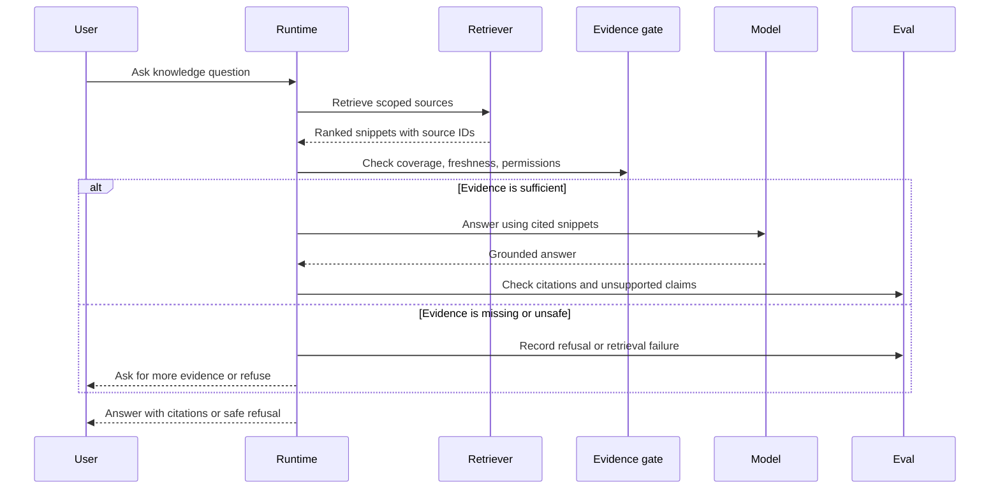

# Lab 03 - Construye Agentic RAG

Descarga la [hoja de ejercicios guiados de Lab 03 Agentic RAG](/capstone-assets/templates/lab-03-agentic-rag-guided-exercise.txt), la [hoja de entrega del laboratorio](/capstone-assets/templates/lab-completion-worksheet.txt) y la [hoja de preparación para producción del laboratorio](/capstone-assets/templates/lab-production-readiness-worksheet.txt) antes de comenzar.

## Objetivo

Construye el límite de retrieval detrás de un sistema Agentic RAG: recupera evidencia delimitada, inyéctala en el context, responde a partir de esa evidencia y rechaza o escala cuando la evidencia no es suficiente.

## Qué Vas a Usar

- Lenguaje: Python
- Framework/runtime: stack de retrieval estilo LangChain/LangGraph con FAISS y embeddings de Hugging Face
- Lección agnóstica de framework: retrieval produce evidencia delimitada; la generación debe mantenerse basada en esa evidencia.
- Capítulos de patrones: [Semantic Recall and RAG](/memory-knowledge/semantic-recall-rag), [Agentic RAG Systems](/systems-architecture/agentic-rag-systems)
- Carpeta fuente: [`context-engineering-pattern/`](https://github.com/GTuritto/Agentic-Systems-Patterns/tree/main/context-engineering-pattern)
- Descarga: [semantic-recall-rag.zip](/downloads/semantic-recall-rag.zip)
- Archivo principal: `context-engineering-pattern/langgraph_python_example/rag_example.py`
- Comparación nativa: `native-framework-examples/langgraph-research-rag/` ([descargar](/downloads/native-langgraph-research-rag.zip))

## Presupuesto de Tiempo para el Ejercicio

Estas estimaciones asumen que el entorno de Python ya está listo.

| Ejercicio | Tiempo | Salida |
| --- | ---: | --- |
| Configuración y retrieval base | 10-15 min | Consulta, context recuperado y respuesta generada o fallback. |
| Cambia el corpus o la consulta | 10-15 min | Evidencia de que la respuesta cambia porque retrieval cambió. |
| Ejecuta la verificación de evidencia faltante | 10-15 min | Nota de rechazo o escalamiento para preguntas no soportadas. |
| Esquematiza el contrato de fuente | 15 min | Campos del paquete fuente para owner, freshness, access y allowed use. |
| Compara el grafo nativo | 15 min | Mapeo de pasos de retrieval a nodos del grafo y eval gates. |

## Configuración

El ejemplo de RAG está basado en Python. Puede ejecutarse en modo local fallback sin una clave de model ni dependencias opcionales de vector-store. Instala todos los requisitos cuando quieras el camino de FAISS y Hugging Face.

Desde la raíz del repositorio:

```sh
python3 -m venv .venv-rag
source .venv-rag/bin/activate
pip install -r context-engineering-pattern/langgraph_python_example/requirements.txt
```

Para generación de respuestas en vivo, configura `MISTRAL_API_KEY`. Sin la clave, el script imprime una respuesta local determinista a partir del context recuperado.

## Ejecútalo

```sh
python3 context-engineering-pattern/langgraph_python_example/rag_example.py
```

## Inspecciona el Código

Abre `context-engineering-pattern/langgraph_python_example/rag_example.py` y localiza:

- `docs`: el tiny demo corpus.
- `HuggingFaceEmbeddings`: el embedding model.
- `FAISS.from_texts`: el vector index.
- `retrieve(query)`: el retrieval boundary.
- `chat_mistral(messages)`: el generation boundary.

La decisión clave de diseño es mantener la evidencia recuperada separada de la instrucción. El model debe responder a partir del context, no de una memory vaga.

## Cambia Una Cosa

Agrega un nuevo documento a la lista `docs`:

```py
{"content": "Agentic RAG uses retrieval, planning, tool use, and verification around a knowledge base."}
```

Luego cambia la consulta:

```py
query = "What makes RAG agentic?"
```

## Ejercicios Guiados

Usa estos ejercicios para convertir el laboratorio en un evidence pack. Cada ejercicio debe dejar una nota en la hoja guiada.

| Ejercicio | Tiempo | Acción | Listo Cuando |
| --- | ---: | --- | --- |
| Baseline retrieval trace | 10 min | Ejecuta el script sin cambios y copia la consulta, context recuperado y respuesta. | Puedes señalar el texto exacto que entró a generación. |
| Grounding change | 15 min | Agrega el documento Agentic RAG de arriba y cambia la consulta. | La respuesta cambia porque la evidencia recuperada cambió. |
| Missing-evidence check | 15 min | Haz una pregunta que el tiny corpus no pueda soportar, como `What is the refund policy?`. | Puedes explicar por qué este demo debe rechazar o escalar en producción. |
| Source contract sketch | 15 min | Reescribe un documento como un source packet con `source_id`, `owner`, `freshness` y `allowed`. | Puedes nombrar los metadatos que un retriever real debe llevar. |
| Native graph comparison | 15 min | Abre `native-framework-examples/langgraph-research-rag/research_rag_graph.py` y compara sus nodos con este laboratorio. | Puedes mapear access policy, retrieval, filtering, answer synthesis, escalation y evals a nodos del grafo. |

Para la verificación de evidencia faltante, no consideres una respuesta fluida como éxito. La señal de éxito es que puedes identificar el claim no soportado y el control de producción que debería bloquearlo.

## Resultado Esperado

Sin una clave de model, el script debe imprimir una respuesta local fallback:

```text
Answer: Local fallback answer from retrieved context: Agentic systems are autonomous AI systems.

Prompt engineering improves LLM outputs.
```

Con `MISTRAL_API_KEY`, la respuesta debe reflejar el context recuperado a través de la llamada de generación de Mistral.

Después de agregar el nuevo documento y cambiar la consulta, la respuesta debe reflejar el nuevo documento. Si la respuesta no cita o usa la evidencia recuperada, el retrieval boundary no está haciendo suficiente trabajo.

Usa este flujo como el modelo de aceptación del laboratorio: cada respuesta debe pasar por retrieval delimitado, verificación de evidencia y evaluación de citas antes de llegar al usuario.



## Lab Review Gate

Antes de continuar, verifica la ruta de la evidencia:

| Verificación | Evidencia |
| --- | --- |
| Retrieval es visible | El código tiene un límite claro de `retrieve(query)`. |
| La evidencia está delimitada | El texto recuperado está separado de las instrucciones y la lógica de generación. |
| El fallback local funciona | El script puede responder desde el context recuperado sin una provider key. |
| La respuesta usa evidencia | La respuesta cambia cuando el corpus y la consulta cambian. |
| Se reconoce la evidencia faltante | Puedes nombrar lo que el demo haría mal cuando no existe un documento aprobado. |
| Se nombran controles de producción | El laboratorio identifica source IDs, ACLs, freshness, verificación de citas y comportamiento de rechazo. |

Registra la consulta, evidencia recuperada, respuesta y brecha de evidencia faltante en la hoja de entrega del laboratorio.

## Ejercicio de Source-Grounding

Usa esta mini-revisión después del grounding change:

| Pregunta | Respuesta |
| --- | --- |
| ¿Qué documento debe recuperarse primero? | El documento que menciona Agentic RAG. |
| ¿Qué oración de la respuesta depende de ese documento? | La oración que explica que Agentic RAG envuelve retrieval con planning, tool use o verification. |
| ¿Qué oración no estaría soportada sin él? | Cualquier claim sobre "qué hace agentic a RAG." |
| ¿Qué agregaría producción? | Source ID, etiqueta de cita, regla de freshness, filtro de access y eval de cita. |

Si la respuesta no cambia después de agregar el nuevo documento, inspecciona primero el retrieval boundary. El problema puede ser la redacción de la consulta, el ranking, metadatos faltantes o un context packet que da al model muy poca evidencia.

## Ejercicio de Falla Intencional

Cambia la consulta a un tema fuera del corpus:

```py
query = "What is the refund policy?"
```

El script de ejemplo aún construirá un context packet a partir de los documentos más cercanos disponibles. Eso es aceptable para un demo mínimo, pero no es comportamiento aceptable en producción. Registra la falla como:

```text
failure_type: missing_approved_evidence
observed_behavior: local fallback used unrelated retrieved context
production_behavior: refuse, clarify, or retrieve from an approved refund-policy source
eval_fixture: question should not answer unless approved refund-policy evidence is present
```

Esta es la lección clave del laboratorio: retrieval no es suficiente. El sistema necesita un evidence gate que pueda decir "el corpus no soporta esta respuesta."

## Extensión para Producción

Agrega controles de producción:

- IDs de documentos
- URLs de origen
- marcas de tiempo de frescura
- filtros de control de acceso
- requisitos de citación
- verificaciones de prompt-injection en el texto recuperado
- rechazo cuando falta evidencia

Agentic RAG no es solo búsqueda vectorial. Es un loop controlado alrededor de retrieval, evidence, uso de tools y verificación.

## Puente a Producción

Usa esta tabla al adaptar el laboratorio a un sistema de conocimiento real:

| Concepto del Lab | Versión de Producción |
| --- | --- |
| Lista pequeña de `docs` | Corpus gobernado con IDs de origen, propietarios, ACLs, frescura y reglas de retención. |
| Índice demo FAISS | Servicio de retrieval gestionado con versión de índice, filtros, evals y rollback. |
| Texto recuperado | Paquete de evidence con metadatos de origen, notas de fuente omitida y etiquetas de citación. |
| Llamada de generación Mistral | Síntesis de respuesta restringida a evidence aprobada. |
| Inspección manual | Citation eval, stale-source eval, forbidden-source eval y prueba de escalamiento. |

El primer hito de producción no es un índice más grande. Es una ruta de retrieval que puede rechazar respuestas no soportadas y explicar qué evidence utilizó.

## Extensión con Framework Nativo

Después de que el ejemplo determinista de RAG pase, compáralo con `native-framework-examples/langgraph-research-rag/`. El slice nativo mapea el mismo límite a un LangGraph `StateGraph` con nodos para access policy, retrieval, filtrado de fuentes, síntesis de respuesta, escalamiento y citation evals.

Estándar de cumplimiento: el grafo nativo debe demostrar que las fuentes obsoletas y prohibidas se omiten antes de la síntesis de respuesta, y que la falta de evidence aprobada escala en vez de producir una respuesta no soportada.

## Mapeo entre Frameworks

- En LangGraph, retrieval puede ser un nodo del grafo que actualiza el state con evidence antes de la generación.
- En LangChain, esto se mapea a retrievers, document loaders, vector stores y chains o runnables.
- En Mastra AI, retrieval se convierte en una knowledge o tool capability usada por un agent o workflow.
- En CrewAI, un rol de research puede recuperar evidence, pero el flujo aún debe validar grounding y citaciones.

## Capítulos Relacionados

- [Context Engineering](/foundations/context-engineering)
- [Knowledge-Bound Agents](/memory-knowledge/knowledge-bound-agents)
- [Working Memory](/memory-knowledge/working-memory)
- [Research RAG Agent Capstone](/capstone-projects/research-rag-agent)
