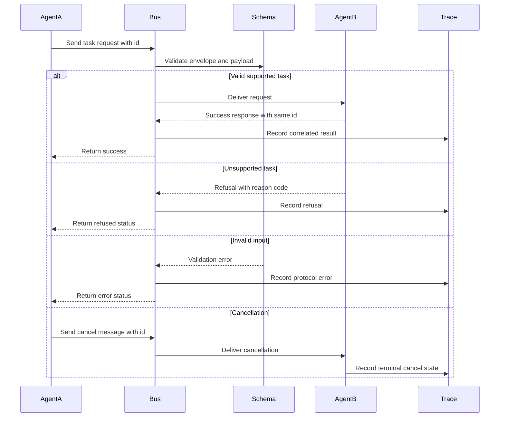

# Lab 04 - Construye Comunicación A2A entre Agents

Descarga la [hoja de trabajo de finalización del laboratorio](/capstone-assets/templates/lab-completion-worksheet.txt) y la [hoja de trabajo de preparación para producción](/capstone-assets/templates/lab-production-readiness-worksheet.txt) antes de comenzar.

## Objetivo

Construye un límite de comunicación tipado entre dos agents. Un agent solicita trabajo, otro agent acepta, rechaza, reporta error o recibe cancelación mediante mensajes explícitos.

## Lo Que Vas a Usar

- Lenguaje: TypeScript
- Framework/runtime: runtime orientado a protocolos con validación de schema JSON usando Ajv
- Lección agnóstica de framework: la comunicación entre agents necesita sobres tipados, correlation IDs, refusal states, error states y cancellation.
- Capítulo de pattern: [A2A Agent Interoperability](/tools-skills-protocols/a2a-agent-interoperability)
- Carpeta fuente: [`agent-to-agent-communication-pattern/`](https://github.com/GTuritto/Agentic-Systems-Patterns/tree/main/agent-to-agent-communication-pattern)
- Descarga: [a2a-agent-interoperability.zip](/downloads/a2a-agent-interoperability.zip)
- Archivos principales:
  - `agent-to-agent-communication-pattern/src/agent_a.ts`
  - `agent-to-agent-communication-pattern/src/agent_b.ts`
  - `agent-to-agent-communication-pattern/src/bus_memory.ts`
  - `agent-to-agent-communication-pattern/protocol/a2a.schema.json`

## Presupuesto de Tiempo del Ejercicio

Estas estimaciones asumen que las dependencias ya están instaladas.

| Ejercicio | Tiempo | Resultado |
| --- | ---: | --- |
| Configuración y prueba base del protocolo | 8 min | Salida de prueba A2A exitosa. |
| Inspecciona el schema de mensajes | 10-12 min | Notas sobre task IDs, states, refusals, errors y cancellation. |
| Cambia una ruta de mensaje | 10-15 min | Un resultado visible de éxito, rechazo, entrada inválida o cancelación. |
| Revisa la propiedad de fallas del protocolo | 10-15 min | Dueño y regla de manejo para trabajos mal formados o cancelados. |
| Completa el mapeo para producción | 5-10 min | Notas sobre transporte, auth, replay y versiones de schema. |

## Configuración

Desde la raíz del repositorio:

```sh
npm install
```

## Ejecútalo

Ejecuta la prueba del protocolo:

```sh
npm run a2a:test
```

Ejecuta el demo:

```sh
npm run a2a:run
```

## Inspecciona el Código

Abre `agent-to-agent-communication-pattern/src/agent_a.ts` y `agent-to-agent-communication-pattern/src/agent_b.ts`.

Busca:

- handshake
- task request
- task response
- refusal
- invalid input error
- cancellation
- validación de schema con Ajv

## Cambia Una Cosa

En la prueba, agrega una segunda task request válida con un ID diferente:

```ts
a.requestTask('t5', 'sum', { a: 10, b: 15 });
```

Ejecuta:

```sh
npm run a2a:test
```

## Resultado Esperado

El receptor debe procesar la nueva task sin confundirla con los task IDs existentes. Si faltan correlation IDs, el progreso y los resultados se vuelven difíciles de asociar.

La prueba debe imprimir cuatro resultados:

```text
AgentA received response: { id: 't1', status: 'success', output: { sum: 3 } }
AgentA received response: { id: 't2', status: 'refused', error: 'unsupported_task' }
AgentA received response: { id: 't3', status: 'error', error: 'invalid_input' }
AgentB cancel received: { id: 't4', reason: 'user_request' }
A2A tests executed: success, refusal, error, cancel
```

El demo debe imprimir el camino exitoso:

```text
AgentA received response: { id: 't1', status: 'success', output: { sum: 7 } }
```

Usa este flujo como modelo de aceptación para el laboratorio. La comunicación A2A es saludable solo cuando el protocolo maneja éxito, rechazo, entrada inválida y cancelación con la misma disciplina de correlación.



## Puerta de Revisión del Lab

Antes de continuar, verifica el límite del protocolo:

| Verificación | Evidencia |
| --- | --- |
| Los mensajes son tipados | El schema A2A valida task requests, responses, refusals, errors y cancellations. |
| La correlación es explícita | Cada task tiene un ID que conecta request, progress, result y cancellation. |
| El rechazo es un state de primera clase | El receptor puede rechazar trabajos no soportados sin simular éxito. |
| La entrada inválida está controlada | Payloads mal formados producen un resultado de error. |
| La cancelación es observable | El trabajo cancelado tiene un mensaje y un state terminal. |

Registra los task IDs, tipos de mensajes y un caso de entrada inválida en la hoja de trabajo de finalización del laboratorio.

## Extensión para Producción

Antes de usar A2A entre servicios, agrega:

- authentication
- authorization
- idempotency keys
- task leases
- retry policy
- durable task state
- audit logs
- encriptación a nivel de transporte

A2A es un límite de protocolo, no solo un agent llamando otra función.

## Puente a Producción

Usa esta tabla al adaptar el laboratorio a comunicación agent a agent entre servicios:

| Concepto del Lab | Versión en Producción |
| --- | --- |
| In-memory bus | Transporte autenticado con entrega durable y retry policy. |
| Task ID | Correlation ID más idempotency key y trace ID. |
| JSON schema | Contrato de protocolo versionado con pruebas de compatibilidad. |
| Refusal message | Negación informada por policy con reason code y registro de auditoría. |
| Cancellation message | Lease, timeout, motivo de cancelación y comportamiento de limpieza. |

El primer hito de producción es un contrato de mensajes que pueda sobrevivir retries, refusal, cancellation y replay sin perder propiedad.

## Mapeo Entre Frameworks

- En LangGraph, esto se parece a un handoff de graph a graph o de servicio a servicio con state tipado.
- En Mastra AI, esto corresponde a límites de servicio o workflow alrededor de llamadas de agent.
- En sistemas estilo AutoGen, corresponde a mensajes estructurados entre agents en vez de solo chat libre.
- En CrewAI, corresponde a handoffs de task y salidas de roles que aún requieren schema, identidad y correlación de trace.

## Capítulos Relacionados

- [Secure Agent Communication](/tools-skills-protocols/secure-agent-communication)
- [MCP-first Tool Use](/tools-skills-protocols/mcp-first-tool-use)
- [Open Personal Agent Architectures](/systems-architecture/open-personal-agent-architectures)
