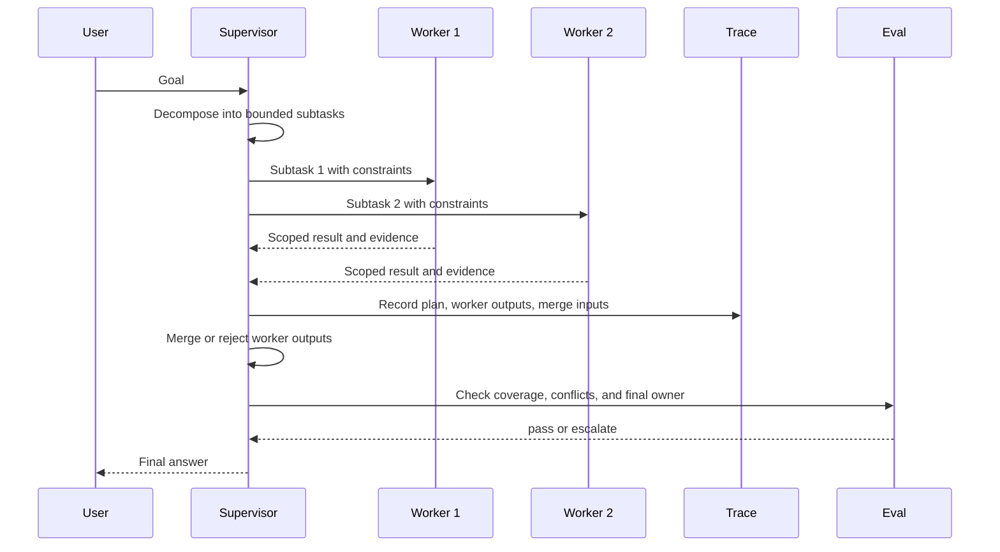

# Lab 05 - Construye un Multi-Agent Supervisor

Descarga la [hoja de trabajo de finalización del laboratorio](/capstone-assets/templates/lab-completion-worksheet.txt) y la [hoja de trabajo de preparación para producción](/capstone-assets/templates/lab-production-readiness-worksheet.txt) antes de comenzar.

## Objetivo

Construye la forma de supervisión detrás de los sistemas multi-agent: un coordinador posee el goal, delega trabajo acotado, recopila los outputs de los workers y produce la respuesta final.

## Lo Que Vas a Usar

- Lenguaje: TypeScript
- Framework/runtime: ejemplo de manager/worker estilo AutoGen
- Lección agnóstica de framework: un supervisor posee la descomposición, contratos de worker, merge policy y síntesis final.
- Capítulos de patrones: [Supervisor / Worker](/multi-agent-systems/supervisor-worker), [Task Delegation](/multi-agent-systems/task-delegation)
- Carpeta fuente: [`hierarchical-agent-pattern/`](https://github.com/GTuritto/Agentic-Systems-Patterns/tree/main/hierarchical-agent-pattern)
- Descarga: [supervisor-worker.zip](/downloads/supervisor-worker.zip)
- Archivo principal: `hierarchical-agent-pattern/autogen_typescript_example/hierarchical_agent.ts`

## Presupuesto de Tiempo del Ejercicio

Estas estimaciones asumen que las dependencias ya están instaladas.

| Ejercicio | Tiempo | Output |
| --- | ---: | --- |
| Configuración y ejecución base | 8-10 min | Output determinista o en vivo del supervisor. |
| Inspeccionar contratos de supervisor y worker | 12 min | Notas sobre ownership del goal, límites de roles y comportamiento de merge. |
| Cambiar delegación o parsing | 12 min | Evidencia de que el output acotado del worker sigue controlando la síntesis. |
| Revisar falla de agregación | 10 min | Regla de manejo para output de worker faltante, conflictivo o débil. |
| Completar mapeo a producción | 5-10 min | Contrato de worker, merge policy, trace y notas de final-owner. |

## Configuración

Este ejemplo puede ejecutarse en dos modos:

- Modo determinista local cuando `MISTRAL_API_KEY` no está configurado.
- Modo en vivo de Mistral cuando `MISTRAL_API_KEY` está presente en `.env`.

Desde la raíz del repositorio:

```sh
npm install
cp .env.example .env
```

Configura `MISTRAL_API_KEY` en `.env` solo si deseas la ruta de modelo en vivo. Déjalo sin configurar si deseas el output determinista del laboratorio que aparece abajo.

## Ejecútalo

```sh
npm run hierarchical-agent
```

Cuando se te pida, ingresa un goal como:

```text
Draft a short plan for evaluating an agentic RAG prototype.
```

## Inspecciona el Código

Abre `hierarchical-agent-pattern/autogen_typescript_example/hierarchical_agent.ts` y encuentra:

- el manager prompt
- los worker prompts
- extracción de subtasks
- aggregation prompt
- ruta de respuesta final

El supervisor posee la descomposición y la aceptación final. Los workers no deben redefinir silenciosamente el goal.

## Cambia Una Cosa

Cambia la instrucción del manager para que pida tres subtasks en lugar de dos. Luego inspecciona la lógica de parsing:

```ts
const subTasks = managerPlan.match(/Sub-task [12]: (.*)/g) || [];
```

Actualiza el regex para que el código pueda recolectar el tercer subtask.

## Resultado Esperado

El manager debe producir un plan, los workers deben producir resultados acotados y la agregación final debe combinar los outputs de los workers. Si el parsing es frágil, el supervisor pierde trabajo.

Sin `MISTRAL_API_KEY`, la ruta determinista debe mostrar esta forma:

```text
Manager Agent Plan:
 Sub-task 1: Define evaluation criteria for answer quality, retrieval grounding, latency, and failure handling.
Sub-task 2: Create a small test set with expected evidence, negative cases, and acceptance thresholds.

Worker Agent 1 Result:
 Worker 1 result: Sub-task 1: Define evaluation criteria for answer quality, retrieval grounding, latency, and failure handling. Criteria should include citation accuracy, unsupported-claim rate, p95 latency, and visible refusal behavior.

Worker Agent 2 Result:
 Worker 2 result: Sub-task 2: Create a small test set with expected evidence, negative cases, and acceptance thresholds. The test set should include grounded answers, missing-evidence questions, stale-document checks, and threshold failures.

Final Aggregated Result for User:
 Final answer: evaluate the RAG prototype with quality, grounding, latency, and failure-handling criteria.
Use a small test set with positive cases, missing-evidence cases, stale-document cases, and blocking thresholds.
Accept the prototype only when worker evidence meets the supervisor policy.
```

El texto exacto puede variar en modo modelo en vivo. La señal requerida es la misma: un plan del manager, outputs acotados de los workers y una respuesta final que use esos outputs.



Usa este flujo como el modelo de aceptación del laboratorio. El supervisor posee la descomposición, contratos de worker, merge policy, evidencia de trace y aceptación final.

## Puerta de Revisión del Lab

Antes de continuar, verifica el límite de supervisión:

| Check | Evidencia |
| --- | --- |
| El supervisor posee el goal | El manager prompt descompone el trabajo sin permitir que los workers redefinan la solicitud. |
| El trabajo del worker está acotado | Cada worker recibe un subtask específico y retorna un resultado acotado. |
| La agregación es explícita | La respuesta final usa los outputs de los workers en vez de ocultar el comportamiento de merge. |
| El riesgo de parsing es visible | El cambio de regex muestra por qué los planes en lenguaje natural necesitan structured output. |
| La ownership de fallas está nombrada | El laboratorio puede explicar quién maneja el output de worker faltante, conflictivo o de baja calidad. |

Registra el plan del manager, los outputs de los workers, el resultado de la agregación y la brecha de parsing en la hoja de trabajo de finalización del laboratorio.

## Extensión a Producción

Reemplaza el parsing de subtasks en lenguaje natural por structured output:

- `subtasks: Array<{ id, role, objective, constraints, expected_output }>`
- permisos específicos por worker
- timeout por worker
- merge policy
- judge o evaluator
- escalamiento humano para desacuerdos

Los sistemas multi-agent necesitan contratos sólidos. Más agents sin merge policy usualmente significa más modos de falla.

## Puente a Producción

Usa esta tabla al adaptar el laboratorio a un workflow multi-agent de producción:

| Concepto del Lab | Versión de Producción |
| --- | --- |
| Manager prompt | Supervisor policy con task schema, reglas de ruteo y criterios de aceptación. |
| Worker prompts | Contratos de rol con permisos, tools, timeouts y expected output schema. |
| Regex subtask parsing | Structured output con validación y retry-on-invalid behavior. |
| Aggregation prompt | Merge policy con manejo de conflictos, atribución de fuente y final owner. |
| Console result | Trace con spans por worker, costo, latencia, razón de parada y resultado de evaluator. |

El primer hito de producción no es agregar más agents. Es probar que el trabajo delegado puede ser acotado, fusionado, rechazado y auditado.

## Mapeo Entre Frameworks

- En LangGraph, esto corresponde a un coordinator graph que enruta trabajo a nodos o subgrafos especializados.
- En Mastra AI, esto corresponde a workflows que coordinan agents y tools bajo un solo runtime.
- En sistemas estilo AutoGen, este es el patrón explícito de conversación manager/worker.
- En CrewAI, esto corresponde a crews con tasks específicos por rol, aunque un flow aún debe poseer el state y la aceptación final.

## Capítulos Relacionados

- [Parallel Agents](/multi-agent-systems/parallel-agents)
- [Debate and Consensus](/multi-agent-systems/debate-and-consensus)
- [CrewAI Flows and Crews](/multi-agent-systems/crewai-flows-and-crews)
