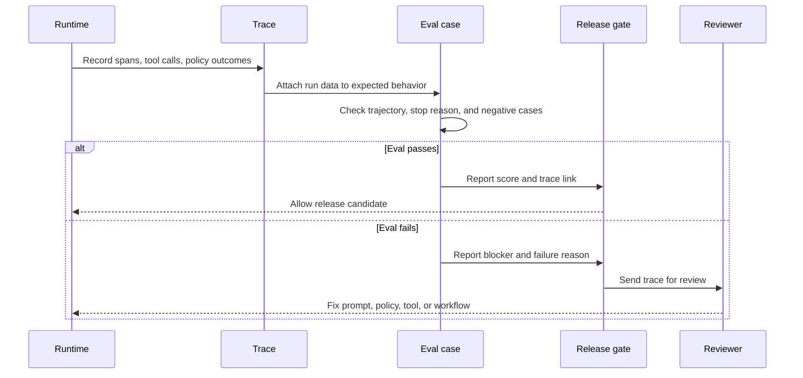
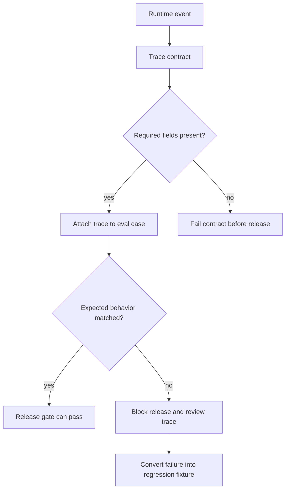

# Lab 06 - Agrega Observability y Evals

Descarga la [hoja de ejercicios guiados de Lab 06 observability and evals](/capstone-assets/templates/lab-06-observability-evals-guided-exercise.txt), la [hoja de finalización del lab](/capstone-assets/templates/lab-completion-worksheet.txt) y la [hoja de preparación para producción del lab](/capstone-assets/templates/lab-production-readiness-worksheet.txt) antes de comenzar.

## Objetivo

Convierte los ejemplos en algo que puedas evaluar. Un agent de producción necesita trace data, regression tasks, expected outcomes y failure review antes de necesitar más autonomía.

## Qué Vas a Usar

- Lenguaje: TypeScript
- Framework/runtime: pruebas neutrales sobre framework usando los ejemplos del repositorio
- Lección agnóstica de framework: los evals deben inspeccionar trayectorias, tool calls, policy outcomes y stop reasons, no solo las respuestas finales.
- Capítulos de patrones: [Observability and Evals](/production-runtime/observability-and-evals), [Evaluator-Optimizer](/control-loops/evaluator-optimizer)
- Carpeta fuente: [`observability-and-evals-pattern/`](https://github.com/GTuritto/Agentic-Systems-Patterns/tree/main/observability-and-evals-pattern)
- Descarga: [observability-and-evals.zip](/downloads/observability-and-evals.zip)
- Comandos de prueba existentes:
  - `npm run observability:test`
  - `npm run plan:test`
  - `npm run a2a:test`
  - `npm run mcp:test`
  - `npm test`

## Presupuesto de Tiempo para el Ejercicio

Estas estimaciones asumen que las dependencias ya están instaladas.

| Ejercicio | Tiempo | Resultado |
| --- | ---: | --- |
| Configuración y ejecución base de eval | 8-10 min | Salida de prueba acotada exitosa. |
| Inspecciona el contrato de trace | 10-12 min | Campos requeridos de trace e invariante protegido. |
| Revisa casos negativos | 15-20 min | Razón de falla, severidad y nota de bloqueo de release. |
| Esquematiza CI y puertas de incident-to-eval | 15-20 min | Comando, responsable, umbral y nombre de fixture futuro. |
| Completa la puerta de revisión | 5-10 min | Notas en la hoja de trabajo sobre trace, eval y brecha de producción. |

## Configuración

Desde la raíz del repositorio:

```sh
npm install
```

## Ejecútalo

Ejecuta las verificaciones determinísticas:

```sh
npm run observability:test
npm run plan:test
npm run a2a:test
npm run mcp:test
```

Luego ejecuta el suite completo:

```sh
npm test
```

## Inspecciona el Código

Usa los archivos de prueba como el primer dataset de eval:

- `observability-and-evals-pattern/trace-contract.spec.ts`
- `observability-and-evals-pattern/trace-contract.ts`
- `planning-pattern/typescript/test/planning.spec.ts`
- `agent-to-agent-communication-pattern/test/a2a.spec.ts`
- `modern-tool-use-pattern/typescript/test/modern-tools.spec.ts`

Cada prueba verifica un contrato:

- los traces contienen correlation IDs, model spans, stop reasons y policy decisions para tool spans
- el planning produce pasos ejecutables
- A2A maneja success, refusal, error y cancel
- el uso de herramientas MCP descubre tools y retorna datos útiles

## Cambia Una Cosa

Agrega un caso negativo a la prueba de A2A enviando input mal formado con un nuevo task ID:

```ts
a.requestTask('t6', 'sum', { a: null, b: 10 } as any);
```

Ejecuta:

```sh
npm run a2a:test
```

## Resultado Esperado

El sistema debe reportar un error outcome, no un resultado exitoso. En un dataset de eval, los casos negativos son tan importantes como los caminos felices.

La puerta de contrato de trace debe imprimir:

```text
Trace contract test OK
```

Esa prueba demuestra ambos lados del límite de eval: un trace completo pasa, y un tool span exitoso sin una policy decision falla.

Usa este flujo como el modelo de aceptación para el lab. Observability captura lo que ocurrió; los evals deciden si la ejecución es lo suficientemente segura para liberar.



## Ejercicios Guiados

Usa estos ejercicios para hacer visible el límite de eval.

| Ejercicio | Tiempo | Qué Hacer | Evidencia a Guardar |
| --- | ---: | --- | --- |
| Línea base del contrato de trace | 10 min | Ejecuta `npm run observability:test`. | La salida exitosa del contrato y los campos protegidos por la prueba. |
| Falla por falta de policy | 10 min | Inspecciona `missingPolicyTrace` en `trace-contract.spec.ts`. | La razón exacta de la falla: `policy decision for tool span span_tool_missing_policy`. |
| Caso negativo de A2A | 15 min | Agrega el input de A2A mal formado de este lab y vuelve a ejecutar `npm run a2a:test`. | Error outcome, task ID y por qué debe bloquear el release. |
| Esquema de puerta CI | 10 min | Decide qué comando debe bloquear el release para este segmento. | `npm test`, una prueba acotada o un futuro comando de eval con responsable. |
| Nota de incident-to-eval | 10 min | Elige una falla del lab y conviértela en un fixture de regresión. | Nombre del fixture, severidad, resultado esperado y campo de trace. |



## Ejercicio de Eval Intencionalmente Fallido

En `observability-and-evals-pattern/trace-contract.spec.ts`, el objeto `missingPolicyTrace` modela una llamada exitosa a tool sin una policy decision. Eso es un bloqueador de release porque la tool usó autoridad sin una decisión auditable de allow, deny, approval o escalation.

Revisa la falla como si viniera de producción:

| Pregunta | Respuesta a Registrar |
| --- | --- |
| ¿Qué span falló? | `span_tool_missing_policy` |
| ¿Qué invariante se rompió? | Cada tool span debe tener una policy decision. |
| ¿Qué debe hacer CI? | Fallar la puerta de eval. |
| ¿Qué debe corregir el responsable? | Agregar la policy decision antes de que el resultado de la tool cuente como válido. |

## Puerta de Revisión del Lab

Antes de continuar, verifica el límite de eval:

| Verificación | Evidencia |
| --- | --- |
| Se aplica el contrato de trace | `npm run observability:test` acepta un trace completo y rechaza una policy decision faltante en tool. |
| Las pruebas verifican contratos | Las pruebas de planning, A2A y MCP afirman el comportamiento, no solo que los comandos se ejecutan. |
| Existen casos negativos | El input de A2A mal formado retorna un error outcome. |
| Se inspecciona la trayectoria | Las pruebas revisan pasos, mensajes, descubrimiento de tools u outcomes antes del texto final. |
| El riesgo de release es visible | El lab nombra qué fallas bloquearían un release de producción. |
| Se implica la propiedad de eval | Cada prueba protege un límite específico de pattern. |

Registra los comandos, salida de éxito/falla, caso negativo y límite protegido en la hoja de finalización del lab.

## Extensión para Producción

Crea un registro de trace y eval para cada ejecución:

```json
{
  "run_id": "run_001",
  "pattern": "a2a-agent-interoperability",
  "input": "sum task",
  "expected": "success with sum",
  "actual": "success with sum",
  "score": 1,
  "stop_reason": "completed",
  "latency_ms": 25
}
```

Luego agrega puertas de release:

- no schema failures
- no missing trace IDs
- no unexpected tool calls
- no regression en golden tasks
- no unresolved safety o policy failures

Observability registra lo que ocurrió. Los evals deciden si es lo suficientemente bueno para liberar.

## Puente a Producción

Usa esta tabla al adaptar el lab a la evaluación en producción:

| Concepto del Lab | Versión en Producción |
| --- | --- |
| Comando de prueba | Puerta de release ligada a cambios en prompt, model, tool, policy, memory o workflow. |
| Fixture de prueba | Caso de eval versionado con responsable, severidad y razón de falla. |
| Salida de consola | Reporte de eval con éxito/falla, enlace al trace, score, umbral y estado de bloqueo. |
| Caso negativo de A2A | Fixture de regresión para schema failure y trayectoria insegura. |
| Full `npm test` | Puerta de CI más monitoreo canario y workflow de incident-to-eval. |

El primer hito de producción no es un dashboard más grande. Es un eval bloqueante que detecta una trayectoria mala conocida antes del release.

## Mapeo Entre Frameworks

- En LangGraph, los traces y checkpoints te permiten inspeccionar rutas de nodos, cambios de state y condiciones de detención.
- En Mastra AI, los evals y observability deben conectar eventos de agent, tool, workflow y memory.
- En sistemas estilo AutoGen, los message logs deben convertirse en traces estructurados antes de ser datos de eval confiables.
- En CrewAI, los outputs de task y flow necesitan casos de eval que verifiquen el comportamiento de roles y la síntesis final.

## Capítulos relacionados

- [Agent Development Lifecycle](/agent-engineering-practice/agent-development-lifecycle)
- [Evaluation-Driven Agent Development](/agent-engineering-practice/evaluation-driven-agent-development)
- [Policy Enforcement](/production-runtime/policy-enforcement)
