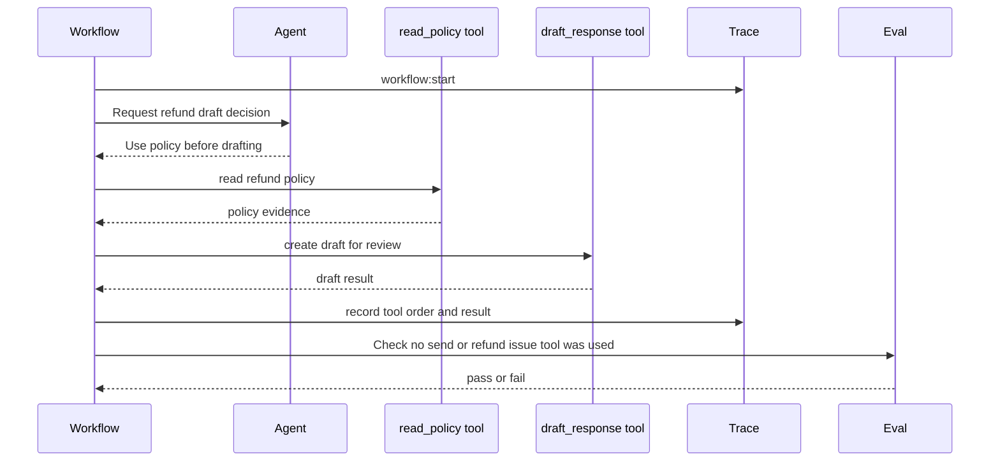
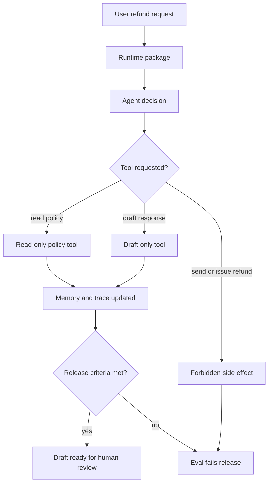

# Lab 07 - Empaqueta Agents, Tools, Workflows, Memory y Evals

Descarga la [hoja de ejercicios guiados de runtime packaging del Lab 07](/capstone-assets/templates/lab-07-runtime-packaging-guided-exercise.txt), la [hoja de finalización del laboratorio](/capstone-assets/templates/lab-completion-worksheet.txt) y la [hoja de preparación para producción del laboratorio](/capstone-assets/templates/lab-production-readiness-worksheet.txt) antes de comenzar.

## Objetivo

Usa una estructura de runtime en TypeScript al estilo Mastra para empaquetar las mismas responsabilidades que construiste desde cero: decisión del agent, ejecución de tools, control del workflow, memory, eventos de trace y evals.

## Qué Vas a Usar

- Lenguaje: TypeScript
- Framework/runtime: runtime packaging estilo Mastra
- Lección agnóstica de framework: un framework puede empaquetar primitivas, pero tu aplicación sigue siendo dueña del state, policy, contratos de tool, traces y criterios de aceptación.
- Capítulos de patrones: [Mastra Runtime](/production-runtime/mastra-runtime), [Building a Minimal Agent Runtime](/agent-engineering-practice/building-a-minimal-agent-runtime), [Observability and Evals](/production-runtime/observability-and-evals)
- Archivos fuente:
  - `mastra-runtime-pattern/typescript/src/runtime_packaging.ts`
  - `mastra-runtime-pattern/typescript/src/run_demo.ts`
  - `mastra-runtime-pattern/typescript/test/runtime_packaging.spec.ts`

## Tiempo Estimado del Ejercicio

Estas estimaciones asumen que las dependencias ya están instaladas.

| Ejercicio | Tiempo | Resultado |
| --- | ---: | --- |
| Configuración y ejecución base del runtime | 10 min | Salida de demo y test. |
| Mapear límites del runtime package | 15 min | Notas de propietario para agent, tool, workflow, memory, trace y eval. |
| Inspeccionar orden de tools y tools prohibidos | 20 min | Trace de orden de tools más resultado de eval de tool prohibido. |
| Ejecutar rollback y comparación nativa | 20-30 min | Deshabilitar ruta y mapeo al slice nativo estilo Mastra. |
| Completar mapeo de producción | 10-20 min | Notas de release para policy, export de trace, eval gate y riesgo de upgrade. |

## Configuración

Desde la raíz del repositorio:

```sh
npm install
```

Este laboratorio es determinista y no requiere una model key. El objetivo es el runtime packaging, no la calidad del model.

## Ejecútalo

```sh
npm run mastra-runtime:demo
npm run mastra-runtime:test
```

## Resultado Esperado

El comando de test debe imprimir:

```text
Mastra-style runtime packaging tests OK
```

La ejecución también debe probar estas señales de comportamiento:

- policy se lee antes de redactar;
- el draft se crea para revisión, no se envía;
- los pasos del workflow y los resultados de tools quedan registrados en traces;
- el eval falla si se usa un tool de envío directo o refund-issue.

El comando demo debe incluir esta evidencia:

```json
{
  "toolCalls": [
    { "name": "read_policy", "input": { "policyId": "refund-v1" } },
    { "name": "draft_response", "input": { "customerId": "cust_123" } }
  ],
  "result": "Policy checked and draft created for human review.",
  "evaluation": {
    "status": "pass"
  }
}
```

El JSON exacto también incluye los campos de memory y trace. Usa los campos `toolCalls`, `result` y `evaluation.status` como verificación rápida.



Usa este flujo como modelo de aceptación del laboratorio. Un framework puede empaquetar el runtime, pero la aplicación sigue siendo dueña del orden de tools, policy de efectos secundarios, evidencia de trace y evals de release.

Punto de comparación nativo de Mastra:

```text
native-framework-examples/mastra-refund/
download: /downloads/native-mastra-refund.zip
agent: refundDraftAgent
workflow: refundDraftWorkflow
tools: refund_policy.retrieve, refunds.create_draft
eval gate: refund_draft_no_money_movement
```

## Ejercicios Guiados

Usa estos ejercicios para inspeccionar qué posee el runtime package y qué sigue siendo responsabilidad de la policy del producto.

| Ejercicio | Tiempo | Qué Hacer | Evidencia a Guardar |
| --- | ---: | --- | --- |
| Mapa de runtime package | 15 min | Inspecciona `Agent`, `Tool`, `WorkflowStep`, `RuntimeState` y `evaluateRuntime`. | Una frase sobre qué posee cada límite. |
| Trace de orden de tools | 10 min | Ejecuta `npm run mastra-runtime:demo` e inspecciona `toolCalls`. | `read_policy` antes de `draft_response`. |
| Eval de tool prohibido | 10 min | Lee el caso negativo `refunds.issue_refund` en `runtime_packaging.spec.ts`. | Estado de eval y razón de fallo. |
| Ejercicio de rollback | 10 min | Nombra la forma más rápida de deshabilitar la capability riesgosa. | Feature flag, eliminación de tool, deshabilitar ruta de workflow o rollback de deployment. |
| Comparación nativa | 20 min | Compara el laboratorio determinista con `native-framework-examples/mastra-refund/`. | Qué partes corresponden a agent, workflow, tools, trace y eval. |



## Ejercicio de Deployment y Rollback

Trata el laboratorio como candidato a producción. Antes de lanzar un runtime real, escribe la acción de rollback que deshabilita la capability de mayor riesgo sin eliminar todo el servicio.

| Capability | Pregunta de Rollback | Evidencia Aceptable |
| --- | --- | --- |
| `read_policy` | ¿Puede el sistema volver a un snapshot estático de policy? | Config flag, policy ID versionada o fuente en caché. |
| `draft_response` | ¿Se puede deshabilitar la creación de draft mientras la consulta de policy sigue disponible? | Cambio en el manifest de tool o flag de ruta de workflow. |
| `send_message` | ¿Puede seguir siendo imposible el envío directo salvo aprobación explícita? | Eval de tool prohibido y approval gate. |
| `refunds.issue_refund` | ¿Puede el movimiento de dinero mantenerse fuera de este runtime? | Falta de registro de tool más eval fallido si aparece. |

## Inspecciona el Código

Abre `mastra-runtime-pattern/typescript/src/runtime_packaging.ts` y encuentra estos límites:

- `Agent`: posee instrucciones y propone la siguiente decisión.
- `Tool`: posee la ejecución tipada de capability.
- `WorkflowStep`: posee la secuencia determinista de runtime.
- `RuntimeState`: posee memory, traces, llamadas a tools y resultado.
- `evaluateRuntime`: revisa la trayectoria, no solo el texto final.

El código local es intencionalmente pequeño, pero el mapeo sigue la forma de producción: agents, workflows, tools, memory, traces y evals pertenecen a un solo runtime package.

## Cambia Una Cosa

Agrega un nuevo tool llamado `send_message` con un efecto secundario directo, luego actualiza `evaluateRuntime` para que el eval falle si ese tool aparece en `toolCalls`. El test del repositorio también verifica el caso de efecto secundario de refund:

```ts
{ name: "refunds.issue_refund", input: { amount: 42 } }
```

Lección esperada: el registro de tools en el framework no es permiso. La policy de la aplicación sigue decidiendo qué es seguro.

## Verifica

Ejecuta:

```sh
npm run mastra-runtime:test
```

Compara la salida con el resultado esperado antes de pasar a la extensión de producción.

## Revisión del Laboratorio

Antes de continuar, verifica el runtime package:

| Revisión | Evidencia |
| --- | --- |
| Las responsabilidades del runtime son visibles | Agent, tool, workflow, memory, trace y eval tienen tipos separados en el código. |
| El orden de tools está restringido | La consulta de policy ocurre antes de crear el draft. |
| Los efectos secundarios están bloqueados | El eval falla si aparece un tool de envío directo o refund issue. |
| El trace explica el comportamiento | La ejecución registra workflow, decisión del agent y eventos de tools. |
| La propiedad del framework es limitada | La policy del producto y los criterios de release quedan fuera de los defaults del framework. |

Registra la salida del comando, eventos de trace, orden de tools y resultado de eval en la hoja de finalización del laboratorio.

## Extensión de Producción

Antes de lanzar una implementación real de Mastra, agrega:

- schemas reales de tools y validación de input;
- policy de retry de workflow y compensación;
- controles de retención, redacción y eliminación de memory;
- fixtures de scorer/eval ligados a release gates;
- export de trace al backend de observability;
- approval gates para tools de escritura y comunicación externa.

## Production Bridge

Usa esta tabla cuando adaptes el laboratorio a un Mastra runtime real:

| Lab Concept | Production Version |
| --- | --- |
| `Agent` type | Agent route con instrucciones versionadas, tools permitidas y razones de detención. |
| `Tool` type | Typed capability con permiso, clase de side-effect, timeout e idempotencia. |
| `WorkflowStep` | Paso de workflow durable con soporte para retry, compensación, checkpoint y aprobación. |
| `RuntimeState` | State de ejecución persistido con tenant, actor, trace ID, budget y memory policy. |
| `evaluateRuntime` | Release gate vinculado a incidentes conocidos, policy rules y trayectorias prohibidas. |

El primer hito de producción es un runtime slice que puede deshabilitarse, reproducirse y evaluarse sin leer los detalles internos del framework.

## Native Framework Extension

Después de que el laboratorio determinista pase, porta una vertical slice a un proyecto real de Mastra. Usa [Real Framework Setup Notes](/agent-engineering-practice/real-framework-setup-notes) para los comandos actuales de configuración y compara tu trabajo con el ejemplo del repositorio en `native-framework-examples/mastra-refund/`.

Pasos para el port nativo:

1. crea un proyecto Mastra;
2. crea un agent para la decisión de borrador de reembolso;
3. crea tools tipados para policy lookup y creación de borrador;
4. crea un workflow que invoque policy lookup antes de la creación del borrador;
5. agrega un eval que falle si se llama a un tool de send o refund-issue;
6. exporta un trace con eventos de workflow, agent, tool, policy y eval;
7. documenta el rollback para deshabilitar el tool de borrador.

Mantén estos assets fuera del código exclusivo del framework:

| Asset | Why |
| --- | --- |
| tool manifest | la autoridad del producto debe ser revisable sin leer el framework |
| policy rules | la policy debe ejecutarse antes del tool |
| eval fixtures | los release gates deben sobrevivir cambios en el framework |
| trace schema | operaciones necesitan campos estables entre runtimes |
| ADR | la elección del framework necesita un owner registrado y un rollback path |

Estándar de finalización: el proyecto nativo prueba el mismo comportamiento que este laboratorio y enlaza al [Support Refund Agent capstone](/capstone-projects/support-refund-agent). Una ejecución nativa de Mastra no está completa solo porque un agent responde; el workflow debe preservar el orden de tools, la side-effect policy, la evidencia en trace y los eval gates.

## Troubleshooting

| Symptom | Likely Cause | Fix |
| --- | --- | --- |
| `mastra dev` cannot find provider credentials | `.env` falta o las variables del proveedor no están configuradas | Copia `.env.example`, configura las claves del proveedor y reinicia el dev server. |
| workflow drafts before policy lookup | el orden de los pasos del workflow es incorrecto | Mantén la obtención de policy como el primer paso y haz que el paso de borrador consuma la salida de policy. |
| eval passes after adding `refunds.issue_refund` | la lista de tools prohibidos está incompleta | Agrega el nombre del tool al release eval y vuelve a ejecutar la validación. |
| trace explica el texto final pero no el orden de tools | el trace es solo a nivel de model | Emite eventos de workflow, tool, policy y eval por separado. |

## Cross-Framework Mapping

- En LangGraph, esto se convierte en graph state, nodes, tools, checkpoints y evals alrededor de ejecuciones del grafo.
- En Mastra AI, estas preocupaciones se empaquetan como agents, workflows, tools, memory, observability y evals.
- En sistemas estilo AutoGen, el runtime package se divide entre manager, workers, functions, messages y transcript evals.
- En CrewAI, el empaquetado equivalente se divide entre flow state, crew tasks, agent roles, tools y evaluación a nivel de flow.

## Related Chapters

- [Mastra Runtime](/production-runtime/mastra-runtime)
- [Framework Selection](/agent-engineering-practice/framework-selection)
- [Building a Minimal Agent Runtime](/agent-engineering-practice/building-a-minimal-agent-runtime)
- [Production Evaluation Feedback Loops](/production-runtime/production-evaluation-feedback-loops)
- [Support Refund Agent Capstone](/capstone-projects/support-refund-agent)
