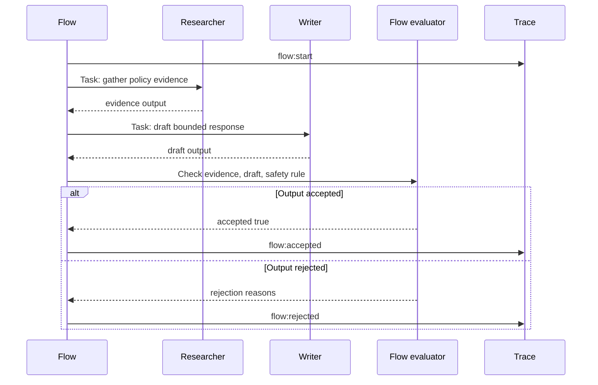

# Lab 08 - Modela Flows, Crews, Roles y Task Contracts

Descarga la [hoja de trabajo de finalización del laboratorio](/capstone-assets/templates/lab-completion-worksheet.txt) y la [hoja de trabajo de preparación para producción](/capstone-assets/templates/lab-production-readiness-worksheet.txt) antes de comenzar.

## Objetivo

Usa una estructura Python al estilo CrewAI para separar la propiedad del flow de la colaboración del crew. El flow es dueño del state, la secuencia, la evaluación y la aceptación final. El crew es responsable de trabajo especializado y acotado.

## Qué Vas a Usar

- Lenguaje: Python
- Framework/runtime: flows y crews al estilo CrewAI
- Lección agnóstica de framework: el valor multi-agent proviene de los límites de roles, task contracts, flow state y aceptación explícita, no de agregar más agents.
- Capítulos de patrones: [CrewAI Flows and Crews](/multi-agent-systems/crewai-flows-and-crews), [Choosing Multi-Agent Topology](/multi-agent-systems/choosing-multi-agent-topology), [Supervisor / Worker](/multi-agent-systems/supervisor-worker)
- Archivos fuente:
  - `crewai-flows-and-crews-pattern/python/flow_crew.py`
  - `crewai-flows-and-crews-pattern/python/test_flow_crew.py`

## Tiempo Estimado por Ejercicio

Estas estimaciones asumen que las dependencias ya están instaladas.

| Ejercicio | Tiempo | Resultado |
| --- | ---: | --- |
| Configuración y ejecución base del flow | 10 min | Demo del flow y salida de prueba. |
| Inspeccionar límites de flow y roles | 15 min | Notas sobre propiedad del state, salida de roles y aceptación. |
| Cambiar un rol o caso de aceptación | 20 min | Un state aceptado o rechazado visible. |
| Verificar y solucionar problemas | 10-15 min | Prueba exitosa o causa de falla registrada. |
| Completar mapeo a producción | 10-20 min | Notas sobre checkpoints, permisos, validadores y ruta de fallback. |

## Configuración

Desde la raíz del repositorio:

```sh
npm install
```

Este laboratorio solo utiliza código de la biblioteca estándar de Python. Es intencionalmente determinista para que puedas inspeccionar el límite de control sin variabilidad del model.

## Ejecútalo

```sh
npm run crewai-flow
npm run crewai-flow:test
```

## Resultado Esperado

El comando de prueba debe imprimir:

```text
CrewAI-style flow and crew tests OK
```

La ejecución también debe demostrar estas señales de comportamiento:

- los roles de researcher y writer producen salidas separadas;
- el flow trace registra inicio, kickoff del crew, evaluación y aceptación;
- el flow rechaza la salida que no cumple la regla de aceptación;
- el state final tiene un único dueño responsable.

El comando demo debe incluir esta estructura de flow aceptado:

```text
FlowState(goal='Prepare a refund response', accepted=True, crew_outputs={'evidence': 'policy evidence for Prepare a refund response: refund window is 30 days', 'draft': 'draft based on policy evidence: offer review, do not promise payment'}, trace=['flow:start', 'flow:crew_kickoff', 'flow:evaluate', 'flow:accepted'], final='Crew output accepted by the flow.')
{'status': 'pass'}
```



Usa este flow como el modelo de aceptación del laboratorio. El crew realiza trabajo especializado, pero el flow es dueño del state, la evaluación, la aceptación final y la evidencia en el trace.

Punto de comparación con CrewAI nativo:

```text
native-framework-examples/crewai-delivery/
download: /downloads/native-crewai-delivery.zip
flow: DeliveryFlow
crew: Planner, Risk reviewer, Test planner
acceptance owner: Flow
eval gate: role outputs present before acceptance
```

## Inspecciona el Código

Abre `crewai-flows-and-crews-pattern/python/flow_crew.py` y encuentra estos límites:

- `FlowState`: la fuente de verdad propiedad del flow.
- `Agent`: un rol con un goal específico.
- `Task`: una asignación acotada a un rol.
- `Crew`: la unidad de colaboración que ejecuta tasks.
- `evaluate_flow`: la puerta de aceptación a nivel de flow.

La regla de diseño importante es que la salida del crew no se acepta automáticamente. El flow la evalúa antes de establecer `accepted`.

## Cambia Una Cosa

Cambia la salida del writer para que omita `do not promise payment`.

Rechazo esperado:

```text
Crew output rejected by the flow.
{'status': 'fail', 'reasons': ['flow did not accept crew output']}
```

La prueba del repositorio ahora ejecuta esa ruta de rechazo con un crew inseguro inyectado. Eso mantiene el laboratorio determinista mientras demuestra que el flow, no el crew, es dueño de la aceptación final.

Luego restaura la salida del writer y vuelve a ejecutar:

```sh
npm run crewai-flow:test
```

## Verifica

Compara la salida con el resultado esperado anterior antes de pasar a la extensión de producción.

## Puerta de Revisión del Lab

Antes de continuar, verifica el límite entre flow y crew:

| Verificación | Evidencia |
| --- | --- |
| El flow es dueño del state | `FlowState` registra solicitud, salidas de roles, trace, aceptación y motivo de detención. |
| Los roles son distintos | Las salidas de researcher y writer difieren por responsabilidad. |
| La salida del crew es validada | `evaluate_flow` rechaza la salida que viola la regla de aceptación. |
| La aceptación tiene un solo dueño | El flow, no el crew, establece la aceptación final. |
| El rechazo es observable | Una mala salida del writer produce un state rechazado y motivo. |

Registra la ejecución aceptada, la rechazada, las salidas de roles y el flow trace en la hoja de trabajo de finalización del laboratorio.

## Extensión para Producción

Antes de lanzar una implementación real de CrewAI, agrega:

- entradas y salidas tipadas para tasks;
- límites explícitos de permisos por rol;
- schemas y validadores de resultados del crew;
- checkpoints del flow y capacidad de reanudación;
- registros de trace por agent, task, crew y paso del flow;
- casos de evaluator para desacuerdo, evidencia faltante, trabajo duplicado y mala síntesis.

## Puente a Producción

Usa esta tabla al adaptar el laboratorio a una implementación real de CrewAI:

| Concepto del Lab | Versión en Producción |
| --- | --- |
| `FlowState` | Flow state durable con tenant, actor, trace ID, checkpoint y datos de rollback. |
| Rol `Agent` | Contrato de rol con permisos, tools, ruta de model y schema de salida esperada. |
| `Task` | Asignación tipada con contrato de entrada, criterios de aceptación, timeout y dueño. |
| `Crew` | Unidad de colaboración acotada con spans de trace y presupuesto de costo. |
| `evaluate_flow` | Puerta de liberación a nivel de flow para evidencia, cobertura de roles, síntesis y seguridad. |

El primer hito de producción no es un crew más elaborado. Es un flow que puede rechazar colaboraciones débiles y explicar por qué.

## Extensión para Framework Nativo

Después de que el laboratorio determinista pase, porta una vertical slice a un Flow y Crew reales de CrewAI. Usa las [Notas de configuración de framework real](/agent-engineering-practice/real-framework-setup-notes) para orientación y compara tu trabajo con el ejemplo del repositorio en `native-framework-examples/crewai-delivery/`.

Pasos para portabilidad nativa:

1. crea un proyecto CrewAI con un Flow;
2. define el Flow state para solicitud, salidas de roles, aceptación, motivo de detención y trace ID;
3. crea agents de researcher, writer y reviewer solo si cada rol tiene un contrato distinto;
4. define entradas de tasks y formas de salida esperadas;
5. valida la salida del crew antes de mutar el Flow state;
6. agrega evals para evidencia faltante, mala síntesis, desacuerdo de roles y salida rechazada;
7. documenta el rollback para deshabilitar la ruta Crew manteniendo la ruta determinista del Flow.

El Flow sigue siendo el dueño responsable:

| Límite | Dueño |
| --- | --- |
| state | Flow |
| task assignment | Flow |
| role behavior | Crew agents |
| output validation | Flow |
| final acceptance | Flow |
| rollback | runtime o plataforma de despliegue |

Estándar de finalización: el proyecto nativo demuestra el mismo comportamiento de roles y aceptación que este laboratorio y enlaza al [Multi-Agent Delivery Workflow capstone](/capstone-projects/multi-agent-delivery-workflow). Una ejecución nativa de CrewAI no está completa solo porque el crew devuelve texto; el Flow debe preservar salidas separadas de roles y validarlas antes de la aceptación.

## Solución de problemas

| Síntoma | Causa probable | Solución |
| --- | --- | --- |
| crew devuelve solo una respuesta agregada | los outputs de cada task no se conservan por separado | Lee los outputs a nivel de task y copia los resultados de planner, reviewer y tester en el state de Flow por separado. |
| Flow acepta outputs débiles o duplicados de roles | la aceptación se basa en la finalización, no en la validación | Agrega validadores a nivel de Flow antes de establecer `accepted`. |
| las credenciales del provider fallan | faltan variables del provider de modelo de CrewAI | Configura el entorno del provider requerido por tu configuración de CrewAI. |
| los roles se superponen mucho | los agents no tienen contratos distintos | Elimina el rol o reescribe los contratos de task hasta que cada rol cambie el riesgo o la calidad del output. |
| rollback no es claro | la delegación está incrustada en el camino principal | Mantén un camino de fallback determinista de un solo dueño fuera de la ruta de Crew. |

## Mapeo entre frameworks

- En LangGraph, el flow puede ser un graph mientras que cada rol corresponde a un nodo o subgraph.
- En Mastra AI, la misma estructura puede modelarse como workflows que coordinan agents y tools.
- En sistemas estilo AutoGen, el crew se parece a agents especialistas dirigidos por un manager, pero el flow aún necesita aceptación final.
- En CrewAI, los flows proveen control estructurado mientras los crews realizan trabajo colaborativo delegado.

## Capítulos relacionados

- [CrewAI Flows and Crews](/multi-agent-systems/crewai-flows-and-crews)
- [Choosing Multi-Agent Topology](/multi-agent-systems/choosing-multi-agent-topology)
- [Task Delegation](/multi-agent-systems/task-delegation)
- [Observability and Evals](/production-runtime/observability-and-evals)
- [Multi-Agent Delivery Workflow Capstone](/capstone-projects/multi-agent-delivery-workflow)
