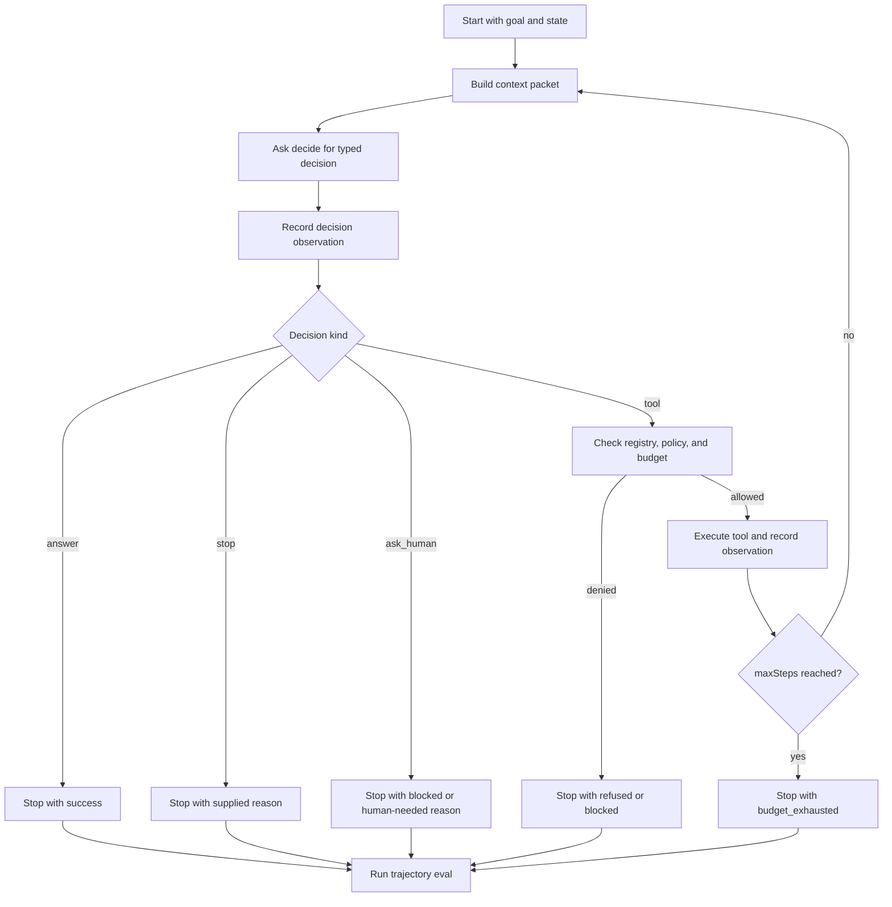

# Lab 09 - Construye un Agent Loop Mínimo

Descarga la [hoja de trabajo de finalización del laboratorio](/capstone-assets/templates/lab-completion-worksheet.txt) y la [hoja de trabajo de preparación para producción](/capstone-assets/templates/lab-production-readiness-worksheet.txt) antes de comenzar.

## Objetivo

Construye el runtime más pequeño y útil: un loop que recibe un goal, solicita una decisión tipada, actualiza el state y se detiene por una razón explícita.

## Qué Vas a Usar

- Lenguaje: TypeScript o Python
- Framework/runtime: runtime educativo hecho desde cero
- Lección agnóstica de framework: un agent es un loop controlado con state, decisiones, observaciones, presupuestos y razones de detención.
- Capítulos de patrones: [What Is An Agent?](/foundations/what-is-an-agent), [Agent Loop](/foundations/agent-loop), [Goals and State](/foundations/goals-and-state)
- Capítulo teórico: [Building a Minimal Agent Runtime](/agent-engineering-practice/building-a-minimal-agent-runtime)

## Tiempo Estimado del Ejercicio

Estas estimaciones asumen que las dependencias ya están instaladas.

| Ejercicio | Tiempo | Resultado |
| --- | ---: | --- |
| Ejecuta el baseline de referencia | 10 min | Salida de prueba mini-runtime exitosa. |
| Implementa o inspecciona el contrato del loop | 20-25 min | Límites tipados de state, decisión, observación y razón de detención. |
| Ejercita casos de fallo y presupuesto | 10-15 min | Comportamiento rechazado, bloqueado o con presupuesto agotado. |
| Revisa trace y razones de detención | 10-20 min | Notas sobre límites del runtime y resultados visibles para el llamador. |

## Configuración

Usa la referencia mantenida en TypeScript o crea tu propio archivo pequeño fuera del código de producción, como `scratch/minimal-agent-loop.ts` o `scratch/minimal_agent_loop.py`.

Archivos de referencia:

- `minimal-agent-runtime/typescript/src/runtime.ts`
- `minimal-agent-runtime/typescript/src/run_demo.ts`
- `minimal-agent-runtime/typescript/test/runtime.spec.ts`

Ejecuta primero la prueba de referencia:

```sh
npm run mini-runtime:test
```

Este laboratorio no requiere una clave de model. Usa una función determinista `decide` para que puedas probar el runtime sin variabilidad del model.

## Contrato del Runtime

Usa esta estructura si implementas la versión más pequeña en TypeScript:

```ts
type StopReason =
  | "success"
  | "blocked"
  | "budget_exhausted"
  | "invalid_decision"
  | "tool_failure";

type Decision =
  | { kind: "answer"; text: string }
  | { kind: "tool"; name: string; input: unknown }
  | { kind: "ask_human"; question: string }
  | { kind: "stop"; reason: StopReason };

type Observation = {
  kind: "decision" | "tool" | "system";
  summary: string;
};

type AgentState = {
  goal: string;
  steps: number;
  maxSteps: number;
  observations: Observation[];
  stopReason?: StopReason;
};
```

La implementación equivalente en Python puede usar dataclasses, diccionarios tipados o diccionarios simples. Mantén los mismos campos.

La referencia mantenida extiende este contrato con campos orientados a producción: `runId`, `toolsCalled`, memory con alcance, definiciones de tool, decisiones de policy, context packets, trace events y casos de trajectory eval. Comienza con el contrato pequeño y luego compara tu resultado con `minimal-agent-runtime/typescript/src/runtime.ts`.

## Cambio Guiado

Implementa `runAgent(state, decide)`.

El loop debe:

1. llamar a `decide(state)`;
2. registrar una observación para la decisión;
3. regresar con `success` cuando la decisión sea una respuesta;
4. regresar con la razón proporcionada cuando la decisión sea `stop`;
5. continuar para decisiones de tool, o ejecutar tools mediante un registro cuando uses el runtime de referencia;
6. detenerse con `budget_exhausted` cuando `steps` alcance `maxSteps`.

## Ejecución Baseline

Usa la demo de referencia:

```sh
npm run mini-runtime
```

Luego inspecciona el caso de respuesta inmediata en `minimal-agent-runtime/typescript/test/runtime.spec.ts`, o usa una función de decisión que responda de inmediato:

```ts
const answerImmediately = async (): Promise<Decision> => ({
  kind: "answer",
  text: "done",
});
```

## Resultado Esperado

El comando demo debe mostrar una trayectoria leída por policy:

```json
{
  "runId": "demo_001",
  "steps": 2,
  "toolsCalled": ["lookup_policy"],
  "answer": "Policy was checked and the draft can be prepared safely.",
  "stopReason": "success"
}
```

También debe incluir trace events con estos tipos:

```text
context_built
decision
policy_decision
tool_result
stop
```

El resultado de eval debe ser:

```json
{
  "status": "pass",
  "caseId": "demo-policy-read"
}
```

El caso de respuesta inmediata debe terminar con:

```text
stopReason: success
steps: 1
observations: at least one decision observation
```

El caso de tool repetido debe terminar con:

```text
stopReason: budget_exhausted
steps: maxSteps
```

La prueba de referencia también cubre:

| Caso | Señal Esperada |
| --- | --- |
| unknown tool | `stopReason: refused`; el tool desconocido no se ejecuta. |
| write tool sin aprobación | `stopReason: blocked`; `send_message` no se ejecuta. |
| policy de escritura permisiva | la respuesta final puede parecer exitosa, pero la trajectory eval falla porque se llamó a `send_message`. |
| memory con alcance | se incluye memory de task y project; la memory de user-scope se omite como `out_of_scope`. |



Usa este loop como el modelo de aceptación del laboratorio. El runtime, no el model, es dueño de los presupuestos, autoridad de tool, razones de detención, observaciones y evaluación final de la trayectoria.

## Caso de Falla

Usa una función de decisión que siempre solicite un tool:

```ts
const neverStops = async (): Promise<Decision> => ({
  kind: "tool",
  name: "search",
  input: { query: "keep going" },
});
```

Esta es la primera propiedad de seguridad de un agent runtime: el model no puede crear un loop infinito solo por seguir preguntando.

## Verifica

Revisa estas afirmaciones manualmente o con la prueba de referencia:

- la respuesta inmediata se detiene con `success`;
- las propuestas de tool repetidas se detienen con `budget_exhausted`;
- cada paso del loop registra una observación;
- el state final contiene una razón de detención.

La prueba de referencia cubre estos casos con decisiones deterministas, así que el resultado es estable entre máquinas.

## Puerta de Revisión del Lab

Antes de continuar, verifica el límite del loop:

| Revisión | Evidencia |
| --- | --- |
| Las decisiones son tipadas | El runtime maneja explícitamente answer, tool, ask-human y stop decisions. |
| Los cambios de state son visibles | Se registran goal, conteo de pasos, observaciones y razón de detención. |
| El presupuesto detiene el loop | Las propuestas repetidas de tool terminan con `budget_exhausted`. |
| El éxito es explícito | Las respuestas inmediatas se detienen con `success`. |
| El model no puede autorizar su propia continuación | `maxSteps` pertenece al runtime, no a la función de decisión. |
| La trajectory eval detecta riesgos ocultos | Una ejecución que envía un mensaje puede fallar en eval aunque la respuesta final diga éxito. |

Registra la ejecución de respuesta inmediata, ejecución de tool repetido, observaciones y razones de detención en la hoja de trabajo de finalización del laboratorio.

## Extensión para Producción

Antes de que este loop pueda ejecutar trabajo real, agrega:

- validación estructurada para decisiones producidas por el model;
- ejecución de tools mediante un registro;
- verificaciones de policy antes de efectos secundarios;
- trace events para cada decisión y detención;
- controles de cancelación y timeout;
- state durable si la ejecución puede pausarse o reanudarse.

## Puente a Producción

Usa esta tabla al adaptar el loop a producción:

| Concepto de Lab | Versión de Producción |
| --- | --- |
| `AgentState` | State durable de ejecución con actor, tenant, trace ID, presupuesto y datos de checkpoint. |
| `Decision` | Propuesta de model validada con schema, contexto de policy y metadatos de confianza. |
| `Observation` | Trace event con timestamp, span ID, status y clase de redacción. |
| `maxSteps` | Presupuesto de runtime con costo, latencia, reintentos, tool y límites de delegación. |
| `stopReason` | Razón visible para el operador ligada a evals, dashboards y revisión de incidentes. |

El primer hito de producción es un loop que siempre se detiene por una razón que los operadores pueden inspeccionar.

## Mapeo Entre Frameworks

- En LangGraph, el loop se expresa mediante recorrido de grafo, actualizaciones de state y edges.
- En Mastra AI, el loop está empaquetado dentro del comportamiento de agent y workflow runtime.
- En sistemas estilo AutoGen, el loop aparece como turnos de mensajes entre manager, worker y ejecutores de tool.
- En CrewAI, el loop se define por la ejecución del flow y el progreso del task.

## Capítulos relacionados

- [Construyendo un agent runtime mínimo](/agent-engineering-practice/building-a-minimal-agent-runtime)
- [Agent Loop](/foundations/agent-loop)
- [Goals y State](/foundations/goals-and-state)
- [Durable Workflows](/production-runtime/durable-workflows)
