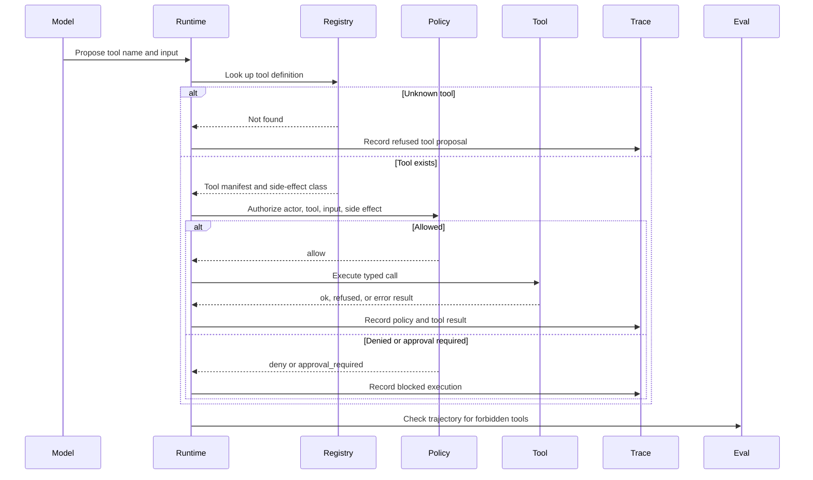

# Lab 10 - Construye un Tool Registry y Policy Gate

Descarga la [hoja de trabajo de finalización del laboratorio](/capstone-assets/templates/lab-completion-worksheet.txt) y la [hoja de trabajo de preparación para producción](/capstone-assets/templates/lab-production-readiness-worksheet.txt) antes de comenzar.

## Objetivo

Extiende el mini-runtime con un tool registry y un policy gate. El model puede proponer una llamada a un tool, pero el software decide si el tool existe, si la entrada es aceptable y si la policy permite la ejecución.

## Qué Vas a Usar

- Lenguaje: TypeScript o Python
- Framework/runtime: runtime educativo desde cero
- Lección agnóstica de framework: las descripciones de tools no son permisos; el registry y la policy son límites separados en el runtime.
- Capítulos de patterns: [Tool Use](/foundations/tool-use), [Tool Capability Design](/tools-skills-protocols/tool-capability-design), [Policy Enforcement](/production-runtime/policy-enforcement)
- Laboratorio anterior: [Lab 09 - Minimal Agent Loop](./lab-09-minimal-agent-loop.md)

## Presupuesto de Tiempo del Ejercicio

Estas estimaciones asumen que el loop de Lab 09 ya está disponible.

| Ejercicio | Tiempo | Resultado |
| --- | ---: | --- |
| Ejecuta el contrato base de tool | 10 min | Salida de prueba exitosa del mini-runtime. |
| Agrega checks de registry y policy | 20-25 min | Búsqueda de tool separada, manejo de schema y decisión de policy. |
| Ejercita casos de denegación y falla | 10-15 min | Señales de tool desconocido, aprobación requerida y falla de tool. |
| Revisa el límite de producción | 10-20 min | Notas sobre propiedad del registry, registros de aprobación y campos de trace. |

## Configuración

Parte del loop de Lab 09. Agrega un objeto registry o un mapa indexado por nombre de tool.

Usa tools deterministas. No llames sistemas externos en este laboratorio.

Archivos de referencia:

- `minimal-agent-runtime/typescript/src/runtime.ts`
- `minimal-agent-runtime/typescript/test/runtime.spec.ts`

Ejecuta la prueba de referencia antes de editar:

```sh
npm run mini-runtime:test
```

## Contrato de Runtime

```ts
type ToolResult =
  | { status: "ok"; data: unknown }
  | { status: "refused"; reason: string }
  | { status: "error"; reason: string };

type ToolDefinition = {
  name: string;
  description: string;
  sideEffect: "read" | "draft" | "write";
  execute(input: unknown): Promise<ToolResult>;
};

type PolicyDecision =
  | { status: "allow" }
  | { status: "deny"; reason: string }
  | { status: "approval_required"; reason: string };
```

## Cambio Guiado

Agrega dos tools:

```ts
const tools: Record<string, ToolDefinition> = {
  lookup_policy: {
    name: "lookup_policy",
    description: "Read policy guidance for the current task.",
    sideEffect: "read",
    execute: async input => ({ status: "ok", data: { input, policy: "approval required for writes" } }),
  },
  draft_message: {
    name: "draft_message",
    description: "Create a draft message for review.",
    sideEffect: "draft",
    execute: async input => ({ status: "ok", data: { draft: String(input) } }),
  },
};
```

Luego agrega la policy:

```ts
function authorize(tool: ToolDefinition): PolicyDecision {
  if (tool.sideEffect === "write") {
    return { status: "approval_required", reason: "write_tool_requires_approval" };
  }
  return { status: "allow" };
}
```

Actualiza el loop para que las decisiones de tool pasen por:

1. búsqueda en el registry;
2. decisión de policy;
3. ejecución del tool solo si está permitido;
4. registro de observaciones para resultados rechazados, denegados, aprobación requerida y exitosos.

## Ejecución Base

Usa el demo de referencia o una función de decisión que llame a `lookup_policy`.

```sh
npm run mini-runtime
```

## Resultado Esperado

La ruta permitida de read-tool en el demo de referencia debe incluir:

```text
toolsCalled: ["lookup_policy"]
observations include: lookup_policy:allow
observations include: lookup_policy:ok
trace includes: policy_decision
trace includes: tool_result
stopReason: success
```

La prueba de referencia cubre estas señales de rechazo y falla:

| Caso | Señal Esperada |
| --- | --- |
| Tool desconocido `delete_customer` | `stopReason: refused`; `delete_customer` no se ejecuta. |
| Write tool `send_message` | `stopReason: blocked`; `send_message` no se ejecuta porque se requiere aprobación. |
| Falla en read tool `flaky_lookup` | `stopReason: tool_failure`; el trace incluye `upstream_timeout`. |
| Policy permisiva insegura para write | La respuesta final puede ser `success`, pero el trajectory eval falla porque se llamó a `send_message`. |



Usa este flujo como el modelo de aceptación del laboratorio. El model puede proponer un tool, pero el registry, policy gate, trace y eval deciden si la ejecución está permitida y es revisable.

## Casos de Falla

Prueba estos casos:

1. Nombre de tool desconocido.
2. Tool con side effect `write`.
3. Ejecución de tool retorna `error`.
4. Policy permisiva que permite un write tool, por lo que el trajectory eval debe detectar la ruta insegura.

El comportamiento exacto de detención puede variar, pero el runtime no debe ejecutar silenciosamente tools prohibidos o desconocidos.

## Verifica

Revisa estas afirmaciones manualmente o con `npm run mini-runtime:test`:

- los tools desconocidos no se ejecutan;
- la policy se ejecuta antes de la ejecución;
- approval-required se representa como un state en el runtime;
- los resultados de tools son structured;
- las observaciones registran tanto rutas permitidas como rechazadas.

La prueba de referencia también demuestra que `send_message` se bloquea antes de la ejecución cuando la policy por defecto requiere aprobación para write tools.

## Lab Review Gate

Antes de continuar, verifica el límite de tool:

| Check | Evidencia |
| --- | --- |
| La búsqueda de tool es explícita | Los nombres de tools desconocidos se rechazan antes de la ejecución. |
| La policy se ejecuta antes de la ejecución | Los write tools producen `approval_required` antes de cualquier side effect. |
| Los resultados son structured | Los resultados de tools usan status `ok`, `refused` o `error`. |
| La clase de side-effect importa | Los tools de read, draft y write pueden ser gobernados de manera diferente. |
| Las observaciones preservan la ruta | Los resultados permitidos y rechazados son visibles en las observaciones del runtime. |

Registra la ruta permitida de read, el rechazo de tool desconocido, el requisito de aprobación para write-tool y el caso de error en la hoja de trabajo de finalización del laboratorio.

## Extensión para Producción

Antes de usar este pattern con tools reales, agrega:

- validación de input schema;
- claves de idempotencia;
- policy de timeout y retry;
- actor, tenant, route y approval context;
- IDs de trace para llamada propuesta, decisión de policy, ejecución y resultado;
- policies separadas para read, draft, write, comunicación externa, movimiento de dinero, memory write y ejecución de código.

## Puente a Producción

Usa esta tabla al adaptar el registry a producción:

| Concepto de Lab | Versión de Producción |
| --- | --- |
| Tool map | Registry de capability versionado con owner, permisos y switch de deshabilitado. |
| `ToolDefinition` | Tool manifest con schema, clase de side-effect, timeout, retry y campos de auditoría. |
| `authorize` | Policy engine usando actor, tenant, recurso, riesgo, presupuesto y approval context. |
| `approval_required` | Solicitud de aprobación durable con revisor, expiración, acción exacta y enlace de trace. |
| Observación de tool | Trace span con input propuesto, decisión, resultado, costo, latencia y redacción. |

El primer hito de producción es una ruta de tool que pueda probar por qué la ejecución fue permitida, denegada o pausada.

## Mapeo entre Frameworks

- En LangGraph, esto se puede implementar como un nodo de tool protegido por un nodo de policy.
- En Mastra AI, esto se mapea a definiciones de tool más policy a nivel de workflow o tool.
- En sistemas estilo AutoGen, esto se mapea a ejecución de función protegida por el manager o runtime.
- En CrewAI, esto se mapea a tools asignados por rol más restricciones a nivel de flujo.

## Capítulos Relacionados

- [Tool Use](/foundations/tool-use)
- [Tool Capability Design](/tools-skills-protocols/tool-capability-design)
- [Human Approval Gates](/tools-skills-protocols/human-approval-gates)
- [Policy Enforcement](/production-runtime/policy-enforcement)
