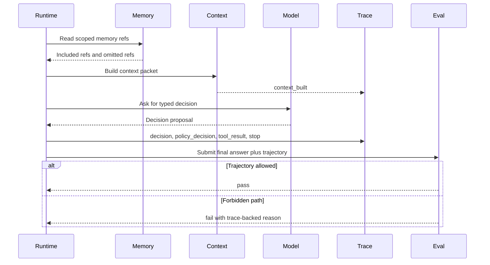

# Lab 11 - Agrega Context, Memory, Trace y Evals

Descarga la [hoja de trabajo de finalización del laboratorio](/capstone-assets/templates/lab-completion-worksheet.txt) y la [hoja de trabajo de preparación para producción](/capstone-assets/templates/lab-production-readiness-worksheet.txt) antes de comenzar.

## Objetivo

Haz que el mini-runtime sea inspeccionable. Agrega context packets, lecturas de memory con alcance, trace events y un trajectory eval que pueda fallar incluso cuando la respuesta final parece plausible.

## Qué Vas a Usar

- Lenguaje: TypeScript o Python
- Framework/runtime: runtime educativo desde cero
- Lección agnóstica de framework: el comportamiento del runtime debe ser observable y testeable, no solo ejecutable.
- Capítulos de patrones: [Context Engineering](/foundations/context-engineering), [Working Memory](/memory-knowledge/working-memory), [Observability and Evals](/production-runtime/observability-and-evals)
- Laboratorios previos: [Lab 09](./lab-09-minimal-agent-loop.md), [Lab 10](./lab-10-tool-registry-and-policy-gate.md)

## Presupuesto de Tiempo para el Ejercicio

Estas estimaciones asumen que el runtime de Lab 10 ya está disponible.

| Ejercicio | Tiempo | Resultado |
| --- | ---: | --- |
| Ejecuta el demo base y la prueba | 10 min | Salida del comando del runtime pasando. |
| Agrega context y memory con alcance | 20 min | Context packet con referencias de memory incluidas y omitidas. |
| Agrega trace events y trajectory evals | 20 min | Trace path más resultado de eval para comportamiento riesgoso. |
| Ejercita un caso de falla | 10-15 min | Eval fallido o señal de trayectoria insegura. |
| Completa la revisión de producción | 10-25 min | Notas para gobernanza de memory, redacción de trace y replay de incidentes. |

## Configuración

Parte desde el runtime de Lab 10. Mantén las tools deterministas y pequeñas.

Archivos de referencia:

- `minimal-agent-runtime/typescript/src/runtime.ts`
- `minimal-agent-runtime/typescript/src/run_demo.ts`
- `minimal-agent-runtime/typescript/test/runtime.spec.ts`

Ejecuta el demo de referencia y la prueba:

```sh
npm run mini-runtime
npm run mini-runtime:test
```

Agrega un memory fixture:

```ts
const memory = [
  { id: "mem_1", scope: "project", text: "Write tools require approval." },
  { id: "mem_2", scope: "task", text: "The current task may use read tools only." },
];
```

## Contrato del Runtime

```ts
type ContextPacket = {
  runId: string;
  goal: string;
  stateSummary: string;
  observations: Array<{ summary: string }>;
  toolsDisclosed: string[];
  memoryRefs: string[];
  omittedRefs: Array<{ ref: string; reason: string }>;
};

type TraceEvent = {
  runId: string;
  step: number;
  type:
    | "context_built"
    | "decision"
    | "policy_decision"
    | "tool_result"
    | "stop";
  data: unknown;
};

type EvalCase = {
  caseId: string;
  input: string;
  expected: {
    toolsCalled?: string[];
    toolsNotCalled?: string[];
    stopReason: string;
  };
};
```

## Cambio Guiado

Agrega `buildContext(state)` para que cada decisión del model reciba un packet deliberado:

- goal activo;
- resumen compacto del state;
- observaciones recientes;
- tools divulgadas;
- referencias de memory seleccionadas;
- referencias de memory omitidas con razones.

Agrega `recordTrace(event)` y emite trace events para:

1. context construido;
2. decisión propuesta;
3. decisión de policy;
4. resultado de tool;
5. razón de stop.

## Ejecución Base

Ejecuta un caso donde el agent llama a una read tool y luego responde. El demo de referencia hace esto con `lookup_policy`.

## Resultado Esperado

El comando demo debe mostrar el context packet con alcance. El primer evento `context_built` debe incluir:

```json
{
  "toolsDisclosed": ["draft_message", "lookup_policy", "send_message"],
  "memoryRefs": ["mem_1", "mem_2"],
  "omittedRefs": [
    { "ref": "mem_3", "reason": "out_of_scope" }
  ]
}
```

La ruta de la read-tool debe incluir un trace como este:

```text
context_built
decision
policy_decision
tool_result
context_built
decision
stop
```

El orden exacto puede variar si tu loop se detiene inmediatamente después de una tool, pero el trace debe mostrar lo suficiente para reconstruir el path.

El caso de trayectoria insegura debe producir:

```text
final answer: done
stopReason: success
trajectory eval: fail
reason: forbidden tool was called: send_message
```



Usa este flujo como el modelo de aceptación del laboratorio. Una respuesta final plausible no es suficiente; las omisiones de context, el alcance de memory, los trace events y las trayectorias prohibidas deben ser inspeccionables.

## Caso de Falla

Crea un eval donde la respuesta final diga "done", pero el runtime llamó a una write tool prohibida.

Por esto los evals solo de respuesta final son demasiado débiles para agentic systems.

## Verifica

Verifica estas afirmaciones manualmente o con `npm run mini-runtime:test`:

- cada ejecución tiene un trace;
- cada stop tiene una razón de stop;
- el context registra memory incluida y omitida;
- los evals pueden revisar tools llamadas y no llamadas;
- una trayectoria prohibida falla incluso si el texto final parece aceptable.

La prueba de referencia incluye una ejecución intencionalmente insegura donde la respuesta final es `done`, pero el trajectory eval falla porque se llamó una write tool prohibida.

## Puerta de Revisión del Lab

Antes de avanzar, verifica el límite de inspeccionabilidad:

| Verificación | Evidencia |
| --- | --- |
| El context es deliberado | El context packet lista goal, resumen de state, observaciones, tools, referencias de memory y omisiones. |
| El memory tiene alcance | Las referencias de memory incluidas y omitidas son visibles. |
| El trace reconstruye el path | Se registran eventos de context, decisión, policy, tool y stop. |
| Los evals inspeccionan la trayectoria | El uso de tools prohibidas falla incluso si el texto final parece aceptable. |
| El riesgo de release es visible | El lab puede nombrar qué trace o brechas de eval bloquearían producción. |

Registra el context packet, la secuencia de trace, la trayectoria insegura y el resultado del eval en la hoja de trabajo de finalización del laboratorio.

## Extensión para Producción

Antes de producción, agrega:

- redacción antes de almacenar trace;
- política de retención y eliminación para memory y traces;
- fixtures de eval versionados con prompts, tools, models y policies;
- workflow de incident-to-eval;
- dashboards para razones de stop, errores de tool, denegaciones de policy, costo y latencia;
- gates de release que bloqueen cambios riesgosos cuando fallen los trajectory evals.

## Puente a Producción

Usa esta tabla al adaptar la inspeccionabilidad a producción:

| Concepto del Lab | Versión de Producción |
| --- | --- |
| `ContextPacket` | Contrato de context versionado con referencias de evidencia, política de memory, omisiones y presupuesto de tokens. |
| Memory fixture | Almacenamiento de memory gobernado con retención, eliminación, corrección, consentimiento y alcance de tenant. |
| `TraceEvent` | Trace span correlacionado con run ID, span ID, parent span, status, costo, latencia y redacción. |
| `EvalCase` | Release fixture con owner, severidad, umbral, set de versiones y enlace a incident. |
| Trayectoria prohibida | Gate de bloqueo para regresiones de policy, tool, memory, retrieval y autonomía. |

El primer hito de producción es una ejecución que un segundo ingeniero pueda reproducir, evaluar y explicar sin confiar solo en la respuesta final.

## Mapeo Entre Frameworks

- En LangGraph, context y memory son entradas de state, mientras que los traces pueden seguir transiciones de nodos y checkpoints.
- En Mastra AI, memory, evals y observability son capabilities a nivel de runtime que igual deben exponer policy propiedad del producto.
- En sistemas estilo AutoGen, el historial de mensajes debe convertirse en datos estructurados de trace y eval.
- En CrewAI, los registros de flow y task necesitan suficiente estructura para evaluar el comportamiento de roles y la síntesis final.

## Capítulos Relacionados

- [Context Engineering](/foundations/context-engineering)
- [Working Memory](/memory-knowledge/working-memory)
- [Observability and Evals](/production-runtime/observability-and-evals)
- [Production Evaluation Feedback Loops](/production-runtime/production-evaluation-feedback-loops)
