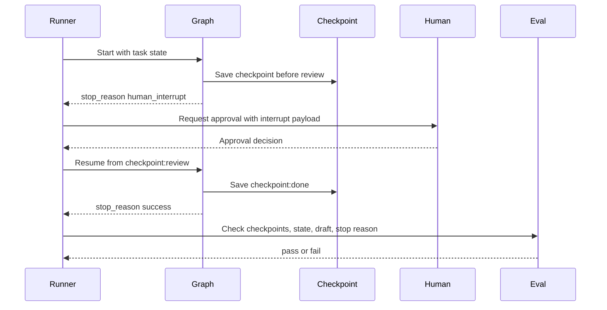
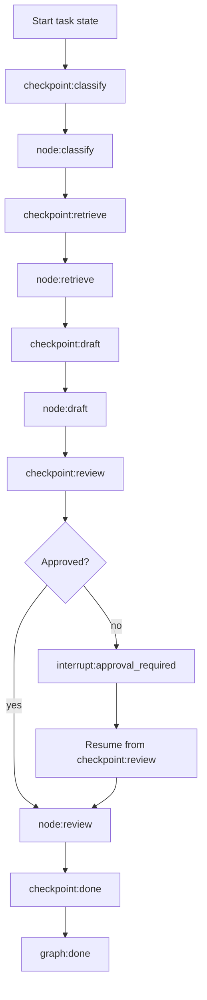

# Lab 12 - Modela grafos de state, checkpoints e interrupts

Descarga la [hoja de ejercicios guiados de Lab 12 state graph](/capstone-assets/templates/lab-12-state-graph-guided-exercise.txt), la [hoja de finalización del laboratorio](/capstone-assets/templates/lab-completion-worksheet.txt) y la [hoja de preparación para producción del laboratorio](/capstone-assets/templates/lab-production-readiness-worksheet.txt) antes de comenzar.

## Objetivo

Usa un grafo de state en Python estilo LangGraph para hacer explícitos el state, los nodos, los edges, los checkpoints, los interrupts y el comportamiento de resume.

## Qué Vas a Usar

- Lenguaje: Python
- Framework/runtime: grafo de state estilo LangGraph
- Lección agnóstica de framework: la ejecución basada en grafos es valiosa cuando importan las transiciones de state, ramificación, pausa/resume y observabilidad a nivel de nodo.
- Terminología oficial revisada: LangGraph graph state, nodes, edges, checkpoints e interrupts.
- Capítulos de patterns: [Agent Loop](/foundations/agent-loop), [Goals and State](/foundations/goals-and-state), [Durable Workflows](/production-runtime/durable-workflows)
- Archivos fuente:
  - `langgraph-state-graph-pattern/python/state_graph.py`
  - `langgraph-state-graph-pattern/python/test_state_graph.py`
- Descarga: [langgraph-state-graph.zip](/downloads/langgraph-state-graph.zip)

## Tiempo Estimado del Ejercicio

Estas estimaciones asumen que las dependencias ya están instaladas.

| Ejercicio | Tiempo | Output |
| --- | ---: | --- |
| Configuración y ejecución base del grafo | 10 min | Demo y output de prueba. |
| Inspeccionar state, nodes y checkpoints | 20 min | Notas sobre el schema de state, límites de nodo y ubicación de checkpoints. |
| Ejercicio de interrupt y resume | 20 min | Evidencia de trace interrumpido y trace reanudado. |
| Revisar fallo de checkpoint y seguridad de replay | 20-25 min | Aserción fallida o nota de riesgo de replay. |
| Comparar grafo nativo y puente de producción | 10-30 min | Mapeo al grafo nativo, checkpointer durable y approval payload. |

## Configuración

Desde la raíz del repositorio:

```sh
npm install
```

Este laboratorio es determinista y no requiere una model key. Modela el contrato de ejecución de LangGraph sin dependencias externas, por lo que el comportamiento del state es fácil de inspeccionar.

## Ejecútalo

```sh
npm run langgraph-state
npm run langgraph-state:test
```

## Resultado Esperado

El comando de prueba debe imprimir:

```text
LangGraph-style state graph tests OK
```

La primera ejecución debe detenerse en la aprobación humana:

```text
stop_reason: human_interrupt
trace includes checkpoint:review
trace includes interrupt:approval_required
```

La ejecución reanudada debe comenzar desde el nodo de revisión con aprobación:

```text
stop_reason: success
trace: checkpoint:review -> node:review -> checkpoint:done -> graph:done
```

El comando demo debe imprimir dos ejecuciones del grafo. Usa estos campos como verificación rápida:

```text
first.state.stop_reason: human_interrupt
first.state.interrupted: True
first.trace: ... checkpoint:review, node:review, interrupt:approval_required
first.eval.status: pass

resumed.state.stop_reason: success
resumed.state.approved: True
resumed.state.draft: Draft a refund response for human review; do not promise payment.
resumed.trace: checkpoint:review, node:review, checkpoint:done, graph:done
resumed.eval.status: pass
```



Usa este flujo como modelo de aceptación del laboratorio. Una ejecución correcta debe probar dónde se pausó, qué state sobrevivió, qué approval lo reanudó y por qué el grafo se detuvo.

Punto de comparación con LangGraph nativo:

```text
native-framework-examples/langgraph-refund/
download: /downloads/native-langgraph-refund.zip
graph: StateGraph
checkpointer: InMemorySaver for local development
interrupt: finance approval
eval gate: draft stops before money movement
```

## Ejercicios Guiados

Usa estos ejercicios para demostrar que pause, resume y replay son comportamientos de grafo de primera clase.

| Ejercicio | Tiempo | Qué Hacer | Evidencia a Guardar |
| --- | ---: | --- | --- |
| Trace de ejecución interrumpida | 10 min | Ejecuta `npm run langgraph-state`. | `checkpoint:review`, `interrupt:approval_required` y `stop_reason: human_interrupt`. |
| Trace de ejecución reanudada | 10 min | Inspecciona la ejecución reanudada después de la aprobación. | El trace inicia en `checkpoint:review` y termina en `graph:done`. |
| Falla de checkpoint | 15 min | Remueve temporalmente `checkpoint(run, node)` antes de la ejecución del nodo y vuelve a ejecutar la prueba. | La aserción fallida o razón del eval. |
| Revisión de seguridad de replay | 15 min | Decide qué nodos serían inseguros de reproducir en producción. | Nombre del nodo, side effect, idempotency key y requisito de checkpoint. |
| Comparación nativa | 20 min | Compara este laboratorio con `native-framework-examples/langgraph-refund/`. | State schema, checkpointer, interrupt y mapeo de eval. |



## Ejercicio de Falla en Checkpoint y Resume

El laboratorio no está completo hasta que puedas explicar qué falla cuando desaparecen los checkpoints. Remueve la llamada al checkpoint antes de la ejecución del nodo, ejecuta la prueba y luego restáurala:

```sh
npm run langgraph-state:test
```

Registra la falla en la hoja de trabajo:

| Pregunta de Revisión | Respuesta Esperada |
| --- | --- |
| ¿Dónde se pausó la primera ejecución? | `checkpoint:review` antes de `interrupt:approval_required`. |
| ¿Qué sobrevivió al resume? | Intent, evidence, draft, approval state y stop reason context. |
| ¿Qué nunca debe reproducirse a ciegas? | Cualquier nodo que lea state externo, escriba state, envíe mensajes o mueva dinero. |
| ¿Qué prueba la ruta reanudada? | El trace inicia en `checkpoint:review` y llega a `graph:done`. |

## Inspecciona el Código

Abre `langgraph-state-graph-pattern/python/state_graph.py` y encuentra estos límites:

- `GraphState`: state compartido del grafo.
- `NODES`: funciones de nodo que actualizan el state.
- `EDGES`: control de flujo de un nodo al siguiente.
- `checkpoint`: snapshot del state antes de la ejecución del nodo.
- `review`: punto de interrupt cuando falta la aprobación humana.
- `run_graph(..., resume_from=...)`: ruta de resume desde un state guardado.
- `evaluate_graph`: eval de trayectoria sobre checkpoints, state y stop reason.

## Ejecución Base

Esta es la lección central de state-graph: el runtime no debería tener que reproducir clasificación, retrieval y drafting cuando un checkpoint guardado es suficiente.

## Cambia Una Cosa

Remueve la llamada a `checkpoint(run, node)` antes de la ejecución del nodo.

Fallo esperado: la prueba debe fallar porque el grafo ya no puede probar dónde se pausó y reanudó.

Restaura la llamada a checkpoint y vuelve a ejecutar:

```sh
npm run langgraph-state:test
```

## Verifica

Revisa que:

- cada límite de nodo pueda crear un checkpoint;
- el state de interrupt sea explícito;
- resume inicie desde un nodo conocido;
- evidence recuperada y draft state sobrevivan al resume;
- los evals inspeccionen la trayectoria y el state, no solo el texto final.
- el éxito sin un draft falla la evaluación.

## Puerta de Revisión del Lab

Antes de continuar, verifica el límite del grafo:

| Revisión | Evidencia |
| --- | --- |
| El state es explícito | `GraphState` lleva los datos que cada nodo necesita y muta. |
| Los límites de nodo son visibles | Cada nodo produce cambios de state trazables. |
| Los checkpoints prueban pausa y resume | `checkpoint:review` existe antes de interrupt y resume. |
| El interrupt está controlado | La aprobación humana es un stop estructurado, no una convención oculta de prompt. |
| Eval revisa la trayectoria | El evaluator revisa checkpoints, state y stop reason. |

Registra la ejecución interrumpida, la ejecución reanudada, el checkpoint, el approval payload y el resultado del eval en la hoja de finalización del laboratorio.

## Extensión para Producción

Antes de usar una implementación real de LangGraph en producción, agrega:

- almacenamiento durable para checkpointer;
- IDs de thread para state independiente de usuario/task;
- idempotency alrededor de side effects de nodo;
- schemas de state tipados y reducers;
- payloads de interrupt para aprobación humana;
- pruebas de replay para ejecuciones fallidas, interrumpidas y reanudadas;
- exportación de trace para inputs, outputs, errores y stop reasons de nodos.

## Puente a Producción

Usa esta tabla al adaptar el graph a producción:

| Concepto de laboratorio | Versión de producción |
| --- | --- |
| `GraphState` | state schema versionado con migración, aislamiento de tenant y reglas de eliminación. |
| Node function | Paso idempotente con input tipado, output, verificación de policy y trace span. |
| Checkpoint | checkpointer durable indexado por thread ID, run ID, tenant y version set. |
| Interrupt | Solicitud de aprobación con acción exacta, rol de revisor, expiración y resume token. |
| `evaluate_graph` | Release gate sobre route, checkpoints, state diff, side effects y stop reason. |

El primer hito de producción es una ejecución del graph que pueda pausar, reanudar y demostrar que no repite trabajo inseguro.

## Extensión Nativa del Framework

Después de que el laboratorio determinista pase, porta una vertical slice a una app real de LangGraph. Usa [Real Framework Setup Notes](/agent-engineering-practice/real-framework-setup-notes) para guiar la configuración y compara tu trabajo con el ejemplo del repositorio en `native-framework-examples/langgraph-refund/`.

Pasos para el port nativo:

1. define el state schema del graph desde `GraphState`;
2. convierte funciones deterministas en node functions;
3. expresa decisiones de route como edges condicionales;
4. compila el graph con un checkpointer;
5. usa un interrupt para aprobación humana en vez de una bandera local de stop;
6. agrega una estrategia de thread ID que prevenga acceso cross-tenant al state;
7. agrega evals sobre el output final, state diff, route seleccionada, checkpoints y stop reason.

No consideres el port nativo completo hasta que demuestre:

| Requisito | Evidencia |
| --- | --- |
| interrupt puede pausar de forma segura | checkpoint guardado y approval payload |
| resume no repite side effects previos | idempotency key o registro de side-effect |
| state es inspeccionable | state serializado y nota de migración |
| trace es útil | spans de node, tool, policy, interrupt y eval |
| rollback es posible | deshabilita una route del graph o tool |

Esta extensión mapea directamente al [Support Refund Agent capstone](/capstone-projects/support-refund-agent) y [Research RAG Agent capstone](/capstone-projects/research-rag-agent). El ejemplo nativo es intencionalmente pequeño: prueba state, interrupt, resume y eval antes de agregar order tools reales o llamadas a model.

## Solución de Problemas

| Síntoma | Causa probable | Solución |
| --- | --- | --- |
| resume reinicia trabajo anterior | el graph no tiene checkpointer o thread ID estable | Compila con un checkpointer y pasa un `thread_id` seguro para tenant. |
| side effects se repiten tras resume | el node de side-effect no es idempotente | Mueve side effects detrás de idempotency keys o approval records. |
| approval payload es difícil de auditar | los datos de interrupt no están estructurados | Guarda ticket ID, draft ID, rol de approver, expiración y acción solicitada en el payload de interrupt. |
| las migraciones de state no son claras | el state schema solo es implícito | Versiona el state schema y documenta reglas de migración antes de producción. |
| trace solo muestra el output final | faltan spans de node | Emite eventos de node, tool, policy, interrupt, resume y eval. |

## Mapeo Entre Frameworks

- En LangGraph, esto mapea directamente a graph state, nodes, edges, checkpoints e interrupts.
- En Mastra AI, la misma responsabilidad puede representarse como workflow steps, memory y runtime traces.
- En sistemas estilo AutoGen, el checkpointing usualmente requiere transcript explícito y task state fuera de la conversación.
- En CrewAI, flow state provee el límite de control durable equivalente mientras crews realizan trabajo delegado.

## Capítulos Relacionados

- [Goals and State](/foundations/goals-and-state)
- [Agent Loop](/foundations/agent-loop)
- [Durable Workflows](/production-runtime/durable-workflows)
- [Observability and Evals](/production-runtime/observability-and-evals)
- [Support Refund Agent Capstone](/capstone-projects/support-refund-agent)
- [Research RAG Agent Capstone](/capstone-projects/research-rag-agent)
