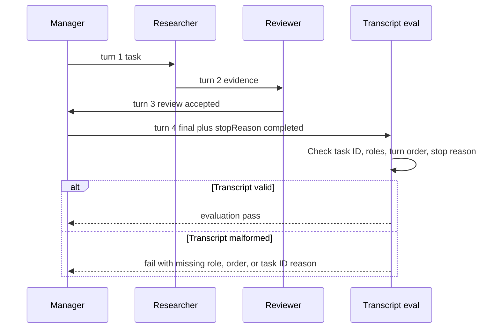

# Lab 13 - Evaluar Transcripts Multi-Agent

Descarga la [hoja de trabajo de finalización del laboratorio](/capstone-assets/templates/lab-completion-worksheet.txt) y la [hoja de trabajo de preparación para producción](/capstone-assets/templates/lab-production-readiness-worksheet.txt) antes de comenzar.

## Objetivo

Usa una conversación estilo AutoGen de equipo para hacer explícitos los agents, turnos de equipo, mensajes estructurados, propiedad del transcript, terminación y transcript evals.

## Qué Vas a Usar

- Lenguaje: TypeScript
- Framework/runtime: transcript de equipo AgentChat estilo AutoGen
- Lección agnóstica de framework: la colaboración multi-agent necesita un transcript revisable y evals que verifiquen quién dijo qué, en qué orden y por qué el equipo se detuvo.
- Terminología oficial revisada: agents, teams, messages y comportamiento observable de equipo de AutoGen AgentChat.
- Capítulos de patrones: [Supervisor / Worker](/multi-agent-systems/supervisor-worker), [Task Delegation](/multi-agent-systems/task-delegation), [Observability and Evals](/production-runtime/observability-and-evals)
- Archivos fuente:
  - `autogen-transcript-pattern/typescript/src/team_transcript.ts`
  - `autogen-transcript-pattern/typescript/src/run_demo.ts`
  - `autogen-transcript-pattern/typescript/test/team_transcript.spec.ts`
- Descarga: [autogen-transcript.zip](/downloads/autogen-transcript.zip)

## Presupuesto de Tiempo del Ejercicio

Estas estimaciones asumen que las dependencias ya están instaladas.

| Ejercicio | Tiempo | Salida |
| --- | ---: | --- |
| Configuración y ejecución base del transcript | 10 min | Salida de demo y test. |
| Inspeccionar schema del transcript y orden de turnos | 15 min | Notas sobre sender, recipient, type, task ID, turn y stop reason. |
| Ejercitar casos de falla del transcript | 20 min | Señal de falla por missing-role, wrong-order o task-ID. |
| Comparar comportamiento nativo del equipo | 10-15 min | Mapeo a agents, team, messages y termination estilo AutoGen. |
| Completar gate de transcript de producción | 10-30 min | Notas para redacción, replay, retención, permisos de rol y eval gates. |

## Configuración

Desde la raíz del repositorio:

```sh
npm install
```

Este laboratorio es determinista y no requiere una clave de model. Modela el contrato de transcript de equipo sin llamadas en vivo al model.

## Ejecútalo

```sh
npm run autogen-transcript
npm run autogen-transcript:test
```

## Resultado Esperado

El comando de test debe imprimir:

```text
AutoGen-style transcript tests OK
```

El transcript debe incluir este flujo de roles:

```text
manager -> researcher: task
researcher -> reviewer: evidence
reviewer -> manager: review
manager -> team: final
```

El state final debe incluir:

```text
stopReason: completed
evaluation: pass
```

El comando demo debe incluir esta estructura de transcript de cuatro mensajes:

```text
turn 1: manager -> researcher, type: task
turn 2: researcher -> reviewer, type: evidence
turn 3: reviewer -> manager, type: review, accepted: true
turn 4: manager -> team, type: final
```

Cada mensaje debe llevar el mismo task ID:

```text
taskId: autogen_style_001
```



Usa este flujo como el modelo de aceptación del laboratorio. La respuesta final no es suficiente; el transcript debe probar evidencia, revisión, propiedad final y la razón por la que el equipo se detuvo.

El test del repositorio también revisa tres casos de transcript malformados:

| Caso | Falla Esperada |
| --- | --- |
| researcher evidence removed | `missing role: researcher` y `missing message type: evidence` |
| final message before review | `review must precede final` |
| mismatched task ID | `message task IDs do not match team task` |

Punto de comparación nativo de AutoGen:

```text
native-framework-examples/autogen-delivery/
download: /downloads/native-autogen-delivery.zip
team: RoundRobinGroupChat
agents: delivery_manager, delivery_planner, risk_reviewer, test_planner
termination: TextMentionTermination("ACCEPTED") OR MaxMessageTermination(8)
eval gate: delivery_transcript_acceptance
```

## Inspecciona el Código

Abre `autogen-transcript-pattern/typescript/src/team_transcript.ts` y encuentra estos límites:

- `TeamMessage`: evento estructurado de transcript.
- `Agent`: participante nombrado con contrato de respuesta.
- `createTeam`: roles de manager, researcher y reviewer.
- `runTeam`: secuencia fija de turnos de equipo y terminación.
- `evaluateTranscript`: criterios de aceptación a nivel de transcript.

El transcript es el core artifact. Debe mostrar asignación de task, evidencia, revisión, síntesis final y stop reason.

## Ejecución Base

Usa el resultado esperado arriba como el contrato base del transcript.

## Cambia Una Cosa

Elimina el turno de researcher o cambia su tipo de mensaje de `evidence` a `final`.

Falla esperada: el transcript eval debe fallar porque el equipo ya no puede probar que la evidencia precedió a la revisión y síntesis final.

Restaura el turno de researcher y vuelve a ejecutar:

```sh
npm run autogen-transcript:test
```

## Verifica

Revisa que:

- cada mensaje tenga sender, recipient, type, task ID y número de turn;
- todos los roles requeridos aparezcan en el transcript;
- los números de turn sean secuenciales;
- los task IDs coincidan con el team task;
- la evidencia preceda a la revisión, y la revisión preceda al final;
- la salida final no omita la revisión humana;
- el stop reason sea explícito;
- los transcript evals fallen si faltan roles o el flujo de mensajes está mal formado.

## Gate de Revisión del Lab

Antes de continuar, verifica el límite del transcript:

| Revisión | Evidencia |
| --- | --- |
| Los mensajes son estructurados | Sender, recipient, type, task ID y número de turn están presentes. |
| Los roles son requeridos | Manager, researcher y reviewer aparecen antes de la salida final. |
| El orden de turnos es forzado | La evidencia precede a la revisión y la revisión precede a la síntesis final. |
| La terminación es explícita | El equipo se detiene con `completed`, no con un mensaje final ambiguo. |
| Eval protege el transcript | Roles faltantes o flujo mal formado fallan el transcript eval. |

Registra el transcript, stop reason, caso de transcript fallido y resultado de eval en la hoja de trabajo de finalización del laboratorio.

## Extensión para Producción

Antes de usar una implementación real de AutoGen en producción, agrega:

- schemas de mensajes para cada evento del equipo;
- condiciones de terminación y presupuestos de turnos máximos;
- registros de tool-call y human-input en el transcript;
- redacción antes de almacenar el transcript;
- transcript replay y regression evals;
- contratos de rol por agent y límites de permisos;
- notas de migración si adoptas Microsoft Agent Framework para nuevos proyectos.

## Puente a Producción

Usa esta tabla al adaptar transcript evals a producción:

| Concepto de Lab | Versión de Producción |
| --- | --- |
| `TeamMessage` | Schema de evento normalizado con campos de role, task, turn, tool, approval y redaction. |
| Agent role | Contrato con tools permitidos, autoridad, ruta de model y schema de salida. |
| Secuencia fija de equipo | policy de terminación más presupuesto de turnos máximos y regla de escalamiento. |
| Transcript eval | Release gate para orden de roles, permiso de tool, owner final, stop reason y seguridad. |
| Conversación cruda | Almacenamiento de transcript redactado con replay, retención, eliminación y enlaces a incidentes. |

El primer hito de producción es un transcript que pueda probar quién fue owner de la respuesta final y por qué el equipo se detuvo.

## Extensión Nativa del Framework

Después de que el laboratorio determinista pase, porta una vertical slice a un equipo real de AutoGen AgentChat. Usa las [Notas de Configuración de Framework Real](/agent-engineering-practice/real-framework-setup-notes) como guía de instalación y compara tu trabajo con el ejemplo del repositorio en `native-framework-examples/autogen-delivery/`.

Pasos para el port nativo:

1. define roles de AssistantAgent que correspondan con los contratos deterministas de manager, researcher y reviewer;
2. define reglas de terminación del equipo y presupuestos máximos de turnos;
3. persiste eventos de mensajes estructurados fuera del chat transcript sin procesar;
4. envuelve tools para que los permisos y efectos secundarios se apliquen fuera del texto del model;
5. redacta el contenido del transcript antes de almacenarlo;
6. reproduce transcripts a través de evals que verifiquen el orden de roles, llamadas a tools, owner final y motivo de detención;
7. documenta rollback para deshabilitar la delegación multi-agent.

Los transcript evals deben revisar más que el texto final:

| Check | Failure It Catches |
| --- | --- |
| required roles present | especialización falsa o revisión omitida |
| turn order valid | respuesta final antes de evidencia o revisión |
| stop reason explicit | comportamiento de equipo interminable o ambiguo |
| tool calls permissioned | un worker usa un tool fuera de su rol |
| final owner present | no hay un límite claro de aceptación responsable |

Estándar de finalización: el proyecto nativo debe probar las mismas garantías de transcript que este laboratorio y enlazar al [Multi-Agent Delivery Workflow capstone](/capstone-projects/multi-agent-delivery-workflow). Un equipo nativo de AutoGen no está completo solo porque los agents intercambian mensajes; el sistema debe normalizar el transcript, preservar el stop reason y reproducirlo con evals.

## Resolución de Problemas

| Symptom | Likely Cause | Fix |
| --- | --- | --- |
| el equipo corre hasta el límite de mensajes | la frase de terminación falta o es demasiado ambigua | Agrega una frase explícita `TextMentionTermination` y requiere que solo el final owner la use. |
| eval no puede probar el orden de roles | el chat sin procesar no está normalizado | Almacena sender, recipient, message type, task ID, turn number y stop reason fuera del transcript sin procesar. |
| el rol de reviewer o tester se omite | la composición del equipo o la policy de turnos es demasiado laxa | Usa un bounded team pattern y evalúa los roles requeridos antes de aceptar el output. |
| falla la importación del provider o el cliente del model | falta el paquete de extensión opcional de AutoGen | Instala `autogen-ext[openai]` o la extensión del provider usada por el proyecto. |
| nueva preocupación del proyecto | el estado de mantenimiento de AutoGen es un riesgo | Compara AutoGen con Microsoft Agent Framework antes de comprometer la arquitectura de plataforma a largo plazo. |

## Mapeo Entre Frameworks

- En LangGraph, la misma colaboración puede representarse como graph nodes o subgraphs con state explícito.
- En Mastra AI, un workflow puede coordinar agents y tools mientras los traces capturan el camino.
- En sistemas estilo AutoGen, el team transcript es el artifact de ejecución revisable.
- En CrewAI, crews y role tasks producen salidas colaborativas similares, mientras que los flows son responsables de la aceptación.

## Capítulos Relacionados

- [Supervisor / Worker](/multi-agent-systems/supervisor-worker)
- [Task Delegation](/multi-agent-systems/task-delegation)
- [Choosing Multi-Agent Topology](/multi-agent-systems/choosing-multi-agent-topology)
- [Production Evaluation Feedback Loops](/production-runtime/production-evaluation-feedback-loops)
- [Multi-Agent Delivery Workflow Capstone](/capstone-projects/multi-agent-delivery-workflow)
