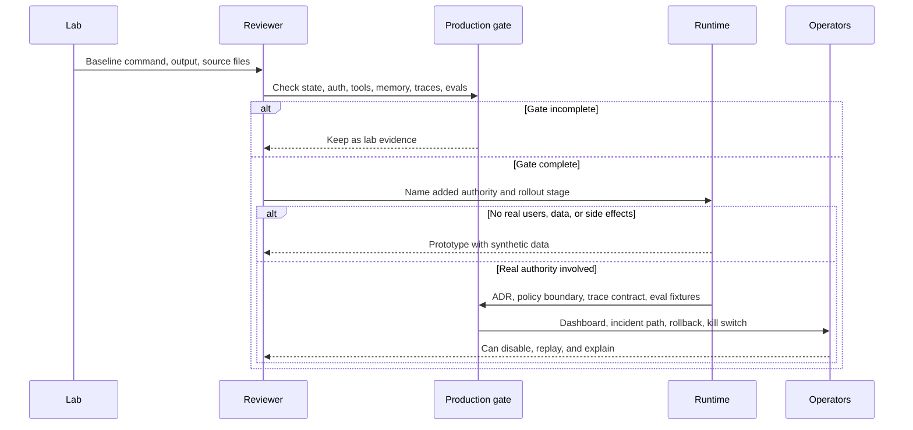

# Lista de verificación de preparación para producción del laboratorio

Los laboratorios son implementaciones didácticas. Esta lista de verificación define lo que debe agregarse antes de que un pattern de laboratorio se convierta en trabajo de producción.

Úsala después de completar un laboratorio. El objetivo es identificar el siguiente límite de ingeniería: persistencia, autorización, reintentos, idempotencia, observabilidad, eval gates, despliegue y rollback. Para el camino completo hacia producción, continúa con [Deployment Walkthrough](../production-runtime/deployment-walkthrough), [Templates and Worksheets](../agent-engineering-practice/templates-and-worksheets) y el [10/10 Production Gate](../publishing/ten-out-of-ten-production-gate).

Descarga el artifact reutilizable para revisión de producción: [10/10 production gate scorecard](/capstone-assets/templates/ten-out-of-ten-production-gate-scorecard.txt).

Descarga la hoja de trabajo específica del laboratorio: [lab production readiness worksheet](/capstone-assets/templates/lab-production-readiness-worksheet.txt).

## Universal Production Gate

Cada laboratorio necesita estos controles antes de involucrar usuarios reales, datos reales o efectos secundarios reales:

| Gate | Evidencia requerida |
| --- | --- |
| State ownership | State schema, owner, persistence strategy, migration plan y replay story. |
| Auth and permissions | Actor identity, tenant/resource scope, tool permissions, approval rules y audit records. |
| Tool safety | Input schemas, side-effect class, idempotency key, timeout, retry policy y error contract. |
| Memory safety | Retention, deletion, redaction, consent, correction path y write policy. |
| Observability | Trace IDs, model/tool events, policy decisions, costs, latency, stop reasons y redaction. |
| Eval gates | Golden tasks, negative cases, trajectory checks, safety checks y release-blocking thresholds. |
| Deployment | Runtime owner, environment config, secrets, scaling limits, rollback, kill switch y incident path. |
| Human control | Approval UI/API, escalation rules, cancellation, reviewer identity y expiry. |



Usa este flujo antes de cambiar acceso, datos o autoridad. Un laboratorio solo puede avanzar cuando la siguiente etapa tiene evidencia revisable, no solo porque el comando de ejemplo se ejecutó una vez.

## Lab Review Questions

Usa estas preguntas antes de que un sistema derivado de laboratorio se convierta en un product slice:

| Pregunta | Evidencia requerida |
| --- | --- |
| ¿Qué demostró el laboratorio? | Baseline command, expected output, source files y success signal. |
| ¿Qué no demostró el laboratorio? | Falta de persistencia, policy, observability, evals, deployment, rollback o human control. |
| ¿Qué autoridad agregará producción? | Read data, write tools, memory, messages, approvals, money movement o workflow execution. |
| ¿Qué debe fallar cerrado? | Missing config, missing policy context, unsafe tool input, stale evidence y failed evals. |
| ¿Cuál es el siguiente artifact de producción? | ADR, trace contract, eval fixture, runbook, checklist, dashboard o rollback plan. |

El laboratorio es un artifact de aprendizaje hasta que estas respuestas existan en documentos de ingeniería revisables.

## Promotion Ladder

Usa esta escalera para decidir para qué está listo el output del laboratorio.

| Etapa | Uso permitido | Evidencia requerida | Condición de detención |
| --- | --- | --- | --- |
| Lab evidence | Aprendizaje, comparación y discusión de diseño. | Baseline command, success signal, source files inspeccionados y una ruta de falla conocida. | No conectar usuarios reales, datos privados, credenciales ni efectos secundarios. |
| Prototype | Demo interna con datos sintéticos. | Lab evidence más schemas básicos, prueba determinística y gaps de producción identificados. | Detener si la demo requiere credenciales reales o acceso amplio a tools. |
| Product slice | Workflow interno limitado con datos controlados. | ADR, policy boundary, trace contract, eval fixtures, owner y nota de rollback. | Detener si falta policy, trace o rollback. |
| Pilot | Despliegue pequeño con usuarios reales o datos reales. | Production gate scorecard, approval rules, incident path, dashboard y release gate. | Detener o hacer rollback ante evals bloqueantes fallidos, trace spans faltantes o efectos secundarios inseguros. |
| Production candidate | Lanzamiento controlado en producción. | Evidencia de deployment walkthrough, runbook, kill switch, rollback path y eval report actual. | Detener si los operadores no pueden deshabilitar, replay o explicar la ejecución. |

No saltes etapas solo porque un ejemplo de framework se ejecuta exitosamente. Un comando exitoso prueba la ejecución; no prueba autoridad, observabilidad, recuperación ni seguridad de lanzamiento.

## Per-Lab Readiness Matrix

| Laboratorio | Adiciones para producción |
| --- | --- |
| Lab 01 - Tool-Using Agent | Tool schemas, side-effect labels, permission checks, idempotency, timeout/retry y audit records. |
| Lab 02 - Agent Loop and Planning | Durable state, plan versioning, step retry policy, cancellation, partial failure handling y plan evals. |
| Lab 03 - Agentic RAG | Source ACLs, freshness, citation checks, retrieval evals, prompt-injection filtering y evidence retention rules. |
| Lab 04 - A2A Communication | Agent identity, signed envelopes, correlation IDs, cancellation semantics, schema versioning y replay logs. |
| Lab 05 - Multi-Agent Supervisor | Worker contracts, merge policy, per-worker traces, disagreement handling, final acceptance owner y cost caps. |
| Lab 06 - Observability and Evals | Trace storage, redaction, eval datasets, release thresholds, incident-to-eval workflow y dashboard ownership. |
| Lab 07 - Mastra Runtime Packaging | Deployment config, tool/memory policy, workflow retries, eval integration, trace export y framework upgrade plan. |
| Lab 08 - CrewAI Flows and Crews | Flow checkpoints, role permissions, task schemas, crew output validators, human escalation y flow acceptance evals. |
| Lab 09 - Minimal Agent Loop | Decision validation, tool registry, stop policy, state persistence, timeout/cancellation y trace events. |
| Lab 10 - Tool Registry and Policy Gate | Policy context, approval records, schema validation, side-effect isolation, idempotency y denial analytics. |
| Lab 11 - Context, Memory, Trace, and Evals | Memory governance, trace redaction, eval fixture versioning, context audit y incident replay. |
| Lab 12 - LangGraph State Graph | Durable checkpointer, thread IDs, interrupt payloads, node idempotency, state migrations y resume tests. |
| Lab 13 - AutoGen Transcript Evals | Message schemas, team termination, transcript redaction, role permissions, transcript replay y team-level eval gates. |

## Framework-Specific Deployment Questions

| Framework Shape | Preguntas para producción |
| --- | --- |
| LangGraph-style | ¿Dónde se almacena el checkpointer? ¿Cómo se asignan los thread IDs? ¿Qué nodos pueden causar side effects? ¿Qué state migrations se soportan? |
| AutoGen-style | ¿Quién es dueño del transcript? ¿Qué mensajes son durables? ¿Cómo funciona la terminación? ¿Cómo se autorizan los agent tools? |
| Mastra-style | ¿Qué features del runtime son propiedad del framework? ¿Cómo se despliegan los workflows? ¿Cómo se exportan tools, memory, traces y evals? |
| CrewAI-style | ¿Qué posee el flow? ¿Qué posee el crew? ¿Cómo se validan los outputs de roles? ¿Cómo se escalan los fallos del crew? |
| Mini-runtime | ¿Qué controles de producción estás dispuesto a construir y operar tú mismo? ¿Cuáles deberían migrar a una plataforma de workflow existente? |

## Release Gate Template

Antes de lanzar un sistema derivado de laboratorio, requiere:

```text
state: persisted or explicitly stateless
policy: enforced before side effects
tools: typed, scoped, idempotent, timed out
memory: governed by retention/deletion rules
trace: redacted and replayable
evals: include happy path, negative path, and trajectory checks
deployment: rollback and kill switch documented
owner: team and escalation path assigned
```

Si alguna línea es desconocida, el sistema sigue siendo una demo.

## Capítulos Relacionados

- [Cross-Framework Decision Matrix](../agent-engineering-practice/cross-framework-decision-matrix)
- [Framework Selection](../agent-engineering-practice/framework-selection)
- [Real Framework Setup Notes](../agent-engineering-practice/real-framework-setup-notes)
- [Templates and Worksheets](../agent-engineering-practice/templates-and-worksheets)
- [10/10 Production Gate](../publishing/ten-out-of-ten-production-gate)
- [Production Runtime Overview](../production-runtime/overview)
- [Deployment Walkthrough](../production-runtime/deployment-walkthrough)
- [Policy Enforcement](../production-runtime/policy-enforcement)
- [Observability and Evals](../production-runtime/observability-and-evals)
