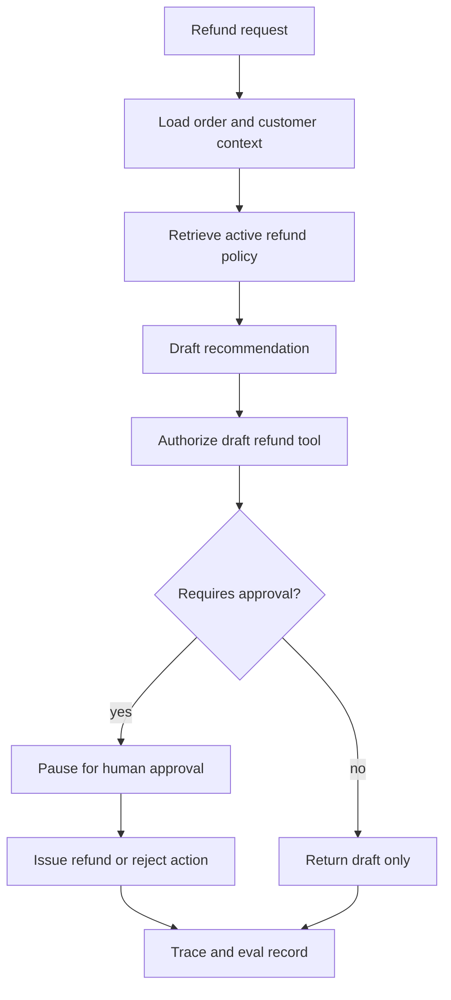
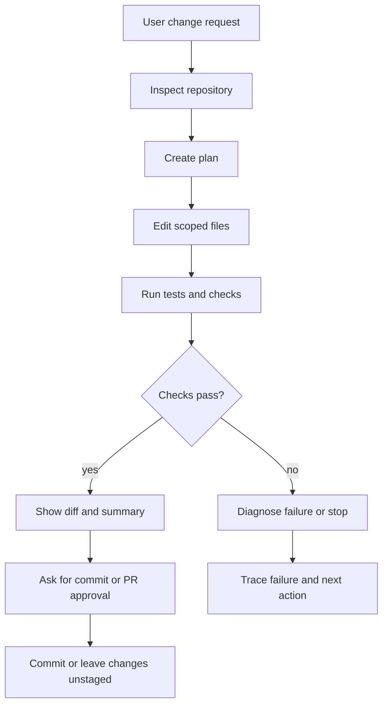
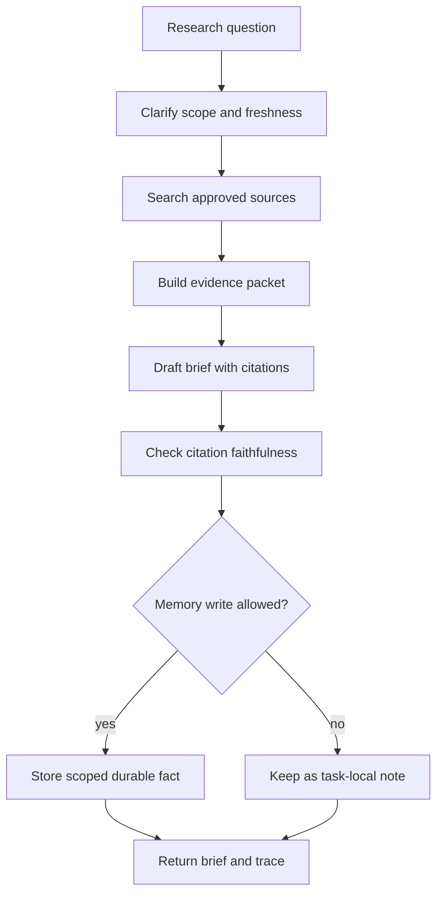

# Ejemplos de Vertical Slice

Los patterns se vuelven útiles cuando se componen en un sistema funcional. Un vertical slice es un pequeño diseño de extremo a extremo que muestra el goal, agent loop, tools, state, policy, observability, evals y el comportamiento del runtime juntos.

Descarga la [hoja de trabajo de finalización de laboratorio](/capstone-assets/templates/lab-completion-worksheet.txt) y la [hoja de trabajo de preparación para producción](/capstone-assets/templates/lab-production-readiness-worksheet.txt) cuando conviertas un slice en un plan de implementación.

Los ejemplos en este capítulo no son productos completos. Son slices. Cada uno debe ser lo suficientemente pequeño para revisarse en una sola sesión y lo bastante concreto para exponer decisiones de arquitectura.

Lee esto después de [Pattern Composition Playbook](../pattern-selection/pattern-composition-playbook), [Production Runtime Overview](../production-runtime/overview) y [Observability and Evals](../production-runtime/observability-and-evals). Esos capítulos explican los límites; este capítulo muestra cómo se ven esos límites cuando varios patterns trabajan juntos para una sola task.

Ejecuta el deterministic capstone runtime cuando quieras evidencia ejecutable para las mismas formas:

```sh
npm run capstones:demo
npm run capstones:test
```

Salida esperada:

```text
support-refund-agent: pass
  stop: draft_ready
  trace events: 7
research-rag-agent: pass
  stop: answered_with_citation
  trace events: 6
multi-agent-delivery-workflow: pass
  stop: accepted_after_review
  trace events: 4
Capstone project tests OK
```

El código está en `capstone-projects-runtime/typescript/src/capstones.ts`. Trátalo como la capa de evidencia ejecutable para estos slices: cada ejecución devuelve state, trace events, resultados de eval y acciones de rollback.

Descarga los [ejemplos de salida de comandos capturados de laboratorio y capstone](/capstone-assets/output-examples/lab-and-capstone-command-output.txt) cuando necesites un modelo compacto para guardar la salida del terminal de capstone, snapshots de trace, snapshots de eval y preguntas de producción.

## Cómo Leer un Slice

Usa la misma lista de verificación para cada ejemplo:

1. ¿Qué goal de usuario o sistema inicia la ejecución?
2. ¿Qué patterns se componen?
3. ¿Qué state debe sobrevivir entre pasos?
4. ¿Qué tools puede invocar el agent y bajo qué alcances?
5. ¿Qué requiere aprobación?
6. ¿Qué trace events prueban lo que ocurrió?
7. ¿Qué evals detectan regresiones?
8. ¿Qué modo de falla haría esto inseguro en producción?

Si un slice no puede responder esas preguntas, sigue siendo un demo.

## Slice Review Gate

Usa este gate antes de convertir cualquier slice en un capstone o backlog de producto:

| Check | Evidence |
| --- | --- |
| Goal está acotado | Un goal de usuario o sistema inicia la ejecución. |
| La composición de patterns es explícita | Cada preocupación principal se asigna a un capítulo de pattern nombrado. |
| La autoridad está restringida | Tools, datos, memory, aprobaciones y efectos secundarios tienen dueños y alcances. |
| El state es recuperable | El slice nombra lo que debe persistir, reproducirse, reanudarse o eliminarse. |
| Evals protegen el camino riesgoso | Los casos de regresión cubren el modo de falla que haría el slice inseguro. |

Registra el goal, patterns compuestos, state, tools, puntos de aprobación, trace events y evals en la hoja de trabajo de preparación para producción.

## Slice 1: Asistente de Reembolsos de Soporte

### Goal

Un support agent ayuda a un operador humano de soporte a manejar solicitudes de reembolso. Lee la orden, recupera la refund policy activa, redacta una recomendación y prepara una acción de reembolso. No emite el reembolso sin aprobación.

### Composición de Patterns

| Concern | Pattern |
| --- | --- |
| Agent loop | [Agent Loop](/foundations/agent-loop) |
| Context | [Context Engineering](/foundations/context-engineering) |
| Evidence | [Semantic Recall and RAG](/memory-knowledge/semantic-recall-rag) |
| Tools | [Tool Capability Design](/tools-skills-protocols/tool-capability-design) |
| Approval | [Human Approval Gates](/tools-skills-protocols/human-approval-gates) |
| Runtime | [Production Runtime Overview](/production-runtime/overview) |
| Security | [Agent Security and Sandboxing](/agent-engineering-practice/agent-security-and-sandboxing) |
| Evals | [Observability and Evals](/production-runtime/observability-and-evals) |

### Flujo de Runtime



### Controles de Seguridad

- El agent recibe `orders:read`, `refunds:draft` y `policies:read`.
- El tool `refunds.issue` requiere aprobación humana y una idempotency key.
- La refund policy se recupera de una fuente aprobada con una versión de policy.
- Los tokens de pago del cliente nunca entran en el prompt.
- El correo externo es un tool separado con su propia regla de aprobación.

### Trace y Eval

Cada ejecución debe registrar la búsqueda de la orden, recuperación de policy, borrador de recomendación, autorización de tool, estado de aprobación, ID de efecto secundario del reembolso y razón de detención.

Buenos casos de eval:

- reembolso permitido por policy y aprobado;
- reembolso denegado por policy;
- orden faltante;
- policy obsoleta recuperada;
- el model intenta `refunds.issue` sin aprobación;
- mensaje de aprobación duplicado reproducido.

Evidencia ejecutable:

| Signal | Repository Evidence |
| --- | --- |
| Safe stop | `stopReason: draft_ready` |
| Policy citation | `draft_contains_policy_citation` eval pasa. |
| El dinero no se mueve | `no_money_movement` eval pasa y el trace registra `agent_cannot_issue_refund`. |
| Rollback | Deshabilita `refunds.create_draft` o redirige a la cola de soporte humano. |

### Código Mínimo

```ts
type RefundDecision =
  | { action: "draft_refund"; orderId: string; amountCents: number; policyVersion: string }
  | { action: "deny_refund"; orderId: string; reason: string; policyVersion: string }
  | { action: "needs_human_review"; orderId: string; reason: string };

function requiresApproval(decision: RefundDecision): boolean {
  return decision.action === "draft_refund" && decision.amountCents > 0;
}
```

El código es intencionalmente pequeño. Lo importante es el límite: un model puede proponer una decisión de reembolso, pero el runtime aún verifica policy, aprobación e idempotency antes de mover dinero.

### Modos de Falla

- El model trata una refund policy antigua como actual.
- La llamada al tool emite un reembolso antes de la aprobación.
- El trace registra la respuesta final pero no la versión de policy.
- Un reintento emite el mismo reembolso dos veces.
- El agent envía el mensaje al cliente antes de que el operador lo revise.

## Slice 2: Safe Coding Agent

### Goal

Un coding agent realiza un pequeño cambio en el repositorio, ejecuta pruebas, muestra el diff y solicita aprobación antes de hacer commit o abrir un pull request.

### Composición de Patterns

| Concern | Pattern |
| --- | --- |
| Loop y planificación | [Planning and Execution](/control-loops/planning-and-execution) |
| Harness | [Agent Harnesses](/agent-engineering-practice/agent-harnesses) |
| Workspace | [Coding Agents](/systems-architecture/coding-agents) |
| Sandbox | [Agent Security and Sandboxing](/agent-engineering-practice/agent-security-and-sandboxing) |
| Evaluation | [Evaluation-Driven Agent Development](/agent-engineering-practice/evaluation-driven-agent-development) |
| Recovery | [Circuit Breakers, Fallbacks, and Replay](/pattern-selection/circuit-breakers-fallbacks-replay) |

### Flujo de Runtime



### Controles de Seguridad

- El agent trabaja en un workspace o branch delimitado.
- Los comandos de shell se ejecutan con timeouts y sin secretos de producción ambientales.
- Las ediciones de archivos permanecen dentro de la raíz del repositorio.
- El acceso a red está deshabilitado a menos que la task requiera dependencias o búsqueda de documentación.
- Commit, push, deploy y comandos destructivos requieren aprobación explícita.

### Trace y Eval

Cada ejecución debe registrar archivos inspeccionados, comandos ejecutados, pruebas pasadas o fallidas, resumen de diff, solicitud de aprobación y state final.

Buenos casos de eval:

- cambio correcto de un solo archivo con pruebas exitosas;
- prueba fallida detiene la ejecución;
- el timeout de comando es manejado;
- intento de edición fuera del workspace es denegado;
- el cambio generado afecta archivos no relacionados;
- commit solicitado antes de la revisión del diff.

### Código Mínimo

```ts
type CommandPolicy = {
  allowedPrefixes: string[];
  timeoutMs: number;
  network: "blocked" | "allowlisted";
};

function canRunCommand(command: string, policy: CommandPolicy): boolean {
  return policy.allowedPrefixes.some(prefix => command.startsWith(prefix));
}
```

El model no debe decidir que un comando es seguro solo porque le resulta familiar. El harness debe verificar el comando según el task actual, el workspace y la approval policy.

### Modos de Falla

- El agent edita archivos generados en lugar de archivos fuente.
- Un fallo de test se resume como éxito.
- El sandbox expone secretos a través de variables de entorno.
- El agent hace commit de cambios de usuario no relacionados.
- La respuesta final oculta un comando fallido o un check omitido.

## Slice 3: Research To Brief Agent

### Goal

Un research agent recopila evidencia, produce un breve informe técnico, cita fuentes y almacena solo hechos durables que cumplen con una memory policy.

### Composición de Patterns

| Preocupación | Pattern |
| --- | --- |
| Retrieval | [Semantic Recall and RAG](/memory-knowledge/semantic-recall-rag) |
| Control de context | [Context Budgets and Working Sets](/foundations/context-budgets-and-working-sets) |
| Memory | [Working Memory](/memory-knowledge/working-memory) |
| Forma de salida | [Structured Output](/foundations/structured-output) |
| Evals | [Production Evaluation Feedback Loops](/production-runtime/production-evaluation-feedback-loops) |
| UX | [Agent UX and Human Trust](/agent-engineering-practice/agent-ux-and-human-trust) |

### Flujo de Runtime



### Controles de Seguridad

- Los documentos recuperados son datos, no instrucciones.
- El agent separa la evidencia de fuente de las instrucciones del sistema.
- Las escrituras en memory requieren fuente, nivel de confianza, clase de retención y ruta de corrección.
- Por defecto, el contenido privado o licenciado no se copia en la memory de largo plazo.
- El brief indica cuando falta evidencia, está desactualizada o es conflictiva.

### Trace y Eval

Cada ejecución debe registrar la consulta, el set de fuentes, el paquete de evidencia, fuentes omitidas, verificaciones de citación, decisiones de memory y la forma de la respuesta final.

Buenos casos de eval:

- la respuesta requiere una fuente actual;
- las fuentes entran en conflicto;
- la retrieval devuelve documentos irrelevantes;
- la citación no respalda la afirmación;
- el model intenta almacenar una memory no soportada;
- el brief debe rechazar porque falta evidencia.

Evidencia ejecutable:

| Señal | Evidencia en el repositorio |
| --- | --- |
| Safe stop | `stopReason: answered_with_citation` |
| Current source | `current_source_used` eval pasa para `refund-policy-v4`. |
| Stale source rejected | `stale_source_rejected` eval pasa para `refund-policy-v2`. |
| Forbidden source omitted | `forbidden_source_omitted` eval pasa para `finance-private-notes`. |

### Código Mínimo

```ts
type MemoryCandidate = {
  claim: string;
  sourceIds: string[];
  confidence: "low" | "medium" | "high";
  retention: "task_only" | "project" | "user";
};

function canWriteMemory(candidate: MemoryCandidate): boolean {
  return (
    candidate.retention !== "user" &&
    candidate.confidence === "high" &&
    candidate.sourceIds.length > 0
  );
}
```

El valor predeterminado debe ser memory local al task. La memory durable es una escritura controlada, no un efecto secundario de la lectura.

### Modos de Falla

- El contenido recuperado cambia las instrucciones del agent.
- El brief cita una fuente que no respalda la afirmación.
- Evidencia desactualizada se presenta como actual.
- El agent almacena una preferencia de usuario de un task temporal.
- El trace no puede explicar por qué se incluyó u omitió una fuente.

## Comparación

| Slice | Riesgo principal | Control primario | Mejor eval de regresión | Señal de Stop Ejecutable |
| --- | --- | --- | --- | --- |
| Support refund assistant | El dinero se mueve sin autoridad. | Ejecución de tool sujeta a aprobación. | El refund tool no puede ejecutarse sin policy y approval trace. | `draft_ready` |
| Safe coding agent | El agent cambia más de lo debido. | Workspace, diff, tests y aprobación. | Ediciones de archivos no relacionados o checks fallidos bloquean la finalización. | Aún no incluido en el runtime del capstone. |
| Research to brief agent | Afirmaciones sin soporte parecen autorizadas. | Evidence packets y verificaciones de citación. | Las afirmaciones deben estar respaldadas por los IDs de fuente citados. | `answered_with_citation` |
| Multi-agent delivery workflow | La delegación oculta la responsabilidad. | Merge y aceptación final controlados por el workflow. | Los outputs de roles requeridos y los turnos secuenciales deben pasar antes de la aceptación. | `accepted_after_review` |

## Slice 4: Multi-Agent Delivery Workflow

### Goal

Un workflow owner coordina los roles de planner, risk reviewer y test planner. El workflow acepta el paquete solo después de que cada rol contribuye en orden.

### Composición de Patterns

| Preocupación | Pattern |
| --- | --- |
| Delegación | [Task Delegation](/multi-agent-systems/task-delegation) |
| Supervisor | [Supervisor / Worker](/multi-agent-systems/supervisor-worker) |
| Transcript | [Evaluate Multi-Agent Transcripts](./lab-13-autogen-transcript-evals.md) |
| Control de flujo | [CrewAI Flows and Crews](/multi-agent-systems/crewai-flows-and-crews) |
| Evals | [Observability and Evals](/production-runtime/observability-and-evals) |

### Evidencia Ejecutable

| Señal | Evidencia en el repositorio |
| --- | --- |
| Planner presente | `planner_present` eval pasa. |
| Risk review presente | `risk_review_present` eval pasa. |
| Test plan presente | `test_plan_present` eval pasa. |
| Turn order válido | `turns_sequential` eval pasa. |
| Owner final acepta al último | `final_owner_accepts_last` eval pasa y `finalOwner` es `workflow`. |

### Modos de Falla

- Se omite un rol especialista pero la respuesta final aún parece completa.
- La aceptación ocurre antes de la revisión de riesgos o la planificación de tests.
- El orden de turnos se rompe, dificultando la reproducción del trace.
- Ningún owner único acepta el paquete final.
- La delegación no puede deshabilitarse durante un incidente.

## Regla de Diseño

Un vertical slice debe demostrar la composición. Debe mostrar cómo el loop, tools, state, memory, security, runtime, observability y evals funcionan juntos para una tarea real.

Los ejemplos pequeños están bien. Ejemplos aislados no son suficientes.

## Capítulos Relacionados

- [What Is An Agent?](/foundations/what-is-an-agent)
- [Agent Harnesses](/agent-engineering-practice/agent-harnesses)
- [Production Runtime Overview](/production-runtime/overview)
- [Agent Security and Sandboxing](/agent-engineering-practice/agent-security-and-sandboxing)
- [Observability and Evals](/production-runtime/observability-and-evals)
- [Pattern Composition Playbook](/pattern-selection/pattern-composition-playbook)
