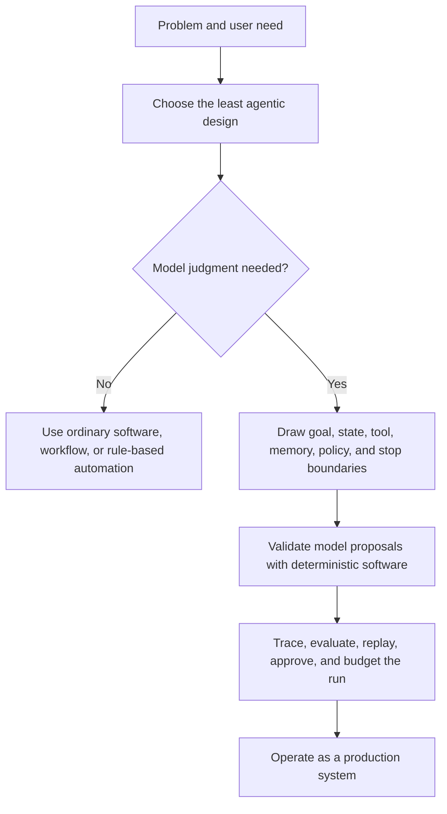
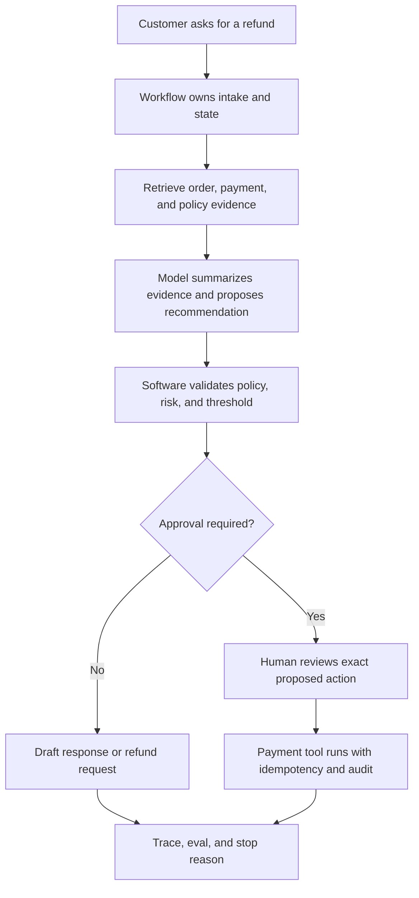

# Agentic Systems Patterns

La mayoría de los agentic systems no fallan porque el model no sea lo suficientemente inteligente. Fallan porque la arquitectura que rodea al model es débil.

El goal es vago. El loop no tiene una condición real de detención. Los tools son demasiado poderosos. El state está oculto en una transcripción de chat. Nadie puede replay lo que ocurrió. El eval suite revisa la respuesta final pero no el camino que la produjo. La observability llega después del primer incidente. La autonomía se agrega antes de que el sistema la haya merecido.

Este libro trata de arreglar eso.

Está escrito para ingenieros de software, líderes técnicos, arquitectos y constructores que necesitan decidir qué debe ser responsabilidad de un agent, qué debe ser responsabilidad del software tradicional y qué nunca debe dejarse a un model. No es una lista de todos los nombres de agent patterns que pude encontrar. Es una guía práctica para elegir, componer, probar, asegurar y operar agentic patterns sin perder el control de ingeniería.

Un agent útil no es un prompt con ambición. Es software con límites.

## Argumento de Arquitectura en Resumen

Usa este diagrama como la prueba central del libro: si un diseño omite los pasos de boundary, validación o evidencia, no está listo para producción.

## Caso de Estudio en Ejecución

Varios capítulos regresan a un ejemplo con forma de producto: un asistente de reembolsos de soporte. Es lo suficientemente pequeño para entenderlo, pero lo suficientemente riesgoso para forzar una arquitectura real. Un refund workflow toca datos de clientes, evidencia de policy, payment tools, umbrales de aprobación, registros de auditoría y comunicación con el usuario. Eso lo convierte en una prueba útil para todo el libro.

El punto no es hacer que los reembolsos sean especiales. El punto es observar cómo un sistema pasa de ser software simple, a juicio acotado de model, a investigación agentic, a efectos secundarios con aprobación, hasta evidencia de producción.

Usa este caso como una pregunta recurrente: ¿qué debe decidir el model, qué debe ser responsabilidad del software y qué evidencia permitiría a un operador replay la ejecución después de que algo salga mal?

## Contrato con el Lector

Cada capítulo debe ayudarte a tomar o revisar una decisión de ingeniería. Un capítulo sólido en este libro debe darte al menos uno de estos:

- un boundary que puedas definir;
- un pattern que puedas elegir o rechazar;
- un contrato que puedas implementar;
- un failure mode que puedas probar;
- una checklist que puedas usar en una revisión;
- un artifact que puedas reutilizar en un diseño, laboratorio, proyecto final o lanzamiento.

Si un capítulo solo enseña vocabulario, debe conectar ese vocabulario con una decisión. Si un capítulo muestra código, debe nombrar los controles de producción que aún faltan. Si un capítulo recomienda un pattern, también debe decir cuándo no usarlo.

Ese es el estándar de calidad para el libro en línea: los lectores deben irse con decisiones, evidencia y artifacts reutilizables, no solo con familiaridad con la terminología agent.

## El Argumento

Mi argumento es simple:

1. Comienza con la arquitectura menos agentic que pueda cumplir el requerimiento.
2. Agrega juicio de model solo donde el software determinista no sea suficiente.
3. Trata las salidas del model como propuestas hasta que el software las valide.
4. Mantén goals, state, tools, memory y policy fuera del model, donde puedan ser inspeccionados.
5. Evalúa trayectorias, no solo respuestas finales.
6. Opera agents como sistemas de producción, con traces, presupuestos, reintentos, aprobaciones y revisión de incidentes.

El diseño agentic no se trata de hacer todo autónomo. Se trata de decidir exactamente dónde la autonomía ayuda, dónde crea riesgo y dónde el software tradicional debe seguir a cargo.

## Qué Deberías Poder Hacer

Después de leer los capítulos principales, deberías poder:

1. Decidir si un problema necesita un prompt chain, workflow, single agent o multi-agent system.
2. Dibujar el boundary entre el juicio del model y el control determinista.
3. Definir el goal, state, tools, memory, policy, presupuesto y condiciones de detención para una ejecución agentic.
4. Revisar una superficie de tool para detectar autoridad excesiva antes de exponerla a un model.
5. Diseñar evals que prueben trayectorias, no solo respuestas finales.
6. Explicar cómo un sistema hará trace, replay, aprobará, reintentará, hará rollback y se recuperará.
7. Convertir un demo en un diseño de producción con controles explícitos de runtime.

Si un capítulo no te ayuda a tomar una de esas decisiones, no está haciendo suficiente trabajo.

## Qué Cubre Este Libro

El libro sigue las decisiones que los ingenieros toman al construir sistemas reales:

- fundamentos: single agents, loops, goals, state, tools, structured outputs y context;
- selección de patterns: cuándo usar chains, routing, workflows, agents o multi-agent systems;
- práctica de ingeniería: ciclo de vida, elección de framework, seguridad, evaluación y confianza del usuario;
- control loops: planning, ReAct, reflection, evaluator-optimizer y recovery loops;
- memory y conocimiento: working memory, episodic memory, retrieval y boundaries de evidencia;
- tools, skills y protocolos: tool contracts, MCP, A2A, comunicación segura y approval gates;
- multi-agent systems: delegación, supervisión, debate, ejecución paralela y sistemas definidos por framework;
- arquitectura de sistemas: cómo los patterns se componen en productos desplegables;
- producción y runtime: durable workflows, observability, evaluación, policy, eventos y operaciones.

Los capítulos de patterns son intencionalmente consistentes. Están pensados para ser consultados durante el trabajo de diseño. Los capítulos que los rodean llevan el argumento: por qué un pattern pertenece a un sistema, qué cuesta y cómo saber si está funcionando.

## Qué No Es Este Libro

Este no es un recetario de prompt engineering, un reporte de comparación de proveedores ni una afirmación de que los agents deban reemplazar al software tradicional. No asume que más autonomía es mejor. Tampoco trata los valores predeterminados de framework como arquitectura.

Los frameworks son útiles, pero no eliminan la necesidad de decidir dónde vive el state, qué tools están permitidas, cómo funcionan las aprobaciones, qué se tracea o cómo los fallos se convierten en pruebas de regresión. Esas son decisiones de producto y arquitectura.

## Cómo Usarlo

Si eres nuevo en agentic systems, comienza con [Cómo Leer Este Libro](/publishing/how-to-read), luego lee [¿Qué es un Agent?](/foundations/what-is-an-agent), [Arquitectura Antes que Autonomía](/pattern-selection/architecture-before-autonomy), [Eligiendo el Pattern Correcto](/pattern-selection/choosing-the-right-pattern) y [De Patterns a Sistemas](/pattern-selection/from-patterns-to-systems).

Si estás revisando un diseño de producción, comienza con los capítulos de selección y de ingeniería antes de leer las páginas de patterns individuales.

Si estás implementando, usa los laboratorios prácticos después de entender la arquitectura. Los ejemplos son deliberadamente pequeños. Las notas de producción muestran lo que debe cambiar antes de que esos ejemplos se conviertan en sistemas que puedan manejar state, policy, evals y observability.

Como este es un libro en línea, úsalo tanto como texto guiado como referencia. Sigue los caminos de lectura cuando estés aprendiendo el material. Usa la barra lateral, búsqueda, páginas de patterns, checklists, diagramas, laboratorios y proyectos finales cuando estés diseñando o revisando un sistema real.

## Licencia

El código fuente y los ejemplos ejecutables están licenciados bajo la Licencia MIT. El contenido del libro/referencia, diagramas, hojas de trabajo y artifacts generados para publicación están licenciados bajo [Creative Commons Attribution-NonCommercial-ShareAlike 4.0 International](https://creativecommons.org/licenses/by-nc-sa/4.0/) (`CC-BY-NC-SA-4.0`).
