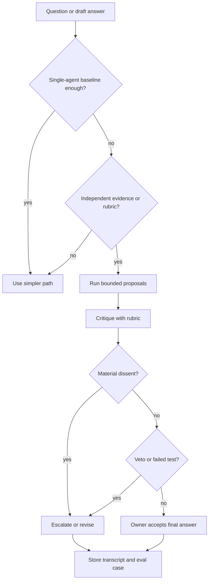

# Debate and Consensus

Debate and consensus utilizan múltiples propuestas independientes, críticas, votos o clasificaciones antes de producir una respuesta final.

> Fuente y descargas
>
> - [Repository source](https://github.com/GTuritto/Agentic-Systems-Patterns/tree/main/consensus-seeking-multi-agent-system-pattern)
> - [Download code bundle](/downloads/debate-and-consensus.zip)

## Intención

Debate and consensus utilizan múltiples propuestas independientes, críticas, votos o clasificaciones antes de producir una respuesta final.

Usa este pattern para exponer desacuerdos, evidencia faltante y razonamientos débiles antes de que una respuesta riesgosa se convierta en una decisión final. No lo uses para hacer que una respuesta parezca más confiable sin agregar evidencia independiente o una regla de revisión más estricta.

## Escenario

Un equipo está revisando si un resumen de incidente generado por un agent es suficientemente bueno para una actualización ejecutiva. Un agent redacta el resumen a partir de traces. Un segundo agent verifica la cronología contra la línea de tiempo del incidente. Un tercer agent revisa el impacto al cliente y la evidencia omitida. Luego, un juez acepta, rechaza o solicita un resumen revisado.

Esto solo funciona si los agents ven evidencia significativamente diferente o aplican rúbricas distintas. Tres agents con el mismo prompt, mismo context y el mismo punto ciego crean un fallo de single-agent más ruidoso. El consensus no es evidencia por sí mismo; es una forma de exponer desacuerdos antes de que un responsable tome la decisión final.

## Usa cuando

- Una sola respuesta es riesgosa, ambigua o probablemente omita evidencia.
- Los participantes tienen evidencia, roles, rúbricas, models o tools genuinamente diferentes.
- La decisión final puede esperar el costo y la latencia extra.
- Existe una regla de fusión escrita antes de que los workers comiencen.
- El disenso debe preservarse para revisión, no ocultarse mediante síntesis.

## Evita cuando

- Una prueba determinista, consulta a base de datos, paso de retrieval o policy check puede responder directamente.
- Los participantes comparten el mismo context y repetirán el mismo fallo.
- El voto mayoritario reemplazaría evidencia, pruebas o un responsable.
- La task necesita un responsable claro más que más opiniones.
- El sistema no puede trazar propuestas, críticas, votos, disenso y aceptación final.

## Arquitectura

Usa este diagrama para leer Debate and Consensus como un límite de sistema, no solo una forma de código. La pregunta clave de propiedad es: el coordinador posee el goal compartido, la descomposición, las asignaciones, la merge policy y la aceptación final.


Léelo como un proceso de decisión respaldado por evidencia: agents independientes proponen respuestas, se critican entre sí y un responsable resuelve acuerdos, disensos o escaladas.

## Reglas de decisión

Usa debate solo cuando la independencia es real y la regla de fusión es conocida antes de la ejecución.

| Pregunta | Buena respuesta | Mala respuesta |
| --- | --- | --- |
| ¿Qué difiere entre los agents? | Fuente de evidencia, rúbrica, rol, acceso a model o tool. | Solo el nombre del prompt de rol. |
| ¿Quién posee la decisión final? | Un coordinador, reductor determinista o revisor humano. | El voto mayoritario por sí solo. |
| ¿Qué puede anular el consensus? | Evidencia faltante, violación de seguridad, prueba fallida o rechazo del responsable. | Nada; el acuerdo se trata como verdad. |
| ¿Cuál es el límite de costo? | Número fijo de agents, turnos, tokens y reintentos. | El debate continúa hasta que las salidas parezcan confiables. |
| ¿Cómo se maneja el disenso? | Registrado, clasificado y escalado cuando es relevante. | Suavizado durante la síntesis. |

### Debate Gate Flow



### Cuando el consensus perjudica la calidad

| Situación | Por qué perjudica | Mejor pattern |
| --- | --- | --- |
| Mismo prompt, misma evidencia, mismo model. | Fallos correlacionados parecen acuerdo. | Single agent más evaluator, o verificación con retrieval/tool. |
| Mayoría débil supera evidencia fuerte. | Los votos ocultan la razón por la que la minoría tiene razón. | Juez ponderado por evidencia o gate de aprobación humana. |
| El debate ocurre después de la síntesis. | La crítica no puede cambiar la ruta de evidencia subyacente. | Revisar propuestas antes de la síntesis final. |
| Los workers optimizan para persuadir. | Las salidas se vuelven retóricas en vez de comprobables. | Puntuar contra una rúbrica con citas obligatorias. |
| El responsable no está nombrado. | Nadie puede aceptar el riesgo residual. | Supervisor o gate de responsable humano final. |

### Protocolos de votación

| Protocolo | Usa cuando | Guardrail |
| --- | --- | --- |
| Majority vote | Las salidas son de bajo riesgo y producidas independientemente. | Un veto de seguridad o evidencia puede anular la mayoría. |
| Weighted rubric | Los roles tienen diferente autoridad o experiencia. | Los pesos se fijan antes de iniciar la ejecución. |
| Veto rule | Una clase de defecto debe bloquear la liberación. | Las razones de veto deben citar evidencia o policy. |
| Pairwise comparison | Varias respuestas candidatas compiten. | Comparar contra la misma rúbrica, no preferencia. |
| Owner review | La decisión implica riesgo de producto, legal, de seguridad o cliente. | El responsable ve disenso y trace evidence antes de aceptar. |

## Forma del sistema

- **Límite del pattern:** un coordinador delega trabajo acotado a agents con roles específicos, luego evalúa y fusiona sus salidas.
- **Propietario del state:** el coordinador posee el goal compartido, descomposición, asignaciones, merge policy y aceptación final.
- **Artifact principal:** `consensus-seeking-multi-agent-system-pattern/` contiene implementaciones de referencia deterministas en TypeScript y Python más pruebas para propuesta, crítica, disenso y comportamiento de responsable final.
- **Promesa operativa:** el debate expone desacuerdos antes de que una respuesta riesgosa se convierta en decisión final.
- **Ruta ejecutable:** comienza con `npm run debate-consensus` antes de adaptar el pattern a un sistema mayor.

## Contrato

Una ejecución de debate debe producir una transcripción que otro ingeniero pueda inspeccionar.

| Campo | Propósito |
| --- | --- |
| `runId` | Correlaciona todas las propuestas, críticas, votos y decisión final. |
| `goal` | Define la pregunta exacta que se debate. |
| `agents[]` | Registra rol, alcance de evidencia, model, tools y límites de permisos. |
| `proposal` | Captura la respuesta de cada agent con citas o referencias de evidencia. |
| `critique` | Nombra defectos específicos, evidencia faltante o riesgos. |
| `vote` o `score` | Aplica una rúbrica predeclarada, no una preferencia improvisada. |
| `dissent` | Preserva el desacuerdo relevante para el responsable. |
| `finalOwner` | Nombra al coordinador, reductor o humano responsable de la aceptación. |
| `stopReason` | Explica accepted, rejected, escalated, budget_exhausted o inconclusive. |

## Protocolo central

1. Define el goal compartido, roles de los workers, salidas esperadas y criterios de aceptación.
2. Divide el trabajo solo donde la ejecución independiente o especializada agregue valor.
3. Asigna tasks con context y permisos acotados.
4. Recoge salidas, errores, rechazos y evidencia de cada worker.
5. Fusiona resultados mediante un juez explícito, reductor, supervisor o gate de revisión humana.

## Notas de implementación

- Comienza con una línea base de single-agent. Agrega debate solo cuando la calidad medida mejora lo suficiente para justificar el costo y la latencia.
- Da a cada participante un alcance de evidencia, rúbrica, model o límite de tool diferente.
- Mantén las propuestas separadas hasta que inicie la crítica. Un context compartido temprano puede colapsar la independencia.
- Requiere citas, IDs de trace, salidas de pruebas o referencias de fuente para afirmaciones relevantes.
- Preserva informes de minoría cuando nombren evidencia faltante, riesgo de policy o afirmaciones no respaldadas.
- Limita el número de agents, turnos, pases de juez, reintentos, tokens totales y tiempo de reloj.
- Trata un worker fallido, evidencia faltante o disenso relevante como un resultado tipado, no como prosa para suavizar.

## Modos de fallo

- Falso acuerdo: los agents comparten el mismo punto ciego y todos aprueban la respuesta incorrecta.
- Trampa de mayoría: dos respuestas débiles superan una objeción respaldada por evidencia.
- Debate teatral: los agents critican el estilo ignorando el soporte de fuente, pruebas o policy.
- Borrado del disenso: la síntesis final elimina el desacuerdo que el pattern debía revelar.
- Captura del juez: el juez confía en prosa confiada en vez de la rúbrica predeclarada.
- Colapso de roles: todos los agents realizan la misma task pese a tener títulos distintos.
- Costo descontrolado: el debate continúa después de que la decisión no se vuelve más clara.
- Brecha de responsable: el sistema produce un consensus sin nadie responsable de la aceptación.

## Lista de verificación de revisión

Antes de usar debate o consenso en producción, verifica:

- Existe un baseline de single-agent y el debate lo supera en tasks medidas.
- Los agents reciben evidencia, roles, rubrics, models o tools diferentes por una razón.
- La merge policy está escrita antes de que inicie la ejecución.
- El disenso se preserva en el trace en lugar de ser eliminado por la síntesis.
- El coordinator puede rechazar, escalar o pedir más evidencia.
- Los presupuestos de costo y latencia limitan agents, turnos, reintentos y pases de judge.
- Los evals incluyen fallas correlacionadas, acuerdos falsos, votos de mayoría incorrectos y errores de judge.

## Estrategia de evaluación

- Compara el output de multi-agent contra un baseline de single-agent en los mismos tasks.
- Prueba casos donde todos los agents están de acuerdo y están equivocados porque comparten evidencia.
- Prueba casos donde la respuesta minoritaria es correcta porque cita evidencia más sólida.
- Prueba fallas de worker, falta de output de worker, trabajo duplicado y malas decisiones de merge.
- Prueba el comportamiento de veto por seguridad, policy, falta de evidencia y fallas en validaciones determinísticas.
- Mide mejora de calidad, costo de latencia, costo de tokens, precisión de merge, manejo de disenso y responsabilidad del owner final.

## Lista de verificación para producción

- Da a cada worker un rol específico, alcance de evidencia, conjunto de permisos y schema de output.
- Haz explícita la merge policy antes de que los workers se ejecuten.
- Registra por worker los inputs, outputs, críticas, puntajes, votos y referencias de evidencia.
- Mantén un solo owner para la aceptación final y la escalación.
- Preserva el disenso material en el trace final y en la vista del operador.
- Agrega controles de presupuesto para agents, turnos, reintentos, pases de judge, tokens y tiempo.
- Define la escalación humana para trabajos de alto riesgo, inconclusos o bloqueados por policy.
- Mantén el source bundle, el capítulo generado, las pruebas y el artifact de deployment en la misma release.

## Ejecuta el ejemplo

```sh
npm run debate-consensus
npm run debate-consensus:test
```

## Recorrido del código

Lee el extracto como la expresión ejecutable más pequeña del pattern. El capítulo circundante explica las restricciones de diseño; el código muestra dónde esas restricciones se convierten en interfaces concretas, state, validación o control de flujo.

## Código fuente

Estos extractos muestran la forma de la implementación. El código completo está disponible en el bundle de descarga y en el source del repositorio.

### `consensus-seeking-multi-agent-system-pattern/typescript/src/consensus.ts`

[Open full source](https://github.com/GTuritto/Agentic-Systems-Patterns/blob/main/consensus-seeking-multi-agent-system-pattern/typescript/src/consensus.ts)

```ts
export type Vote = "accept" | "revise" | "escalate";

export type StopReason = "accepted" | "needs_revision" | "escalated" | "blocked";

export type DebateEvidence = Record<string, string | undefined>;

export type DebateInput = {
  runId: string;
  goal: string;
  evidence: DebateEvidence;
  finalOwner: string;
  agents: DebateAgent[];
};

export type Proposal = {
  agentId: string;
  role: string;
  evidenceScope: string;
  answer: string;
  evidenceRefs: string[];
  vote: Vote;
  confidence: number;
  risks: string[];
};

export type Critique = {
  fromAgentId: string;
  targetAgentId: string;
  concerns: string[];
  material: boolean;
};

export type DebateAgent = {
  id: string;
  role: string;
  evidenceScope: string;
  weight: number;
  propose: (input: Omit<DebateInput, "agents">) => Omit<Proposal, "agentId" | "role" | "evidenceScope">;
};

export type DebateDecision = {
  stopReason: StopReason;
  finalOwner: string;
  accepted: boolean;
  summary: string;
  dissent: string[];
};

export type TranscriptEvent = {
  type: "proposal" | "critique" | "decision";
  agentId?: string;
  targetAgentId?: string;
  message: string;
  vote?: Vote;
  evidenceRefs?: string[];
};

export type DebateRun = {
  runId: string;
  goal: string;
  finalOwner: string;
  agents: Array<Pick<DebateAgent, "id" | "role" | "evidenceScope" | "weight">>;
  proposals: Proposal[];
  critiques: Critique[];
  decision: DebateDecision;
  transcript: TranscriptEvent[];
};

export type DebateEvaluation = {
  status: "pass" | "fail";
  reasons: string[];
};

export function createRubricAgent(config: {
  id: string;
  role: string;
  evidenceScope: string;
  requiredEvidence: string[];
  acceptedAnswer: string;
  weight?: number;
}): DebateAgent {
  return {
    id: config.id,
    role: config.role,
    evidenceScope: config.evidenceScope,
    weight: config.weight ?? 1,
    propose(input) {
      const missing = config.requiredEvidence.filter(key => !input.evidence[key]);
      const evidenceRefs = config.requiredEvidence.filter(key => Boolean(input.evidence[key]));
```

_Extracto truncado por legibilidad. Descarga el bundle o abre el archivo fuente para la implementación completa._

### `consensus-seeking-multi-agent-system-pattern/typescript/test/consensus.spec.ts`

[Open full source](https://github.com/GTuritto/Agentic-Systems-Patterns/blob/main/consensus-seeking-multi-agent-system-pattern/typescript/test/consensus.spec.ts)

```ts
import {
  createRubricAgent,
  evaluateDebate,
  incidentSummaryAgents,
  runDebate,
  type DebateRun,
} from "../src/consensus.ts";

function assert(condition: unknown, message: string): asserts condition {
  if (!condition) throw new Error(message);
}

const acceptedRun = runDebate({
  runId: "debate_accept",
  goal: "Approve incident summary",
  finalOwner: "incident-commander",
  evidence: {
    timeline: "incident timeline",
    customer_impact: "customer impact statement",
    mitigation: "mitigation record",
    owner: "follow-up owner",
  },
  agents: incidentSummaryAgents(),
});

assert(acceptedRun.decision.stopReason === "accepted", "Expected accepted decision");
assert(acceptedRun.decision.accepted, "Expected accepted flag");
assert(acceptedRun.proposals.length === 3, "Expected one proposal per agent");
assert(acceptedRun.transcript.some(event => event.type === "decision"), "Expected decision transcript event");
assert(evaluateDebate(acceptedRun).status === "pass", "Expected accepted run to pass evaluation");

const missingImpactRun = runDebate({
  runId: "debate_revision",
  goal: "Approve incident summary",
  finalOwner: "incident-commander",
  evidence: {
    timeline: "incident timeline",
    mitigation: "mitigation record",
    owner: "follow-up owner",
  },
  agents: incidentSummaryAgents(),
});

assert(missingImpactRun.decision.stopReason === "needs_revision", "Expected revision decision");
assert(missingImpactRun.decision.dissent.some(item => item.includes("customer_impact")), "Expected impact dissent");
assert(evaluateDebate(missingImpactRun).status === "pass", "Expected preserved dissent to pass evaluation");

const correlatedAgent = createRubricAgent({
  id: "same_1",
  role: "same reviewer",
  evidenceScope: "same scope",
  requiredEvidence: ["timeline"],
  acceptedAnswer: "same answer",
});
const correlatedRun = runDebate({
  runId: "debate_correlated",
  goal: "Approve incident summary",
  finalOwner: "incident-commander",
  evidence: { timeline: "incident timeline" },
  agents: [
    correlatedAgent,
    { ...correlatedAgent, id: "same_2" },
  ],
});
const correlatedEval = evaluateDebate(correlatedRun);
assert(correlatedEval.status === "fail", "Expected correlated agents to fail");
assert(correlatedEval.reasons.includes("agents are not independent"), "Expected independence reason");

const missingOwner: DebateRun = {
  ...acceptedRun,
  finalOwner: "",
  decision: {
    ...acceptedRun.decision,
    finalOwner: "",
  },
};
const missingOwnerEval = evaluateDebate(missingOwner);
assert(missingOwnerEval.status === "fail", "Expected missing final owner to fail");
assert(missingOwnerEval.reasons.includes("missing final owner"), "Expected final-owner reason");

console.log("Debate and consensus tests OK");
```

### `consensus-seeking-multi-agent-system-pattern/python/consensus.py`

[Abrir el código fuente completo](https://github.com/GTuritto/Agentic-Systems-Patterns/blob/main/consensus-seeking-multi-agent-system-pattern/python/consensus.py)

```py
from dataclasses import dataclass
from typing import Literal

Vote = Literal["accept", "revise", "escalate"]
StopReason = Literal["accepted", "needs_revision", "escalated", "blocked"]

@dataclass(frozen=True)
class Proposal:
    agent_id: str
    role: str
    evidence_scope: str
    answer: str
    evidence_refs: list[str]
    vote: Vote
    confidence: float
    risks: list[str]

@dataclass(frozen=True)
class Critique:
    from_agent_id: str
    target_agent_id: str
    concerns: list[str]
    material: bool

@dataclass(frozen=True)
class DebateAgent:
    id: str
    role: str
    evidence_scope: str
    required_evidence: list[str]
    accepted_answer: str
    weight: float = 1.0

    def propose(self, evidence: dict[str, str]) -> Proposal:
        missing = [key for key in self.required_evidence if not evidence.get(key)]
        evidence_refs = [key for key in self.required_evidence if evidence.get(key)]

        if missing:
            return Proposal(
                agent_id=self.id,
                role=self.role,
                evidence_scope=self.evidence_scope,
                answer=f"{self.role} cannot accept until evidence is added: {', '.join(missing)}.",
                evidence_refs=evidence_refs,
                vote="revise",
                confidence=0.45,
                risks=[f"missing evidence: {key}" for key in missing],
            )

        return Proposal(
            agent_id=self.id,
            role=self.role,
            evidence_scope=self.evidence_scope,
            answer=self.accepted_answer,
            evidence_refs=evidence_refs,
            vote="accept",
            confidence=0.9,
            risks=[],
        )

def incident_summary_agents() -> list[DebateAgent]:
    return [
        DebateAgent(
            id="chronology",
            role="Chronology reviewer",
            evidence_scope="incident_timeline",
            required_evidence=["timeline"],
            accepted_answer="Timeline is supported by the incident trace.",
        ),
        DebateAgent(
            id="impact",
            role="Impact reviewer",
            evidence_scope="customer_impact",
            required_evidence=["customer_impact"],
            accepted_answer="Customer impact is explicit and bounded.",
        ),
        DebateAgent(
            id="safety",
            role="Safety reviewer",
            evidence_scope="mitigation_and_followup",
            required_evidence=["mitigation", "owner"],
            accepted_answer="Mitigation, owner, and follow-up are recorded.",
        ),
    ]
```

_Fragmento truncado para facilitar la lectura. Descarga el paquete o abre el archivo fuente para ver la implementación completa._

## Descarga

- [Descargar paquete de código fuente](/downloads/debate-and-consensus.zip)
- [Abrir carpeta de código fuente](https://github.com/GTuritto/Agentic-Systems-Patterns/tree/main/consensus-seeking-multi-agent-system-pattern)

El paquete descargable contiene la carpeta `consensus-seeking-multi-agent-system-pattern/` actual de este repositorio.

## Patrones relacionados

- [Task Delegation](/multi-agent-systems/task-delegation)
- [Supervisor / Worker](/multi-agent-systems/supervisor-worker)
- [Parallel Agents](/multi-agent-systems/parallel-agents)
- [Choosing the Right Pattern](/pattern-selection/choosing-the-right-pattern)
- [Resource-Aware Agent Design](/pattern-selection/resource-aware-agent-design)
