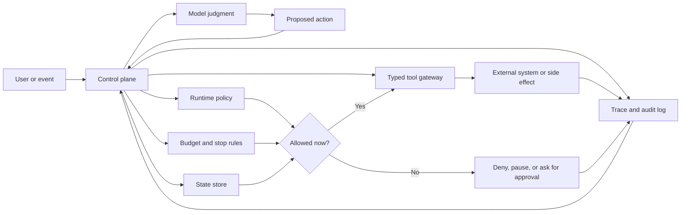

# Arquitectura antes que autonomía

No comiences con el framework. Comienza con el límite: ¿qué puede decidir el model?

Los agents tienen sentido cuando el software no puede conocer cada paso de antemano. Se vuelven un riesgo cuando el sistema permite que el model tome decisiones que deberían pertenecer al código, como verificaciones de permisos, condiciones de detención, límites de presupuesto, transiciones de state, registros de auditoría y efectos secundarios irreversibles. Una buena arquitectura agentic separa el juicio de la autoridad. El model propone la siguiente acción útil; el sistema decide si esa acción es válida, permitida, asequible, observable y segura de ejecutar.

## El model no es el sistema

Un LLM puede resumir context, proponer planes, elegir entre tools, criticar resultados y explicar compensaciones. Nada de eso lo convierte en el control plane. El control plane es dueño del goal activo, los tools permitidos, el state actual, el presupuesto, la condición de detención, el policy context, los requisitos de aprobación, las reglas de retry y fallback, y el trace de lo que ocurrió.

Cuando esas responsabilidades viven solo en un prompt, el sistema se vuelve difícil de probar y aún más difícil de operar. Un prompt puede influir en el comportamiento. No puede reemplazar un límite durable.

## Un límite práctico

Usa esta división de responsabilidades como predeterminada:

| Preocupación | Propiedad del software | Propuesta por el model |
| --- | --- | --- |
| Goal | El contrato del task y los criterios de éxito | Preguntas de aclaración o subgoals |
| State | Almacenamiento durable, motor de workflow o servicio de aplicación | Resúmenes o escrituras de memory candidatas |
| Tools | Schemas tipados, permisos, timeouts y logs de auditoría | Elección de tool y argumentos |
| Policy | Verificaciones en runtime y puertas de aprobación | Explicación de riesgos o solicitud de escalamiento |
| Evaluation | Tests, rúbricas, traces y workflow de revisión | Autocrítica o score candidato |
| Stopping | Regla explícita de éxito, falla, presupuesto o cancelación | Afirmación de que el goal parece completo |

Esto no hace que el sistema sea menos agentic. Hace que la autonomía sea legible, lo que permite operarla.

## Mapa de límites

Usa este mapa al revisar un diseño. El model puede proponer trabajo que requiera juicio, pero el software debe ser dueño de la autoridad, la ejecución y la evidencia.



Este capítulo nombra el límite. [Tool Capability Design](../tools-skills-protocols/tool-capability-design) y [Human Approval Gates](../tools-skills-protocols/human-approval-gates) definen los contratos concretos de tool y aprobación detrás de él.

En código, el límite puede ser pequeño y explícito:

```ts
interface ProposedAction {
  kind: 'read' | 'write' | 'notify' | 'stop';
  tool?: string;
  input?: unknown;
  risk: 'low' | 'medium' | 'high';
}

function decideExecution(action: ProposedAction, policy: RuntimePolicy) {
  if (action.kind === 'stop') return { status: 'stop' };

  if (!action.tool || !policy.allowedTools.includes(action.tool)) {
    return { status: 'deny', reason: 'tool_not_allowed' };
  }

  if (action.risk === 'high' && !policy.hasHumanApproval) {
    return { status: 'pause', reason: 'approval_required' };
  }

  return { status: 'execute', tool: action.tool, input: action.input };
}
```

El model propone `ProposedAction`. El runtime decide si se niega, pausa, ejecuta o detiene.

## Autonomía prematura

La autonomía prematura aparece cuando un equipo recurre a un agent loop antes de responder preguntas más simples: ¿Podría ser esto un workflow determinista con pasos asistidos por model? ¿Podría resolverse con un prompt chain y validación? ¿Podría el routing aislar los diferentes tipos de tasks? ¿Podría un human approval gate manejar los casos de riesgo? ¿Ya puede el sistema probar por qué se tomó una acción y puede un run fallido ser replayed?

Cuando la respuesta a esas preguntas es no, agregar más agents tiende a ocultar la debilidad en lugar de corregirla. Los sistemas multi-agent amplifican goals poco claros, state débil y poca observability mucho más confiablemente de lo que los resuelven.

## Una reescritura común

Un diseño débil dice:

```text
Give the agent access to order data, refund tools, and the customer conversation.
Let it investigate the case and issue the refund if appropriate.
```

Eso suena eficiente, pero falta el límite. El model es dueño de demasiado: interpretación de policy, selección de evidencia, clasificación de riesgos, aprobación, autoridad sobre tools y condiciones de detención.

Un mejor diseño dice:

```text
Workflow receives refund request.
Software loads order, payment, customer, and policy records.
Model summarizes evidence and proposes a refund recommendation.
Software validates required evidence, refund threshold, account status, and policy version.
Low-risk denial or draft response can proceed.
High-risk refund creates an approval request.
Payment tool executes only after approval, with idempotency and audit records.
Run stops with completed, denied, needs_approval, policy_blocked, or evidence_missing.
```

El segundo diseño sigue usando el juicio del model, pero el model ya no es dueño de la autoridad. Propone una recomendación dentro de un sistema que puede ser revisado, probado, pausado, replayed y operado.

## La prueba de ingeniería

Antes de agregar autonomía, pregunta si un operador podría inspeccionar un run fallido y responder:

1. ¿Qué goal estaba activo?
2. ¿Qué state creía el sistema?
3. ¿Qué evidencia estaba disponible?
4. ¿Qué propuso el model?
5. ¿Qué validó el software?
6. ¿Qué llamadas a tool se ejecutaron?
7. ¿Qué verificaciones de policy pasaron o fallaron?
8. ¿Por qué se detuvo el run?
9. ¿Qué cambió en el mundo exterior?

Si esas respuestas no están disponibles, lo siguiente que debes construir no es otro agent. Es state, policy, evaluation u observability.

## Lista de revisión para autonomía

Usa esta lista antes de aprobar un diseño agentic:

| Pregunta | Condición para aprobar |
| --- | --- |
| ¿Qué decisión en runtime toma el model? | La decisión está nombrada y es más específica que "hacer el task". |
| ¿Qué es propiedad del software? | Goal, state, policy, tools, presupuesto, razones de detención y registros de auditoría están fuera del model. |
| ¿Qué efectos secundarios pueden ocurrir? | Cada escritura, envío, pago, cambio de permisos o escritura de memory tiene un dueño y una regla de idempotencia. |
| ¿Qué requiere aprobación? | Los umbrales de riesgo y roles de aprobación están definidos antes de la ejecución. |
| ¿Qué se persiste? | State, evidencia, propuestas, decisiones de validación, resultados de tools y razón de detención pueden ser inspeccionados. |
| ¿Qué se prueba? | Los evals cubren acciones permitidas, acciones denegadas, evidencia faltante, tools fallidas y detenciones por presupuesto. |
| ¿Qué ocurre en caso de falla? | El sistema puede detenerse, reintentar, fallback, escalar o replay sin repetir efectos secundarios inseguros. |

Si la lista parece demasiado pesada, probablemente el diseño necesita menos autonomía, no más.

## Regla de diseño

La autonomía es un presupuesto. Úsala solo donde logre un mejor resultado que el software determinista, y rodéala de límites que hagan visible el fallo.

## Capítulos relacionados

- [Choosing the Right Pattern](./choosing-the-right-pattern)
- [Pattern Evaluation Checklist](./pattern-evaluation-checklist)
- [Pattern Composition Playbook](./pattern-composition-playbook)
- [Agent Loop](../foundations/agent-loop)
- [Goals and State](../foundations/goals-and-state)
- [Tool Use](../foundations/tool-use)
- [Tool Capability Design](../tools-skills-protocols/tool-capability-design)
- [Human Approval Gates](../tools-skills-protocols/human-approval-gates)
- [Evaluation-Driven Agent Development](../agent-engineering-practice/evaluation-driven-agent-development)
- [Agentic System Architecture](../systems-architecture/agentic-system-architecture)
- [Production Runtime Overview](../production-runtime/overview)
